---
hide:
  - path
---

<!-- This file is auto-generated. if you do not want it to be overwritten, set TRUE in the line below -->
<!-- DO_NOT_OVERWRITE_DOC=FALSE -->

## Schema

```mermaid
graph TD
Survey["Survey"]:::mainObject
click Survey "/objects/Survey/"


classDef object fill:#D6E9FF,stroke:#0070D2,stroke-width:3px,rx:12px,ry:12px,shadow:drop,color:#333;
classDef customObject fill:#FFF4C2,stroke:#CCAA00,stroke-width:3px,rx:12px,ry:12px,shadow:drop,color:#333;
classDef customObjectManaged fill:#FFD8B2,stroke:#CC5500,stroke-width:3px,rx:12px,ry:12px,shadow:drop,color:#333;
classDef mainObject fill:#FFB3B3,stroke:#A94442,stroke-width:4px,rx:14px,ry:14px,shadow:drop,color:#333,font-weight:bold;

```

<!-- Object description -->

## Related Flows

| Object | Name      | Type | Description |
| :----  | :-------- | :--: | :---------- | 
| 💻 | [art_post_sales_survey](../flows/art_post_sales_survey.md) |  Survey | <!-- --> |
| 💻 | [arts_lead_lost_survey_flow](../flows/arts_lead_lost_survey_flow.md) |  Survey | <!-- --> |
| 💻 | [arts_lost_opportunity_survey](../flows/arts_lost_opportunity_survey.md) |  Survey | <!-- --> |
| 💻 | [arts_part_purchase_survey](../flows/arts_part_purchase_survey.md) |  Survey | <!-- --> |
| 💻 | [arts_showroom_experience_survey](../flows/arts_showroom_experience_survey.md) |  Survey | <!-- --> |
| 💻 | [arts_test_drive_experience](../flows/arts_test_drive_experience.md) |  Survey | <!-- --> |
| 💻 | [customer_satisfaction](../flows/customer_satisfaction.md) |  Survey | <!-- --> |
| 💻 | [elite_lead_lost_survey_flow](../flows/elite_lead_lost_survey_flow.md) |  Survey | <!-- --> |
| 💻 | [elite_lost_opportunity_survey](../flows/elite_lost_opportunity_survey.md) |  Survey | <!-- --> |
| 💻 | [elite_part_purchase_survey](../flows/elite_part_purchase_survey.md) |  Survey | <!-- --> |
| 💻 | [elite_post_sales_survey](../flows/elite_post_sales_survey.md) |  Survey | <!-- --> |
| 💻 | [elite_showroom_experience_survey_flow](../flows/elite_showroom_experience_survey_flow.md) |  Survey | <!-- --> |
| 💻 | [elite_test_drive_experience](../flows/elite_test_drive_experience.md) |  Survey | <!-- --> |
| 💻 | [jetour_lead_lost_survey_flow](../flows/jetour_lead_lost_survey_flow.md) |  Survey | <!-- --> |
| 💻 | [jetour_lost_opportunity_survey](../flows/jetour_lost_opportunity_survey.md) |  Survey | <!-- --> |
| 💻 | [jetour_part_purchase_survey](../flows/jetour_part_purchase_survey.md) |  Survey | <!-- --> |
| 💻 | [jetour_post_bodyshop_survey](../flows/jetour_post_bodyshop_survey.md) |  Survey | <!-- --> |
| 💻 | [jetour_post_sales_survey](../flows/jetour_post_sales_survey.md) |  Survey | <!-- --> |
| 💻 | [jetour_post_service_survey](../flows/jetour_post_service_survey.md) |  Survey | <!-- --> |
| 💻 | [jetour_showroom_experience_survey](../flows/jetour_showroom_experience_survey.md) |  Survey | <!-- --> |
| 💻 | [jetour_survey_template](../flows/jetour_survey_template.md) |  Survey | <!-- --> |
| 💻 | [jetour_test_drive_experience](../flows/jetour_test_drive_experience.md) |  Survey | <!-- --> |
| 💻 | [knowledge_article_feedback](../flows/knowledge_article_feedback.md) |  Survey | <!-- --> |
| 💻 | [net_promoter_score](../flows/net_promoter_score.md) |  Survey | <!-- --> |
| 💻 | [salesforce_demo](../flows/salesforce_demo.md) |  Survey | <!-- --> |
| 💻 | [soueast_lead_lost_survey_flow](../flows/soueast_lead_lost_survey_flow.md) |  Survey | <!-- --> |
| 💻 | [soueast_lost_opportunity_survey](../flows/soueast_lost_opportunity_survey.md) |  Survey | <!-- --> |
| 💻 | [soueast_part_purchase_survey](../flows/soueast_part_purchase_survey.md) |  Survey | <!-- --> |
| 💻 | [soueast_post_bodyshop_survey](../flows/soueast_post_bodyshop_survey.md) |  Survey | <!-- --> |
| 💻 | [soueast_post_sales_survey](../flows/soueast_post_sales_survey.md) |  Survey | <!-- --> |
| 💻 | [soueast_post_service_survey](../flows/soueast_post_service_survey.md) |  Survey | <!-- --> |
| 💻 | [soueast_showroom_experience_survey](../flows/soueast_showroom_experience_survey.md) |  Survey | <!-- --> |
| 💻 | [soueast_test_drive_experience](../flows/soueast_test_drive_experience.md) |  Survey | <!-- --> |
| Case | [egh_Auto_Assign_Entitlement_Flow](../flows/egh_Auto_Assign_Entitlement_Flow.md) |  Record After Save | <!-- --> |
| SurveyInvitation | [EGH_CaseCreateFeedbackCaseForPoorScoreSurveys](../flows/EGH_CaseCreateFeedbackCaseForPoorScoreSurveys.md) |  Record After Save | Create Feedback Case For Poor Score Surveys using Platform Event. Update Reason Code and Category. |

## Related Lightning Pages

| Lightning Page | Type |
| :----      | :--: | 
| [EGH_PersonAccountLightningPage](../pages/EGH_PersonAccountLightningPage.md) |  Record Page |
| [EGH_VehicleLightningRecordPage](../pages/EGH_VehicleLightningRecordPage.md) |  Record Page |
| [Interaction](../pages/Interaction.md) |  Record Page |

## Related Profiles

| Profile | User License |
| :----      | :--: | 
| [Admin](../profiles/Admin.md) |  Salesforce |
| [EGH Minimum Access Profile](../profiles/EGH%20Minimum%20Access%20Profile.md) |  Salesforce |
| [EGH Sales Profile](../profiles/EGH%20Sales%20Profile.md) |  Salesforce |
| [EGH Service Profile](../profiles/EGH%20Service%20Profile.md) |  Salesforce |

## Related Permission Sets

| Permission Set | User License |
| :----      | :--: | 
| [EGH_Contact_Center_PS](../permissionsets/EGH_Contact_Center_PS.md) | None |
| [EGH_Core_Integration_Permission_Set](../permissionsets/EGH_Core_Integration_Permission_Set.md) | None |
| [EGH_Core_Permission](../permissionsets/EGH_Core_Permission.md) | None |
| [EGH_Digital_Sales_Consultant_Omni_Channel](../permissionsets/EGH_Digital_Sales_Consultant_Omni_Channel.md) | None |
| [EGH_FeedbackManagementAdvancedPermissionSet](../permissionsets/EGH_FeedbackManagementAdvancedPermissionSet.md) | None |
| [EGH_Fleet_Consultant](../permissionsets/EGH_Fleet_Consultant.md) | None |
| [EGH_Lease_Consultant](../permissionsets/EGH_Lease_Consultant.md) | None |
| [EGH_Meet_and_Greet_Application](../permissionsets/EGH_Meet_and_Greet_Application.md) | None |
| [EGH_Product_Genius](../permissionsets/EGH_Product_Genius.md) | None |
| [EGH_QA_and_Data_Analyst_PS](../permissionsets/EGH_QA_and_Data_Analyst_PS.md) | None |
| [EGH_Sales_Consultant_Omni_Channel](../permissionsets/EGH_Sales_Consultant_Omni_Channel.md) | None |
| [EGH_Service_Consultants_PS](../permissionsets/EGH_Service_Consultants_PS.md) | None |
| [EGH_SystemAdminPermissionSet](../permissionsets/EGH_SystemAdminPermissionSet.md) | None |
| [EGH_Test_Drive_Team](../permissionsets/EGH_Test_Drive_Team.md) | None |
| [Salesforce_Feedback_Management_Starter](../permissionsets/Salesforce_Feedback_Management_Starter.md) | None |

_Documentation generated with [sfdx-hardis](https://sfdx-hardis.cloudity.com), by [Cloudity](https://www.cloudity.com/) & [friends](https://github.com/hardisgroupcom/sfdx-hardis/graphs/contributors)_
