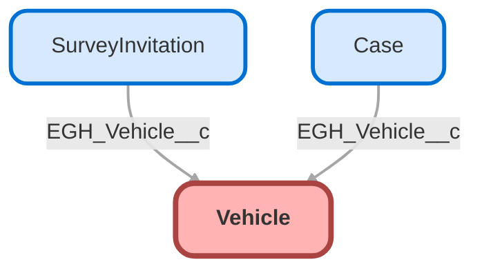

---
hide:
  - path
---

<!-- This file is auto-generated. if you do not want it to be overwritten, set TRUE in the line below -->
<!-- DO_NOT_OVERWRITE_DOC=FALSE -->

## Schema

<!-- Object description -->

## Fields

| Name      | Label | Type | Description |
| :-------- | :---- | :--: | :---------- | 
| ActiveRecallCount |  |  | undefined |
| ActiveServiceContractCount |  |  | undefined |
| ActiveSubscriptionCount |  |  | undefined |
| ActiveWarrantyCount |  |  | undefined |
| AssetId |  | MasterDetail | undefined |
| AverageMarketValue |  |  | undefined |
| ChassisNumber |  |  | undefined |
| Classification |  |  | undefined |
| ConditionType |  | Picklist | undefined |
| CurrentOwnerId |  | Lookup | undefined |
| CylinderCount |  |  | undefined |
| DrivetrainSystem |  | Picklist | undefined |
| EGH_PlateNumberText__c | Plate Number | Text | Vehicle Plate Number |
| EngineName |  |  | undefined |
| EngineNumber |  |  | undefined |
| ExteriorColor |  |  | undefined |
| ExtlSystemVehicleIdentifier |  |  | undefined |
| FrontRimSize |  |  | undefined |
| FrontTireSize |  |  | undefined |
| FuelSource |  | Picklist | undefined |
| GearBoxType |  |  | undefined |
| HeadUnitName |  |  | undefined |
| HeadUnitSecurityCode |  |  | undefined |
| HighestMarketValue |  |  | undefined |
| IgnitionKeyCode |  |  | undefined |
| InteriorColor |  |  | undefined |
| IsConnectedServiceActive |  |  | undefined |
| IsRecallOpen |  |  | undefined |
| IsTelematicsServiceActive |  |  | undefined |
| LastOdometerReading |  |  | undefined |
| LastServiceDate |  |  | undefined |
| LatestResidualValue |  |  | undefined |
| LatestResidualValueDate |  |  | undefined |
| Location |  |  | undefined |
| LowestMarketValue |  |  | undefined |
| MakeName |  |  | undefined |
| ManufacturedDate |  |  | undefined |
| ManufacturerWarrantyEndDate |  |  | undefined |
| ManufacturerWarrantyStartDt |  |  | undefined |
| ManufacturingBatchNumber |  |  | undefined |
| ManufacturingPlantName |  |  | undefined |
| MarketPrice |  |  | undefined |
| MarketPriceDate |  |  | undefined |
| MarketPriceSource |  | Picklist | undefined |
| ModelName |  |  | undefined |
| ModelYear |  |  | undefined |
| Name |  |  | undefined |
| OdometerReadingDate |  |  | undefined |
| OdometerReadingUomId |  | Lookup | undefined |
| OdometerState |  | Picklist | undefined |
| OdometerStatus |  |  | undefined |
| RearRimSize |  |  | undefined |
| RearTireSize |  |  | undefined |
| RegistrationRegionCode |  | Picklist | undefined |
| RegistrationValidityDate |  |  | undefined |
| SourceSystemIdentifier |  |  | undefined |
| SourceSystemName |  |  | undefined |
| Status |  | Picklist | undefined |
| SteeringType |  |  | undefined |
| StockCode |  |  | undefined |
| TrimLevel |  |  | undefined |
| UpholsteryColor |  |  | undefined |
| UpholsteryType |  |  | undefined |
| VehicleDefinitionId |  | Lookup | undefined |
| VehicleIdentificationNumber |  |  | undefined |
| VehicleRegistrationNumber |  |  | undefined |

## Related Apex Classes

| Apex Class | Type |
| :----      | :--: | 
| [EGHTestDriveTimelineControllerTest](../apex/EGHTestDriveTimelineControllerTest.md) | Test |
| [EGH_AppraisalAdjustmentTriggerTest](../apex/EGH_AppraisalAdjustmentTriggerTest.md) | Test |
| [EGH_AssignedResourceInspectTriggerTest](../apex/EGH_AssignedResourceInspectTriggerTest.md) | Test |
| [EGH_AssignedResourceTriggerTest](../apex/EGH_AssignedResourceTriggerTest.md) | Test |
| [EGH_DamageCaptureController](../apex/EGH_DamageCaptureController.md) | Lightning Controller |
| [EGH_DamageCaptureController_Test](../apex/EGH_DamageCaptureController_Test.md) | Test |
| [EGH_RestTests](../apex/EGH_RestTests.md) | Test |
| [EGH_ServiceAppointmentUpdateVDCTest](../apex/EGH_ServiceAppointmentUpdateVDCTest.md) | Test |
| [EGH_TestDriveSlotFinder](../apex/EGH_TestDriveSlotFinder.md) | Lightning Controller |
| [EGH_TestDriveSlotFinder_Test](../apex/EGH_TestDriveSlotFinder_Test.md) | Test |
| [EGH_AssignedResourceInspectionTrigger](../apex/EGH_AssignedResourceInspectionTrigger.md) | Class |
| [EGH_ServiceAppointmentUpdateVDC](../apex/EGH_ServiceAppointmentUpdateVDC.md) | Class |

## Related Lightning Pages

| Lightning Page | Type |
| :----      | :--: | 
| [EGH_Case_Record_Page](../pages/EGH_Case_Record_Page.md) |  Record Page |
| [EGH_FleetAccountLightningPage](../pages/EGH_FleetAccountLightningPage.md) |  Record Page |
| [EGH_PersonAccountLightningPage](../pages/EGH_PersonAccountLightningPage.md) |  Record Page |
| [EGH_Service_Appointment_Lightning_Page](../pages/EGH_Service_Appointment_Lightning_Page.md) |  Record Page |
| [EGH_Service_Appointment_SystemAdmin](../pages/EGH_Service_Appointment_SystemAdmin.md) |  Record Page |
| [EGH_Traffic_Fine_Lightning_Page](../pages/EGH_Traffic_Fine_Lightning_Page.md) |  Record Page |
| [EGH_VehicleLightningRecordPage](../pages/EGH_VehicleLightningRecordPage.md) |  Record Page |
| [EGH_Vehicle_Damage_Capture_Record_Page](../pages/EGH_Vehicle_Damage_Capture_Record_Page.md) |  Record Page |

## Related Profiles

| Profile | User License |
| :----      | :--: | 
| [Admin](../profiles/Admin.md) |  Salesforce |
| [EGH Minimum Access Profile](../profiles/EGH%20Minimum%20Access%20Profile.md) |  Salesforce |
| [EGH Sales Profile](../profiles/EGH%20Sales%20Profile.md) |  Salesforce |
| [EGH Service Profile](../profiles/EGH%20Service%20Profile.md) |  Salesforce |

## Related Permission Sets

| Permission Set | User License |
| :----      | :--: | 
| [EGH_Contact_Center_PS](../permissionsets/EGH_Contact_Center_PS.md) | None |
| [EGH_Core_Integration_Permission_Set](../permissionsets/EGH_Core_Integration_Permission_Set.md) | None |
| [EGH_Core_Permission](../permissionsets/EGH_Core_Permission.md) | None |
| [EGH_Digital_Sales_Consultant_Omni_Channel](../permissionsets/EGH_Digital_Sales_Consultant_Omni_Channel.md) | None |
| [EGH_FeedbackManagementAdvancedPermissionSet](../permissionsets/EGH_FeedbackManagementAdvancedPermissionSet.md) | None |
| [EGH_Fleet_Consultant](../permissionsets/EGH_Fleet_Consultant.md) | None |
| [EGH_Lease_Consultant](../permissionsets/EGH_Lease_Consultant.md) | None |
| [EGH_Meet_and_Greet_Application](../permissionsets/EGH_Meet_and_Greet_Application.md) | None |
| [EGH_Product_Genius_Admin](../permissionsets/EGH_Product_Genius_Admin.md) | None |
| [EGH_Product_Genius](../permissionsets/EGH_Product_Genius.md) | None |
| [EGH_QA_and_Data_Analyst_PS](../permissionsets/EGH_QA_and_Data_Analyst_PS.md) | None |
| [EGH_Sales_Consultant_Omni_Channel](../permissionsets/EGH_Sales_Consultant_Omni_Channel.md) | None |
| [EGH_Service_Consultants_PS](../permissionsets/EGH_Service_Consultants_PS.md) | None |
| [EGH_SystemAdminPermissionSet](../permissionsets/EGH_SystemAdminPermissionSet.md) | None |
| [EGH_Test_Drive_Team](../permissionsets/EGH_Test_Drive_Team.md) | None |

_Documentation generated with [sfdx-hardis](https://sfdx-hardis.cloudity.com), by [Cloudity](https://www.cloudity.com/) & [friends](https://github.com/hardisgroupcom/sfdx-hardis/graphs/contributors)_
