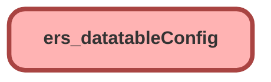

---
hide:
  - path
---

<!-- This file is auto-generated. if you do not want it to be overwritten, set TRUE in the line below -->
<!-- DO_NOT_OVERWRITE_DOC=FALSE -->

## Schema

<!-- Object description -->

## Fields

| Name      | Label | Type | Description |
| :-------- | :---- | :--: | :---------- | 
| Active__c | Active | Checkbox | undefined |
| Alignments__c | Alignments | Text | undefined |
| Cell_Attributes__c | Cell Attributes | Text | undefined |
| Edits__c | Edits | Text | undefined |
| Field_API_Names__c | Field API Names | Text | undefined |
| Filters__c | Filters | Text | undefined |
| Icons__c | Icons | Text | undefined |
| Labels__c | Labels | Text | undefined |
| Object_API_Name__c | Object API Name | Text | undefined |
| Other_Attributes__c | Other Attributes | Text | undefined |
| Selection_Method__c | Selection Method | Picklist | undefined |
| Type_Attributes__c | Type Attributes | Text | undefined |
| Widths__c | Widths | Text | undefined |
| Wraps__c | Wraps | Text | undefined |

## Related Permission Sets

| Permission Set | User License |
| :----      | :--: | 
| [EGH_SystemAdminPermissionSet](../permissionsets/EGH_SystemAdminPermissionSet.md) | None |

_Documentation generated with [sfdx-hardis](https://sfdx-hardis.cloudity.com), by [Cloudity](https://www.cloudity.com/) & [friends](https://github.com/hardisgroupcom/sfdx-hardis/graphs/contributors)_
