# Create New Lead

## Flow Diagram

```mermaid
%% If you read this, your Markdown visualizer does not handle MermaidJS syntax.
%% - If you are in VS Code, install extension `Markdown Preview Mermaid Support` at https://marketplace.visualstudio.com/items?itemName=bierner.markdown-mermaid
%% - If you are using sfdx-hardis, try to define env variable `MERMAID_MODES=cli,docker` ,then run again the command to regenerate markdown with SVG images.
%% - If you are within mkdocs-material, define mermaid plugin in `mkdocs.yml` as described in https://squidfunk.github.io/mkdocs-material/extensions/mermaid/
%% - As a last resort, you can copy-paste this MermaidJS code into https://mermaid.live/ to see the flow diagram

flowchart TB
START(["START<br/><b>Screen Flow</b>"]):::startClass
click START "#general-information" "3137038974"

Media_Type{"🔀 <em></em><br/>Media Type"}:::decisions
click Media_Type "#media_type" "1422261803"

Voice_Call_Or_Experience{"🔀 <em></em><br/>Voice Call Or Experience"}:::decisions
click Voice_Call_Or_Experience "#voice_call_or_experience" "3958724121"

Create_Lead[("➕ <em></em><br/>Create Lead")]:::recordCreates
click Create_Lead "#create_lead" "1160193370"

Create_Lead_From_Experience[("➕ <em></em><br/>Create Lead From Experience")]:::recordCreates
click Create_Lead_From_Experience "#create_lead_from_experience" "942524447"

Get_Experience[("🔍 <em></em><br/>Get Experience")]:::recordLookups
click Get_Experience "#get_experience" "531982217"

Get_Voice_Call[("🔍 <em></em><br/>Get Voice Call")]:::recordLookups
click Get_Voice_Call "#get_voice_call" "142626518"

Copy_1_of_Update_Voice_Call_Lead[("🛠️ <em></em><br/>Copy 1 of Update Voice Call Lead")]:::recordUpdates
click Copy_1_of_Update_Voice_Call_Lead "#copy_1_of_update_voice_call_lead" "3614253986"

Create_New_Lead(["💻 <em></em><br/>Create New Lead"]):::screens
click Create_New_Lead "#create_new_lead" "3142691723"

Create_New_Lead_Experience(["💻 <em></em><br/>Create New Lead Experience"]):::screens
click Create_New_Lead_Experience "#create_new_lead_experience" "1248944694"

Sucess(["💻 <em></em><br/>Sucess"]):::screens
click Sucess "#sucess" "3798720949"

Media_Type --> |"WhatsApp"| Create_New_Lead_Experience
Media_Type --> |"Default Outcome"| Sucess
Voice_Call_Or_Experience --> |"Voice Calll"| Create_New_Lead
Voice_Call_Or_Experience --> |"Default Outcome"| Media_Type
Create_Lead --> Sucess
Create_Lead_From_Experience --> Copy_1_of_Update_Voice_Call_Lead
Get_Experience --> Get_Voice_Call
Get_Voice_Call --> Voice_Call_Or_Experience
Copy_1_of_Update_Voice_Call_Lead --> Sucess
Create_New_Lead --> Create_Lead
Create_New_Lead_Experience --> Create_Lead_From_Experience
Sucess --> END_Sucess
START -->  Get_Experience
END_Sucess(( END )):::endClass


classDef actionCalls fill:#D4E4FC,color:black,text-decoration:none,max-height:100px
classDef assignments fill:#FBEED7,color:black,text-decoration:none,max-height:100px
classDef collectionProcessors fill:#F0E3FA,color:black,text-decoration:none,max-height:100px
classDef customErrors fill:#FFE9E9,color:black,text-decoration:none,max-height:100px
classDef decisions fill:#FDEAF6,color:black,text-decoration:none,max-height:100px
classDef loops fill:#FDEAF6,color:black,text-decoration:none,max-height:100px
classDef recordCreates fill:#FFF8C9,color:black,text-decoration:none,max-height:100px
classDef recordDeletes fill:#FFF8C9,color:black,text-decoration:none,max-height:100px
classDef recordLookups fill:#EDEAFF,color:black,text-decoration:none,max-height:100px
classDef recordUpdates fill:#FFF8C9,color:black,text-decoration:none,max-height:100px
classDef screens fill:#DFF6FF,color:black,text-decoration:none,max-height:100px
classDef subflows fill:#D4E4FC,color:black,text-decoration:none,max-height:100px
classDef startClass fill:#D9F2E6,color:black,text-decoration:none,max-height:100px
classDef endClass fill:#F9BABA,color:black,text-decoration:none,max-height:100px
classDef transforms fill:#FDEAF6,color:black,text-decoration:none,max-height:100px


```

<!-- Flow description -->

## General Information

|<!-- -->|<!-- -->|
|:---|:---|
|Process Type| Flow|
|Label|Create New Lead|
|Status|Active|
|Description|This screen pop flow is triggered through Genesys. If customer is calling from an unknown phone number, this will pop up.|
|Environments|Default|
|Interview Label|CX Cloud Create New Lead Screen Pop {!$Flow.CurrentDateTime}|
| Builder Type (PM)|LightningFlowBuilder|
| Canvas Mode (PM)|AUTO_LAYOUT_CANVAS|
| Origin Builder Type (PM)|LightningFlowBuilder|
|Connector|[Get_Experience](#get_experience)|
|Next Node|[Get_Experience](#get_experience)|

## Variables

|Name|Data Type|Is Collection|Is Input|Is Output|Object Type|Description|
|:-- |:--:|:--:|:--:|:--:|:--:|:--  |
|recordId|String|⬜|✅|⬜|<!-- -->|<!-- -->|

## Formulas

|Name|Data Type|Expression|Description|
|:-- |:--:|:-- |:--  |
|Customer_Number|String|SUBSTITUTE(     MID({!Get_Experience.genesysps__Customer_Data__c},          FIND('"phoneNumber":"', {!Get_Experience.genesysps__Customer_Data__c}) + 14,          FIND('"}', {!Get_Experience.genesysps__Customer_Data__c}, FIND('"phoneNumber":"', {!Get_Experience.genesysps__Customer_Data__c}))          - (FIND('"phoneNumber":"', {!Get_Experience.genesysps__Customer_Data__c}) + 14)     ),      '"',      '' )|<!-- -->|

## Flow Nodes Details

### Media_Type

|<!-- -->|<!-- -->|
|:---|:---|
|Type|Decision|
|Label|Media Type|
|Default Connector|[Sucess](#sucess)|
|Default Connector Label|Default Outcome|

#### Rule WhatsApp (WhatsApp)

|<!-- -->|<!-- -->|
|:---|:---|
|Connector|[Create_New_Lead_Experience](#create_new_lead_experience)|
|Condition Logic|and|

|Condition Id|Left Value Reference|Operator|Right Value|
|:-- |:-- |:--:|:--: |
|1|Get_Experience.genesysps__Media_Type__c| Equal To|whatsapp|

### Voice_Call_Or_Experience

|<!-- -->|<!-- -->|
|:---|:---|
|Type|Decision|
|Label|Voice Call Or Experience|
|Default Connector|[Media_Type](#media_type)|
|Default Connector Label|Default Outcome|

#### Rule Voice_Calll (Voice Calll)

|<!-- -->|<!-- -->|
|:---|:---|
|Connector|[Create_New_Lead](#create_new_lead)|
|Condition Logic|and|

|Condition Id|Left Value Reference|Operator|Right Value|
|:-- |:-- |:--:|:--: |
|1|[Get_Voice_Call](#get_voice_call)| Is Null|⬜|

### Create_Lead

|<!-- -->|<!-- -->|
|:---|:---|
|Type|Record Create|
|Object|Lead|
|Label|Create Lead|
|Store Output Automatically|✅|
|Connector|[Sucess](#sucess)|

#### Input Assignments

|Field|Value|
|:-- |:--: |
|Email|Email.value|
|LastName|Name|
|Phone|Phone.value|

### Create_Lead_From_Experience

|<!-- -->|<!-- -->|
|:---|:---|
|Type|Record Create|
|Object|Lead|
|Label|Create Lead From Experience|
|Store Output Automatically|✅|
|Connector|[Copy_1_of_Update_Voice_Call_Lead](#copy_1_of_update_voice_call_lead)|

#### Input Assignments

|Field|Value|
|:-- |:--: |
|EGH_BrandListPicklist__c|Brand|
|Email|Email_From_Experience.value|
|LastName|Copy_1_of_Name|
|Phone|Phone_Experience.value|

### Get_Experience

|<!-- -->|<!-- -->|
|:---|:---|
|Type|Record Lookup|
|Object|genesysps__Experience__c|
|Label|Get Experience|
|Assign Null Values If No Records Found|⬜|
|Get First Record Only|✅|
|Store Output Automatically|✅|
|Connector|[Get_Voice_Call](#get_voice_call)|

#### Filters (logic: **and**)

|Filter Id|Field|Operator|Value|
|:-- |:-- |:--:|:--: |
|1|Id| Equal To|recordId|

### Get_Voice_Call

|<!-- -->|<!-- -->|
|:---|:---|
|Type|Record Lookup|
|Object|VoiceCall|
|Label|Get Voice Call|
|Assign Null Values If No Records Found|⬜|
|Get First Record Only|✅|
|Queried Fields|- Id - FromPhoneNumber |
|Store Output Automatically|✅|
|Connector|[Voice_Call_Or_Experience](#voice_call_or_experience)|

#### Filters (logic: **and**)

|Filter Id|Field|Operator|Value|
|:-- |:-- |:--:|:--: |
|1|Id| Equal To|recordId|

### Copy_1_of_Update_Voice_Call_Lead

|<!-- -->|<!-- -->|
|:---|:---|
|Type|Record Update|
|Object|genesysps__Experience__c|
|Label|Copy 1 of Update Voice Call Lead|
|Connector|[Sucess](#sucess)|

#### Filters (logic: **and**)

|Filter Id|Field|Operator|Value|
|:-- |:-- |:--:|:--: |
|1|Id| Equal To|Get_Experience.Id|

#### Input Assignments

|Field|Value|
|:-- |:--: |
|Lead__c|[Create_Lead_From_Experience](#create_lead_from_experience)|

### Create_New_Lead

|<!-- -->|<!-- -->|
|:---|:---|
|Type|Screen|
|Label|Create New Lead|
|Allow Back|✅|
|Allow Finish|✅|
|Allow Pause|✅|
|Show Footer|✅|
|Show Header|✅|
|Connector|[Create_Lead](#create_lead)|

#### Name

|<!-- -->|<!-- -->|
|:---|:---|
|Data Type|String|
|Field Text|Name|
|Field Type| Input Field|
|Inputs On Next Nav To Assoc Scrn| Use Stored Values|
|Is Required|✅|
|Style Properties|verticalAlignment: &nbsp;&nbsp;stringValue: top width: &nbsp;&nbsp;stringValue: 12 |
|Parent Field|[Create_New_Lead_Section1_Column1](#create_new_lead_section1_column1)|

#### Create_New_Lead_Section1_Column1

|<!-- -->|<!-- -->|
|:---|:---|
|Field Type| Region|
|Is Required|⬜|
|Parent Field|[Create_New_Lead_Section1](#create_new_lead_section1)|
|Width (input)|6|

#### Phone

|<!-- -->|<!-- -->|
|:---|:---|
|Extension Name|flowruntime:phone|
|Field Type| Component Instance|
|Inputs On Next Nav To Assoc Scrn| Use Stored Values|
|Is Required|✅|
|Store Output Automatically|✅|
|Style Properties|verticalAlignment: &nbsp;&nbsp;stringValue: top width: &nbsp;&nbsp;stringValue: 12 |
|Parent Field|[Create_New_Lead_Section1_Column2](#create_new_lead_section1_column2)|
|Value (input)|Get_Voice_Call.FromPhoneNumber|

#### Email

|<!-- -->|<!-- -->|
|:---|:---|
|Extension Name|flowruntime:email|
|Field Type| Component Instance|
|Inputs On Next Nav To Assoc Scrn| Use Stored Values|
|Is Required|✅|
|Store Output Automatically|✅|
|Style Properties|verticalAlignment: &nbsp;&nbsp;stringValue: top width: &nbsp;&nbsp;stringValue: 12 |
|Parent Field|[Create_New_Lead_Section1_Column2](#create_new_lead_section1_column2)|

#### Create_New_Lead_Section1_Column2

|<!-- -->|<!-- -->|
|:---|:---|
|Field Type| Region|
|Is Required|⬜|
|Parent Field|[Create_New_Lead_Section1](#create_new_lead_section1)|
|Width (input)|6|

#### Create_New_Lead_Section1

|<!-- -->|<!-- -->|
|:---|:---|
|Field Type| Region Container|
|Is Required|⬜|
|Region Container Type| Section Without Header|
|Style Properties|verticalAlignment: &nbsp;&nbsp;stringValue: top width: &nbsp;&nbsp;stringValue: 12 |

### Create_New_Lead_Experience

|<!-- -->|<!-- -->|
|:---|:---|
|Type|Screen|
|Label|Create New Lead Experience|
|Allow Back|✅|
|Allow Finish|✅|
|Allow Pause|✅|
|Show Footer|✅|
|Show Header|✅|
|Connector|[Create_Lead_From_Experience](#create_lead_from_experience)|

#### Copy_1_of_Name

|<!-- -->|<!-- -->|
|:---|:---|
|Data Type|String|
|Field Text|Name|
|Field Type| Input Field|
|Inputs On Next Nav To Assoc Scrn| Use Stored Values|
|Is Required|✅|
|Style Properties|verticalAlignment: &nbsp;&nbsp;stringValue: top width: &nbsp;&nbsp;stringValue: 12 |
|Parent Field|[Create_New_Lead_Experience_Section1_Column1](#create_new_lead_experience_section1_column1)|

#### Brand

|<!-- -->|<!-- -->|
|:---|:---|
|Data Type|String|
|Choice References|BrandList|
|Field Text|Brand|
|Field Type| Dropdown Box|
|Inputs On Next Nav To Assoc Scrn| Use Stored Values|
|Is Required|⬜|
|Style Properties|verticalAlignment: &nbsp;&nbsp;stringValue: top width: &nbsp;&nbsp;stringValue: 12 |
|Parent Field|[Create_New_Lead_Experience_Section1_Column1](#create_new_lead_experience_section1_column1)|

#### Create_New_Lead_Experience_Section1_Column1

|<!-- -->|<!-- -->|
|:---|:---|
|Field Type| Region|
|Is Required|⬜|
|Parent Field|[Create_New_Lead_Experience_Section1](#create_new_lead_experience_section1)|
|Width (input)|6|

#### Phone_Experience

|<!-- -->|<!-- -->|
|:---|:---|
|Extension Name|flowruntime:phone|
|Field Type| Component Instance|
|Inputs On Next Nav To Assoc Scrn| Use Stored Values|
|Is Required|✅|
|Store Output Automatically|✅|
|Style Properties|verticalAlignment: &nbsp;&nbsp;stringValue: top width: &nbsp;&nbsp;stringValue: 12 |
|Parent Field|[Create_New_Lead_Experience_Section1_Column2](#create_new_lead_experience_section1_column2)|
|Value (input)|Customer_Number|

#### Email_From_Experience

|<!-- -->|<!-- -->|
|:---|:---|
|Extension Name|flowruntime:email|
|Field Type| Component Instance|
|Inputs On Next Nav To Assoc Scrn| Use Stored Values|
|Is Required|✅|
|Store Output Automatically|✅|
|Style Properties|verticalAlignment: &nbsp;&nbsp;stringValue: top width: &nbsp;&nbsp;stringValue: 12 |
|Parent Field|[Create_New_Lead_Experience_Section1_Column2](#create_new_lead_experience_section1_column2)|

#### Create_New_Lead_Experience_Section1_Column2

|<!-- -->|<!-- -->|
|:---|:---|
|Field Type| Region|
|Is Required|⬜|
|Parent Field|[Create_New_Lead_Experience_Section1](#create_new_lead_experience_section1)|
|Width (input)|6|

#### Create_New_Lead_Experience_Section1

|<!-- -->|<!-- -->|
|:---|:---|
|Field Type| Region Container|
|Is Required|⬜|
|Region Container Type| Section Without Header|
|Style Properties|verticalAlignment: &nbsp;&nbsp;stringValue: top width: &nbsp;&nbsp;stringValue: 12 |

### Sucess

|<!-- -->|<!-- -->|
|:---|:---|
|Type|Screen|
|Label|[Sucess](#sucess)|
|Allow Back|✅|
|Allow Finish|✅|
|Allow Pause|✅|
|Show Footer|✅|
|Show Header|✅|

#### Success_Text

|<!-- -->|<!-- -->|
|:---|:---|
|Field Text|
New Lead Created Successfully!
|
|Field Type| Display Text|
|Style Properties|verticalAlignment: &nbsp;&nbsp;stringValue: top width: &nbsp;&nbsp;stringValue: 12 |

___

_Documentation generated from branch null by [sfdx-hardis](https://sfdx-hardis.cloudity.com), featuring [salesforce-flow-visualiser](https://github.com/toddhalfpenny/salesforce-flow-visualiser)_