# Appraisal- Assign to Evaluators Queue Flow

## Flow Diagram

```mermaid
%% If you read this, your Markdown visualizer does not handle MermaidJS syntax.
%% - If you are in VS Code, install extension `Markdown Preview Mermaid Support` at https://marketplace.visualstudio.com/items?itemName=bierner.markdown-mermaid
%% - If you are using sfdx-hardis, try to define env variable `MERMAID_MODES=cli,docker` ,then run again the command to regenerate markdown with SVG images.
%% - If you are within mkdocs-material, define mermaid plugin in `mkdocs.yml` as described in https://squidfunk.github.io/mkdocs-material/extensions/mermaid/
%% - As a last resort, you can copy-paste this MermaidJS code into https://mermaid.live/ to see the flow diagram

flowchart TB
START(["START<br/><b>AutoLaunched Flow</b></br>Type: <b> Record After Save</b>"]):::startClass
click START "#general-information" "2637218179"

Get_Records_1[("🔍 <em></em><br/>Get Evaluators Queue Id")]:::recordLookups
click Get_Records_1 "#get_records_1" "2739461412"

Update_Records_1[("🛠️ <em></em><br/>Assign Appraisal Owner to Queue")]:::recordUpdates
click Update_Records_1 "#update_records_1" "1158611652"

Get_Records_1 --> Update_Records_1
Update_Records_1 --> END_Update_Records_1
START -->  Get_Records_1
END_Update_Records_1(( END )):::endClass


classDef actionCalls fill:#D4E4FC,color:black,text-decoration:none,max-height:100px
classDef assignments fill:#FBEED7,color:black,text-decoration:none,max-height:100px
classDef collectionProcessors fill:#F0E3FA,color:black,text-decoration:none,max-height:100px
classDef customErrors fill:#FFE9E9,color:black,text-decoration:none,max-height:100px
classDef decisions fill:#FDEAF6,color:black,text-decoration:none,max-height:100px
classDef loops fill:#FDEAF6,color:black,text-decoration:none,max-height:100px
classDef recordCreates fill:#FFF8C9,color:black,text-decoration:none,max-height:100px
classDef recordDeletes fill:#FFF8C9,color:black,text-decoration:none,max-height:100px
classDef recordLookups fill:#EDEAFF,color:black,text-decoration:none,max-height:100px
classDef recordUpdates fill:#FFF8C9,color:black,text-decoration:none,max-height:100px
classDef screens fill:#DFF6FF,color:black,text-decoration:none,max-height:100px
classDef subflows fill:#D4E4FC,color:black,text-decoration:none,max-height:100px
classDef startClass fill:#D9F2E6,color:black,text-decoration:none,max-height:100px
classDef endClass fill:#F9BABA,color:black,text-decoration:none,max-height:100px
classDef transforms fill:#FDEAF6,color:black,text-decoration:none,max-height:100px


```

<!-- Flow description -->

## General Information

|<!-- -->|<!-- -->|
|:---|:---|
|Object|Appraisal|
|Process Type| Auto Launched Flow|
|Trigger Type| Record After Save|
|Record Trigger Type| Update|
|Label|Appraisal- Assign to Evaluators Queue Flow|
|Status|Active|
|Does Require Record Changed To Meet Criteria|✅|
|Description|Assign the Appraisal to the Evaluators Queue.|
|Environments|Default|
|Interview Label|Appraisal- Assign to Evaluators Queue Flow {!$Flow.CurrentDateTime}|
| Builder Type (PM)|LightningFlowBuilder|
| Canvas Mode (PM)|AUTO_LAYOUT_CANVAS|
| Origin Builder Type (PM)|LightningFlowBuilder|
|Connector|[Get_Records_1](#get_records_1)|
|Next Node|[Get_Records_1](#get_records_1)|

#### Filters (logic: **and**)

|Filter Id|Field|Operator|Value|
|:-- |:-- |:--:|:--: |
|1|IsActive| Equal To|✅|
|2|Status| Not Equal To|Completed|
|3|Status| Not Equal To|Cancelled|
|4|Status| Equal To|Submitted for Evaluation|

## Flow Nodes Details

### Get_Records_1

|<!-- -->|<!-- -->|
|:---|:---|
|Type|Record Lookup|
|Object|Group|
|Label|Get Evaluators Queue Id|
|Description|Get the Evaluators Queue Id|
|Assign Null Values If No Records Found|⬜|
|Get First Record Only|✅|
|Store Output Automatically|✅|
|Connector|[Update_Records_1](#update_records_1)|

#### Filters (logic: **and**)

|Filter Id|Field|Operator|Value|
|:-- |:-- |:--:|:--: |
|1|Type| Equal To|Queue|
|2|DeveloperName| Equal To|EGH_EvaluatorsQueue|

### Update_Records_1

|<!-- -->|<!-- -->|
|:---|:---|
|Type|Record Update|
|Label|Assign Appraisal Owner to Queue|
|Description|Assign Appraisal Owner to Evaluators Queue|
|Input Reference|$Record|

#### Input Assignments

|Field|Value|
|:-- |:--: |
|OwnerId|Get_Records_1.Id|

___

_Documentation generated from branch null by [sfdx-hardis](https://sfdx-hardis.cloudity.com), featuring [salesforce-flow-visualiser](https://github.com/toddhalfpenny/salesforce-flow-visualiser)_