# EGH - Auto Complete Milestonnes

## Flow Diagram

```mermaid
%% If you read this, your Markdown visualizer does not handle MermaidJS syntax.
%% - If you are in VS Code, install extension `Markdown Preview Mermaid Support` at https://marketplace.visualstudio.com/items?itemName=bierner.markdown-mermaid
%% - If you are using sfdx-hardis, try to define env variable `MERMAID_MODES=cli,docker` ,then run again the command to regenerate markdown with SVG images.
%% - If you are within mkdocs-material, define mermaid plugin in `mkdocs.yml` as described in https://squidfunk.github.io/mkdocs-material/extensions/mermaid/
%% - As a last resort, you can copy-paste this MermaidJS code into https://mermaid.live/ to see the flow diagram

flowchart TB
START(["START<br/><b>AutoLaunched Flow</b></br>"]):::startClass
click START "#general-information" "3974368124"

MilestoneCompletionValidation{"🔀 <em></em><br/>Milestone Completion Validation"}:::decisions
click MilestoneCompletionValidation "#milestonecompletionvalidation" "588554280"

Case[("🔍 <em></em><br/>Case")]:::recordLookups
click Case "#case" "4143112000"

Complete_CaseMilestone_Update[("🛠️ <em></em><br/>Complete CaseMilestone Update")]:::recordUpdates
click Complete_CaseMilestone_Update "#complete_casemilestone_update" "1985384254"

MilestoneCompletionValidation --> |"Complete CaseMilestone"| Complete_CaseMilestone_Update
MilestoneCompletionValidation --> |"Default Outcome"| END_MilestoneCompletionValidation
Case --> MilestoneCompletionValidation
Complete_CaseMilestone_Update --> END_Complete_CaseMilestone_Update
START -->  Case
END_MilestoneCompletionValidation(( END )):::endClass
END_Complete_CaseMilestone_Update(( END )):::endClass


classDef actionCalls fill:#D4E4FC,color:black,text-decoration:none,max-height:100px
classDef assignments fill:#FBEED7,color:black,text-decoration:none,max-height:100px
classDef collectionProcessors fill:#F0E3FA,color:black,text-decoration:none,max-height:100px
classDef customErrors fill:#FFE9E9,color:black,text-decoration:none,max-height:100px
classDef decisions fill:#FDEAF6,color:black,text-decoration:none,max-height:100px
classDef loops fill:#FDEAF6,color:black,text-decoration:none,max-height:100px
classDef recordCreates fill:#FFF8C9,color:black,text-decoration:none,max-height:100px
classDef recordDeletes fill:#FFF8C9,color:black,text-decoration:none,max-height:100px
classDef recordLookups fill:#EDEAFF,color:black,text-decoration:none,max-height:100px
classDef recordUpdates fill:#FFF8C9,color:black,text-decoration:none,max-height:100px
classDef screens fill:#DFF6FF,color:black,text-decoration:none,max-height:100px
classDef subflows fill:#D4E4FC,color:black,text-decoration:none,max-height:100px
classDef startClass fill:#D9F2E6,color:black,text-decoration:none,max-height:100px
classDef endClass fill:#F9BABA,color:black,text-decoration:none,max-height:100px
classDef transforms fill:#FDEAF6,color:black,text-decoration:none,max-height:100px


```

<!-- Flow description -->

## General Information

|<!-- -->|<!-- -->|
|:---|:---|
|Process Type| Auto Launched Flow|
|Label|EGH - Auto Complete Milestonnes|
|Status|Active|
|Environments|Default|
|Interview Label|EGH - Auto Complete Milestonnes {!$Flow.CurrentDateTime}|
| Builder Type (PM)|LightningFlowBuilder|
| Canvas Mode (PM)|AUTO_LAYOUT_CANVAS|
| Origin Builder Type (PM)|LightningFlowBuilder|
|Connector|[Case](#case)|
|Next Node|[Case](#case)|

## Variables

|Name|Data Type|Is Collection|Is Input|Is Output|Object Type|Description|
|:-- |:--:|:--:|:--:|:--:|:--:|:--  |
|CaseId|String|⬜|✅|⬜|<!-- -->|Case Record Identifier|
|CaseMilestonneIds|String|✅|✅|✅|<!-- -->|<!-- -->|

## Formulas

|Name|Data Type|Expression|Description|
|:-- |:--:|:-- |:--  |
|CompletionDate|DateTime|NOW()|CaseMilestone completion date.|

## Flow Nodes Details

### MilestoneCompletionValidation

|<!-- -->|<!-- -->|
|:---|:---|
|Type|Decision|
|Label|Milestone Completion Validation|
|Description|CaseMilestone Completion Criteria decision node where admin specifies required conditions for change|
|Default Connector Label|Default Outcome|

#### Rule Complete_CaseMilestone (Complete CaseMilestone)

|<!-- -->|<!-- -->|
|:---|:---|
|Connector|[Complete_CaseMilestone_Update](#complete_casemilestone_update)|
|Condition Logic|or|

|Condition Id|Left Value Reference|Operator|Right Value|
|:-- |:-- |:--:|:--: |
|1|Case.Status| Equal To|Investigation|
|2|Case.Status| Equal To|In Progress|
|3|Case.Status| Equal To|Closed|

### Case

|<!-- -->|<!-- -->|
|:---|:---|
|Type|Record Lookup|
|Object|[Case](#case)|
|Label|[Case](#case)|
|Description|fetch Case data required for conditional validation.|
|Assign Null Values If No Records Found|⬜|
|Get First Record Only|✅|
|Store Output Automatically|✅|
|Connector|[MilestoneCompletionValidation](#milestonecompletionvalidation)|

#### Filters (logic: **and**)

|Filter Id|Field|Operator|Value|
|:-- |:-- |:--:|:--: |
|1|Id| Equal To|CaseId|

### Complete_CaseMilestone_Update

|<!-- -->|<!-- -->|
|:---|:---|
|Type|Record Update|
|Object|CaseMilestone|
|Label|Complete CaseMilestone Update|
|Description|completes casemilestone|

#### Filters (logic: **and**)

|Filter Id|Field|Operator|Value|
|:-- |:-- |:--:|:--: |
|1|Id| In|CaseMilestonneIds|

#### Input Assignments

|Field|Value|
|:-- |:--: |
|CompletionDate|CompletionDate|

___

_Documentation generated from branch null by [sfdx-hardis](https://sfdx-hardis.cloudity.com), featuring [salesforce-flow-visualiser](https://github.com/toddhalfpenny/salesforce-flow-visualiser)_

## Dependencies

- [EGH_Auto_Complete_Case_Milestones](EGH_Auto_Complete_Case_Milestones.md)
