# EGH Case Action Notification After 4 Hour

## Flow Diagram

```mermaid
%% If you read this, your Markdown visualizer does not handle MermaidJS syntax.
%% - If you are in VS Code, install extension `Markdown Preview Mermaid Support` at https://marketplace.visualstudio.com/items?itemName=bierner.markdown-mermaid
%% - If you are using sfdx-hardis, try to define env variable `MERMAID_MODES=cli,docker` ,then run again the command to regenerate markdown with SVG images.
%% - If you are within mkdocs-material, define mermaid plugin in `mkdocs.yml` as described in https://squidfunk.github.io/mkdocs-material/extensions/mermaid/
%% - As a last resort, you can copy-paste this MermaidJS code into https://mermaid.live/ to see the flow diagram

flowchart TB
START(["START<br/><b>AutoLaunched Flow</b></br>"]):::startClass
click START "#general-information" "3946791876"

Send_Email_Action("📧 <em></em><br/>Send First Level Of Escalation  Email to Leadership"):::actionCalls
click Send_Email_Action "#send_email_action" "3366644088"

Get_Active_Case_Milestone[("🔍 <em></em><br/>Get Active Case Milestone")]:::recordLookups
click Get_Active_Case_Milestone "#get_active_case_milestone" "292727271"

Get_Case[("🔍 <em></em><br/>Get Case")]:::recordLookups
click Get_Case "#get_case" "1907187806"

Get_Case_Owners_Manager_Email[("🔍 <em></em><br/>Get Case Owners Manager Email")]:::recordLookups
click Get_Case_Owners_Manager_Email "#get_case_owners_manager_email" "620984944"

Get_First_Level_of_Escalation_Email_List[["🔗 <em>Subflow</em><br/>Get First Level of Escalation Email List"]]:::subflows
click Get_First_Level_of_Escalation_Email_List "#get_first_level_of_escalation_email_list" "4133196842"

Send_Email_Action --> END_Send_Email_Action
Get_Active_Case_Milestone --> Send_Email_Action
Get_Case --> Get_Case_Owners_Manager_Email
Get_Case_Owners_Manager_Email --> Get_First_Level_of_Escalation_Email_List
START -->  Get_Case
Get_First_Level_of_Escalation_Email_List --> Get_Active_Case_Milestone
END_Send_Email_Action(( END )):::endClass


classDef actionCalls fill:#D4E4FC,color:black,text-decoration:none,max-height:100px
classDef assignments fill:#FBEED7,color:black,text-decoration:none,max-height:100px
classDef collectionProcessors fill:#F0E3FA,color:black,text-decoration:none,max-height:100px
classDef customErrors fill:#FFE9E9,color:black,text-decoration:none,max-height:100px
classDef decisions fill:#FDEAF6,color:black,text-decoration:none,max-height:100px
classDef loops fill:#FDEAF6,color:black,text-decoration:none,max-height:100px
classDef recordCreates fill:#FFF8C9,color:black,text-decoration:none,max-height:100px
classDef recordDeletes fill:#FFF8C9,color:black,text-decoration:none,max-height:100px
classDef recordLookups fill:#EDEAFF,color:black,text-decoration:none,max-height:100px
classDef recordUpdates fill:#FFF8C9,color:black,text-decoration:none,max-height:100px
classDef screens fill:#DFF6FF,color:black,text-decoration:none,max-height:100px
classDef subflows fill:#D4E4FC,color:black,text-decoration:none,max-height:100px
classDef startClass fill:#D9F2E6,color:black,text-decoration:none,max-height:100px
classDef endClass fill:#F9BABA,color:black,text-decoration:none,max-height:100px
classDef transforms fill:#FDEAF6,color:black,text-decoration:none,max-height:100px


```

<!-- Flow description -->

## General Information

|<!-- -->|<!-- -->|
|:---|:---|
|Process Type| Auto Launched Flow|
|Label|EGH Case Action Notification After 4 Hour|
|Status|Active|
|Environments|Default|
|Interview Label|EGH Notification 4 Hour Before {!$Flow.CurrentDateTime}|
|Run In Mode| System Mode Without Sharing|
| Builder Type (PM)|LightningFlowBuilder|
| Canvas Mode (PM)|AUTO_LAYOUT_CANVAS|
| Origin Builder Type (PM)|LightningFlowBuilder|
|Connector|[Get_Case](#get_case)|
|Next Node|[Get_Case](#get_case)|

## Variables

|Name|Data Type|Is Collection|Is Input|Is Output|Object Type|Description|
|:-- |:--:|:--:|:--:|:--:|:--:|:--  |
|case_id|String|⬜|✅|⬜|<!-- -->|Case Id|
|recordId|String|⬜|✅|⬜|<!-- -->|<!-- -->|
|varToEmailList|String|✅|⬜|⬜|<!-- -->|<!-- -->|

## Formulas

|Name|Data Type|Expression|Description|
|:-- |:--:|:-- |:--  |
|varCurrentDateTime|DateTime|{!$Flow.CurrentDateTime}|<!-- -->|
|varElapsedTime|Number|({!$Flow.CurrentDateTime}-{!Get_Active_Case_Milestone.StartDate}) *24|<!-- -->|
|varMilestoneCreatedDatetIme|DateTime|{!Get_Active_Case_Milestone.StartDate}|<!-- -->|

## Text Templates

|Name|Text|Description|
|:-- |:-- |:--  |
|varEmailBody|
Dear <strong>Team Leaders</strong>

 

I hope you are doing well. This is to notify you that <strong>Case {!Get_Case.CaseNumber}</strong>, submitted on <strong>{!Get_Case.CreatedDate}</strong>, has <strong>exceeded the Level 1 SLA threshold</strong> without resolution or update. As per our escalation matrix, this requires your kind review and guidance to ensure appropriate action is taken to restore compliance.
<h3><strong>ℹ️ CASE DETAILS</strong></h3><table class="ql-table-blob" border="0" style="font-family: Arial, sans-serif; font-size: 14px; background-color: rgb(249, 249, 249); border-collapse: collapse; white-space: pre;" width="100%">  <tbody style="white-space: pre;">    <tr style="white-space: pre;">      <td width="35%" style="padding: 10px; border-bottom: 1px solid #eeeeee;"><strong>Customer Name:</strong></td>      <td style="padding: 10px; border-bottom: 1px solid #eeeeee;"><strong>{!Get_Case.Account.Name}</strong></td>    </tr>    <tr style="white-space: pre;">      <td style="padding: 10px; border-bottom: 1px solid #eeeeee;"><strong>Case Type:</strong></td>      <td style="padding: 10px; border-bottom: 1px solid #eeeeee;"><strong>{!Get_Case.Type}</strong></td>    </tr>    <tr style="white-space: pre;">      <td style="padding: 10px; border-bottom: 1px solid #eeeeee;"><strong>Submission Date:</strong></td>      <td style="padding: 10px; border-bottom: 1px solid #eeeeee;"><strong>{!Get_Case.CreatedDate}</strong></td>    </tr>    <tr style="white-space: pre;">      <td style="padding: 10px; border-bottom: 1px solid #eeeeee;"><strong>Current Status:</strong></td>      <td style="padding: 10px; border-bottom: 1px solid #eeeeee;"><strong>{!Get_Case.Status}</strong></td>    </tr>    <tr style="white-space: pre;">      <td style="padding: 10px;"><strong>SLA Time Lapsed:</strong></td>      <td style="padding: 10px;"><strong>{!varElapsedTime} Hours</strong></td>    </tr>  </tbody></table>
 
<h3><strong>Action Required:</strong></h3>
Kindly review and facilitate necessary follow-up to ensure immediate progression and closure. Your intervention at this stage will help us prevent further escalation to Level 2 and maintain customer confidence. Thank you for your prompt support.

 

Regards,

 

  <strong>{!Get_Case.Owner:User.Name}</strong>

 

  {!Get_Case.Owner:User.Title}

 

  {!Get_Case.Owner:User.Department} {!Get_Case.Owner:User.CompanyName}
|<!-- -->|
|varSubject|Level 1 SLA Threshold breached for {!Get_Case.CaseNumber}|<!-- -->|

## Flow Nodes Details

### Send_Email_Action

|<!-- -->|<!-- -->|
|:---|:---|
|Type|Action Call|
|Label|Send First Level Of Escalation  Email to Leadership|
|Action Type|Email Simple|
|Action Name|emailSimple|
|Flow Transaction Model|CurrentTransaction|
|Name Segment|emailSimple|
|Offset|0|
|Email Addresses Array (input)|varToEmailList|
|Sender Type (input)|OrgWideEmailAddress|
|Sender Address (input)|abhi.chauhan@salesforce.com|
|Email Subject (input)|varSubject|
|Email Body (input)|varEmailBody|
|Send Rich Body (input)|✅|
|Use Line Breaks (input)|✅|
|Compose Email Content (input)|True|

### Get_Active_Case_Milestone

|<!-- -->|<!-- -->|
|:---|:---|
|Type|Record Lookup|
|Object|CaseMilestone|
|Label|Get Active Case Milestone|
|Assign Null Values If No Records Found|⬜|
|Get First Record Only|✅|
|Store Output Automatically|✅|
|Connector|[Send_Email_Action](#send_email_action)|

#### Filters (logic: **(1 OR 2) AND 3**)

|Filter Id|Field|Operator|Value|
|:-- |:-- |:--:|:--: |
|1|CaseId| Equal To|recordId|
|2|CaseId| Equal To|case_id|
|3|IsCompleted| Equal To|⬜|

### Get_Case

|<!-- -->|<!-- -->|
|:---|:---|
|Type|Record Lookup|
|Object|Case|
|Label|Get Case|
|Assign Null Values If No Records Found|⬜|
|Get First Record Only|✅|
|Store Output Automatically|✅|
|Connector|[Get_Case_Owners_Manager_Email](#get_case_owners_manager_email)|

#### Filters (logic: **or**)

|Filter Id|Field|Operator|Value|
|:-- |:-- |:--:|:--: |
|1|Id| Equal To|case_id|
|2|Id| Equal To|recordId|

### Get_Case_Owners_Manager_Email

|<!-- -->|<!-- -->|
|:---|:---|
|Type|Record Lookup|
|Object|User|
|Label|Get Case Owners Manager Email|
|Assign Null Values If No Records Found|⬜|
|Get First Record Only|✅|
|Store Output Automatically|✅|
|Connector|[Get_First_Level_of_Escalation_Email_List](#get_first_level_of_escalation_email_list)|

#### Filters (logic: **and**)

|Filter Id|Field|Operator|Value|
|:-- |:-- |:--:|:--: |
|1|Id| Equal To|Get_Case.Owner:User.Manager.Id|

### Get_First_Level_of_Escalation_Email_List

|<!-- -->|<!-- -->|
|:---|:---|
|Type|Subflow|
|Label|Get First Level of Escalation Email List|
|Flow Name|EGH_Collect_Emails_For_Escalation_Flow|
|Output Assignments|assignToReference: varToEmailList name: varEmailList |
|Connector|[Get_Active_Case_Milestone](#get_active_case_milestone)|

#### Input Assignments

|Field|Value|
|:-- |:--: |
|<!-- -->|$Label.EGHFirstLevelEscalationLeadershipRole|

___

_Documentation generated from branch null by [sfdx-hardis](https://sfdx-hardis.cloudity.com), featuring [salesforce-flow-visualiser](https://github.com/toddhalfpenny/salesforce-flow-visualiser)_