# EGH - Close Main Case When All Internal Cases Are Closed

## Flow Diagram

```mermaid
%% If you read this, your Markdown visualizer does not handle MermaidJS syntax.
%% - If you are in VS Code, install extension `Markdown Preview Mermaid Support` at https://marketplace.visualstudio.com/items?itemName=bierner.markdown-mermaid
%% - If you are using sfdx-hardis, try to define env variable `MERMAID_MODES=cli,docker` ,then run again the command to regenerate markdown with SVG images.
%% - If you are within mkdocs-material, define mermaid plugin in `mkdocs.yml` as described in https://squidfunk.github.io/mkdocs-material/extensions/mermaid/
%% - As a last resort, you can copy-paste this MermaidJS code into https://mermaid.live/ to see the flow diagram

flowchart TB
START(["START<br/><b>AutoLaunched Flow</b></br>Type: <b> Record After Save</b>"]):::startClass
click START "#general-information" "3046060813"

Check_if_record_is_newly_created{"🔀 <em></em><br/>Check if record is newly created"}:::decisions
click Check_if_record_is_newly_created "#check_if_record_is_newly_created" "464331582"

Check_main_case_record_type{"🔀 <em></em><br/>Check main case record type"}:::decisions
click Check_main_case_record_type "#check_main_case_record_type" "2074344155"

Check_number_of_related_Open_Internal_cases{"🔀 <em></em><br/>Check number of related Open Internal cases"}:::decisions
click Check_number_of_related_Open_Internal_cases "#check_number_of_related_open_internal_cases" "1568965540"

Close_main_case[("🛠️ <em></em><br/>Close main case")]:::recordUpdates
click Close_main_case "#close_main_case" "1783644932"

Update_Open_Int_Req_Count_on_main_case[("🛠️ <em></em><br/>Update Open Int Req Count on main case")]:::recordUpdates
click Update_Open_Int_Req_Count_on_main_case "#update_open_int_req_count_on_main_case" "234398415"

Update_Open_Int_Req_Count_on_main_case1[("🛠️ <em></em><br/>Update Open Int Req Count on main case")]:::recordUpdates
click Update_Open_Int_Req_Count_on_main_case1 "#update_open_int_req_count_on_main_case1" "2085024028"

Check_if_record_is_newly_created --> |"No"| Update_Open_Int_Req_Count_on_main_case
Check_if_record_is_newly_created --> |"New Internal Case"| Update_Open_Int_Req_Count_on_main_case1
Check_if_record_is_newly_created --> |"default"| END_Check_if_record_is_newly_created
Check_main_case_record_type --> |"Enquiry / Follow-up"| Close_main_case
Check_main_case_record_type --> |"Default Outcome"| END_Check_main_case_record_type
Check_number_of_related_Open_Internal_cases --> |"equals 0"| Check_main_case_record_type
Check_number_of_related_Open_Internal_cases --> |"Default Outcome"| END_Check_number_of_related_Open_Internal_cases
Close_main_case --> END_Close_main_case
Update_Open_Int_Req_Count_on_main_case --> Check_number_of_related_Open_Internal_cases
Update_Open_Int_Req_Count_on_main_case1 --> END_Update_Open_Int_Req_Count_on_main_case1
START -->  Check_if_record_is_newly_created
END_Check_if_record_is_newly_created(( END )):::endClass
END_Check_main_case_record_type(( END )):::endClass
END_Check_number_of_related_Open_Internal_cases(( END )):::endClass
END_Close_main_case(( END )):::endClass
END_Update_Open_Int_Req_Count_on_main_case1(( END )):::endClass


classDef actionCalls fill:#D4E4FC,color:black,text-decoration:none,max-height:100px
classDef assignments fill:#FBEED7,color:black,text-decoration:none,max-height:100px
classDef collectionProcessors fill:#F0E3FA,color:black,text-decoration:none,max-height:100px
classDef customErrors fill:#FFE9E9,color:black,text-decoration:none,max-height:100px
classDef decisions fill:#FDEAF6,color:black,text-decoration:none,max-height:100px
classDef loops fill:#FDEAF6,color:black,text-decoration:none,max-height:100px
classDef recordCreates fill:#FFF8C9,color:black,text-decoration:none,max-height:100px
classDef recordDeletes fill:#FFF8C9,color:black,text-decoration:none,max-height:100px
classDef recordLookups fill:#EDEAFF,color:black,text-decoration:none,max-height:100px
classDef recordUpdates fill:#FFF8C9,color:black,text-decoration:none,max-height:100px
classDef screens fill:#DFF6FF,color:black,text-decoration:none,max-height:100px
classDef subflows fill:#D4E4FC,color:black,text-decoration:none,max-height:100px
classDef startClass fill:#D9F2E6,color:black,text-decoration:none,max-height:100px
classDef endClass fill:#F9BABA,color:black,text-decoration:none,max-height:100px
classDef transforms fill:#FDEAF6,color:black,text-decoration:none,max-height:100px


```

<!-- Flow description -->

## General Information

|<!-- -->|<!-- -->|
|:---|:---|
|Object|Case|
|Process Type| Auto Launched Flow|
|Trigger Type| Record After Save|
|Record Trigger Type| Create And Update|
|Label|EGH - Close Main Case When All Internal Cases Are Closed|
|Status|Active|
|Filter Formula|AND(    NOT(ISNULL({!$Record.ParentId})),    OR(ISPICKVAL({!$Record.EGH_Case_SLACategory__c}, 'InternalSF'),ISPICKVAL({!$Record.EGH_Case_SLACategory__c}, 'InternalNSF'),    OR( ISNEW(), AND(ISCHANGED({!$Record.Status}),ISPICKVAL({!$Record.Status}, 'Closed')))            )  )|
|Environments|Default|
|Interview Label|Close Main case wheen all Internal Cases are closed {!$Flow.CurrentDateTime}|
| Builder Type (PM)|LightningFlowBuilder|
| Canvas Mode (PM)|AUTO_LAYOUT_CANVAS|
| Origin Builder Type (PM)|LightningFlowBuilder|
|Connector|[Check_if_record_is_newly_created](#check_if_record_is_newly_created)|
|Next Node|[Check_if_record_is_newly_created](#check_if_record_is_newly_created)|

## Formulas

|Name|Data Type|Expression|Description|
|:-- |:--:|:-- |:--  |
|varOpenIntReqCountAddOne|Number|{!$Record.Parent.EGH_Open_Int_Req_Count__c}+1|<!-- -->|
|varOpenIntReqCountMinusOne|Number|{!$Record.Parent.EGH_Open_Int_Req_Count__c}-1|<!-- -->|

## Flow Nodes Details

### Check_if_record_is_newly_created

|<!-- -->|<!-- -->|
|:---|:---|
|Type|Decision|
|Label|Check if record is newly created|
|Default Connector Label|default|

#### Rule No (No)

|<!-- -->|<!-- -->|
|:---|:---|
|Connector|[Update_Open_Int_Req_Count_on_main_case](#update_open_int_req_count_on_main_case)|
|Condition Logic|and|

|Condition Id|Left Value Reference|Operator|Right Value|
|:-- |:-- |:--:|:--: |
|1|$Record.Status| Is Changed|✅|
|2|$Record.Status| Equal To|Closed|

#### Rule New_Internal_Case (New Internal Case)

|<!-- -->|<!-- -->|
|:---|:---|
|Connector|[Update_Open_Int_Req_Count_on_main_case1](#update_open_int_req_count_on_main_case1)|
|Condition Logic|and|

|Condition Id|Left Value Reference|Operator|Right Value|
|:-- |:-- |:--:|:--: |
|1|$Record__Prior.Id| Is Null|✅|

### Check_main_case_record_type

|<!-- -->|<!-- -->|
|:---|:---|
|Type|Decision|
|Label|Check main case record type|
|Default Connector Label|Default Outcome|

#### Rule Enquiry_Follow_up (Enquiry / Follow-up)

|<!-- -->|<!-- -->|
|:---|:---|
|Connector|[Close_main_case](#close_main_case)|
|Condition Logic|or|

|Condition Id|Left Value Reference|Operator|Right Value|
|:-- |:-- |:--:|:--: |
|1|$Record.RecordType.DeveloperName| Contains|Follow_Up|
|2|$Record.Parent.RecordType.DeveloperName| Contains|EGH_General_Enquiry|

### Check_number_of_related_Open_Internal_cases

|<!-- -->|<!-- -->|
|:---|:---|
|Type|Decision|
|Label|Check number of related Open Internal cases|
|Default Connector Label|Default Outcome|

#### Rule equals_0 (equals 0)

|<!-- -->|<!-- -->|
|:---|:---|
|Connector|[Check_main_case_record_type](#check_main_case_record_type)|
|Condition Logic|and|

|Condition Id|Left Value Reference|Operator|Right Value|
|:-- |:-- |:--:|:--: |
|1|$Record.Parent.EGH_Open_Int_Req_Count__c| Equal To|numberValue: 0 |

### Close_main_case

|<!-- -->|<!-- -->|
|:---|:---|
|Type|Record Update|
|Label|Close main case|
|Input Reference|$Record.Parent|

#### Input Assignments

|Field|Value|
|:-- |:--: |
|Status|Closed|

### Update_Open_Int_Req_Count_on_main_case

|<!-- -->|<!-- -->|
|:---|:---|
|Type|Record Update|
|Label|Update Open Int Req Count on main case|
|Input Reference|$Record.Parent|
|Connector|[Check_number_of_related_Open_Internal_cases](#check_number_of_related_open_internal_cases)|

#### Input Assignments

|Field|Value|
|:-- |:--: |
|EGH_Open_Int_Req_Count__c|varOpenIntReqCountMinusOne|

### Update_Open_Int_Req_Count_on_main_case1

|<!-- -->|<!-- -->|
|:---|:---|
|Type|Record Update|
|Label|Update Open Int Req Count on main case|
|Input Reference|$Record.Parent|

#### Input Assignments

|Field|Value|
|:-- |:--: |
|EGH_Open_Int_Req_Count__c|varOpenIntReqCountAddOne|

___

_Documentation generated from branch null by [sfdx-hardis](https://sfdx-hardis.cloudity.com), featuring [salesforce-flow-visualiser](https://github.com/toddhalfpenny/salesforce-flow-visualiser)_