# EGH Collect Emails For Escalation Flow

## Flow Diagram

```mermaid
%% If you read this, your Markdown visualizer does not handle MermaidJS syntax.
%% - If you are in VS Code, install extension `Markdown Preview Mermaid Support` at https://marketplace.visualstudio.com/items?itemName=bierner.markdown-mermaid
%% - If you are using sfdx-hardis, try to define env variable `MERMAID_MODES=cli,docker` ,then run again the command to regenerate markdown with SVG images.
%% - If you are within mkdocs-material, define mermaid plugin in `mkdocs.yml` as described in https://squidfunk.github.io/mkdocs-material/extensions/mermaid/
%% - As a last resort, you can copy-paste this MermaidJS code into https://mermaid.live/ to see the flow diagram

flowchart TB
START(["START<br/><b>AutoLaunched Flow</b></br>"]):::startClass
click START "#general-information" "1109160079"

Collect_Emails[\"🟰 <em></em><br/>Collect Emails"/]:::assignments
click Collect_Emails "#collect_emails" "2455371682"

Iterate_through_Users{{"🔁 <em></em><br/>Iterate through Users"}}:::loops
click Iterate_through_Users "#iterate_through_users" "3351222156"

Get_Role_for_Escalation[("🔍 <em></em><br/>Get Role for Escalation")]:::recordLookups
click Get_Role_for_Escalation "#get_role_for_escalation" "954848803"

Get_Users_in_the_Role[("🔍 <em></em><br/>Get Users in the Role")]:::recordLookups
click Get_Users_in_the_Role "#get_users_in_the_role" "351866144"

Collect_Emails --> Iterate_through_Users
Iterate_through_Users --> |"For Each"|Collect_Emails
Iterate_through_Users ---> |"After Last"|END
Get_Role_for_Escalation --> Get_Users_in_the_Role
Get_Users_in_the_Role --> Iterate_through_Users
START -->  Get_Role_for_Escalation


classDef actionCalls fill:#D4E4FC,color:black,text-decoration:none,max-height:100px
classDef assignments fill:#FBEED7,color:black,text-decoration:none,max-height:100px
classDef collectionProcessors fill:#F0E3FA,color:black,text-decoration:none,max-height:100px
classDef customErrors fill:#FFE9E9,color:black,text-decoration:none,max-height:100px
classDef decisions fill:#FDEAF6,color:black,text-decoration:none,max-height:100px
classDef loops fill:#FDEAF6,color:black,text-decoration:none,max-height:100px
classDef recordCreates fill:#FFF8C9,color:black,text-decoration:none,max-height:100px
classDef recordDeletes fill:#FFF8C9,color:black,text-decoration:none,max-height:100px
classDef recordLookups fill:#EDEAFF,color:black,text-decoration:none,max-height:100px
classDef recordUpdates fill:#FFF8C9,color:black,text-decoration:none,max-height:100px
classDef screens fill:#DFF6FF,color:black,text-decoration:none,max-height:100px
classDef subflows fill:#D4E4FC,color:black,text-decoration:none,max-height:100px
classDef startClass fill:#D9F2E6,color:black,text-decoration:none,max-height:100px
classDef endClass fill:#F9BABA,color:black,text-decoration:none,max-height:100px
classDef transforms fill:#FDEAF6,color:black,text-decoration:none,max-height:100px


```

<!-- Flow description -->

## General Information

|<!-- -->|<!-- -->|
|:---|:---|
|Process Type| Auto Launched Flow|
|Label|EGH Collect Emails For Escalation Flow|
|Status|Active|
|Environments|Default|
|Interview Label|EGH Collect Emails For Escalation Flow {!$Flow.CurrentDateTime}|
| Builder Type (PM)|LightningFlowBuilder|
| Canvas Mode (PM)|AUTO_LAYOUT_CANVAS|
| Origin Builder Type (PM)|LightningFlowBuilder|
|Connector|[Get_Role_for_Escalation](#get_role_for_escalation)|
|Next Node|[Get_Role_for_Escalation](#get_role_for_escalation)|

## Variables

|Name|Data Type|Is Collection|Is Input|Is Output|Object Type|Description|
|:-- |:--:|:--:|:--:|:--:|:--:|:--  |
|varEmailList|String|✅|⬜|✅|<!-- -->|This stores the list of email ids of the recipients|
|varRoleName|String|⬜|✅|⬜|<!-- -->|This variable stores the name of the Role of the leadership|

## Flow Nodes Details

### Collect_Emails

|<!-- -->|<!-- -->|
|:---|:---|
|Type|Assignment|
|Label|Collect Emails|
|Connector|[Iterate_through_Users](#iterate_through_users)|

#### Assignments

|Assign To Reference|Operator|Value|
|:-- |:--:|:--: |
|varEmailList| Add|Iterate_through_Users.Email|

### Iterate_through_Users

|<!-- -->|<!-- -->|
|:---|:---|
|Type|Loop|
|Label|Iterate through Users|
|Collection Reference|[Get_Users_in_the_Role](#get_users_in_the_role)|
|Iteration Order|Asc|
|Next Value Connector|[Collect_Emails](#collect_emails)|

### Get_Role_for_Escalation

|<!-- -->|<!-- -->|
|:---|:---|
|Type|Record Lookup|
|Object|UserRole|
|Label|Get Role for Escalation|
|Assign Null Values If No Records Found|⬜|
|Get First Record Only|✅|
|Store Output Automatically|✅|
|Connector|[Get_Users_in_the_Role](#get_users_in_the_role)|

#### Filters (logic: **and**)

|Filter Id|Field|Operator|Value|
|:-- |:-- |:--:|:--: |
|1|Name| Equal To|varRoleName|

### Get_Users_in_the_Role

|<!-- -->|<!-- -->|
|:---|:---|
|Type|Record Lookup|
|Object|User|
|Label|Get Users in the Role|
|Assign Null Values If No Records Found|⬜|
|Get First Record Only|⬜|
|Store Output Automatically|✅|
|Connector|[Iterate_through_Users](#iterate_through_users)|

#### Filters (logic: **and**)

|Filter Id|Field|Operator|Value|
|:-- |:-- |:--:|:--: |
|1|UserRoleId| Equal To|Get_Role_for_Escalation.Id|

___

_Documentation generated from branch null by [sfdx-hardis](https://sfdx-hardis.cloudity.com), featuring [salesforce-flow-visualiser](https://github.com/toddhalfpenny/salesforce-flow-visualiser)_

## Dependencies

- [EGH_Case_Action_Notification_After_4_Hour](EGH_Case_Action_Notification_After_4_Hour.md)
- [EGH_Case_Notification_After_5_Hour](EGH_Case_Notification_After_5_Hour.md)
