# EGH Contact - Mark First Contact as Primary

## Flow Diagram

```mermaid
%% If you read this, your Markdown visualizer does not handle MermaidJS syntax.
%% - If you are in VS Code, install extension `Markdown Preview Mermaid Support` at https://marketplace.visualstudio.com/items?itemName=bierner.markdown-mermaid
%% - If you are using sfdx-hardis, try to define env variable `MERMAID_MODES=cli,docker` ,then run again the command to regenerate markdown with SVG images.
%% - If you are within mkdocs-material, define mermaid plugin in `mkdocs.yml` as described in https://squidfunk.github.io/mkdocs-material/extensions/mermaid/
%% - As a last resort, you can copy-paste this MermaidJS code into https://mermaid.live/ to see the flow diagram

flowchart TB
START(["START<br/><b>AutoLaunched Flow</b></br>Type: <b> Record After Save</b>"]):::startClass
click START "#general-information" "266684712"

Account_Has_Primary_Contact{"🔀 <em></em><br/>Account Has Primary Contact ?"}:::decisions
click Account_Has_Primary_Contact "#account_has_primary_contact" "3253188485"

Get_Account_Primary_Contact[("🔍 <em></em><br/>Get Account Primary Contact")]:::recordLookups
click Get_Account_Primary_Contact "#get_account_primary_contact" "2645088219"

Mark_Contact_as_Primary[("🛠️ <em></em><br/>Mark Contact as Primary")]:::recordUpdates
click Mark_Contact_as_Primary "#mark_contact_as_primary" "1255948708"

Account_Has_Primary_Contact --> |"No"| Mark_Contact_as_Primary
Get_Account_Primary_Contact --> Account_Has_Primary_Contact
Mark_Contact_as_Primary --> END_Mark_Contact_as_Primary
START -->  Get_Account_Primary_Contact
END_Mark_Contact_as_Primary(( END )):::endClass


classDef actionCalls fill:#D4E4FC,color:black,text-decoration:none,max-height:100px
classDef assignments fill:#FBEED7,color:black,text-decoration:none,max-height:100px
classDef collectionProcessors fill:#F0E3FA,color:black,text-decoration:none,max-height:100px
classDef customErrors fill:#FFE9E9,color:black,text-decoration:none,max-height:100px
classDef decisions fill:#FDEAF6,color:black,text-decoration:none,max-height:100px
classDef loops fill:#FDEAF6,color:black,text-decoration:none,max-height:100px
classDef recordCreates fill:#FFF8C9,color:black,text-decoration:none,max-height:100px
classDef recordDeletes fill:#FFF8C9,color:black,text-decoration:none,max-height:100px
classDef recordLookups fill:#EDEAFF,color:black,text-decoration:none,max-height:100px
classDef recordUpdates fill:#FFF8C9,color:black,text-decoration:none,max-height:100px
classDef screens fill:#DFF6FF,color:black,text-decoration:none,max-height:100px
classDef subflows fill:#D4E4FC,color:black,text-decoration:none,max-height:100px
classDef startClass fill:#D9F2E6,color:black,text-decoration:none,max-height:100px
classDef endClass fill:#F9BABA,color:black,text-decoration:none,max-height:100px
classDef transforms fill:#FDEAF6,color:black,text-decoration:none,max-height:100px


```

<!-- Flow description -->

## General Information

|<!-- -->|<!-- -->|
|:---|:---|
|Object|Contact|
|Process Type| Auto Launched Flow|
|Trigger Type| Record After Save|
|Record Trigger Type| Create|
|Label|EGH Contact - Mark First Contact as Primary|
|Status|Active|
|Environments|Default|
|Interview Label|EGH Contact - Mark First Contact as Primary {!$Flow.CurrentDateTime}|
| Builder Type (PM)|LightningFlowBuilder|
| Canvas Mode (PM)|AUTO_LAYOUT_CANVAS|
| Origin Builder Type (PM)|LightningFlowBuilder|
|Connector|[Get_Account_Primary_Contact](#get_account_primary_contact)|
|Next Node|[Get_Account_Primary_Contact](#get_account_primary_contact)|

#### Filters (logic: **and**)

|Filter Id|Field|Operator|Value|
|:-- |:-- |:--:|:--: |
|1|AccountId| Is Null|<!-- -->|

## Flow Nodes Details

### Account_Has_Primary_Contact

|<!-- -->|<!-- -->|
|:---|:---|
|Type|Decision|
|Label|Account Has Primary Contact ?|
|Default Connector|[Mark_Contact_as_Primary](#mark_contact_as_primary)|
|Default Connector Label|No|

#### Rule Yes (Yes)

|<!-- -->|<!-- -->|
|:---|:---|
|Condition Logic|and|

|Condition Id|Left Value Reference|Operator|Right Value|
|:-- |:-- |:--:|:--: |
|1|[Get_Account_Primary_Contact](#get_account_primary_contact)| Is Null|⬜|

### Get_Account_Primary_Contact

|<!-- -->|<!-- -->|
|:---|:---|
|Type|Record Lookup|
|Object|AccountContactRelation|
|Label|Get Account Primary Contact|
|Assign Null Values If No Records Found|⬜|
|Get First Record Only|✅|
|Store Output Automatically|✅|
|Connector|[Account_Has_Primary_Contact](#account_has_primary_contact)|

#### Filters (logic: **and**)

|Filter Id|Field|Operator|Value|
|:-- |:-- |:--:|:--: |
|1|AccountId| Equal To|$Record.AccountId|
|2|IsPrimaryMember| Equal To|✅|

### Mark_Contact_as_Primary

|<!-- -->|<!-- -->|
|:---|:---|
|Type|Record Update|
|Object|AccountContactRelation|
|Label|Mark Contact as Primary|

#### Filters (logic: **and**)

|Filter Id|Field|Operator|Value|
|:-- |:-- |:--:|:--: |
|1|ContactId| Equal To|$Record.Id|
|2|AccountId| Equal To|$Record.AccountId|

#### Input Assignments

|Field|Value|
|:-- |:--: |
|IsPrimaryMember|✅|

___

_Documentation generated from branch null by [sfdx-hardis](https://sfdx-hardis.cloudity.com), featuring [salesforce-flow-visualiser](https://github.com/toddhalfpenny/salesforce-flow-visualiser)_