# Insert Lead as Campaign Member

## Flow Diagram

```mermaid
%% If you read this, your Markdown visualizer does not handle MermaidJS syntax.
%% - If you are in VS Code, install extension `Markdown Preview Mermaid Support` at https://marketplace.visualstudio.com/items?itemName=bierner.markdown-mermaid
%% - If you are using sfdx-hardis, try to define env variable `MERMAID_MODES=cli,docker` ,then run again the command to regenerate markdown with SVG images.
%% - If you are within mkdocs-material, define mermaid plugin in `mkdocs.yml` as described in https://squidfunk.github.io/mkdocs-material/extensions/mermaid/
%% - As a last resort, you can copy-paste this MermaidJS code into https://mermaid.live/ to see the flow diagram

flowchart TB
START(["START<br/><b>AutoLaunched Flow</b></br>Type: <b> Record After Save</b>"]):::startClass
click START "#general-information" "2234383611"

Campaign_User_Records_Found{"🔀 <em></em><br/>Campaign User Records Found"}:::decisions
click Campaign_User_Records_Found "#campaign_user_records_found" "634472592"

Create_Campaign_Member[("➕ <em></em><br/>Create Campaign Member")]:::recordCreates
click Create_Campaign_Member "#create_campaign_member" "67052730"

Get_Campaign_From_Campaign_User[("🔍 <em></em><br/>Get Campaign From Campaign User")]:::recordLookups
click Get_Campaign_From_Campaign_User "#get_campaign_from_campaign_user" "3449541361"

Campaign_User_Records_Found --> |"Associated Campaigns Found"| Create_Campaign_Member
Campaign_User_Records_Found --> |"Default Outcome"| END_Campaign_User_Records_Found
Create_Campaign_Member --> END_Create_Campaign_Member
Get_Campaign_From_Campaign_User --> Campaign_User_Records_Found
START -->  Get_Campaign_From_Campaign_User
END_Campaign_User_Records_Found(( END )):::endClass
END_Create_Campaign_Member(( END )):::endClass


classDef actionCalls fill:#D4E4FC,color:black,text-decoration:none,max-height:100px
classDef assignments fill:#FBEED7,color:black,text-decoration:none,max-height:100px
classDef collectionProcessors fill:#F0E3FA,color:black,text-decoration:none,max-height:100px
classDef customErrors fill:#FFE9E9,color:black,text-decoration:none,max-height:100px
classDef decisions fill:#FDEAF6,color:black,text-decoration:none,max-height:100px
classDef loops fill:#FDEAF6,color:black,text-decoration:none,max-height:100px
classDef recordCreates fill:#FFF8C9,color:black,text-decoration:none,max-height:100px
classDef recordDeletes fill:#FFF8C9,color:black,text-decoration:none,max-height:100px
classDef recordLookups fill:#EDEAFF,color:black,text-decoration:none,max-height:100px
classDef recordUpdates fill:#FFF8C9,color:black,text-decoration:none,max-height:100px
classDef screens fill:#DFF6FF,color:black,text-decoration:none,max-height:100px
classDef subflows fill:#D4E4FC,color:black,text-decoration:none,max-height:100px
classDef startClass fill:#D9F2E6,color:black,text-decoration:none,max-height:100px
classDef endClass fill:#F9BABA,color:black,text-decoration:none,max-height:100px
classDef transforms fill:#FDEAF6,color:black,text-decoration:none,max-height:100px


```

<!-- Flow description -->

## General Information

|<!-- -->|<!-- -->|
|:---|:---|
|Object|Lead|
|Process Type| Auto Launched Flow|
|Trigger Type| Record After Save|
|Record Trigger Type| Create|
|Label|Insert Lead as Campaign Member|
|Status|Active|
|Filter Formula|CONTAINS({!$UserRole.Name}, 'Product Genius')|
|Environments|Default|
|Interview Label|Insert Lead as Campaign Member {!$Flow.CurrentDateTime}|
| Builder Type (PM)|LightningFlowBuilder|
| Canvas Mode (PM)|AUTO_LAYOUT_CANVAS|
| Origin Builder Type (PM)|LightningFlowBuilder|
|Connector|[Get_Campaign_From_Campaign_User](#get_campaign_from_campaign_user)|
|Next Node|[Get_Campaign_From_Campaign_User](#get_campaign_from_campaign_user)|

## Formulas

|Name|Data Type|Expression|Description|
|:-- |:--:|:-- |:--  |
|varCurrentDateTime|DateTime|NOW()|<!-- -->|

## Flow Nodes Details

### Campaign_User_Records_Found

|<!-- -->|<!-- -->|
|:---|:---|
|Type|Decision|
|Label|Campaign User Records Found|
|Default Connector Label|Default Outcome|

#### Rule Associated_Campaigns_Found (Associated Campaigns Found)

|<!-- -->|<!-- -->|
|:---|:---|
|Connector|[Create_Campaign_Member](#create_campaign_member)|
|Condition Logic|and|

|Condition Id|Left Value Reference|Operator|Right Value|
|:-- |:-- |:--:|:--: |
|1|[Get_Campaign_From_Campaign_User](#get_campaign_from_campaign_user)| Is Null|⬜|

### Create_Campaign_Member

|<!-- -->|<!-- -->|
|:---|:---|
|Type|Record Create|
|Object|CampaignMember|
|Label|Create Campaign Member|
|Store Output Automatically|✅|

#### Input Assignments

|Field|Value|
|:-- |:--: |
|CampaignId|Get_Campaign_From_Campaign_User.EGH_Associated_Campaign__c|
|LeadId|$Record.Id|

### Get_Campaign_From_Campaign_User

|<!-- -->|<!-- -->|
|:---|:---|
|Type|Record Lookup|
|Object|EGH_Campaign_User__c|
|Label|Get Campaign From Campaign User|
|Assign Null Values If No Records Found|⬜|
|Get First Record Only|✅|
|Store Output Automatically|✅|
|Connector|[Campaign_User_Records_Found](#campaign_user_records_found)|

#### Filters (logic: **and**)

|Filter Id|Field|Operator|Value|
|:-- |:-- |:--:|:--: |
|1|EGH_Campaign_User__c| Equal To|$User.Id|
|2|EGH_Campaign_End_Date_Time__c| Greater Than Or Equal To|varCurrentDateTime|
|3|Campaign_Start_Date_Time__c| Less Than Or Equal To|varCurrentDateTime|

___

_Documentation generated from branch null by [sfdx-hardis](https://sfdx-hardis.cloudity.com), featuring [salesforce-flow-visualiser](https://github.com/toddhalfpenny/salesforce-flow-visualiser)_