# Lead Follow Up Task Creation (2nd and 3rd)

## Flow Diagram

```mermaid
%% If you read this, your Markdown visualizer does not handle MermaidJS syntax.
%% - If you are in VS Code, install extension `Markdown Preview Mermaid Support` at https://marketplace.visualstudio.com/items?itemName=bierner.markdown-mermaid
%% - If you are using sfdx-hardis, try to define env variable `MERMAID_MODES=cli,docker` ,then run again the command to regenerate markdown with SVG images.
%% - If you are within mkdocs-material, define mermaid plugin in `mkdocs.yml` as described in https://squidfunk.github.io/mkdocs-material/extensions/mermaid/
%% - As a last resort, you can copy-paste this MermaidJS code into https://mermaid.live/ to see the flow diagram

flowchart TB
START(["START<br/><b>AutoLaunched Flow</b></br>"]):::startClass
click START "#general-information" "3488368395"

Defer_the_1st_Attempt_Task[\"🟰 <em></em><br/>Defer the 1st Attempt Task"/]:::assignments
click Defer_the_1st_Attempt_Task "#defer_the_1st_attempt_task" "3938745086"

Defer_the_2nd_Attempt_Task[\"🟰 <em></em><br/>Defer the 2nd Attempt Task"/]:::assignments
click Defer_the_2nd_Attempt_Task "#defer_the_2nd_attempt_task" "2161519410"

Create_2nd_Attempt_Follow_ups{"🔀 <em></em><br/>Create 2nd Attempt Follow ups?"}:::decisions
click Create_2nd_Attempt_Follow_ups "#create_2nd_attempt_follow_ups" "2285166886"

Create_3rd_Attempt_Follow_ups{"🔀 <em></em><br/>Create 3rd Attempt Follow ups?"}:::decisions
click Create_3rd_Attempt_Follow_ups "#create_3rd_attempt_follow_ups" "665203474"

Loop_1st_Attempt_Tasks{{"🔁 <em></em><br/>Loop 1st Attempt Tasks"}}:::loops
click Loop_1st_Attempt_Tasks "#loop_1st_attempt_tasks" "2519542715"

Loop_2nd_Attempt_Tasks{{"🔁 <em></em><br/>Loop 2nd Attempt Tasks"}}:::loops
click Loop_2nd_Attempt_Tasks "#loop_2nd_attempt_tasks" "3272851314"

Create_2nd_Attempt_Tasks[("➕ <em></em><br/>Create 2nd Attempt Tasks")]:::recordCreates
click Create_2nd_Attempt_Tasks "#create_2nd_attempt_tasks" "45612592"

Create_3rd_Attempt_Tasks[("➕ <em></em><br/>Create 3rd Attempt Tasks")]:::recordCreates
click Create_3rd_Attempt_Tasks "#create_3rd_attempt_tasks" "1399840344"

Get_Lead_for_2nd_Follow_Up_Task[("🔍 <em></em><br/>Get Lead for 2nd Follow Up Task")]:::recordLookups
click Get_Lead_for_2nd_Follow_Up_Task "#get_lead_for_2nd_follow_up_task" "1411395147"

Get_Lead_for_3rd_Follow_Up_Task[("🔍 <em></em><br/>Get Lead for 3rd Follow Up Task")]:::recordLookups
click Get_Lead_for_3rd_Follow_Up_Task "#get_lead_for_3rd_follow_up_task" "3733010527"

Get_Not_Started_1st_Attempt_Tasks_in_Past[("🔍 <em></em><br/>Get Not Started 1st Attempt Tasks in Past")]:::recordLookups
click Get_Not_Started_1st_Attempt_Tasks_in_Past "#get_not_started_1st_attempt_tasks_in_past" "1931459998"

Get_Not_Started_2nd_Attempt_Tasks_in_Past[("🔍 <em></em><br/>Get Not Started 2nd Attempt Tasks in Past")]:::recordLookups
click Get_Not_Started_2nd_Attempt_Tasks_in_Past "#get_not_started_2nd_attempt_tasks_in_past" "2785697340"

Update_1st_Task[("🛠️ <em></em><br/>Update 1st Task")]:::recordUpdates
click Update_1st_Task "#update_1st_task" "284691269"

Update_2nd_Task[("🛠️ <em></em><br/>Update 2nd Task")]:::recordUpdates
click Update_2nd_Task "#update_2nd_task" "868783544"

Defer_the_1st_Attempt_Task --> Update_1st_Task
Defer_the_2nd_Attempt_Task --> Update_2nd_Task
Create_2nd_Attempt_Follow_ups --> |"Yes"| Get_Lead_for_2nd_Follow_Up_Task
Create_2nd_Attempt_Follow_ups --> |"No"| Loop_1st_Attempt_Tasks
Create_3rd_Attempt_Follow_ups --> |"Yes"| Get_Lead_for_3rd_Follow_Up_Task
Create_3rd_Attempt_Follow_ups --> |"No"| Loop_2nd_Attempt_Tasks
Loop_1st_Attempt_Tasks --> |"For Each"|Defer_the_1st_Attempt_Task
Loop_1st_Attempt_Tasks ---> |"After Last"|Get_Not_Started_2nd_Attempt_Tasks_in_Past
Loop_2nd_Attempt_Tasks --> |"For Each"|Defer_the_2nd_Attempt_Task
Loop_2nd_Attempt_Tasks ---> |"After Last"|END
Create_2nd_Attempt_Tasks --> Loop_1st_Attempt_Tasks
Create_3rd_Attempt_Tasks --> Loop_2nd_Attempt_Tasks
Get_Lead_for_2nd_Follow_Up_Task --> Create_2nd_Attempt_Tasks
Get_Lead_for_3rd_Follow_Up_Task --> Create_3rd_Attempt_Tasks
Get_Not_Started_1st_Attempt_Tasks_in_Past --> Loop_1st_Attempt_Tasks
Get_Not_Started_2nd_Attempt_Tasks_in_Past --> Loop_2nd_Attempt_Tasks
Update_1st_Task --> Create_2nd_Attempt_Follow_ups
Update_2nd_Task --> Create_3rd_Attempt_Follow_ups
START -->  Get_Not_Started_1st_Attempt_Tasks_in_Past


classDef actionCalls fill:#D4E4FC,color:black,text-decoration:none,max-height:100px
classDef assignments fill:#FBEED7,color:black,text-decoration:none,max-height:100px
classDef collectionProcessors fill:#F0E3FA,color:black,text-decoration:none,max-height:100px
classDef customErrors fill:#FFE9E9,color:black,text-decoration:none,max-height:100px
classDef decisions fill:#FDEAF6,color:black,text-decoration:none,max-height:100px
classDef loops fill:#FDEAF6,color:black,text-decoration:none,max-height:100px
classDef recordCreates fill:#FFF8C9,color:black,text-decoration:none,max-height:100px
classDef recordDeletes fill:#FFF8C9,color:black,text-decoration:none,max-height:100px
classDef recordLookups fill:#EDEAFF,color:black,text-decoration:none,max-height:100px
classDef recordUpdates fill:#FFF8C9,color:black,text-decoration:none,max-height:100px
classDef screens fill:#DFF6FF,color:black,text-decoration:none,max-height:100px
classDef subflows fill:#D4E4FC,color:black,text-decoration:none,max-height:100px
classDef startClass fill:#D9F2E6,color:black,text-decoration:none,max-height:100px
classDef endClass fill:#F9BABA,color:black,text-decoration:none,max-height:100px
classDef transforms fill:#FDEAF6,color:black,text-decoration:none,max-height:100px


```

<!-- Flow description -->

## General Information

|<!-- -->|<!-- -->|
|:---|:---|
|Process Type| Auto Launched Flow|
|Label|Lead Follow Up Task Creation (2nd and 3rd)|
|Status|Active|
|Description|Creates 2nd and 3rd Lead Task follow ups (Triggered by SchedulOmatic)|
|Environments|Default|
|Interview Label|Lead Follow Up Task Creation (2nd and 3rd) {!$Flow.CurrentDateTime}|
| Builder Type (PM)|LightningFlowBuilder|
| Canvas Mode (PM)|AUTO_LAYOUT_CANVAS|
| Origin Builder Type (PM)|LightningFlowBuilder|
|Connector|[Get_Not_Started_1st_Attempt_Tasks_in_Past](#get_not_started_1st_attempt_tasks_in_past)|
|Next Node|[Get_Not_Started_1st_Attempt_Tasks_in_Past](#get_not_started_1st_attempt_tasks_in_past)|

## Formulas

|Name|Data Type|Expression|Description|
|:-- |:--:|:-- |:--  |
|CurrentDate|Date|TODAY()|<!-- -->|
|SecondTaskDescriptionVariable|String|{!Get_Lead_for_2nd_Follow_Up_Task.FirstName} + ' ' + {!Get_Lead_for_2nd_Follow_Up_Task.LastName} + ' - ' + '2nd Follow-up'|<!-- -->|
|TaskDueTime|DateTime|NOW() + (30 / 1440)|<!-- -->|
|ThirdTaskDescriptionVariable|String|{!Get_Lead_for_3rd_Follow_Up_Task.FirstName} + ' ' + {!Get_Lead_for_3rd_Follow_Up_Task.LastName} + ' - ' + '3rd Follow-up'|<!-- -->|

## Flow Nodes Details

### Defer_the_1st_Attempt_Task

|<!-- -->|<!-- -->|
|:---|:---|
|Type|Assignment|
|Label|Defer the 1st Attempt Task|
|Connector|[Update_1st_Task](#update_1st_task)|

#### Assignments

|Assign To Reference|Operator|Value|
|:-- |:--:|:--: |
|Loop_1st_Attempt_Tasks.Status| Assign|Deferred|

### Defer_the_2nd_Attempt_Task

|<!-- -->|<!-- -->|
|:---|:---|
|Type|Assignment|
|Label|Defer the 2nd Attempt Task|
|Connector|[Update_2nd_Task](#update_2nd_task)|

#### Assignments

|Assign To Reference|Operator|Value|
|:-- |:--:|:--: |
|Loop_2nd_Attempt_Tasks.Status| Assign|Deferred|

### Create_2nd_Attempt_Follow_ups

|<!-- -->|<!-- -->|
|:---|:---|
|Type|Decision|
|Label|Create 2nd Attempt Follow ups?|
|Default Connector|[Loop_1st_Attempt_Tasks](#loop_1st_attempt_tasks)|
|Default Connector Label|No|

#### Rule Yes (Yes)

|<!-- -->|<!-- -->|
|:---|:---|
|Connector|[Get_Lead_for_2nd_Follow_Up_Task](#get_lead_for_2nd_follow_up_task)|
|Condition Logic|and|

|Condition Id|Left Value Reference|Operator|Right Value|
|:-- |:-- |:--:|:--: |
|1|[Get_Not_Started_1st_Attempt_Tasks_in_Past](#get_not_started_1st_attempt_tasks_in_past)| Is Null|⬜|

### Create_3rd_Attempt_Follow_ups

|<!-- -->|<!-- -->|
|:---|:---|
|Type|Decision|
|Label|Create 3rd Attempt Follow ups?|
|Default Connector|[Loop_2nd_Attempt_Tasks](#loop_2nd_attempt_tasks)|
|Default Connector Label|No|

#### Rule Copy_1_of_Yes (Yes)

|<!-- -->|<!-- -->|
|:---|:---|
|Connector|[Get_Lead_for_3rd_Follow_Up_Task](#get_lead_for_3rd_follow_up_task)|
|Condition Logic|and|

|Condition Id|Left Value Reference|Operator|Right Value|
|:-- |:-- |:--:|:--: |
|1|[Get_Not_Started_2nd_Attempt_Tasks_in_Past](#get_not_started_2nd_attempt_tasks_in_past)| Is Null|⬜|

### Loop_1st_Attempt_Tasks

|<!-- -->|<!-- -->|
|:---|:---|
|Type|Loop|
|Label|Loop 1st Attempt Tasks|
|Collection Reference|[Get_Not_Started_1st_Attempt_Tasks_in_Past](#get_not_started_1st_attempt_tasks_in_past)|
|Iteration Order|Asc|
|Next Value Connector|[Defer_the_1st_Attempt_Task](#defer_the_1st_attempt_task)|
|No More Values Connector|[Get_Not_Started_2nd_Attempt_Tasks_in_Past](#get_not_started_2nd_attempt_tasks_in_past)|

### Loop_2nd_Attempt_Tasks

|<!-- -->|<!-- -->|
|:---|:---|
|Type|Loop|
|Label|Loop 2nd Attempt Tasks|
|Collection Reference|[Get_Not_Started_2nd_Attempt_Tasks_in_Past](#get_not_started_2nd_attempt_tasks_in_past)|
|Iteration Order|Asc|
|Next Value Connector|[Defer_the_2nd_Attempt_Task](#defer_the_2nd_attempt_task)|

### Create_2nd_Attempt_Tasks

|<!-- -->|<!-- -->|
|:---|:---|
|Type|Record Create|
|Object|Task|
|Label|Create 2nd Attempt Tasks|
|Store Output Automatically|✅|
|Connector|[Loop_1st_Attempt_Tasks](#loop_1st_attempt_tasks)|

#### Input Assignments

|Field|Value|
|:-- |:--: |
|ActivityDate|CurrentDate|
|EGH_ContactTypePicklist__c|2nd Attempt|
|EGH_DueDateTime__c|TaskDueTime|
|IsReminderSet|✅|
|Priority|High|
|ReminderDateTime|TaskDueTime|
|Subject|SecondTaskDescriptionVariable|
|WhoId|Loop_1st_Attempt_Tasks.WhoId|

### Create_3rd_Attempt_Tasks

|<!-- -->|<!-- -->|
|:---|:---|
|Type|Record Create|
|Object|Task|
|Label|Create 3rd Attempt Tasks|
|Store Output Automatically|✅|
|Connector|[Loop_2nd_Attempt_Tasks](#loop_2nd_attempt_tasks)|

#### Input Assignments

|Field|Value|
|:-- |:--: |
|ActivityDate|CurrentDate|
|EGH_ContactTypePicklist__c|3rd Attempt|
|EGH_DueDateTime__c|TaskDueTime|
|IsReminderSet|✅|
|Priority|High|
|ReminderDateTime|TaskDueTime|
|Subject|ThirdTaskDescriptionVariable|
|WhoId|Loop_2nd_Attempt_Tasks.WhoId|

### Get_Lead_for_2nd_Follow_Up_Task

|<!-- -->|<!-- -->|
|:---|:---|
|Type|Record Lookup|
|Object|Lead|
|Label|Get Lead for 2nd Follow Up Task|
|Assign Null Values If No Records Found|⬜|
|Get First Record Only|✅|
|Store Output Automatically|✅|
|Connector|[Create_2nd_Attempt_Tasks](#create_2nd_attempt_tasks)|

#### Filters (logic: **and**)

|Filter Id|Field|Operator|Value|
|:-- |:-- |:--:|:--: |
|1|Id| Equal To|Loop_1st_Attempt_Tasks.WhoId|

### Get_Lead_for_3rd_Follow_Up_Task

|<!-- -->|<!-- -->|
|:---|:---|
|Type|Record Lookup|
|Object|Lead|
|Label|Get Lead for 3rd Follow Up Task|
|Assign Null Values If No Records Found|⬜|
|Get First Record Only|✅|
|Store Output Automatically|✅|
|Connector|[Create_3rd_Attempt_Tasks](#create_3rd_attempt_tasks)|

#### Filters (logic: **and**)

|Filter Id|Field|Operator|Value|
|:-- |:-- |:--:|:--: |
|1|Id| Equal To|Loop_2nd_Attempt_Tasks.WhoId|

### Get_Not_Started_1st_Attempt_Tasks_in_Past

|<!-- -->|<!-- -->|
|:---|:---|
|Type|Record Lookup|
|Object|Task|
|Label|Get Not Started 1st Attempt Tasks in Past|
|Assign Null Values If No Records Found|⬜|
|Get First Record Only|⬜|
|Limit|500|
|Store Output Automatically|✅|
|Connector|[Loop_1st_Attempt_Tasks](#loop_1st_attempt_tasks)|

#### Filters (logic: **and**)

|Filter Id|Field|Operator|Value|
|:-- |:-- |:--:|:--: |
|1|EGH_ContactTypePicklist__c| Equal To|1st Attempt|
|2|Status| Equal To|Not Started|
|3|Status| Not Equal To|Deferred|
|4|EGH_DueDateTime__c| Less Than|$Flow.CurrentDateTime|
|5|Status| Not Equal To|No Contact|

### Get_Not_Started_2nd_Attempt_Tasks_in_Past

|<!-- -->|<!-- -->|
|:---|:---|
|Type|Record Lookup|
|Object|Task|
|Label|Get Not Started 2nd Attempt Tasks in Past|
|Assign Null Values If No Records Found|⬜|
|Get First Record Only|⬜|
|Limit|500|
|Store Output Automatically|✅|
|Connector|[Loop_2nd_Attempt_Tasks](#loop_2nd_attempt_tasks)|

#### Filters (logic: **and**)

|Filter Id|Field|Operator|Value|
|:-- |:-- |:--:|:--: |
|1|EGH_ContactTypePicklist__c| Equal To|2nd Attempt|
|2|Status| Equal To|Not Started|
|3|Status| Not Equal To|Deferred|
|4|EGH_DueDateTime__c| Less Than|$Flow.CurrentDateTime|
|5|Status| Not Equal To|No Contact|

### Update_1st_Task

|<!-- -->|<!-- -->|
|:---|:---|
|Type|Record Update|
|Label|Update 1st Task|
|Input Reference|[Loop_1st_Attempt_Tasks](#loop_1st_attempt_tasks)|
|Connector|[Create_2nd_Attempt_Follow_ups](#create_2nd_attempt_follow_ups)|

### Update_2nd_Task

|<!-- -->|<!-- -->|
|:---|:---|
|Type|Record Update|
|Label|Update 2nd Task|
|Input Reference|[Loop_2nd_Attempt_Tasks](#loop_2nd_attempt_tasks)|
|Connector|[Create_3rd_Attempt_Follow_ups](#create_3rd_attempt_follow_ups)|

___

_Documentation generated from branch null by [sfdx-hardis](https://sfdx-hardis.cloudity.com), featuring [salesforce-flow-visualiser](https://github.com/toddhalfpenny/salesforce-flow-visualiser)_