# Lead - Sent to Digital Sales Queue if not Qualified by Bot

## Flow Diagram

```mermaid
%% If you read this, your Markdown visualizer does not handle MermaidJS syntax.
%% - If you are in VS Code, install extension `Markdown Preview Mermaid Support` at https://marketplace.visualstudio.com/items?itemName=bierner.markdown-mermaid
%% - If you are using sfdx-hardis, try to define env variable `MERMAID_MODES=cli,docker` ,then run again the command to regenerate markdown with SVG images.
%% - If you are within mkdocs-material, define mermaid plugin in `mkdocs.yml` as described in https://squidfunk.github.io/mkdocs-material/extensions/mermaid/
%% - As a last resort, you can copy-paste this MermaidJS code into https://mermaid.live/ to see the flow diagram

flowchart TB
START(["START<br/><b>AutoLaunched Flow</b></br>Type: <b> Record After Save</b>"]):::startClass
click START "#general-information" "11605897"

Decision_Check_Pre_qualification_Status{"🔀 <em></em><br/>Check Pre-qualification Status"}:::decisions
click Decision_Check_Pre_qualification_Status "#decision_check_pre_qualification_status" "483583743"

Get_Queue_ID[("🔍 <em></em><br/>Get Queue ID")]:::recordLookups
click Get_Queue_ID "#get_queue_id" "2216683776"

Update_Lead_Owner_and_Pre_qualification_Status[("🛠️ <em></em><br/>Update Lead Owner and Pre-qualification Status")]:::recordUpdates
click Update_Lead_Owner_and_Pre_qualification_Status "#update_lead_owner_and_pre_qualification_status" "1501548996"

Update_Lead_Sent_To_Bot_DateTime[("🛠️ <em></em><br/>Update Lead Sent To Bot DateTime")]:::recordUpdates
click Update_Lead_Sent_To_Bot_DateTime "#update_lead_sent_to_bot_datetime" "604470894"

Decision_Check_Pre_qualification_Status --> |"In Pre-qualification Status"| Get_Queue_ID
Decision_Check_Pre_qualification_Status --> |"Other Status"| END_Decision_Check_Pre_qualification_Status
Get_Queue_ID --> Update_Lead_Owner_and_Pre_qualification_Status
Update_Lead_Owner_and_Pre_qualification_Status --> END_Update_Lead_Owner_and_Pre_qualification_Status
Update_Lead_Sent_To_Bot_DateTime --> END_Update_Lead_Sent_To_Bot_DateTime
START --> |"Run Immediately"| Update_Lead_Sent_To_Bot_DateTime
START --> |"Run After 25 min"| Decision_Check_Pre_qualification_Status
END_Decision_Check_Pre_qualification_Status(( END )):::endClass
END_Update_Lead_Owner_and_Pre_qualification_Status(( END )):::endClass
END_Update_Lead_Sent_To_Bot_DateTime(( END )):::endClass


classDef actionCalls fill:#D4E4FC,color:black,text-decoration:none,max-height:100px
classDef assignments fill:#FBEED7,color:black,text-decoration:none,max-height:100px
classDef collectionProcessors fill:#F0E3FA,color:black,text-decoration:none,max-height:100px
classDef customErrors fill:#FFE9E9,color:black,text-decoration:none,max-height:100px
classDef decisions fill:#FDEAF6,color:black,text-decoration:none,max-height:100px
classDef loops fill:#FDEAF6,color:black,text-decoration:none,max-height:100px
classDef recordCreates fill:#FFF8C9,color:black,text-decoration:none,max-height:100px
classDef recordDeletes fill:#FFF8C9,color:black,text-decoration:none,max-height:100px
classDef recordLookups fill:#EDEAFF,color:black,text-decoration:none,max-height:100px
classDef recordUpdates fill:#FFF8C9,color:black,text-decoration:none,max-height:100px
classDef screens fill:#DFF6FF,color:black,text-decoration:none,max-height:100px
classDef subflows fill:#D4E4FC,color:black,text-decoration:none,max-height:100px
classDef startClass fill:#D9F2E6,color:black,text-decoration:none,max-height:100px
classDef endClass fill:#F9BABA,color:black,text-decoration:none,max-height:100px
classDef transforms fill:#FDEAF6,color:black,text-decoration:none,max-height:100px


```

<!-- Flow description -->

## General Information

|<!-- -->|<!-- -->|
|:---|:---|
|Object|Lead|
|Process Type| Auto Launched Flow|
|Trigger Type| Record After Save|
|Record Trigger Type| Update|
|Label|Lead - Sent to Digital Sales Queue if not Qualified by Bot|
|Status|Active|
|Does Require Record Changed To Meet Criteria|✅|
|Description|Update Lead Sent To Bot DateTime field to indicate when the Lead was shared with Genesys (sent to WhatsApp Bot Queue). Assign the Lead to Digital Sales Queue if the Bot has not change the field Pre-qualification Status to "Yes" after 15 min and change Pre-qualification status to "No".|
|Environments|Default|
|Interview Label|Lead-Control Time Bot To Pre-qualify {!$Flow.CurrentDateTime}|
| Builder Type (PM)|LightningFlowBuilder|
| Canvas Mode (PM)|AUTO_LAYOUT_CANVAS|
| Origin Builder Type (PM)|LightningFlowBuilder|
|Connector|[Update_Lead_Sent_To_Bot_DateTime](#update_lead_sent_to_bot_datetime)|
|Next Node|[Update_Lead_Sent_To_Bot_DateTime](#update_lead_sent_to_bot_datetime)|

#### Scheduled Paths

|Label|Name|Offset Number|Offset Unit|Record Field|Time Source|Connector|
|:-- |:-- |:-- |:-- |:-- |:-- |:--  |
|Run After 25 min|Run_After_25_min|25|Minutes|EGH_LeadSentToBotDateTime__c|RecordField|[Decision_Check_Pre_qualification_Status](#decision_check_pre_qualification_status)|

#### Filters (logic: **and**)

|Filter Id|Field|Operator|Value|
|:-- |:-- |:--:|:--: |
|1|EGH_PreQualificationStatusPicklist__c| Equal To|In Pre-qualification|

## Flow Nodes Details

### Decision_Check_Pre_qualification_Status

|<!-- -->|<!-- -->|
|:---|:---|
|Type|Decision|
|Label|Check Pre-qualification Status|
|Description|Check if the Lead is in Pre-qualification Status after 15 min|
|Default Connector Label|Other Status|

#### Rule Check_Pre_qualification_Status (In Pre-qualification Status)

|<!-- -->|<!-- -->|
|:---|:---|
|Connector|[Get_Queue_ID](#get_queue_id)|
|Condition Logic|and|

|Condition Id|Left Value Reference|Operator|Right Value|
|:-- |:-- |:--:|:--: |
|1|$Record.EGH_PreQualificationStatusPicklist__c| Equal To|In Pre-qualification|

### Get_Queue_ID

|<!-- -->|<!-- -->|
|:---|:---|
|Type|Record Lookup|
|Object|Group|
|Label|Get Queue ID|
|Description|Get the Digital Sales Queue Id|
|Assign Null Values If No Records Found|⬜|
|Get First Record Only|✅|
|Queried Fields|- Id - DeveloperName |
|Store Output Automatically|✅|
|Connector|[Update_Lead_Owner_and_Pre_qualification_Status](#update_lead_owner_and_pre_qualification_status)|

#### Filters (logic: **and**)

|Filter Id|Field|Operator|Value|
|:-- |:-- |:--:|:--: |
|1|Name| Equal To|Digital Sales Consultant Queue|
|2|Type| Equal To|Queue|

### Update_Lead_Owner_and_Pre_qualification_Status

|<!-- -->|<!-- -->|
|:---|:---|
|Type|Record Update|
|Label|Update Lead Owner and Pre-qualification Status|
|Description|Update Lead: Pre-qualification Status to No and Lead Owner to Digital Sales Queue|
|Input Reference|$Record|

#### Input Assignments

|Field|Value|
|:-- |:--: |
|EGH_PreQualificationStatusPicklist__c|No|
|OwnerId|Get_Queue_ID.Id|

### Update_Lead_Sent_To_Bot_DateTime

|<!-- -->|<!-- -->|
|:---|:---|
|Type|Record Update|
|Label|Update Lead Sent To Bot DateTime|
|Description|Update Lead Sent To Bot DateTime with current Date/Time|
|Input Reference|$Record|

#### Input Assignments

|Field|Value|
|:-- |:--: |
|Description|11111111|
|EGH_LeadSentToBotDateTime__c|$Flow.CurrentDateTime|

___

_Documentation generated from branch null by [sfdx-hardis](https://sfdx-hardis.cloudity.com), featuring [salesforce-flow-visualiser](https://github.com/toddhalfpenny/salesforce-flow-visualiser)_