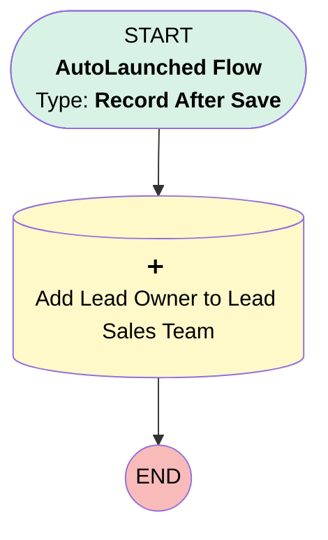

# EGH Lead - Add Leasing/Fleet Consultant to Lead Sales Team

## Flow Diagram

<!-- Flow description -->

## General Information

|<!-- -->|<!-- -->|
|:---|:---|
|Object|Lead|
|Process Type| Auto Launched Flow|
|Trigger Type| Record After Save|
|Record Trigger Type| Create|
|Label|EGH Lead - Add Leasing/Fleet Consultant to Lead Sales Team|
|Status|Active|
|Filter Formula|BEGINS({!$Record.OwnerId},"005") &&   ( {!$Record.Owner:User.UserRole.DeveloperName} = "Fleet_Sales_Consultant" || {!$Record.Owner:User.UserRole.DeveloperName} = "Leasing_Sales_Consultant")|
|Environments|Default|
|Interview Label|EGH Lead - Add Leasing/Fleet Consultant to Lead Sales Team {!$Flow.CurrentDateTime}|
| Builder Type (PM)|LightningFlowBuilder|
| Canvas Mode (PM)|AUTO_LAYOUT_CANVAS|
| Origin Builder Type (PM)|LightningFlowBuilder|
|Connector|[Add_Lead_Owner_to_Lead_Sales_Team](#add_lead_owner_to_lead_sales_team)|
|Next Node|[Add_Lead_Owner_to_Lead_Sales_Team](#add_lead_owner_to_lead_sales_team)|

## Flow Nodes Details

### Add_Lead_Owner_to_Lead_Sales_Team

|<!-- -->|<!-- -->|
|:---|:---|
|Type|Record Create|
|Object|EGH_LeadSalesTeam__c|
|Label|Add Lead Owner to Lead Sales Team|
|Store Output Automatically|✅|

#### Input Assignments

|Field|Value|
|:-- |:--: |
|EGH_LeadLookup__c|$Record.Id|
|EGH_ShowroomLookup__c|$Record.EGH_LeadBranchUnitLookup__c|
|EGH_TeamMemberLookup__c|$Record.OwnerId|

___

_Documentation generated from branch null by [sfdx-hardis](https://sfdx-hardis.cloudity.com), featuring [salesforce-flow-visualiser](https://github.com/toddhalfpenny/salesforce-flow-visualiser)_