# EGH Lead Add Sales Consultant to Lead Sales Team

## Flow Diagram

```mermaid
%% If you read this, your Markdown visualizer does not handle MermaidJS syntax.
%% - If you are in VS Code, install extension `Markdown Preview Mermaid Support` at https://marketplace.visualstudio.com/items?itemName=bierner.markdown-mermaid
%% - If you are using sfdx-hardis, try to define env variable `MERMAID_MODES=cli,docker` ,then run again the command to regenerate markdown with SVG images.
%% - If you are within mkdocs-material, define mermaid plugin in `mkdocs.yml` as described in https://squidfunk.github.io/mkdocs-material/extensions/mermaid/
%% - As a last resort, you can copy-paste this MermaidJS code into https://mermaid.live/ to see the flow diagram

flowchart TB
START(["START<br/><b>AutoLaunched Flow</b></br>Type: <b> Record After Save</b>"]):::startClass
click START "#general-information" "3814820394"

Update_Visit_Owner_with_Lead_Owner[\"🟰 <em></em><br/>Update Visit Owner with Lead Owner"/]:::assignments
click Update_Visit_Owner_with_Lead_Owner "#update_visit_owner_with_lead_owner" "3296247972"

Latest_Visit_Exist{"🔀 <em></em><br/>Latest Visit Exist ?"}:::decisions
click Latest_Visit_Exist "#latest_visit_exist" "3515612852"

Lead_Sales_Team_Exists{"🔀 <em></em><br/>Lead Sales Team Exists ?"}:::decisions
click Lead_Sales_Team_Exists "#lead_sales_team_exists" "2509080675"

Add_Sales_Consultant_Owner_to_Lead_Sales_Team[("➕ <em></em><br/>Add Sales Consultant Owner to Lead Sales Team")]:::recordCreates
click Add_Sales_Consultant_Owner_to_Lead_Sales_Team "#add_sales_consultant_owner_to_lead_sales_team" "3034948245"

Get_Existing_Lead_Sales_Team[("🔍 <em></em><br/>Get Existing Lead Sales Team")]:::recordLookups
click Get_Existing_Lead_Sales_Team "#get_existing_lead_sales_team" "392563268"

Get_Latest_Related_Visit[("🔍 <em></em><br/>Get Latest Related Visit")]:::recordLookups
click Get_Latest_Related_Visit "#get_latest_related_visit" "1186814987"

Update_Latest_Related_Visit[("🛠️ <em></em><br/>Update Latest Related Visit")]:::recordUpdates
click Update_Latest_Related_Visit "#update_latest_related_visit" "3334997432"

Update_Visit_Owner_with_Lead_Owner --> Update_Latest_Related_Visit
Latest_Visit_Exist --> |"Update Visit Owner"| Update_Visit_Owner_with_Lead_Owner
Latest_Visit_Exist --> |"Default Outcome"| END_Latest_Visit_Exist
Lead_Sales_Team_Exists --> |"No Create One"| Add_Sales_Consultant_Owner_to_Lead_Sales_Team
Lead_Sales_Team_Exists --> |"Exist Already"| Get_Latest_Related_Visit
Add_Sales_Consultant_Owner_to_Lead_Sales_Team --> Get_Latest_Related_Visit
Get_Existing_Lead_Sales_Team --> Lead_Sales_Team_Exists
Get_Latest_Related_Visit --> Latest_Visit_Exist
Update_Latest_Related_Visit --> END_Update_Latest_Related_Visit
START -->  Get_Existing_Lead_Sales_Team
END_Latest_Visit_Exist(( END )):::endClass
END_Update_Latest_Related_Visit(( END )):::endClass


classDef actionCalls fill:#D4E4FC,color:black,text-decoration:none,max-height:100px
classDef assignments fill:#FBEED7,color:black,text-decoration:none,max-height:100px
classDef collectionProcessors fill:#F0E3FA,color:black,text-decoration:none,max-height:100px
classDef customErrors fill:#FFE9E9,color:black,text-decoration:none,max-height:100px
classDef decisions fill:#FDEAF6,color:black,text-decoration:none,max-height:100px
classDef loops fill:#FDEAF6,color:black,text-decoration:none,max-height:100px
classDef recordCreates fill:#FFF8C9,color:black,text-decoration:none,max-height:100px
classDef recordDeletes fill:#FFF8C9,color:black,text-decoration:none,max-height:100px
classDef recordLookups fill:#EDEAFF,color:black,text-decoration:none,max-height:100px
classDef recordUpdates fill:#FFF8C9,color:black,text-decoration:none,max-height:100px
classDef screens fill:#DFF6FF,color:black,text-decoration:none,max-height:100px
classDef subflows fill:#D4E4FC,color:black,text-decoration:none,max-height:100px
classDef startClass fill:#D9F2E6,color:black,text-decoration:none,max-height:100px
classDef endClass fill:#F9BABA,color:black,text-decoration:none,max-height:100px
classDef transforms fill:#FDEAF6,color:black,text-decoration:none,max-height:100px


```

<!-- Flow description -->

## General Information

|<!-- -->|<!-- -->|
|:---|:---|
|Object|Lead|
|Process Type| Auto Launched Flow|
|Trigger Type| Record After Save|
|Record Trigger Type| Update|
|Label|EGH Lead Add Sales Consultant to Lead Sales Team|
|Status|Active|
|Filter Formula|ISCHANGED({!$Record.OwnerId}) && BEGINS({!$Record.OwnerId},"005") &&  ({!$Record.Owner:User.UserRole.DeveloperName} = "EGH_SalesConsultantRole" || {!$Record.Owner:User.UserRole.DeveloperName} = "Fleet_Sales_Consultant" || {!$Record.Owner:User.UserRole.DeveloperName} = "Leasing_Sales_Consultant")|
|Environments|Default|
|Interview Label|EGH {!$Flow.CurrentDateTime}|
| Builder Type (PM)|LightningFlowBuilder|
| Canvas Mode (PM)|AUTO_LAYOUT_CANVAS|
| Origin Builder Type (PM)|LightningFlowBuilder|
|Connector|[Get_Existing_Lead_Sales_Team](#get_existing_lead_sales_team)|
|Next Node|[Get_Existing_Lead_Sales_Team](#get_existing_lead_sales_team)|

## Flow Nodes Details

### Update_Visit_Owner_with_Lead_Owner

|<!-- -->|<!-- -->|
|:---|:---|
|Type|Assignment|
|Label|Update Visit Owner with Lead Owner|
|Connector|[Update_Latest_Related_Visit](#update_latest_related_visit)|

#### Assignments

|Assign To Reference|Operator|Value|
|:-- |:--:|:--: |
|Get_Latest_Related_Visit.OwnerId| Assign|$Record.OwnerId|

### Latest_Visit_Exist

|<!-- -->|<!-- -->|
|:---|:---|
|Type|Decision|
|Label|Latest Visit Exist ?|
|Default Connector Label|Default Outcome|

#### Rule Update_Visit_Owner (Update Visit Owner)

|<!-- -->|<!-- -->|
|:---|:---|
|Connector|[Update_Visit_Owner_with_Lead_Owner](#update_visit_owner_with_lead_owner)|
|Condition Logic|and|

|Condition Id|Left Value Reference|Operator|Right Value|
|:-- |:-- |:--:|:--: |
|1|[Get_Latest_Related_Visit](#get_latest_related_visit)| Is Null|⬜|

### Lead_Sales_Team_Exists

|<!-- -->|<!-- -->|
|:---|:---|
|Type|Decision|
|Label|Lead Sales Team Exists ?|
|Default Connector|[Get_Latest_Related_Visit](#get_latest_related_visit)|
|Default Connector Label|Exist Already|

#### Rule No_Create_One (No Create One)

|<!-- -->|<!-- -->|
|:---|:---|
|Connector|[Add_Sales_Consultant_Owner_to_Lead_Sales_Team](#add_sales_consultant_owner_to_lead_sales_team)|
|Condition Logic|and|

|Condition Id|Left Value Reference|Operator|Right Value|
|:-- |:-- |:--:|:--: |
|1|[Get_Existing_Lead_Sales_Team](#get_existing_lead_sales_team)| Is Null|✅|

### Add_Sales_Consultant_Owner_to_Lead_Sales_Team

|<!-- -->|<!-- -->|
|:---|:---|
|Type|Record Create|
|Object|EGH_LeadSalesTeam__c|
|Label|Add Sales Consultant Owner to Lead Sales Team|
|Store Output Automatically|✅|
|Connector|[Get_Latest_Related_Visit](#get_latest_related_visit)|

#### Input Assignments

|Field|Value|
|:-- |:--: |
|EGH_LeadLookup__c|$Record.Id|
|EGH_ShowroomLookup__c|$Record.EGH_LeadBranchUnitLookup__c|
|EGH_TeamMemberLookup__c|$Record.OwnerId|

### Get_Existing_Lead_Sales_Team

|<!-- -->|<!-- -->|
|:---|:---|
|Type|Record Lookup|
|Object|EGH_LeadSalesTeam__c|
|Label|Get Existing Lead Sales Team|
|Assign Null Values If No Records Found|⬜|
|Get First Record Only|✅|
|Store Output Automatically|✅|
|Connector|[Lead_Sales_Team_Exists](#lead_sales_team_exists)|

#### Filters (logic: **and**)

|Filter Id|Field|Operator|Value|
|:-- |:-- |:--:|:--: |
|1|EGH_LeadLookup__c| Equal To|$Record.Id|
|2|EGH_TeamMemberLookup__c| Equal To|$Record.OwnerId|
|3|EGH_ShowroomLookup__c| Equal To|$Record.EGH_LeadBranchUnitLookup__c|

### Get_Latest_Related_Visit

|<!-- -->|<!-- -->|
|:---|:---|
|Type|Record Lookup|
|Object|EGH_ShowroomVisit__c|
|Label|Get Latest Related Visit|
|Assign Null Values If No Records Found|⬜|
|Get First Record Only|✅|
|Sort Field|CreatedDate|
|Sort Order|Desc|
|Store Output Automatically|✅|
|Connector|[Latest_Visit_Exist](#latest_visit_exist)|

#### Filters (logic: **and**)

|Filter Id|Field|Operator|Value|
|:-- |:-- |:--:|:--: |
|1|EGH_LeadLookup__c| Equal To|$Record.Id|
|2|EGH_Status__c| Not Equal To|Ended|

### Update_Latest_Related_Visit

|<!-- -->|<!-- -->|
|:---|:---|
|Type|Record Update|
|Label|Update Latest Related Visit|
|Input Reference|[Get_Latest_Related_Visit](#get_latest_related_visit)|

___

_Documentation generated from branch null by [sfdx-hardis](https://sfdx-hardis.cloudity.com), featuring [salesforce-flow-visualiser](https://github.com/toddhalfpenny/salesforce-flow-visualiser)_