# EGH - Lead Creation - Set Defaults

## Flow Diagram

```mermaid
%% If you read this, your Markdown visualizer does not handle MermaidJS syntax.
%% - If you are in VS Code, install extension `Markdown Preview Mermaid Support` at https://marketplace.visualstudio.com/items?itemName=bierner.markdown-mermaid
%% - If you are using sfdx-hardis, try to define env variable `MERMAID_MODES=cli,docker` ,then run again the command to regenerate markdown with SVG images.
%% - If you are within mkdocs-material, define mermaid plugin in `mkdocs.yml` as described in https://squidfunk.github.io/mkdocs-material/extensions/mermaid/
%% - As a last resort, you can copy-paste this MermaidJS code into https://mermaid.live/ to see the flow diagram

flowchart TB
START(["START<br/><b>AutoLaunched Flow</b></br>Type: <b> Record Before Save</b>"]):::startClass
click START "#general-information" "2375666901"

Check_Persona{"🔀 <em></em><br/>Check Persona"}:::decisions
click Check_Persona "#check_persona" "1185718222"

Copy_1_of_Update_Record[("🛠️ <em></em><br/>Copy 1 of Update Record")]:::recordUpdates
click Copy_1_of_Update_Record "#copy_1_of_update_record" "3930098921"

Copy_2_of_Update_Record[("🛠️ <em></em><br/>Copy 2 of Update Record")]:::recordUpdates
click Copy_2_of_Update_Record "#copy_2_of_update_record" "1252158527"

Update_Record[("🛠️ <em></em><br/>Update Record")]:::recordUpdates
click Update_Record "#update_record" "3000503797"

Check_Persona --> |"Meet and Greet"| Update_Record
Check_Persona --> |"Product Genius"| Copy_1_of_Update_Record
Check_Persona --> |"Digital Sales Consultant"| Copy_2_of_Update_Record
Check_Persona --> |"Default Outcome"| END_Check_Persona
Copy_1_of_Update_Record --> END_Copy_1_of_Update_Record
Copy_2_of_Update_Record --> END_Copy_2_of_Update_Record
Update_Record --> END_Update_Record
START -->  Check_Persona
END_Check_Persona(( END )):::endClass
END_Copy_1_of_Update_Record(( END )):::endClass
END_Copy_2_of_Update_Record(( END )):::endClass
END_Update_Record(( END )):::endClass


classDef actionCalls fill:#D4E4FC,color:black,text-decoration:none,max-height:100px
classDef assignments fill:#FBEED7,color:black,text-decoration:none,max-height:100px
classDef collectionProcessors fill:#F0E3FA,color:black,text-decoration:none,max-height:100px
classDef customErrors fill:#FFE9E9,color:black,text-decoration:none,max-height:100px
classDef decisions fill:#FDEAF6,color:black,text-decoration:none,max-height:100px
classDef loops fill:#FDEAF6,color:black,text-decoration:none,max-height:100px
classDef recordCreates fill:#FFF8C9,color:black,text-decoration:none,max-height:100px
classDef recordDeletes fill:#FFF8C9,color:black,text-decoration:none,max-height:100px
classDef recordLookups fill:#EDEAFF,color:black,text-decoration:none,max-height:100px
classDef recordUpdates fill:#FFF8C9,color:black,text-decoration:none,max-height:100px
classDef screens fill:#DFF6FF,color:black,text-decoration:none,max-height:100px
classDef subflows fill:#D4E4FC,color:black,text-decoration:none,max-height:100px
classDef startClass fill:#D9F2E6,color:black,text-decoration:none,max-height:100px
classDef endClass fill:#F9BABA,color:black,text-decoration:none,max-height:100px
classDef transforms fill:#FDEAF6,color:black,text-decoration:none,max-height:100px


```

<!-- Flow description -->

## General Information

|<!-- -->|<!-- -->|
|:---|:---|
|Object|Lead|
|Process Type| Auto Launched Flow|
|Trigger Type| Record Before Save|
|Record Trigger Type| Create|
|Label|EGH - Lead Creation - Set Defaults|
|Status|Obsolete|
|Filter Formula|NOT(ISBLANK({!$UserRole.DeveloperName}))|
|Description|Sets Default Fields on Lead When record is Created|
|Environments|Default|
|Interview Label|EGH - Lead Creation - Set Defaults {!$Flow.CurrentDateTime}|
| Builder Type (PM)|LightningFlowBuilder|
| Canvas Mode (PM)|AUTO_LAYOUT_CANVAS|
| Origin Builder Type (PM)|LightningFlowBuilder|
|Connector|[Check_Persona](#check_persona)|
|Next Node|[Check_Persona](#check_persona)|

## Flow Nodes Details

### Check_Persona

|<!-- -->|<!-- -->|
|:---|:---|
|Type|Decision|
|Label|Check Persona|
|Default Connector Label|Default Outcome|

#### Rule Meet_and_Greet (Meet and Greet)

|<!-- -->|<!-- -->|
|:---|:---|
|Connector|[Update_Record](#update_record)|
|Condition Logic|and|

|Condition Id|Left Value Reference|Operator|Right Value|
|:-- |:-- |:--:|:--: |
|1|$UserRole.DeveloperName| Equal To|MeetGreetTeamMemberRole|

#### Rule Product_Genius (Product Genius)

|<!-- -->|<!-- -->|
|:---|:---|
|Connector|[Copy_1_of_Update_Record](#copy_1_of_update_record)|
|Condition Logic|and|

|Condition Id|Left Value Reference|Operator|Right Value|
|:-- |:-- |:--:|:--: |
|1|$UserRole.DeveloperName| Equal To|Product_Genius_Agent|

#### Rule Digital_Sales_Consultant (Digital Sales Consultant)

|<!-- -->|<!-- -->|
|:---|:---|
|Connector|[Copy_2_of_Update_Record](#copy_2_of_update_record)|
|Condition Logic|and|

|Condition Id|Left Value Reference|Operator|Right Value|
|:-- |:-- |:--:|:--: |
|1|$UserRole.DeveloperName| Equal To|EGH_DigitalSalesConsultant|

### Copy_1_of_Update_Record

|<!-- -->|<!-- -->|
|:---|:---|
|Type|Record Update|
|Label|Copy 1 of Update Record|
|Input Reference|$Record|

#### Input Assignments

|Field|Value|
|:-- |:--: |
|LeadSource|Event|

### Copy_2_of_Update_Record

|<!-- -->|<!-- -->|
|:---|:---|
|Type|Record Update|
|Label|Copy 2 of Update Record|
|Input Reference|$Record|

#### Input Assignments

|Field|Value|
|:-- |:--: |
|LeadSource|Digital Sales Consultant|

### Update_Record

|<!-- -->|<!-- -->|
|:---|:---|
|Type|Record Update|
|Label|Update Record|
|Input Reference|$Record|

#### Input Assignments

|Field|Value|
|:-- |:--: |
|EGH_UTMCampaignSourceText__c|Event|
|LeadSource|Walk-in|

___

_Documentation generated from branch null by [sfdx-hardis](https://sfdx-hardis.cloudity.com), featuring [salesforce-flow-visualiser](https://github.com/toddhalfpenny/salesforce-flow-visualiser)_