# EGH - Set Branch Code

## Flow Diagram

```mermaid
%% If you read this, your Markdown visualizer does not handle MermaidJS syntax.
%% - If you are in VS Code, install extension `Markdown Preview Mermaid Support` at https://marketplace.visualstudio.com/items?itemName=bierner.markdown-mermaid
%% - If you are using sfdx-hardis, try to define env variable `MERMAID_MODES=cli,docker` ,then run again the command to regenerate markdown with SVG images.
%% - If you are within mkdocs-material, define mermaid plugin in `mkdocs.yml` as described in https://squidfunk.github.io/mkdocs-material/extensions/mermaid/
%% - As a last resort, you can copy-paste this MermaidJS code into https://mermaid.live/ to see the flow diagram

flowchart TB
START(["START<br/><b>AutoLaunched Flow</b></br>Type: <b> Record Before Save</b>"]):::startClass
click START "#general-information" "1435746808"

Assign_Branch_Code[\"🟰 <em></em><br/>Assign Branch Code"/]:::assignments
click Assign_Branch_Code "#assign_branch_code" "2395745846"

No_Branch_Assigned[\"🟰 <em></em><br/>No Branch Assigned"/]:::assignments
click No_Branch_Assigned "#no_branch_assigned" "1112007614"

Preferred_Branch_Code_Exists{"🔀 <em></em><br/>Preferred Branch Code Exists ?"}:::decisions
click Preferred_Branch_Code_Exists "#preferred_branch_code_exists" "573761675"

Populate_Branch_Code[("🛠️ <em></em><br/>Populate Branch Code")]:::recordUpdates
click Populate_Branch_Code "#populate_branch_code" "1544020942"

Assign_Branch_Code --> Populate_Branch_Code
No_Branch_Assigned --> Populate_Branch_Code
Preferred_Branch_Code_Exists --> |"Yes"| Assign_Branch_Code
Preferred_Branch_Code_Exists --> |"No"| No_Branch_Assigned
Populate_Branch_Code --> END_Populate_Branch_Code
START -->  Preferred_Branch_Code_Exists
END_Populate_Branch_Code(( END )):::endClass


classDef actionCalls fill:#D4E4FC,color:black,text-decoration:none,max-height:100px
classDef assignments fill:#FBEED7,color:black,text-decoration:none,max-height:100px
classDef collectionProcessors fill:#F0E3FA,color:black,text-decoration:none,max-height:100px
classDef customErrors fill:#FFE9E9,color:black,text-decoration:none,max-height:100px
classDef decisions fill:#FDEAF6,color:black,text-decoration:none,max-height:100px
classDef loops fill:#FDEAF6,color:black,text-decoration:none,max-height:100px
classDef recordCreates fill:#FFF8C9,color:black,text-decoration:none,max-height:100px
classDef recordDeletes fill:#FFF8C9,color:black,text-decoration:none,max-height:100px
classDef recordLookups fill:#EDEAFF,color:black,text-decoration:none,max-height:100px
classDef recordUpdates fill:#FFF8C9,color:black,text-decoration:none,max-height:100px
classDef screens fill:#DFF6FF,color:black,text-decoration:none,max-height:100px
classDef subflows fill:#D4E4FC,color:black,text-decoration:none,max-height:100px
classDef startClass fill:#D9F2E6,color:black,text-decoration:none,max-height:100px
classDef endClass fill:#F9BABA,color:black,text-decoration:none,max-height:100px
classDef transforms fill:#FDEAF6,color:black,text-decoration:none,max-height:100px


```

<!-- Flow description -->

## General Information

|<!-- -->|<!-- -->|
|:---|:---|
|Object|Lead|
|Process Type| Auto Launched Flow|
|Trigger Type| Record Before Save|
|Record Trigger Type| Create And Update|
|Label|EGH - Set Branch Code|
|Status|Active|
|Environments|Default|
|Interview Label|EGH - {!$Flow.CurrentDateTime}|
| Builder Type (PM)|LightningFlowBuilder|
| Canvas Mode (PM)|AUTO_LAYOUT_CANVAS|
| Origin Builder Type (PM)|LightningFlowBuilder|
|Connector|[Preferred_Branch_Code_Exists](#preferred_branch_code_exists)|
|Next Node|[Preferred_Branch_Code_Exists](#preferred_branch_code_exists)|

#### Filters (logic: **or**)

|Filter Id|Field|Operator|Value|
|:-- |:-- |:--:|:--: |
|1|EGH_BranchCode__c| Is Null|<!-- -->|
|2|EGH_LeadBranchUnitLookup__c| Is Changed|✅|

## Variables

|Name|Data Type|Is Collection|Is Input|Is Output|Object Type|Description|
|:-- |:--:|:--:|:--:|:--:|:--:|:--  |
|BranchCode|String|⬜|⬜|⬜|<!-- -->|<!-- -->|

## Flow Nodes Details

### Assign_Branch_Code

|<!-- -->|<!-- -->|
|:---|:---|
|Type|Assignment|
|Label|Assign Branch Code|
|Connector|[Populate_Branch_Code](#populate_branch_code)|

#### Assignments

|Assign To Reference|Operator|Value|
|:-- |:--:|:--: |
|BranchCode| Assign|$Record.EGH_LeadBranchUnitLookup__r.BranchCode|

### No_Branch_Assigned

|<!-- -->|<!-- -->|
|:---|:---|
|Type|Assignment|
|Label|No Branch Assigned|
|Connector|[Populate_Branch_Code](#populate_branch_code)|

#### Assignments

|Assign To Reference|Operator|Value|
|:-- |:--:|:--: |
|BranchCode| Assign|NO_BRANCH_ASSIGNED|

### Preferred_Branch_Code_Exists

|<!-- -->|<!-- -->|
|:---|:---|
|Type|Decision|
|Label|Preferred Branch Code Exists ?|
|Default Connector|[No_Branch_Assigned](#no_branch_assigned)|
|Default Connector Label|No|

#### Rule Yes (Yes)

|<!-- -->|<!-- -->|
|:---|:---|
|Connector|[Assign_Branch_Code](#assign_branch_code)|
|Condition Logic|and|

|Condition Id|Left Value Reference|Operator|Right Value|
|:-- |:-- |:--:|:--: |
|1|$Record.EGH_LeadBranchUnitLookup__r.BranchCode| Is Null|⬜|

### Populate_Branch_Code

|<!-- -->|<!-- -->|
|:---|:---|
|Type|Record Update|
|Label|Populate Branch Code|
|Input Reference|$Record|

#### Input Assignments

|Field|Value|
|:-- |:--: |
|EGH_BranchCode__c|BranchCode|

___

_Documentation generated from branch null by [sfdx-hardis](https://sfdx-hardis.cloudity.com), featuring [salesforce-flow-visualiser](https://github.com/toddhalfpenny/salesforce-flow-visualiser)_