# EGH Start Test Drive Flow

## Flow Diagram

```mermaid
%% If you read this, your Markdown visualizer does not handle MermaidJS syntax.
%% - If you are in VS Code, install extension `Markdown Preview Mermaid Support` at https://marketplace.visualstudio.com/items?itemName=bierner.markdown-mermaid
%% - If you are using sfdx-hardis, try to define env variable `MERMAID_MODES=cli,docker` ,then run again the command to regenerate markdown with SVG images.
%% - If you are within mkdocs-material, define mermaid plugin in `mkdocs.yml` as described in https://squidfunk.github.io/mkdocs-material/extensions/mermaid/
%% - As a last resort, you can copy-paste this MermaidJS code into https://mermaid.live/ to see the flow diagram

flowchart TB
START(["START<br/><b>Screen Flow</b>"]):::startClass
click START "#general-information" "2580676498"

Add_Existing_DL_to_Collection[\"🟰 <em></em><br/>Add Existing  DL to Collection"/]:::assignments
click Add_Existing_DL_to_Collection "#add_existing_dl_to_collection" "1498802060"

Add_Existing_EID_to_Collection[\"🟰 <em></em><br/>Add Existing EID to Collection"/]:::assignments
click Add_Existing_EID_to_Collection "#add_existing_eid_to_collection" "1654565917"

Add_New_DL_to_Collection[\"🟰 <em></em><br/>Add New DL to Collection"/]:::assignments
click Add_New_DL_to_Collection "#add_new_dl_to_collection" "1906553200"

Add_New_EID_to_Collection[\"🟰 <em></em><br/>Add New EID to Collection"/]:::assignments
click Add_New_EID_to_Collection "#add_new_eid_to_collection" "357210081"

Create_Existing_Driving_License_Instance[\"🟰 <em></em><br/>Create Existing Driving License Instance"/]:::assignments
click Create_Existing_Driving_License_Instance "#create_existing_driving_license_instance" "798322797"

Create_Existing_Emirate_ID_Instance[\"🟰 <em></em><br/>Create Existing Emirate ID Instance"/]:::assignments
click Create_Existing_Emirate_ID_Instance "#create_existing_emirate_id_instance" "1480039958"

Create_New_Driving_License_Instance[\"🟰 <em></em><br/>Create New Driving License Instance"/]:::assignments
click Create_New_Driving_License_Instance "#create_new_driving_license_instance" "983135030"

Create_New_Emirate_ID_Instance[\"🟰 <em></em><br/>Create New Emirate ID Instance"/]:::assignments
click Create_New_Emirate_ID_Instance "#create_new_emirate_id_instance" "3385043558"

setDLFlag[\"🟰 <em></em><br/>setDLFlag"/]:::assignments
click setDLFlag "#setdlflag" "3001555624"

SetEIDFlag[\"🟰 <em></em><br/>SetEIDFlag"/]:::assignments
click SetEIDFlag "#seteidflag" "4061853480"

setIDNumber_Flag[\"🟰 <em></em><br/>setIDNumber Flag"/]:::assignments
click setIDNumber_Flag "#setidnumber_flag" "2426261788"

SetPassportFlag[\"🟰 <em></em><br/>SetPassportFlag"/]:::assignments
click SetPassportFlag "#setpassportflag" "1615802832"

Any_Change_In_Driving_License_Information{"🔀 <em></em><br/>Any Change In Driving License Information"}:::decisions
click Any_Change_In_Driving_License_Information "#any_change_in_driving_license_information" "3722360516"

Any_Change_In_Emirates_ID_Information{"🔀 <em></em><br/>Any Change In Emirates ID Information"}:::decisions
click Any_Change_In_Emirates_ID_Information "#any_change_in_emirates_id_information" "3662342629"

IdentifytheTypeofDocument{"🔀 <em></em><br/>Identify the type of Document"}:::decisions
click IdentifytheTypeofDocument "#identifythetypeofdocument" "2838849785"

If_Start_Date_is_less_than_current_time{"🔀 <em></em><br/>If Start Date is less than current time"}:::decisions
click If_Start_Date_is_less_than_current_time "#if_start_date_is_less_than_current_time" "3453158589"

Separate_Out_The_Existing_Documents{{"🔁 <em></em><br/>Separate Out The Existing Documents"}}:::loops
click Separate_Out_The_Existing_Documents "#separate_out_the_existing_documents" "237838407"

UpsertPersonalDocuments[("➕ <em></em><br/>UpsertPersonalDocuments")]:::recordCreates
click UpsertPersonalDocuments "#upsertpersonaldocuments" "538743457"

Get_Existing_Documents_for_Customer[("🔍 <em></em><br/>Get Existing Documents for Customer")]:::recordLookups
click Get_Existing_Documents_for_Customer "#get_existing_documents_for_customer" "1450538054"

Get_Service_Appointment[("🔍 <em></em><br/>Get Service Appointment")]:::recordLookups
click Get_Service_Appointment "#get_service_appointment" "623008699"

Update_Actual_Start_Time_and_In_Progress[("🛠️ <em></em><br/>Update Actual Start Time and In Progress")]:::recordUpdates
click Update_Actual_Start_Time_and_In_Progress "#update_actual_start_time_and_in_progress" "2514863578"

Capture_Informationv1(["💻 <em></em><br/>Capture Information"]):::screens
click Capture_Informationv1 "#capture_informationv1" "1292323155"

End_Time(["💻 <em></em><br/>End Time Validation"]):::screens
click End_Time "#end_time" "80677009"

FaultScreen(["💻 <em></em><br/>FaultScreen"]):::screens
click FaultScreen "#faultscreen" "1641380505"

Add_Existing_DL_to_Collection --> Any_Change_In_Emirates_ID_Information
Add_Existing_EID_to_Collection --> UpsertPersonalDocuments
Add_New_DL_to_Collection --> Any_Change_In_Emirates_ID_Information
Add_New_EID_to_Collection --> UpsertPersonalDocuments
Create_Existing_Driving_License_Instance --> Add_Existing_DL_to_Collection
Create_Existing_Emirate_ID_Instance --> Add_Existing_EID_to_Collection
Create_New_Driving_License_Instance --> Add_New_DL_to_Collection
Create_New_Emirate_ID_Instance --> Add_New_EID_to_Collection
setDLFlag --> Separate_Out_The_Existing_Documents
SetEIDFlag --> Separate_Out_The_Existing_Documents
setIDNumber_Flag --> Separate_Out_The_Existing_Documents
SetPassportFlag --> Separate_Out_The_Existing_Documents
Any_Change_In_Driving_License_Information --> |"Driving LicenseChange Deteced"| Create_Existing_Driving_License_Instance
Any_Change_In_Driving_License_Information --> |"New Driving License  Information Captured"| Create_New_Driving_License_Instance
Any_Change_In_Driving_License_Information --> |"No  Driving License Change Caotured"| Any_Change_In_Emirates_ID_Information
Any_Change_In_Emirates_ID_Information --> |"Emirates ID Change Deteced"| Create_Existing_Emirate_ID_Instance
Any_Change_In_Emirates_ID_Information --> |"New Emirates ID Captured"| Create_New_Emirate_ID_Instance
Any_Change_In_Emirates_ID_Information --> |"No  Emirates ID Captured"| UpsertPersonalDocuments
IdentifytheTypeofDocument --> |"Set Passport"| SetPassportFlag
IdentifytheTypeofDocument --> |"Set EID"| SetEIDFlag
IdentifytheTypeofDocument --> |"Set IDNumber"| setIDNumber_Flag
IdentifytheTypeofDocument --> |"Set DL"| setDLFlag
IdentifytheTypeofDocument --> |"Default Outcome"| Separate_Out_The_Existing_Documents
If_Start_Date_is_less_than_current_time --> |"End Date is Less Than Current Time"| End_Time
If_Start_Date_is_less_than_current_time --> |"Default Outcome"| Get_Existing_Documents_for_Customer
Separate_Out_The_Existing_Documents --> |"For Each"|IdentifytheTypeofDocument
Separate_Out_The_Existing_Documents ---> |"After Last"|Capture_Informationv1
UpsertPersonalDocuments --> Update_Actual_Start_Time_and_In_Progress
UpsertPersonalDocuments -. Fault .->FaultScreen
Get_Existing_Documents_for_Customer --> Separate_Out_The_Existing_Documents
Get_Service_Appointment --> If_Start_Date_is_less_than_current_time
Update_Actual_Start_Time_and_In_Progress --> END_Update_Actual_Start_Time_and_In_Progress
Update_Actual_Start_Time_and_In_Progress -. Fault .->FaultScreen
Capture_Informationv1 --> Any_Change_In_Driving_License_Information
End_Time --> END_End_Time
FaultScreen --> END_FaultScreen
START -->  Get_Service_Appointment
END_Update_Actual_Start_Time_and_In_Progress(( END )):::endClass
END_End_Time(( END )):::endClass
END_FaultScreen(( END )):::endClass


classDef actionCalls fill:#D4E4FC,color:black,text-decoration:none,max-height:100px
classDef assignments fill:#FBEED7,color:black,text-decoration:none,max-height:100px
classDef collectionProcessors fill:#F0E3FA,color:black,text-decoration:none,max-height:100px
classDef customErrors fill:#FFE9E9,color:black,text-decoration:none,max-height:100px
classDef decisions fill:#FDEAF6,color:black,text-decoration:none,max-height:100px
classDef loops fill:#FDEAF6,color:black,text-decoration:none,max-height:100px
classDef recordCreates fill:#FFF8C9,color:black,text-decoration:none,max-height:100px
classDef recordDeletes fill:#FFF8C9,color:black,text-decoration:none,max-height:100px
classDef recordLookups fill:#EDEAFF,color:black,text-decoration:none,max-height:100px
classDef recordUpdates fill:#FFF8C9,color:black,text-decoration:none,max-height:100px
classDef screens fill:#DFF6FF,color:black,text-decoration:none,max-height:100px
classDef subflows fill:#D4E4FC,color:black,text-decoration:none,max-height:100px
classDef startClass fill:#D9F2E6,color:black,text-decoration:none,max-height:100px
classDef endClass fill:#F9BABA,color:black,text-decoration:none,max-height:100px
classDef transforms fill:#FDEAF6,color:black,text-decoration:none,max-height:100px


```

<!-- Flow description -->

## General Information

|<!-- -->|<!-- -->|
|:---|:---|
|Process Type| Flow|
|Label|EGH Start Test Drive Flow|
|Status|Active|
|Description|Start Test Drive Screen Flow|
|Environments|Default|
|Interview Label|EGH Start Test Drive Flow {!$Flow.CurrentDateTime}|
|Run In Mode| System Mode Without Sharing|
| Builder Type (PM)|LightningFlowBuilder|
| Canvas Mode (PM)|AUTO_LAYOUT_CANVAS|
| Origin Builder Type (PM)|LightningFlowBuilder|
|Connector|[Get_Service_Appointment](#get_service_appointment)|
|Next Node|[Get_Service_Appointment](#get_service_appointment)|

## Variables

|Name|Data Type|Is Collection|Is Input|Is Output|Object Type|Description|
|:-- |:--:|:--:|:--:|:--:|:--:|:--  |
|currentItem_Exclude_Orphan_Personal_Documents|SObject|⬜|⬜|⬜|EGH_PersonalDocumentsObject__c|<!-- -->|
|recordId|String|⬜|✅|⬜|<!-- -->|ID of the Service Appointment record|
|varDrivingLicenseFlag|Boolean|⬜|⬜|⬜|<!-- -->|<!-- -->|
|varEmiratesIDFlag|Boolean|⬜|⬜|⬜|<!-- -->|<!-- -->|
|varInternationalDrivingNumberFlag|Boolean|⬜|⬜|⬜|<!-- -->|<!-- -->|
|varNewDLRecord|SObject|⬜|⬜|⬜|EGH_PersonalDocumentsObject__c|<!-- -->|
|varNewEmiratesID|SObject|⬜|⬜|⬜|EGH_PersonalDocumentsObject__c|<!-- -->|
|varNewInternationalDrivingNumberRecord|SObject|⬜|⬜|⬜|EGH_PersonalDocumentsObject__c|<!-- -->|
|varNewPassportRecord|SObject|⬜|⬜|⬜|EGH_PersonalDocumentsObject__c|<!-- -->|
|varOldDrivingLicenseRecord|SObject|⬜|⬜|⬜|EGH_PersonalDocumentsObject__c|<!-- -->|
|varOldEmiratesIDRecord|SObject|⬜|✅|⬜|EGH_PersonalDocumentsObject__c|<!-- -->|
|varOldInternationalDrivingNumberRecord|SObject|⬜|⬜|⬜|EGH_PersonalDocumentsObject__c|<!-- -->|
|varOldPassportRecord|SObject|⬜|⬜|⬜|EGH_PersonalDocumentsObject__c|<!-- -->|
|varPassportFlag|Boolean|⬜|⬜|⬜|<!-- -->|<!-- -->|
|varPersonalDocumentRecordCollection|SObject|✅|⬜|⬜|EGH_PersonalDocumentsObject__c|<!-- -->|

## Formulas

|Name|Data Type|Expression|Description|
|:-- |:--:|:-- |:--  |
|CurrentDateTime|DateTime|NOW()|Current Date and Time|
|isDrivingLicenseChanged|Boolean|{!Driving_Licensev1}<>{!varOldDrivingLicenseRecord.EGH_DocumentNumberText__c}|<!-- -->|
|isDrivingLicenseExpiryDateChanged|Boolean|{!Driving_License_Expiry_Datev1}<>{!varOldDrivingLicenseRecord.EGH_ExpirationDate__c}|<!-- -->|
|isDrivingLicenseIssueDateChanged|Boolean|{!DLIssueDatev1}<>{!varOldDrivingLicenseRecord.EGH_Issue_Date__c}|<!-- -->|
|isEmiratesIDChanged|Boolean|{!Emirates_IDv1}<>{!varOldEmiratesIDRecord.EGH_DocumentNumberText__c}|<!-- -->|
|isEmiratesIDExpiryDateChanged|Boolean|{!Emirates_ID_Expiry_Datev1}<>{!varOldEmiratesIDRecord.EGH_ExpirationDate__c}|<!-- -->|
|isEmiratesIDIssueDateChanged|Boolean|{!Emirates_ID_Issue_Datev1}<>{!varOldEmiratesIDRecord.EGH_Issue_Date__c}|<!-- -->|
|TodayDate|Date|TODAY()|Today's Date|
|varCustomMetadataDLMaxLength|Number|{!$CustomMetadata.EGH_Personal_Documents_Validation_Meta__mdt.Driving_License.Minimum_Length__c}|<!-- -->|
|varCustomMetadataDLMinLength|Number|{!$CustomMetadata.EGH_Personal_Documents_Validation_Meta__mdt.Driving_License.Minimum_Length__c}|<!-- -->|
|varCustomMetadataDLRegex|String|{!$CustomMetadata.EGH_Personal_Documents_Validation_Meta__mdt.Driving_License.REGEX__c}|<!-- -->|
|varCustomMetadataEIDMaxLength|Number|{!$CustomMetadata.EGH_Personal_Documents_Validation_Meta__mdt.Emirates_ID.Maximum_Length__c}|<!-- -->|
|varCustomMetadataEIDMinLength|Number|{!$CustomMetadata.EGH_Personal_Documents_Validation_Meta__mdt.Emirates_ID.Minimum_Length__c}|<!-- -->|
|varCustomMetadataEIDRegex|String|{!$CustomMetadata.EGH_Personal_Documents_Validation_Meta__mdt.Emirates_ID.REGEX__c}|<!-- -->|
|varCustomMetadataPassportMaxLength|Number|{!$CustomMetadata.EGH_Personal_Documents_Validation_Meta__mdt.Passport.Maximum_Length__c}|<!-- -->|
|varCustomMetadataPassportMinLength|Number|{!$CustomMetadata.EGH_Personal_Documents_Validation_Meta__mdt.Passport.Minimum_Length__c}|<!-- -->|
|varCustomMetadataPassportRegex|String|{!$CustomMetadata.EGH_Personal_Documents_Validation_Meta__mdt.Passport.REGEX__c}|<!-- -->|
|varParentAccountID|String|IF({!Get_Service_Appointment.AccountId}<>'',{!Get_Service_Appointment.AccountId},'')|<!-- -->|
|varParentLeadID|String|IF({!Get_Service_Appointment.ParentRecordType}='Lead',{!Get_Service_Appointment.ParentRecordId},'')|<!-- -->|

## Flow Nodes Details

### Add_Existing_DL_to_Collection

|<!-- -->|<!-- -->|
|:---|:---|
|Type|Assignment|
|Label|Add Existing  DL to Collection|
|Connector|[Any_Change_In_Emirates_ID_Information](#any_change_in_emirates_id_information)|

#### Assignments

|Assign To Reference|Operator|Value|
|:-- |:--:|:--: |
|varPersonalDocumentRecordCollection| Add|varNewDLRecord|

### Add_Existing_EID_to_Collection

|<!-- -->|<!-- -->|
|:---|:---|
|Type|Assignment|
|Label|Add Existing EID to Collection|
|Connector|[UpsertPersonalDocuments](#upsertpersonaldocuments)|

#### Assignments

|Assign To Reference|Operator|Value|
|:-- |:--:|:--: |
|varPersonalDocumentRecordCollection| Add|varNewEmiratesID|

### Add_New_DL_to_Collection

|<!-- -->|<!-- -->|
|:---|:---|
|Type|Assignment|
|Label|Add New DL to Collection|
|Connector|[Any_Change_In_Emirates_ID_Information](#any_change_in_emirates_id_information)|

#### Assignments

|Assign To Reference|Operator|Value|
|:-- |:--:|:--: |
|varPersonalDocumentRecordCollection| Add|varNewDLRecord|

### Add_New_EID_to_Collection

|<!-- -->|<!-- -->|
|:---|:---|
|Type|Assignment|
|Label|Add New EID to Collection|
|Connector|[UpsertPersonalDocuments](#upsertpersonaldocuments)|

#### Assignments

|Assign To Reference|Operator|Value|
|:-- |:--:|:--: |
|varPersonalDocumentRecordCollection| Add|varNewEmiratesID|

### Create_Existing_Driving_License_Instance

|<!-- -->|<!-- -->|
|:---|:---|
|Type|Assignment|
|Label|Create Existing Driving License Instance|
|Connector|[Add_Existing_DL_to_Collection](#add_existing_dl_to_collection)|

#### Assignments

|Assign To Reference|Operator|Value|
|:-- |:--:|:--: |
|varNewDLRecord.EGH_DocumentNumberText__c| Assign|Driving_Licensev1|
|varNewDLRecord.EGH_Issue_Date__c| Assign|DLIssueDatev1|
|varNewDLRecord.EGH_ExpirationDate__c| Assign|Driving_License_Expiry_Datev1|
|varNewDLRecord.Id| Assign|varOldDrivingLicenseRecord.Id|

### Create_Existing_Emirate_ID_Instance

|<!-- -->|<!-- -->|
|:---|:---|
|Type|Assignment|
|Label|Create Existing Emirate ID Instance|
|Connector|[Add_Existing_EID_to_Collection](#add_existing_eid_to_collection)|

#### Assignments

|Assign To Reference|Operator|Value|
|:-- |:--:|:--: |
|varNewEmiratesID.EGH_DocumentNumberText__c| Assign|Emirates_IDv1|
|varNewEmiratesID.EGH_ExpirationDate__c| Assign|Emirates_ID_Expiry_Datev1|
|varNewEmiratesID.EGH_Issue_Date__c| Assign|Emirates_ID_Issue_Datev1|
|varNewEmiratesID.Id| Assign|varOldEmiratesIDRecord.Id|

### Create_New_Driving_License_Instance

|<!-- -->|<!-- -->|
|:---|:---|
|Type|Assignment|
|Label|Create New Driving License Instance|
|Connector|[Add_New_DL_to_Collection](#add_new_dl_to_collection)|

#### Assignments

|Assign To Reference|Operator|Value|
|:-- |:--:|:--: |
|varNewDLRecord.EGH_DocumentNumberText__c| Assign|Driving_Licensev1|
|varNewDLRecord.EGH_Issue_Date__c| Assign|DLIssueDatev1|
|varNewDLRecord.EGH_ExpirationDate__c| Assign|Emirates_ID_Expiry_Datev1|
|varNewDLRecord.EGH_DocumentTypePicklist__c| Assign|Driving License|
|varNewDLRecord.Lead__c| Assign|varParentLeadID|
|varNewDLRecord.Account__c| Assign|varParentAccountID|

### Create_New_Emirate_ID_Instance

|<!-- -->|<!-- -->|
|:---|:---|
|Type|Assignment|
|Label|Create New Emirate ID Instance|
|Connector|[Add_New_EID_to_Collection](#add_new_eid_to_collection)|

#### Assignments

|Assign To Reference|Operator|Value|
|:-- |:--:|:--: |
|varNewEmiratesID.EGH_DocumentNumberText__c| Assign|Emirates_IDv1|
|varNewEmiratesID.EGH_ExpirationDate__c| Assign|Emirates_ID_Expiry_Datev1|
|varNewEmiratesID.EGH_Issue_Date__c| Assign|Emirates_ID_Issue_Datev1|
|varNewEmiratesID.EGH_DocumentTypePicklist__c| Assign|EID|
|varNewEmiratesID.Lead__c| Assign|varParentLeadID|
|varNewEmiratesID.Account__c| Assign|varParentAccountID|

### setDLFlag

|<!-- -->|<!-- -->|
|:---|:---|
|Type|Assignment|
|Label|[setDLFlag](#setdlflag)|
|Connector|[Separate_Out_The_Existing_Documents](#separate_out_the_existing_documents)|

#### Assignments

|Assign To Reference|Operator|Value|
|:-- |:--:|:--: |
|varOldDrivingLicenseRecord| Assign|[Separate_Out_The_Existing_Documents](#separate_out_the_existing_documents)|

### SetEIDFlag

|<!-- -->|<!-- -->|
|:---|:---|
|Type|Assignment|
|Label|[SetEIDFlag](#seteidflag)|
|Connector|[Separate_Out_The_Existing_Documents](#separate_out_the_existing_documents)|

#### Assignments

|Assign To Reference|Operator|Value|
|:-- |:--:|:--: |
|varOldEmiratesIDRecord| Assign|[Separate_Out_The_Existing_Documents](#separate_out_the_existing_documents)|

### setIDNumber_Flag

|<!-- -->|<!-- -->|
|:---|:---|
|Type|Assignment|
|Label|setIDNumber Flag|
|Connector|[Separate_Out_The_Existing_Documents](#separate_out_the_existing_documents)|

#### Assignments

|Assign To Reference|Operator|Value|
|:-- |:--:|:--: |
|varOldInternationalDrivingNumberRecord| Assign|[Separate_Out_The_Existing_Documents](#separate_out_the_existing_documents)|

### SetPassportFlag

|<!-- -->|<!-- -->|
|:---|:---|
|Type|Assignment|
|Label|[SetPassportFlag](#setpassportflag)|
|Connector|[Separate_Out_The_Existing_Documents](#separate_out_the_existing_documents)|

#### Assignments

|Assign To Reference|Operator|Value|
|:-- |:--:|:--: |
|varOldPassportRecord| Assign|[Separate_Out_The_Existing_Documents](#separate_out_the_existing_documents)|

### Any_Change_In_Driving_License_Information

|<!-- -->|<!-- -->|
|:---|:---|
|Type|Decision|
|Label|Any Change In Driving License Information|
|Default Connector|[Any_Change_In_Emirates_ID_Information](#any_change_in_emirates_id_information)|
|Default Connector Label|No  Driving License Change Caotured|

#### Rule Driving_LicenseChange_Deteced (Driving LicenseChange Deteced)

|<!-- -->|<!-- -->|
|:---|:---|
|Connector|[Create_Existing_Driving_License_Instance](#create_existing_driving_license_instance)|
|Condition Logic|(1 OR 2 OR 3) AND 4|

|Condition Id|Left Value Reference|Operator|Right Value|
|:-- |:-- |:--:|:--: |
|1|isDrivingLicenseChanged| Equal To|✅|
|2|isDrivingLicenseExpiryDateChanged| Equal To|✅|
|3|isDrivingLicenseIssueDateChanged| Equal To|✅|
|4|varOldDrivingLicenseRecord| Is Null|⬜|

#### Rule New_Driving_License_Information_Captured (New Driving License  Information Captured)

|<!-- -->|<!-- -->|
|:---|:---|
|Connector|[Create_New_Driving_License_Instance](#create_new_driving_license_instance)|
|Condition Logic|and|

|Condition Id|Left Value Reference|Operator|Right Value|
|:-- |:-- |:--:|:--: |
|1|varOldDrivingLicenseRecord| Is Null|✅|
|2|Driving_Licensev1| Is Blank|⬜|

### Any_Change_In_Emirates_ID_Information

|<!-- -->|<!-- -->|
|:---|:---|
|Type|Decision|
|Label|Any Change In Emirates ID Information|
|Default Connector|[UpsertPersonalDocuments](#upsertpersonaldocuments)|
|Default Connector Label|No  Emirates ID Captured|

#### Rule Emirates_ID_Change_Deteced (Emirates ID Change Deteced)

|<!-- -->|<!-- -->|
|:---|:---|
|Connector|[Create_Existing_Emirate_ID_Instance](#create_existing_emirate_id_instance)|
|Condition Logic|(1 OR 2 OR 3) AND 4|

|Condition Id|Left Value Reference|Operator|Right Value|
|:-- |:-- |:--:|:--: |
|1|isEmiratesIDChanged| Equal To|✅|
|2|isEmiratesIDExpiryDateChanged| Equal To|✅|
|3|isEmiratesIDIssueDateChanged| Equal To|✅|
|4|varOldEmiratesIDRecord| Is Null|⬜|

#### Rule New_Emirates_ID_Captured (New Emirates ID Captured)

|<!-- -->|<!-- -->|
|:---|:---|
|Connector|[Create_New_Emirate_ID_Instance](#create_new_emirate_id_instance)|
|Condition Logic|and|

|Condition Id|Left Value Reference|Operator|Right Value|
|:-- |:-- |:--:|:--: |
|1|varOldEmiratesIDRecord| Is Null|✅|
|2|Emirates_IDv1| Is Blank|⬜|

### IdentifytheTypeofDocument

|<!-- -->|<!-- -->|
|:---|:---|
|Type|Decision|
|Label|Identify the type of Document|
|Default Connector|[Separate_Out_The_Existing_Documents](#separate_out_the_existing_documents)|
|Default Connector Label|Default Outcome|

#### Rule SetPassport (Set Passport)

|<!-- -->|<!-- -->|
|:---|:---|
|Connector|[SetPassportFlag](#setpassportflag)|
|Condition Logic|and|

|Condition Id|Left Value Reference|Operator|Right Value|
|:-- |:-- |:--:|:--: |
|1|Separate_Out_The_Existing_Documents.EGH_DocumentTypePicklist__c| Equal To|Passport|

#### Rule Set_EID (Set EID)

|<!-- -->|<!-- -->|
|:---|:---|
|Connector|[SetEIDFlag](#seteidflag)|
|Condition Logic|and|

|Condition Id|Left Value Reference|Operator|Right Value|
|:-- |:-- |:--:|:--: |
|1|Separate_Out_The_Existing_Documents.EGH_DocumentTypePicklist__c| Equal To|EID|

#### Rule Set_IDNumber (Set IDNumber)

|<!-- -->|<!-- -->|
|:---|:---|
|Connector|[setIDNumber_Flag](#setidnumber_flag)|
|Condition Logic|and|

|Condition Id|Left Value Reference|Operator|Right Value|
|:-- |:-- |:--:|:--: |
|1|Separate_Out_The_Existing_Documents.EGH_DocumentTypePicklist__c| Equal To|International Driving Number|

#### Rule Set_DL (Set DL)

|<!-- -->|<!-- -->|
|:---|:---|
|Connector|[setDLFlag](#setdlflag)|
|Condition Logic|and|

|Condition Id|Left Value Reference|Operator|Right Value|
|:-- |:-- |:--:|:--: |
|1|Separate_Out_The_Existing_Documents.EGH_DocumentTypePicklist__c| Equal To|Driving License|

### If_Start_Date_is_less_than_current_time

|<!-- -->|<!-- -->|
|:---|:---|
|Type|Decision|
|Label|If Start Date is less than current time|
|Default Connector|[Get_Existing_Documents_for_Customer](#get_existing_documents_for_customer)|
|Default Connector Label|Default Outcome|

#### Rule End_Date_is_Less_Than_Current_Time (End Date is Less Than Current Time)

|<!-- -->|<!-- -->|
|:---|:---|
|Connector|[End_Time](#end_time)|
|Condition Logic|and|

|Condition Id|Left Value Reference|Operator|Right Value|
|:-- |:-- |:--:|:--: |
|1|Get_Service_Appointment.ActualEndTime| Is Blank|⬜|
|2|Get_Service_Appointment.ActualEndTime| Less Than Or Equal To|$Flow.CurrentDateTime|

### Separate_Out_The_Existing_Documents

|<!-- -->|<!-- -->|
|:---|:---|
|Type|Loop|
|Label|Separate Out The Existing Documents|
|Collection Reference|[Get_Existing_Documents_for_Customer](#get_existing_documents_for_customer)|
|Iteration Order|Asc|
|Next Value Connector|[IdentifytheTypeofDocument](#identifythetypeofdocument)|
|No More Values Connector|[Capture_Informationv1](#capture_informationv1)|

### UpsertPersonalDocuments

|<!-- -->|<!-- -->|
|:---|:---|
|Type|Record Create|
|Label|[UpsertPersonalDocuments](#upsertpersonaldocuments)|
|Does Upsert|✅|
|Does Upsert All Or None|✅|
|Fault Connector|[FaultScreen](#faultscreen)|
|Input Reference|varPersonalDocumentRecordCollection|
|Connector|[Update_Actual_Start_Time_and_In_Progress](#update_actual_start_time_and_in_progress)|

### Get_Existing_Documents_for_Customer

|<!-- -->|<!-- -->|
|:---|:---|
|Type|Record Lookup|
|Object|EGH_PersonalDocumentsObject__c|
|Label|Get Existing Documents for Customer|
|Assign Null Values If No Records Found|⬜|
|Get First Record Only|⬜|
|Store Output Automatically|✅|
|Connector|[Separate_Out_The_Existing_Documents](#separate_out_the_existing_documents)|

#### Filters (logic: **((1 AND 7) OR (6 AND 8)) AND (2 OR 3 OR 4 OR 5)**)

|Filter Id|Field|Operator|Value|
|:-- |:-- |:--:|:--: |
|1|Lead__c| Equal To|Get_Service_Appointment.ParentRecordId|
|2|EGH_DocumentTypePicklist__c| Equal To|EID|
|3|EGH_DocumentTypePicklist__c| Equal To|Passport|
|4|EGH_DocumentTypePicklist__c| Equal To|Driving License|
|5|EGH_DocumentTypePicklist__c| Equal To|International Driving Number|
|6|Account__c| Equal To|Get_Service_Appointment.AccountId|
|7|Lead__c| Is Null|<!-- -->|
|8|Account__c| Is Null|<!-- -->|

### Get_Service_Appointment

|<!-- -->|<!-- -->|
|:---|:---|
|Type|Record Lookup|
|Object|ServiceAppointment|
|Label|Get Service Appointment|
|Description|Get Service Appointment record|
|Assign Null Values If No Records Found|⬜|
|Get First Record Only|✅|
|Store Output Automatically|✅|
|Connector|[If_Start_Date_is_less_than_current_time](#if_start_date_is_less_than_current_time)|

#### Filters (logic: **and**)

|Filter Id|Field|Operator|Value|
|:-- |:-- |:--:|:--: |
|1|Id| Equal To|recordId|

### Update_Actual_Start_Time_and_In_Progress

|<!-- -->|<!-- -->|
|:---|:---|
|Type|Record Update|
|Object|ServiceAppointment|
|Label|Update Actual Start Time and In Progress|
|Description|Update Service Appointment Start date and Status|
|Fault Connector|isGoTo: true targetReference: FaultScreen |

#### Filters (logic: **and**)

|Filter Id|Field|Operator|Value|
|:-- |:-- |:--:|:--: |
|1|Id| Equal To|recordId|

#### Input Assignments

|Field|Value|
|:-- |:--: |
|ActualStartTime|CurrentDateTime|
|Status|In Progress|

### Capture_Informationv1

|<!-- -->|<!-- -->|
|:---|:---|
|Type|Screen|
|Label|Capture Information|
|Description|Update Start Date and Capture important info|
|Allow Back|⬜|
|Allow Finish|✅|
|Allow Pause|⬜|
|Help Text|
Update Start Date and Capture important info
|
|Show Footer|✅|
|Show Header|✅|
|Connector|[Any_Change_In_Driving_License_Information](#any_change_in_driving_license_information)|

#### DrivingLicenseInformationv1

|<!-- -->|<!-- -->|
|:---|:---|
|Field Text|
<strong style="font-size: 13px;">Driving License Information</strong>
|
|Field Type| Display Text|
|Style Properties|verticalAlignment: &nbsp;&nbsp;stringValue: top width: &nbsp;&nbsp;stringValue: 12 |

#### Driving_Licensev1

|<!-- -->|<!-- -->|
|:---|:---|
|Data Type|String|
|Default Value|varOldDrivingLicenseRecord.EGH_DocumentNumberText__c|
|Field Text|Driving License Number|
|Field Type| Input Field|
|Inputs On Next Nav To Assoc Scrn| Use Stored Values|
|Is Required|✅|
|Style Properties|verticalAlignment: &nbsp;&nbsp;stringValue: top width: &nbsp;&nbsp;stringValue: 12 |
|Validation Rule|errorMessage: >- &nbsp;&nbsp;
Driving License has to be an alphanumeric value less than or equal to &nbsp;&nbsp;25 character and more than  or &nbsp;&nbsp;equal to 7 character.
 formulaExpression: |- &nbsp;&nbsp;((LEN(({!Driving_Licensev1})) <= {!varCustomMetadataDLMaxLength} &nbsp;&nbsp;&& &nbsp;&nbsp;LEN(({!Driving_Licensev1})) >= {!varCustomMetadataDLMinLength} &nbsp;&nbsp;&& &nbsp;&nbsp;REGEX({!Driving_Licensev1}, ^[a-zA-Z0-9]+$)) &nbsp;&nbsp;&nbsp;|| &nbsp;&nbsp;((NOT({!isDrivingLicenseChanged})))) |

#### DLIssueDatev1

|<!-- -->|<!-- -->|
|:---|:---|
|Data Type|Date|
|Default Value|varOldDrivingLicenseRecord.EGH_Issue_Date__c|
|Field Text|Driving License Issue Date|
|Field Type| Input Field|
|Inputs On Next Nav To Assoc Scrn| Use Stored Values|
|Is Required|✅|
|Style Properties|verticalAlignment: &nbsp;&nbsp;stringValue: top width: &nbsp;&nbsp;stringValue: 12 |
|Validation Rule|errorMessage: >- &nbsp;&nbsp;
Driving License Issue Date cannot be &nbsp;&nbsp;in the future.
 formulaExpression: |- &nbsp;&nbsp;(ISBLANK({!DLIssueDatev1})) &nbsp;&nbsp;|| &nbsp;&nbsp;&nbsp;&nbsp;&nbsp;&nbsp;&nbsp;&nbsp;&nbsp;&nbsp;&nbsp;&nbsp;(NOT( &nbsp;&nbsp;&nbsp;&nbsp;&nbsp;&nbsp;&nbsp;&nbsp;&nbsp;&nbsp;&nbsp;&nbsp;&nbsp;&nbsp;&nbsp;&nbsp;&nbsp;&nbsp;&nbsp;&nbsp;&nbsp;&nbsp;&nbsp;&nbsp;&nbsp;&nbsp;&nbsp;&nbsp;&nbsp;&nbsp;&nbsp;&nbsp;&nbsp;&nbsp;&nbsp;&nbsp;( ({!isDrivingLicenseChanged})   &nbsp;&nbsp;&nbsp;&nbsp;&nbsp;&nbsp;&nbsp;&nbsp;&nbsp;&nbsp;&nbsp;&nbsp;&nbsp;&nbsp;&nbsp;&nbsp;&nbsp;&nbsp;|| &nbsp;&nbsp;&nbsp;&nbsp;&nbsp;&nbsp;&nbsp;&nbsp;&nbsp;&nbsp;&nbsp;&nbsp;&nbsp;&nbsp;&nbsp;&nbsp;&nbsp;&nbsp;({!isDrivingLicenseExpiryDateChanged}) &nbsp;&nbsp;&nbsp;&nbsp;&nbsp;&nbsp;&nbsp;&nbsp;&nbsp;&nbsp;&nbsp;&nbsp;&nbsp;&nbsp;&nbsp;&nbsp;&nbsp;&nbsp;||  &nbsp;&nbsp;&nbsp;&nbsp;&nbsp;&nbsp;&nbsp;&nbsp;&nbsp;&nbsp;&nbsp;&nbsp;&nbsp;&nbsp;&nbsp;&nbsp;&nbsp;&nbsp;({!isDrivingLicenseIssueDateChanged}) &nbsp;&nbsp;&nbsp;&nbsp;&nbsp;&nbsp;&nbsp;&nbsp;&nbsp;&nbsp;&nbsp;&nbsp;&nbsp;&nbsp;&nbsp;&nbsp;&nbsp;) &nbsp;&nbsp;&nbsp;&nbsp;&nbsp;&nbsp;&nbsp;&nbsp;&nbsp;&nbsp;&nbsp;&nbsp;&nbsp;&nbsp;&nbsp;&& &nbsp;&nbsp;&nbsp;&nbsp;&nbsp;({!DLIssueDatev1} > TODAY() )  &nbsp;&nbsp;&nbsp;&nbsp;&nbsp;&nbsp;&nbsp;&nbsp;&nbsp;&nbsp;)) |
|Parent Field|[Capture_Informationv1_Section1_Column1](#capture_informationv1_section1_column1)|

#### Capture_Informationv1_Section1_Column1

|<!-- -->|<!-- -->|
|:---|:---|
|Field Type| Region|
|Is Required|⬜|
|Parent Field|[Capture_Informationv1_Section1](#capture_informationv1_section1)|
|Width (input)|6|

#### Driving_License_Expiry_Datev1

|<!-- -->|<!-- -->|
|:---|:---|
|Data Type|Date|
|Default Value|varOldDrivingLicenseRecord.EGH_ExpirationDate__c|
|Field Text|Driving License Expiry Date|
|Field Type| Input Field|
|Inputs On Next Nav To Assoc Scrn| Use Stored Values|
|Is Required|✅|
|Style Properties|verticalAlignment: &nbsp;&nbsp;stringValue: top width: &nbsp;&nbsp;stringValue: 12 |
|Validation Rule|errorMessage: >- &nbsp;&nbsp;
Driving License Expiry Date cannot be &nbsp;&nbsp;in the past or today.
 formulaExpression: |- &nbsp;&nbsp;(ISBLANK({!Driving_License_Expiry_Datev1})) &nbsp;&nbsp;|| &nbsp;&nbsp;&nbsp;&nbsp;&nbsp;&nbsp;&nbsp;&nbsp;&nbsp;&nbsp;&nbsp;&nbsp;(NOT( &nbsp;&nbsp;&nbsp;&nbsp;&nbsp;&nbsp;&nbsp;&nbsp;&nbsp;&nbsp;&nbsp;&nbsp;&nbsp;&nbsp;&nbsp;&nbsp;&nbsp;&nbsp;&nbsp;&nbsp;&nbsp;&nbsp;&nbsp;&nbsp;&nbsp;&nbsp;&nbsp;&nbsp;&nbsp;&nbsp;&nbsp;&nbsp;&nbsp;&nbsp;&nbsp;&nbsp;( ({!isDrivingLicenseChanged})   &nbsp;&nbsp;&nbsp;&nbsp;&nbsp;&nbsp;&nbsp;&nbsp;&nbsp;&nbsp;&nbsp;&nbsp;&nbsp;&nbsp;&nbsp;&nbsp;&nbsp;&nbsp;|| &nbsp;&nbsp;&nbsp;&nbsp;&nbsp;&nbsp;&nbsp;&nbsp;&nbsp;&nbsp;&nbsp;&nbsp;&nbsp;&nbsp;&nbsp;&nbsp;&nbsp;&nbsp;({!isDrivingLicenseExpiryDateChanged}) &nbsp;&nbsp;&nbsp;&nbsp;&nbsp;&nbsp;&nbsp;&nbsp;&nbsp;&nbsp;&nbsp;&nbsp;&nbsp;&nbsp;&nbsp;&nbsp;&nbsp;&nbsp;||  &nbsp;&nbsp;&nbsp;&nbsp;&nbsp;&nbsp;&nbsp;&nbsp;&nbsp;&nbsp;&nbsp;&nbsp;&nbsp;&nbsp;&nbsp;&nbsp;&nbsp;&nbsp;({!isDrivingLicenseIssueDateChanged}) &nbsp;&nbsp;&nbsp;&nbsp;&nbsp;&nbsp;&nbsp;&nbsp;&nbsp;&nbsp;&nbsp;&nbsp;&nbsp;&nbsp;&nbsp;&nbsp;&nbsp;) &nbsp;&nbsp;&nbsp;&nbsp;&nbsp;&nbsp;&nbsp;&nbsp;&nbsp;&nbsp;&nbsp;&nbsp;&nbsp;&nbsp;&nbsp;&& &nbsp;&nbsp;&nbsp;&nbsp;&nbsp;({!Driving_License_Expiry_Datev1} <= TODAY() )  &nbsp;&nbsp;&nbsp;&nbsp;&nbsp;&nbsp;&nbsp;&nbsp;&nbsp;&nbsp;)) |
|Parent Field|[Capture_Informationv1_Section1_Column2](#capture_informationv1_section1_column2)|

#### Capture_Informationv1_Section1_Column2

|<!-- -->|<!-- -->|
|:---|:---|
|Field Type| Region|
|Is Required|⬜|
|Parent Field|[Capture_Informationv1_Section1](#capture_informationv1_section1)|
|Width (input)|6|

#### Capture_Informationv1_Section1

|<!-- -->|<!-- -->|
|:---|:---|
|Field Type| Region Container|
|Is Required|⬜|
|Region Container Type| Section Without Header|
|Style Properties|verticalAlignment: &nbsp;&nbsp;stringValue: top width: &nbsp;&nbsp;stringValue: 12 |
|Visibility Rule|conditionLogic: and conditions: &nbsp;&nbsp;leftValueReference: Driving_Licensev1 &nbsp;&nbsp;operator: IsNull &nbsp;&nbsp;rightValue: &nbsp;&nbsp;&nbsp;&nbsp;booleanValue: false |

#### EmiratesIDInformationv1

|<!-- -->|<!-- -->|
|:---|:---|
|Field Text|
<strong style="background-color: rgb(255, 255, 255); font-size: 14px; font-family: &quot;Atlassian Sans&quot;, ui-sans-serif, -apple-system, &quot;system-ui&quot;, &quot;Segoe UI&quot;, Ubuntu, &quot;Helvetica Neue&quot;, sans-serif; color: rgb(41, 42, 46);">Emirates ID Information</strong>
|
|Field Type| Display Text|
|Style Properties|verticalAlignment: &nbsp;&nbsp;stringValue: top width: &nbsp;&nbsp;stringValue: 12 |

#### Emirates_IDv1

|<!-- -->|<!-- -->|
|:---|:---|
|Data Type|String|
|Default Value|varOldEmiratesIDRecord.EGH_DocumentNumberText__c|
|Field Text|Emirates ID|
|Field Type| Input Field|
|Inputs On Next Nav To Assoc Scrn| Use Stored Values|
|Is Required|✅|
|Style Properties|verticalAlignment: &nbsp;&nbsp;stringValue: top width: &nbsp;&nbsp;stringValue: 12 |
|Validation Rule|errorMessage: >- &nbsp;&nbsp;
Emirates ID must be a 15 digit &nbsp;&nbsp;number.
 formulaExpression: |- &nbsp;&nbsp;((LEN({!Emirates_IDv1}) = {!varCustomMetadataEIDMinLength} &nbsp;&nbsp;&&  &nbsp;&nbsp;REGEX({!Emirates_IDv1}, ^[0-9]+$))) &nbsp;&nbsp;|| &nbsp;&nbsp;((NOT({!isEmiratesIDChanged}))) |

#### Emirates_ID_Issue_Datev1

|<!-- -->|<!-- -->|
|:---|:---|
|Data Type|Date|
|Default Value|varOldEmiratesIDRecord.EGH_Issue_Date__c|
|Field Text|Emirates ID Issue Date|
|Field Type| Input Field|
|Inputs On Next Nav To Assoc Scrn| Use Stored Values|
|Is Required|✅|
|Style Properties|verticalAlignment: &nbsp;&nbsp;stringValue: top width: &nbsp;&nbsp;stringValue: 12 |
|Validation Rule|errorMessage: >- &nbsp;&nbsp;
Emirates ID Issue Date cannot be in &nbsp;&nbsp;the future.
 formulaExpression: |- &nbsp;&nbsp;(ISBLANK({!Emirates_ID_Issue_Datev1})) &nbsp;&nbsp;|| &nbsp;&nbsp;&nbsp;&nbsp;&nbsp;&nbsp;&nbsp;&nbsp;&nbsp;&nbsp;&nbsp;&nbsp;(NOT( &nbsp;&nbsp;&nbsp;&nbsp;&nbsp;&nbsp;&nbsp;&nbsp;&nbsp;&nbsp;&nbsp;&nbsp;&nbsp;&nbsp;&nbsp;&nbsp;&nbsp;&nbsp;&nbsp;&nbsp;&nbsp;&nbsp;&nbsp;&nbsp;&nbsp;&nbsp;&nbsp;&nbsp;&nbsp;&nbsp;&nbsp;&nbsp;&nbsp;&nbsp;&nbsp;&nbsp;( ({!isEmiratesIDChanged})   &nbsp;&nbsp;&nbsp;&nbsp;&nbsp;&nbsp;&nbsp;&nbsp;&nbsp;&nbsp;&nbsp;&nbsp;&nbsp;&nbsp;&nbsp;&nbsp;&nbsp;&nbsp;|| &nbsp;&nbsp;&nbsp;&nbsp;&nbsp;&nbsp;&nbsp;&nbsp;&nbsp;&nbsp;&nbsp;&nbsp;&nbsp;&nbsp;&nbsp;&nbsp;&nbsp;&nbsp;({!isEmiratesIDExpiryDateChanged}) &nbsp;&nbsp;&nbsp;&nbsp;&nbsp;&nbsp;&nbsp;&nbsp;&nbsp;&nbsp;&nbsp;&nbsp;&nbsp;&nbsp;&nbsp;&nbsp;&nbsp;&nbsp;||  &nbsp;&nbsp;&nbsp;&nbsp;&nbsp;&nbsp;&nbsp;&nbsp;&nbsp;&nbsp;&nbsp;&nbsp;&nbsp;&nbsp;&nbsp;&nbsp;&nbsp;&nbsp;({!isEmiratesIDIssueDateChanged}) &nbsp;&nbsp;&nbsp;&nbsp;&nbsp;&nbsp;&nbsp;&nbsp;&nbsp;&nbsp;&nbsp;&nbsp;&nbsp;&nbsp;&nbsp;&nbsp;&nbsp;) &nbsp;&nbsp;&nbsp;&nbsp;&nbsp;&nbsp;&nbsp;&nbsp;&nbsp;&nbsp;&nbsp;&nbsp;&nbsp;&nbsp;&nbsp;&& &nbsp;&nbsp;&nbsp;&nbsp;&nbsp;({!Emirates_ID_Issue_Datev1} > TODAY() )  &nbsp;&nbsp;&nbsp;&nbsp;&nbsp;&nbsp;&nbsp;&nbsp;&nbsp;&nbsp;)) |
|Parent Field|[Capture_Informationv1_Section2_Column1](#capture_informationv1_section2_column1)|

#### Capture_Informationv1_Section2_Column1

|<!-- -->|<!-- -->|
|:---|:---|
|Field Type| Region|
|Is Required|⬜|
|Parent Field|[Capture_Informationv1_Section2](#capture_informationv1_section2)|
|Width (input)|6|

#### Emirates_ID_Expiry_Datev1

|<!-- -->|<!-- -->|
|:---|:---|
|Data Type|Date|
|Default Value|varOldEmiratesIDRecord.EGH_ExpirationDate__c|
|Field Text|Emirates ID Expiry Date|
|Field Type| Input Field|
|Inputs On Next Nav To Assoc Scrn| Use Stored Values|
|Is Required|✅|
|Style Properties|verticalAlignment: &nbsp;&nbsp;stringValue: top width: &nbsp;&nbsp;stringValue: 12 |
|Validation Rule|errorMessage: >- &nbsp;&nbsp;
Emirates ID Expiry Date cannot be in &nbsp;&nbsp;the past or today.
 formulaExpression: |- &nbsp;&nbsp;(ISBLANK({!Emirates_ID_Expiry_Datev1})) &nbsp;&nbsp;|| &nbsp;&nbsp;&nbsp;&nbsp;&nbsp;&nbsp;&nbsp;&nbsp;&nbsp;&nbsp;&nbsp;&nbsp;(NOT( &nbsp;&nbsp;&nbsp;&nbsp;&nbsp;&nbsp;&nbsp;&nbsp;&nbsp;&nbsp;&nbsp;&nbsp;&nbsp;&nbsp;&nbsp;&nbsp;&nbsp;&nbsp;&nbsp;&nbsp;&nbsp;&nbsp;&nbsp;&nbsp;&nbsp;&nbsp;&nbsp;&nbsp;&nbsp;&nbsp;&nbsp;&nbsp;&nbsp;&nbsp;&nbsp;&nbsp;( ({!isEmiratesIDChanged})   &nbsp;&nbsp;&nbsp;&nbsp;&nbsp;&nbsp;&nbsp;&nbsp;&nbsp;&nbsp;&nbsp;&nbsp;&nbsp;&nbsp;&nbsp;&nbsp;&nbsp;&nbsp;|| &nbsp;&nbsp;&nbsp;&nbsp;&nbsp;&nbsp;&nbsp;&nbsp;&nbsp;&nbsp;&nbsp;&nbsp;&nbsp;&nbsp;&nbsp;&nbsp;&nbsp;&nbsp;({!isEmiratesIDExpiryDateChanged}) &nbsp;&nbsp;&nbsp;&nbsp;&nbsp;&nbsp;&nbsp;&nbsp;&nbsp;&nbsp;&nbsp;&nbsp;&nbsp;&nbsp;&nbsp;&nbsp;&nbsp;&nbsp;||  &nbsp;&nbsp;&nbsp;&nbsp;&nbsp;&nbsp;&nbsp;&nbsp;&nbsp;&nbsp;&nbsp;&nbsp;&nbsp;&nbsp;&nbsp;&nbsp;&nbsp;&nbsp;({!isEmiratesIDIssueDateChanged}) &nbsp;&nbsp;&nbsp;&nbsp;&nbsp;&nbsp;&nbsp;&nbsp;&nbsp;&nbsp;&nbsp;&nbsp;&nbsp;&nbsp;&nbsp;&nbsp;&nbsp;) &nbsp;&nbsp;&nbsp;&nbsp;&nbsp;&nbsp;&nbsp;&nbsp;&nbsp;&nbsp;&nbsp;&nbsp;&nbsp;&nbsp;&nbsp;&& &nbsp;&nbsp;&nbsp;&nbsp;&nbsp;({!Emirates_ID_Expiry_Datev1} <= TODAY() )  &nbsp;&nbsp;&nbsp;&nbsp;&nbsp;&nbsp;&nbsp;&nbsp;&nbsp;&nbsp;)) |
|Parent Field|[Capture_Informationv1_Section2_Column2](#capture_informationv1_section2_column2)|

#### Capture_Informationv1_Section2_Column2

|<!-- -->|<!-- -->|
|:---|:---|
|Field Type| Region|
|Is Required|⬜|
|Parent Field|[Capture_Informationv1_Section2](#capture_informationv1_section2)|
|Width (input)|6|

#### Capture_Informationv1_Section2

|<!-- -->|<!-- -->|
|:---|:---|
|Field Type| Region Container|
|Is Required|⬜|
|Region Container Type| Section Without Header|
|Style Properties|verticalAlignment: &nbsp;&nbsp;stringValue: top width: &nbsp;&nbsp;stringValue: 12 |
|Visibility Rule|conditionLogic: and conditions: &nbsp;&nbsp;leftValueReference: Emirates_IDv1 &nbsp;&nbsp;operator: IsNull &nbsp;&nbsp;rightValue: &nbsp;&nbsp;&nbsp;&nbsp;booleanValue: false |

### End_Time

|<!-- -->|<!-- -->|
|:---|:---|
|Type|Screen|
|Label|End Time Validation|
|Allow Back|✅|
|Allow Finish|✅|
|Allow Pause|✅|
|Show Footer|✅|
|Show Header|✅|

#### EndTimeValidation

|<!-- -->|<!-- -->|
|:---|:---|
|Field Text|
<strong style="color: rgb(247, 2, 2);">"Actual End Time" is already populated and is in the past.Please reset it.</strong>
|
|Field Type| Display Text|
|Style Properties|verticalAlignment: &nbsp;&nbsp;stringValue: top width: &nbsp;&nbsp;stringValue: 12 |

### FaultScreen

|<!-- -->|<!-- -->|
|:---|:---|
|Type|Screen|
|Label|[FaultScreen](#faultscreen)|
|Allow Back|✅|
|Allow Finish|✅|
|Allow Pause|✅|
|Show Footer|✅|
|Show Header|✅|

#### FaultScreenMessage

|<!-- -->|<!-- -->|
|:---|:---|
|Field Text|
<strong style="color: rgb(241, 3, 3);">{!$Flow.FaultMessage}</strong>
|
|Field Type| Display Text|
|Style Properties|verticalAlignment: &nbsp;&nbsp;stringValue: top width: &nbsp;&nbsp;stringValue: 12 |

___

_Documentation generated from branch null by [sfdx-hardis](https://sfdx-hardis.cloudity.com), featuring [salesforce-flow-visualiser](https://github.com/toddhalfpenny/salesforce-flow-visualiser)_