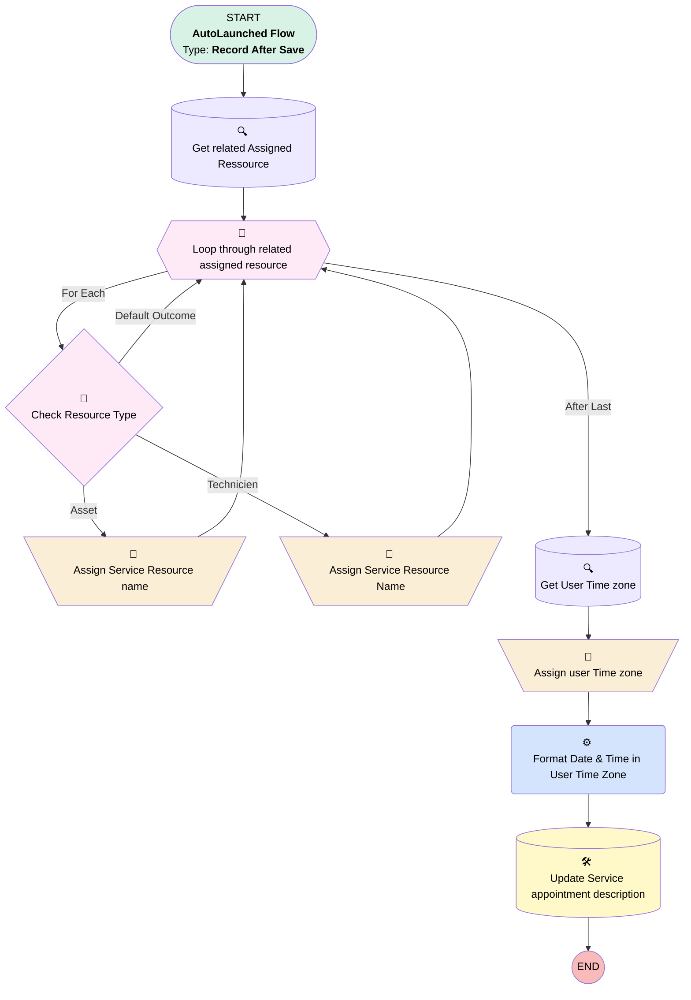

# EGH Update Time In Description

## Flow Diagram

<!-- Flow description -->

## General Information

|<!-- -->|<!-- -->|
|:---|:---|
|Object|ServiceAppointment|
|Process Type| Auto Launched Flow|
|Trigger Type| Record After Save|
|Record Trigger Type| Update|
|Label|EGH Update Time In Description|
|Status|Active|
|Description|This flow is triggered when the Service Appointment’s Arrival Window Start or End time is changed. It uses an Apex action to format the date and time in the user’s timezone, then updates the Description field with the Date, Time, and Timezone in the correct format.|
|Environments|Default|
|Interview Label|EGH Update Time In Description {!$Flow.CurrentDateTime}|
| Builder Type (PM)|LightningFlowBuilder|
| Canvas Mode (PM)|AUTO_LAYOUT_CANVAS|
| Origin Builder Type (PM)|LightningFlowBuilder|
|Connector|[Get_related_Service_Ressource](#get_related_service_ressource)|
|Next Node|[Get_related_Service_Ressource](#get_related_service_ressource)|

#### Filters (logic: **or**)

|Filter Id|Field|Operator|Value|
|:-- |:-- |:--:|:--: |
|1|ArrivalWindowStartTime| Is Changed|✅|
|2|ArrivalWindowEndTime| Is Changed|✅|

## Variables

|Name|Data Type|Is Collection|Is Input|Is Output|Object Type|Description|
|:-- |:--:|:--:|:--:|:--:|:--:|:--  |
|assignedResourceIds|String|✅|⬜|⬜|<!-- -->|<!-- -->|
|FormattedDate|String|⬜|⬜|⬜|<!-- -->|<!-- -->|
|FormattedEndTime|String|⬜|⬜|⬜|<!-- -->|<!-- -->|
|FormattedStartTime|String|⬜|⬜|⬜|<!-- -->|<!-- -->|
|ServiceResourceNameAsset|String|⬜|⬜|⬜|<!-- -->|<!-- -->|
|ServiceResourceNameTechnicien|String|⬜|⬜|⬜|<!-- -->|<!-- -->|
|userTimeZone|String|⬜|⬜|⬜|<!-- -->|<!-- -->|

## Formulas

|Name|Data Type|Expression|Description|
|:-- |:--:|:-- |:--  |
|buildTimeLine|String|"Time: " & {!FormattedStartTime} & " - " & {!FormattedEndTime}|<!-- -->|
|UpdatedDescription|String|"Test Drive Scheduled!" & BR() & "Vehicle: " & {!ServiceResourceNameAsset} & BR() & "Driver: " & {!ServiceResourceNameTechnicien} & BR() & "Date: " & {!FormattedDate} & BR() & {!buildTimeLine} & BR() & BR() & "Timezone: " & {!userTimeZone}|<!-- -->|

## Flow Nodes Details

### Format_Date_Time_in_User_Time_Zone

|<!-- -->|<!-- -->|
|:---|:---|
|Type|Action Call|
|Label|Format Date & Time in User Time Zone|
|Action Type|Apex|
|Action Name|[EGH_FormatServiceAppointmentTime](../apex/EGH_FormatServiceAppointmentTime.md)|
|Flow Transaction Model|Automatic|
|Name Segment|EGH_FormatServiceAppointmentTime|
|Offset|0|
|Output Parameters|- assignToReference: FormattedDate &nbsp;&nbsp;name: formattedDate - assignToReference: FormattedEndTime &nbsp;&nbsp;name: formattedEndTime - assignToReference: FormattedStartTime &nbsp;&nbsp;name: formattedStartTime |
|End Time (input)|$Record.ArrivalWindowEndTime|
|Start Time (input)|$Record.ArrivalWindowStartTime|
|User Time Zone (input)|userTimeZone|
|Connector|[Update_Service_appointment_description](#update_service_appointment_description)|

### Assign_Service_Resource_name

|<!-- -->|<!-- -->|
|:---|:---|
|Type|Assignment|
|Label|Assign Service Resource name|
|Connector|[Loop_through_related_assigned_resource](#loop_through_related_assigned_resource)|

#### Assignments

|Assign To Reference|Operator|Value|
|:-- |:--:|:--: |
|ServiceResourceNameAsset| Assign|Loop_through_related_assigned_resource.ServiceResource.Name|

### Assign_Service_Resource_Name1

|<!-- -->|<!-- -->|
|:---|:---|
|Type|Assignment|
|Label|Assign Service Resource Name|
|Connector|[Loop_through_related_assigned_resource](#loop_through_related_assigned_resource)|

#### Assignments

|Assign To Reference|Operator|Value|
|:-- |:--:|:--: |
|ServiceResourceNameTechnicien| Assign|Loop_through_related_assigned_resource.ServiceResource.Name|

### Assign_user_Time_zone

|<!-- -->|<!-- -->|
|:---|:---|
|Type|Assignment|
|Label|Assign user Time zone|
|Connector|[Format_Date_Time_in_User_Time_Zone](#format_date_time_in_user_time_zone)|

#### Assignments

|Assign To Reference|Operator|Value|
|:-- |:--:|:--: |
|userTimeZone| Assign|Get_User_Time_zone.TimeZoneSidKey|

### Check_Resource_Type

|<!-- -->|<!-- -->|
|:---|:---|
|Type|Decision|
|Label|Check Resource Type|
|Default Connector|[Loop_through_related_assigned_resource](#loop_through_related_assigned_resource)|
|Default Connector Label|Default Outcome|

#### Rule Asset (Asset)

|<!-- -->|<!-- -->|
|:---|:---|
|Connector|[Assign_Service_Resource_name](#assign_service_resource_name)|
|Condition Logic|and|

|Condition Id|Left Value Reference|Operator|Right Value|
|:-- |:-- |:--:|:--: |
|1|Loop_through_related_assigned_resource.ServiceResource.ResourceType| Equal To|S|

#### Rule Technicien (Technicien)

|<!-- -->|<!-- -->|
|:---|:---|
|Connector|[Assign_Service_Resource_Name1](#assign_service_resource_name1)|
|Condition Logic|and|

|Condition Id|Left Value Reference|Operator|Right Value|
|:-- |:-- |:--:|:--: |
|1|Loop_through_related_assigned_resource.ServiceResource.ResourceType| Equal To|T|

### Loop_through_related_assigned_resource

|<!-- -->|<!-- -->|
|:---|:---|
|Type|Loop|
|Label|Loop through related assigned resource|
|Collection Reference|[Get_related_Service_Ressource](#get_related_service_ressource)|
|Iteration Order|Asc|
|Next Value Connector|[Check_Resource_Type](#check_resource_type)|
|No More Values Connector|[Get_User_Time_zone](#get_user_time_zone)|

### Get_related_Service_Ressource

|<!-- -->|<!-- -->|
|:---|:---|
|Type|Record Lookup|
|Object|AssignedResource|
|Label|Get related Assigned Ressource|
|Assign Null Values If No Records Found|⬜|
|Get First Record Only|⬜|
|Store Output Automatically|✅|
|Connector|[Loop_through_related_assigned_resource](#loop_through_related_assigned_resource)|

#### Filters (logic: **and**)

|Filter Id|Field|Operator|Value|
|:-- |:-- |:--:|:--: |
|1|ServiceAppointmentId| Equal To|$Record.Id|

### Get_User_Time_zone

|<!-- -->|<!-- -->|
|:---|:---|
|Type|Record Lookup|
|Object|User|
|Label|Get User Time zone|
|Assign Null Values If No Records Found|⬜|
|Get First Record Only|✅|
|Store Output Automatically|✅|
|Connector|[Assign_user_Time_zone](#assign_user_time_zone)|

#### Filters (logic: **and**)

|Filter Id|Field|Operator|Value|
|:-- |:-- |:--:|:--: |
|1|Id| Equal To|$User.Id|

### Update_Service_appointment_description

|<!-- -->|<!-- -->|
|:---|:---|
|Type|Record Update|
|Label|Update Service appointment description|
|Input Reference|$Record|

#### Input Assignments

|Field|Value|
|:-- |:--: |
|Description|UpdatedDescription|

___

_Documentation generated from branch null by [sfdx-hardis](https://sfdx-hardis.cloudity.com), featuring [salesforce-flow-visualiser](https://github.com/toddhalfpenny/salesforce-flow-visualiser)_