# Customer Satisfaction

## Flow Diagram

```mermaid
%% If you read this, your Markdown visualizer does not handle MermaidJS syntax.
%% - If you are in VS Code, install extension `Markdown Preview Mermaid Support` at https://marketplace.visualstudio.com/items?itemName=bierner.markdown-mermaid
%% - If you are using sfdx-hardis, try to define env variable `MERMAID_MODES=cli,docker` ,then run again the command to regenerate markdown with SVG images.
%% - If you are within mkdocs-material, define mermaid plugin in `mkdocs.yml` as described in https://squidfunk.github.io/mkdocs-material/extensions/mermaid/
%% - As a last resort, you can copy-paste this MermaidJS code into https://mermaid.live/ to see the flow diagram

flowchart TB
START(["START"]):::startClass
click START "#general-information" "4176690184"

START --> surveyQuestionPage
surveyQuestionPage(["💻 <em></em><br/>Page 1"]):::screens
click surveyQuestionPage "#surveyquestionpage" "1274327574"

surveyQuestionPage --> END_surveyQuestionPage
END_surveyQuestionPage(( END )):::endClass


classDef actionCalls fill:#D4E4FC,color:black,text-decoration:none,max-height:100px
classDef assignments fill:#FBEED7,color:black,text-decoration:none,max-height:100px
classDef collectionProcessors fill:#F0E3FA,color:black,text-decoration:none,max-height:100px
classDef customErrors fill:#FFE9E9,color:black,text-decoration:none,max-height:100px
classDef decisions fill:#FDEAF6,color:black,text-decoration:none,max-height:100px
classDef loops fill:#FDEAF6,color:black,text-decoration:none,max-height:100px
classDef recordCreates fill:#FFF8C9,color:black,text-decoration:none,max-height:100px
classDef recordDeletes fill:#FFF8C9,color:black,text-decoration:none,max-height:100px
classDef recordLookups fill:#EDEAFF,color:black,text-decoration:none,max-height:100px
classDef recordUpdates fill:#FFF8C9,color:black,text-decoration:none,max-height:100px
classDef screens fill:#DFF6FF,color:black,text-decoration:none,max-height:100px
classDef subflows fill:#D4E4FC,color:black,text-decoration:none,max-height:100px
classDef startClass fill:#D9F2E6,color:black,text-decoration:none,max-height:100px
classDef endClass fill:#F9BABA,color:black,text-decoration:none,max-height:100px
classDef transforms fill:#FDEAF6,color:black,text-decoration:none,max-height:100px


```

<!-- Flow description -->

## General Information

|<!-- -->|<!-- -->|
|:---|:---|
|Process Type| Survey|
|Label|Customer Satisfaction|
|Status|⚠️ Draft|
|Interview Label|Customer Satisfaction|
|Start Element Reference|[surveyQuestionPage](#surveyquestionpage)|
|Advance Thank You Page Enabled (PM)|⬜|
|Auto Progress Enabled (PM)|⬜|
|Autosave Time Window (PM)|5|
|Has Welcome Page (PM)|⬜|
|Is Autosave Enabled (PM)|⬜|
|Is Simple Survey (PM)|⬜|
|Override Active Version (PM)|⬜|
|Survey Type (PM)|Survey|

## Variables

|Name|Data Type|Is Collection|Is Input|Is Output|Object Type|Description|
|:-- |:--:|:--:|:--:|:--:|:--:|:--  |
|guestUserLang|String|⬜|✅|✅|<!-- -->|<!-- -->|
|invitationId|String|⬜|✅|✅|<!-- -->|<!-- -->|
|previewMode|Boolean|⬜|✅|✅|<!-- -->|<!-- -->|
|thankYouDescription|String|⬜|✅|✅|<!-- -->|<!-- -->|
|thankYouLabel|String|⬜|✅|✅|<!-- -->|<!-- -->|
|var_q_0d3d8145_bd3f_4e37_815e_7d15053b7c8e_defaultValue|String|⬜|✅|⬜|<!-- -->|<!-- -->|

## Text Templates

|Name|Text|Description|
|:-- |:-- |:--  |
|thankYouDescriptionTextTemplate||<!-- -->|
|thankYouLabelTextTemplate|Thanks for participating!|<!-- -->|

## Flow Nodes Details

### surveyQuestionPage

|<!-- -->|<!-- -->|
|:---|:---|
|Type|Screen|
|Label|Page 1|
|Allow Back|✅|
|Allow Finish|✅|
|Allow Pause|✅|
|Paused Text|To pick up where you left off, refresh this page, or open the survey again.|
|Show Footer|✅|
|Show Header|✅|

#### q_0d3d8145_bd3f_4e37_815e_7d15053b7c8e

|<!-- -->|<!-- -->|
|:---|:---|
|Data Type|Number|
|Process Metadata Values|- name: autoProgressAction &nbsp;&nbsp;value: &nbsp;&nbsp;&nbsp;&nbsp;stringValue: NONE - name: defaultValue &nbsp;&nbsp;value: &nbsp;&nbsp;&nbsp;&nbsp;elementReference: var_q_0d3d8145_bd3f_4e37_815e_7d15053b7c8e_defaultValue - name: iconType &nbsp;&nbsp;value: &nbsp;&nbsp;&nbsp;&nbsp;stringValue: star - name: isMovableDown &nbsp;&nbsp;value: &nbsp;&nbsp;&nbsp;&nbsp;booleanValue: true - name: isMovableUp &nbsp;&nbsp;value: &nbsp;&nbsp;&nbsp;&nbsp;booleanValue: true |
|Choice References|- S_f82948e1_3ecd_45ff_87e3_e900f29fc8a8 - S_73007ecf_5548_48e8_9f51_469580c78adc - S_2152847f_42ff_4773_8c05_f1063966db3c - S_1cab166e_3d1e_4906_8423_e3346b9e1c64 - S_45b33aed_2976_486a_837a_529708998c64 |
|Extension Name|survey:runtimeRating|
|Field Text|How would you rate our service?|
|Field Type| Component Choice|
|Is Required|⬜|
|Scale|0|
|Style Properties|verticalAlignment: &nbsp;&nbsp;stringValue: top width: &nbsp;&nbsp;stringValue: 12 |

#### q_3fb21187_ca4e_475e_9b0a_1447d59e8253

|<!-- -->|<!-- -->|
|:---|:---|
|Data Type|String|
|Process Metadata Values|- name: autoProgressAction &nbsp;&nbsp;value: &nbsp;&nbsp;&nbsp;&nbsp;stringValue: NONE - name: isMovableDown &nbsp;&nbsp;value: &nbsp;&nbsp;&nbsp;&nbsp;booleanValue: true - name: isMovableUp &nbsp;&nbsp;value: &nbsp;&nbsp;&nbsp;&nbsp;booleanValue: true |
|Field Text|Any comments or feedback for us?|
|Field Type| Input Field|
|Is Required|⬜|
|Style Properties|verticalAlignment: &nbsp;&nbsp;stringValue: top width: &nbsp;&nbsp;stringValue: 12 |

___

_Documentation generated from branch null by [sfdx-hardis](https://sfdx-hardis.cloudity.com), featuring [salesforce-flow-visualiser](https://github.com/toddhalfpenny/salesforce-flow-visualiser)_