# EGH Auto Assign Entitlement Flow

## Flow Diagram

```mermaid
%% If you read this, your Markdown visualizer does not handle MermaidJS syntax.
%% - If you are in VS Code, install extension `Markdown Preview Mermaid Support` at https://marketplace.visualstudio.com/items?itemName=bierner.markdown-mermaid
%% - If you are using sfdx-hardis, try to define env variable `MERMAID_MODES=cli,docker` ,then run again the command to regenerate markdown with SVG images.
%% - If you are within mkdocs-material, define mermaid plugin in `mkdocs.yml` as described in https://squidfunk.github.io/mkdocs-material/extensions/mermaid/
%% - As a last resort, you can copy-paste this MermaidJS code into https://mermaid.live/ to see the flow diagram

flowchart TB
START(["START<br/><b>AutoLaunched Flow</b></br>Type: <b> Record After Save</b>"]):::startClass
click START "#general-information" "2231164764"

Default[\"🟰 <em></em><br/>Default"/]:::assignments
click Default "#default" "1871518946"

Entitlement_Type_Case[\"🟰 <em></em><br/>Entitlement Type Case"/]:::assignments
click Entitlement_Type_Case "#entitlement_type_case" "2503812257"

Entitlement_Type_Complaint[\"🟰 <em></em><br/>Entitlement Type Complaint"/]:::assignments
click Entitlement_Type_Complaint "#entitlement_type_complaint" "2082336192"

Entitlement_Type_Survey[\"🟰 <em></em><br/>Entitlement Type Survey"/]:::assignments
click Entitlement_Type_Survey "#entitlement_type_survey" "896427919"

Assign_Entitlement_Type{"🔀 <em></em><br/>Assign Entitlement Type"}:::decisions
click Assign_Entitlement_Type "#assign_entitlement_type" "463060053"

Check_Matrix_Found{"🔀 <em></em><br/>Check Matrix Found"}:::decisions
click Check_Matrix_Found "#check_matrix_found" "1984346880"

Get_Matrix_Record[("🔍 <em></em><br/>Get Matrix Record")]:::recordLookups
click Get_Matrix_Record "#get_matrix_record" "806854784"

Associate_Entitlement_to_Case[("🛠️ <em></em><br/>Associate Entitlement to Case")]:::recordUpdates
click Associate_Entitlement_to_Case "#associate_entitlement_to_case" "1243819921"

Default --> Get_Matrix_Record
Entitlement_Type_Case --> Get_Matrix_Record
Entitlement_Type_Complaint --> Get_Matrix_Record
Entitlement_Type_Survey --> Get_Matrix_Record
Assign_Entitlement_Type --> |"Complaint"| Entitlement_Type_Complaint
Assign_Entitlement_Type --> |"General Enquiry OR Follow-Up"| Entitlement_Type_Case
Assign_Entitlement_Type --> |"Survey"| Entitlement_Type_Survey
Assign_Entitlement_Type --> |"Default Outcome"| Default
Check_Matrix_Found --> |"Matrix Found"| Associate_Entitlement_to_Case
Check_Matrix_Found --> |"Default Outcome"| END_Check_Matrix_Found
Get_Matrix_Record --> Check_Matrix_Found
Associate_Entitlement_to_Case --> END_Associate_Entitlement_to_Case
START -->  Assign_Entitlement_Type
END_Check_Matrix_Found(( END )):::endClass
END_Associate_Entitlement_to_Case(( END )):::endClass


classDef actionCalls fill:#D4E4FC,color:black,text-decoration:none,max-height:100px
classDef assignments fill:#FBEED7,color:black,text-decoration:none,max-height:100px
classDef collectionProcessors fill:#F0E3FA,color:black,text-decoration:none,max-height:100px
classDef customErrors fill:#FFE9E9,color:black,text-decoration:none,max-height:100px
classDef decisions fill:#FDEAF6,color:black,text-decoration:none,max-height:100px
classDef loops fill:#FDEAF6,color:black,text-decoration:none,max-height:100px
classDef recordCreates fill:#FFF8C9,color:black,text-decoration:none,max-height:100px
classDef recordDeletes fill:#FFF8C9,color:black,text-decoration:none,max-height:100px
classDef recordLookups fill:#EDEAFF,color:black,text-decoration:none,max-height:100px
classDef recordUpdates fill:#FFF8C9,color:black,text-decoration:none,max-height:100px
classDef screens fill:#DFF6FF,color:black,text-decoration:none,max-height:100px
classDef subflows fill:#D4E4FC,color:black,text-decoration:none,max-height:100px
classDef startClass fill:#D9F2E6,color:black,text-decoration:none,max-height:100px
classDef endClass fill:#F9BABA,color:black,text-decoration:none,max-height:100px
classDef transforms fill:#FDEAF6,color:black,text-decoration:none,max-height:100px


```

<!-- Flow description -->

## General Information

|<!-- -->|<!-- -->|
|:---|:---|
|Object|Case|
|Process Type| Auto Launched Flow|
|Trigger Type| Record After Save|
|Record Trigger Type| Create And Update|
|Label|EGH Auto Assign Entitlement Flow|
|Status|Active|
|Filter Formula|OR(     AND(         ISNEW(),         NOT(ISBLANK({!$Record.RecordTypeId}))     ),     {!$Record.RecordTypeId} <> PRIORVALUE({!$Record.RecordTypeId}) )|
|Environments|[Default](#default)|
|Interview Label|egh Auto Assign Entitlement Flow {!$Flow.CurrentDateTime}|
| Builder Type (PM)|LightningFlowBuilder|
| Canvas Mode (PM)|AUTO_LAYOUT_CANVAS|
| Origin Builder Type (PM)|LightningFlowBuilder|
|Connector|[Assign_Entitlement_Type](#assign_entitlement_type)|
|Next Node|[Assign_Entitlement_Type](#assign_entitlement_type)|

## Variables

|Name|Data Type|Is Collection|Is Input|Is Output|Object Type|Description|
|:-- |:--:|:--:|:--:|:--:|:--:|:--  |
|varEntitlementType|String|⬜|⬜|⬜|<!-- -->|<!-- -->|
|varPriority|String|⬜|⬜|⬜|<!-- -->|<!-- -->|

## Formulas

|Name|Data Type|Expression|Description|
|:-- |:--:|:-- |:--  |
|varEntitlementName|String|IF(   {!varEntitlementType} = "Case",   IF(     {!varPriority} = "High",     "EGH High priority entitlement",     IF(       {!varPriority} = "Medium",        "EGH Medium Priority Entitlement",       "EGH Low priority entitlement"     )   ),   IF(     {!varEntitlementType} = "Complaint",     "Complaint SLA - " + {!varPriority},     "Negative Feedback Entitlement"   ) )|Determines entitlement name based on type and priority|

## Flow Nodes Details

### Default

|<!-- -->|<!-- -->|
|:---|:---|
|Type|Assignment|
|Label|[Default](#default)|
|Connector|[Get_Matrix_Record](#get_matrix_record)|

#### Assignments

|Assign To Reference|Operator|Value|
|:-- |:--:|:--: |
|varEntitlementType| Assign|Case|

### Entitlement_Type_Case

|<!-- -->|<!-- -->|
|:---|:---|
|Type|Assignment|
|Label|Entitlement Type Case|
|Connector|[Get_Matrix_Record](#get_matrix_record)|

#### Assignments

|Assign To Reference|Operator|Value|
|:-- |:--:|:--: |
|varEntitlementType| Assign|Case|

### Entitlement_Type_Complaint

|<!-- -->|<!-- -->|
|:---|:---|
|Type|Assignment|
|Label|Entitlement Type Complaint|
|Connector|[Get_Matrix_Record](#get_matrix_record)|

#### Assignments

|Assign To Reference|Operator|Value|
|:-- |:--:|:--: |
|varEntitlementType| Assign|Complaint|

### Entitlement_Type_Survey

|<!-- -->|<!-- -->|
|:---|:---|
|Type|Assignment|
|Label|Entitlement Type Survey|
|Connector|[Get_Matrix_Record](#get_matrix_record)|

#### Assignments

|Assign To Reference|Operator|Value|
|:-- |:--:|:--: |
|varEntitlementType| Assign|Survey|

### Assign_Entitlement_Type

|<!-- -->|<!-- -->|
|:---|:---|
|Type|Decision|
|Label|Assign Entitlement Type|
|Default Connector|[Default](#default)|
|Default Connector Label|Default Outcome|

#### Rule Complaint (Complaint)

|<!-- -->|<!-- -->|
|:---|:---|
|Connector|[Entitlement_Type_Complaint](#entitlement_type_complaint)|
|Condition Logic|and|

|Condition Id|Left Value Reference|Operator|Right Value|
|:-- |:-- |:--:|:--: |
|1|$Record.RecordType.DeveloperName| Equal To|EGH_Complaint|

#### Rule General_Enquiry_OR_Follow_Up (General Enquiry OR Follow-Up)

|<!-- -->|<!-- -->|
|:---|:---|
|Connector|[Entitlement_Type_Case](#entitlement_type_case)|
|Condition Logic|or|

|Condition Id|Left Value Reference|Operator|Right Value|
|:-- |:-- |:--:|:--: |
|1|$Record.RecordType.DeveloperName| Equal To|EGH_General_Enquiry|
|2|$Record.RecordType.DeveloperName| Equal To|Follow_Up|

#### Rule Survey (Survey)

|<!-- -->|<!-- -->|
|:---|:---|
|Connector|[Entitlement_Type_Survey](#entitlement_type_survey)|
|Condition Logic|or|

|Condition Id|Left Value Reference|Operator|Right Value|
|:-- |:-- |:--:|:--: |
|1|$Record.RecordType.DeveloperName| Equal To|EGH_Feedback|

### Check_Matrix_Found

|<!-- -->|<!-- -->|
|:---|:---|
|Type|Decision|
|Label|Check Matrix Found|
|Default Connector Label|Default Outcome|

#### Rule Matrix_Found (Matrix Found)

|<!-- -->|<!-- -->|
|:---|:---|
|Connector|[Associate_Entitlement_to_Case](#associate_entitlement_to_case)|
|Condition Logic|and|

|Condition Id|Left Value Reference|Operator|Right Value|
|:-- |:-- |:--:|:--: |
|1|[Get_Matrix_Record](#get_matrix_record)| Is Null|⬜|

### Get_Matrix_Record

|<!-- -->|<!-- -->|
|:---|:---|
|Type|Record Lookup|
|Object|EGH_Matrix_Assigning_Entitlement__c|
|Label|Get Matrix Record|
|Description|EGH Matrix Assigning Entitlement|
|Assign Null Values If No Records Found|⬜|
|Get First Record Only|✅|
|Store Output Automatically|✅|
|Connector|[Check_Matrix_Found](#check_matrix_found)|

#### Filters (logic: **and**)

|Filter Id|Field|Operator|Value|
|:-- |:-- |:--:|:--: |
|1|EGH_Reason_Code__c| Is Null|<!-- -->|
|2|EGH_Priority__c| Is Null|<!-- -->|
|3|EGH_Entitlement_Type__c| Equal To|varEntitlementType|

### Associate_Entitlement_to_Case

|<!-- -->|<!-- -->|
|:---|:---|
|Type|Record Update|
|Label|Associate Entitlement to Case|
|Input Reference|$Record|

#### Input Assignments

|Field|Value|
|:-- |:--: |
|EntitlementId|Get_Matrix_Record.EGH_EntitlementProcessLookup__r.Id|

___

_Documentation generated from branch null by [sfdx-hardis](https://sfdx-hardis.cloudity.com), featuring [salesforce-flow-visualiser](https://github.com/toddhalfpenny/salesforce-flow-visualiser)_