# Jetour Lost Opportunity Survey

## Flow Diagram

```mermaid
%% If you read this, your Markdown visualizer does not handle MermaidJS syntax.
%% - If you are in VS Code, install extension `Markdown Preview Mermaid Support` at https://marketplace.visualstudio.com/items?itemName=bierner.markdown-mermaid
%% - If you are using sfdx-hardis, try to define env variable `MERMAID_MODES=cli,docker` ,then run again the command to regenerate markdown with SVG images.
%% - If you are within mkdocs-material, define mermaid plugin in `mkdocs.yml` as described in https://squidfunk.github.io/mkdocs-material/extensions/mermaid/
%% - As a last resort, you can copy-paste this MermaidJS code into https://mermaid.live/ to see the flow diagram

flowchart TB
START(["START"]):::startClass
click START "#general-information" "3073198567"

START --> pageNamesInOrder_Assignment
pageNamesInOrder_Assignment[\"🟰 <em></em><br/>pageNamesInOrder_Assignment"/]:::assignments
click pageNamesInOrder_Assignment "#pagenamesinorder_assignment" "933790972"

defNav_p_48b6dd0a_cee5_4b36_8253_06be9e1ad9a6{"🔀 <em></em><br/>my_default_decision"}:::decisions
click defNav_p_48b6dd0a_cee5_4b36_8253_06be9e1ad9a6 "#defnav_p_48b6dd0a_cee5_4b36_8253_06be9e1ad9a6" "727609310"

p_48b6dd0a_cee5_4b36_8253_06be9e1ad9a6(["💻 <em></em><br/>English"]):::screens
click p_48b6dd0a_cee5_4b36_8253_06be9e1ad9a6 "#p_48b6dd0a_cee5_4b36_8253_06be9e1ad9a6" "2557026766"

pageNamesInOrder_Assignment --> p_48b6dd0a_cee5_4b36_8253_06be9e1ad9a6
defNav_p_48b6dd0a_cee5_4b36_8253_06be9e1ad9a6 --> |"Next Page"| END_defNav_p_48b6dd0a_cee5_4b36_8253_06be9e1ad9a6
p_48b6dd0a_cee5_4b36_8253_06be9e1ad9a6 --> defNav_p_48b6dd0a_cee5_4b36_8253_06be9e1ad9a6
END_defNav_p_48b6dd0a_cee5_4b36_8253_06be9e1ad9a6(( END )):::endClass


classDef actionCalls fill:#D4E4FC,color:black,text-decoration:none,max-height:100px
classDef assignments fill:#FBEED7,color:black,text-decoration:none,max-height:100px
classDef collectionProcessors fill:#F0E3FA,color:black,text-decoration:none,max-height:100px
classDef customErrors fill:#FFE9E9,color:black,text-decoration:none,max-height:100px
classDef decisions fill:#FDEAF6,color:black,text-decoration:none,max-height:100px
classDef loops fill:#FDEAF6,color:black,text-decoration:none,max-height:100px
classDef recordCreates fill:#FFF8C9,color:black,text-decoration:none,max-height:100px
classDef recordDeletes fill:#FFF8C9,color:black,text-decoration:none,max-height:100px
classDef recordLookups fill:#EDEAFF,color:black,text-decoration:none,max-height:100px
classDef recordUpdates fill:#FFF8C9,color:black,text-decoration:none,max-height:100px
classDef screens fill:#DFF6FF,color:black,text-decoration:none,max-height:100px
classDef subflows fill:#D4E4FC,color:black,text-decoration:none,max-height:100px
classDef startClass fill:#D9F2E6,color:black,text-decoration:none,max-height:100px
classDef endClass fill:#F9BABA,color:black,text-decoration:none,max-height:100px
classDef transforms fill:#FDEAF6,color:black,text-decoration:none,max-height:100px


```

<!-- Flow description -->

## General Information

|<!-- -->|<!-- -->|
|:---|:---|
|Process Type| Survey|
|Label|Jetour Lost Opportunity Survey|
|Status|Active|
|Interview Label|Jetour Lost Opportunity Survey|
|Start Element Reference|[pageNamesInOrder_Assignment](#pagenamesinorder_assignment)|
| Branding Set (PM)|sb_jetour_lost_opportunity_survey_146980af_eada_4f57_a40c_d629c92123e9|
|Advance Thank You Page Enabled (PM)|✅|
|Auto Progress Enabled (PM)|⬜|
|Autosave Time Window (PM)|5|
|Has Welcome Page (PM)|⬜|
|Is Autosave Enabled (PM)|⬜|
|Is Simple Survey (PM)|⬜|
|Override Active Version (PM)|⬜|
|Page Options Map (PM)|{"p_48b6dd0a_cee5_4b36_8253_06be9e1ad9a6":{"isMovable":true,"isDeletable":true}}|
|Survey Type (PM)|Survey|

## Variables

|Name|Data Type|Is Collection|Is Input|Is Output|Object Type|Description|
|:-- |:--:|:--:|:--:|:--:|:--:|:--  |
|guestUserLang|String|⬜|✅|✅|<!-- -->|<!-- -->|
|invitationId|String|⬜|✅|✅|<!-- -->|<!-- -->|
|pageNamesInOrder|String|✅|⬜|✅|<!-- -->|<!-- -->|
|previewMode|Boolean|⬜|✅|✅|<!-- -->|<!-- -->|
|thankYouDescription|String|⬜|✅|✅|<!-- -->|<!-- -->|
|thankYouLabel|String|⬜|✅|✅|<!-- -->|<!-- -->|
|thankYouRedirectUrl|String|⬜|✅|✅|<!-- -->|<!-- -->|
|var_q_e754e094_181c_4699_a490_8c2fa1b08f14_defaultValue|Number|⬜|✅|⬜|<!-- -->|<!-- -->|
|var_q_e90eb756_650c_477c_9abf_2ecbf36b977c_defaultValue|Number|⬜|✅|⬜|<!-- -->|<!-- -->|

## Constants

|Name|Data Type|Value|Description|
|:-- |:--:|:--:|:--  |
|defaultPageNav|Boolean|true|<!-- -->|

## Text Templates

|Name|Text|Description|
|:-- |:-- |:--  |
|thankYouDescriptionTextTemplate||<!-- -->|
|thankYouLabelTextTemplate|
<strong style="font-family: sans-serif; font-size: 14px;">Thank you very much for your time! We appreciate your comments and we will use them to improve your future experiences.</strong>
|<!-- -->|

## Flow Nodes Details

### pageNamesInOrder_Assignment

|<!-- -->|<!-- -->|
|:---|:---|
|Type|Assignment|
|Label|[pageNamesInOrder_Assignment](#pagenamesinorder_assignment)|
|Connector|[p_48b6dd0a_cee5_4b36_8253_06be9e1ad9a6](#p_48b6dd0a_cee5_4b36_8253_06be9e1ad9a6)|

#### Assignments

|Assign To Reference|Operator|Value|
|:-- |:--:|:--: |
|pageNamesInOrder| Add|[p_48b6dd0a_cee5_4b36_8253_06be9e1ad9a6](#p_48b6dd0a_cee5_4b36_8253_06be9e1ad9a6)|
|pageNamesInOrder| Add|thank_you_page|

### defNav_p_48b6dd0a_cee5_4b36_8253_06be9e1ad9a6

|<!-- -->|<!-- -->|
|:---|:---|
|Type|Decision|
|Label|my_default_decision|
|Default Connector Label|Next Page|

#### Rule r_e2cd2270_9699_44fe_83ab_812c4b70df25 (my_rule)

|<!-- -->|<!-- -->|
|:---|:---|
|Condition Logic|and|

|Condition Id|Left Value Reference|Operator|Right Value|
|:-- |:-- |:--:|:--: |
|1|defaultPageNav| Equal To|✅|

### p_48b6dd0a_cee5_4b36_8253_06be9e1ad9a6

|<!-- -->|<!-- -->|
|:---|:---|
|Type|Screen|
|Label|English|
|Allow Back|✅|
|Allow Finish|✅|
|Allow Pause|✅|
|Paused Text|To pick up where you left off, refresh this page, or open the survey again.|
|Show Footer|✅|
|Show Header|✅|
|Connector|[defNav_p_48b6dd0a_cee5_4b36_8253_06be9e1ad9a6](#defnav_p_48b6dd0a_cee5_4b36_8253_06be9e1ad9a6)|

#### q_d9a20937_5f4e_40df_8673_96107000b7ce

|<!-- -->|<!-- -->|
|:---|:---|
|Data Type|String|
|Process Metadata Values|- name: autoProgressAction &nbsp;&nbsp;value: &nbsp;&nbsp;&nbsp;&nbsp;stringValue: NONE - name: isDeletable &nbsp;&nbsp;value: &nbsp;&nbsp;&nbsp;&nbsp;booleanValue: true - name: isEditable &nbsp;&nbsp;value: &nbsp;&nbsp;&nbsp;&nbsp;booleanValue: true - name: isMovableDown &nbsp;&nbsp;value: &nbsp;&nbsp;&nbsp;&nbsp;booleanValue: true - name: isMovableUp &nbsp;&nbsp;value: &nbsp;&nbsp;&nbsp;&nbsp;booleanValue: true |
|Choice References|- c_6b30624b_dfc0_4ee6_bac6_9cc07fd11309 - c_16c5fbc0_d0a5_4723_b84c_aa03594a22b7 - c_95710e71_96f6_4498_ad12_ab08d39a484c - c_a1537979_200e_463b_84bb_1187caf26819 - c_3b532090_a352_49a3_8303_247e9270409b - c_0b70d0ee_1092_4e8e_ac54_e3df3b089804 |
|Extension Name|survey:runtimePicklist|
|Field Text|
What was the main reason you chose not to proceed with the purchase?

 
|
|Field Type| Component Choice|
|Is Required|⬜|
|Style Properties|verticalAlignment: &nbsp;&nbsp;stringValue: top width: &nbsp;&nbsp;stringValue: 12 |

#### q_e754e094_181c_4699_a490_8c2fa1b08f14

|<!-- -->|<!-- -->|
|:---|:---|
|Data Type|Number|
|Process Metadata Values|- name: autoProgressAction &nbsp;&nbsp;value: &nbsp;&nbsp;&nbsp;&nbsp;stringValue: NONE - name: defaultValue &nbsp;&nbsp;value: &nbsp;&nbsp;&nbsp;&nbsp;elementReference: var_q_e754e094_181c_4699_a490_8c2fa1b08f14_defaultValue - name: isDeletable &nbsp;&nbsp;value: &nbsp;&nbsp;&nbsp;&nbsp;booleanValue: true - name: isEditable &nbsp;&nbsp;value: &nbsp;&nbsp;&nbsp;&nbsp;booleanValue: true - name: isMovableDown &nbsp;&nbsp;value: &nbsp;&nbsp;&nbsp;&nbsp;booleanValue: true - name: isMovableUp &nbsp;&nbsp;value: &nbsp;&nbsp;&nbsp;&nbsp;booleanValue: true - name: max &nbsp;&nbsp;value: &nbsp;&nbsp;&nbsp;&nbsp;stringValue: 10 - name: min &nbsp;&nbsp;value: &nbsp;&nbsp;&nbsp;&nbsp;stringValue: 0 |
|Extension Name|survey:cmpInputRuntimeCsat|
|Field Text|
How would you rate the interaction you had with our sales consultant?

 
|
|Field Type| Component Input|
|Is Required|⬜|
|Scale|0|
|Style Properties|verticalAlignment: &nbsp;&nbsp;stringValue: top width: &nbsp;&nbsp;stringValue: 12 |

#### q_52edbda8_b567_41a2_a3c6_f87679fdda19

|<!-- -->|<!-- -->|
|:---|:---|
|Data Type|String|
|Process Metadata Values|- name: autoProgressAction &nbsp;&nbsp;value: &nbsp;&nbsp;&nbsp;&nbsp;stringValue: NONE - name: isDeletable &nbsp;&nbsp;value: &nbsp;&nbsp;&nbsp;&nbsp;booleanValue: true - name: isEditable &nbsp;&nbsp;value: &nbsp;&nbsp;&nbsp;&nbsp;booleanValue: true - name: isMovableDown &nbsp;&nbsp;value: &nbsp;&nbsp;&nbsp;&nbsp;booleanValue: true - name: isMovableUp &nbsp;&nbsp;value: &nbsp;&nbsp;&nbsp;&nbsp;booleanValue: true |
|Choice References|- c_5909b4ab_9717_4b04_86e9_3206d076e854 - c_30f2def2_7216_4ff7_aa9c_ce7b1ca73560 |
|Extension Name|survey:runtimeRadioButton|
|Field Text|
Was the vehicle you were interested in available for viewing or test drive?

 
|
|Field Type| Component Choice|
|Is Required|⬜|
|Style Properties|verticalAlignment: &nbsp;&nbsp;stringValue: top width: &nbsp;&nbsp;stringValue: 12 |

#### q_e90eb756_650c_477c_9abf_2ecbf36b977c

|<!-- -->|<!-- -->|
|:---|:---|
|Data Type|Number|
|Process Metadata Values|- name: autoProgressAction &nbsp;&nbsp;value: &nbsp;&nbsp;&nbsp;&nbsp;stringValue: NONE - name: defaultValue &nbsp;&nbsp;value: &nbsp;&nbsp;&nbsp;&nbsp;elementReference: var_q_e90eb756_650c_477c_9abf_2ecbf36b977c_defaultValue - name: isDeletable &nbsp;&nbsp;value: &nbsp;&nbsp;&nbsp;&nbsp;booleanValue: true - name: isEditable &nbsp;&nbsp;value: &nbsp;&nbsp;&nbsp;&nbsp;booleanValue: true - name: isMovableDown &nbsp;&nbsp;value: &nbsp;&nbsp;&nbsp;&nbsp;booleanValue: true - name: isMovableUp &nbsp;&nbsp;value: &nbsp;&nbsp;&nbsp;&nbsp;booleanValue: true - name: max &nbsp;&nbsp;value: &nbsp;&nbsp;&nbsp;&nbsp;stringValue: 10 - name: min &nbsp;&nbsp;value: &nbsp;&nbsp;&nbsp;&nbsp;stringValue: 0 |
|Extension Name|survey:cmpInputRuntimeCsat|
|Field Text|
How would you rate the follow-up from our team after your visit? 1-10 rating

 
|
|Field Type| Component Input|
|Is Required|⬜|
|Scale|0|
|Style Properties|verticalAlignment: &nbsp;&nbsp;stringValue: top width: &nbsp;&nbsp;stringValue: 12 |

#### q_ecaf906a_173e_4ee0_a430_aff7f8b0b3f2

|<!-- -->|<!-- -->|
|:---|:---|
|Data Type|String|
|Process Metadata Values|- name: autoProgressAction &nbsp;&nbsp;value: &nbsp;&nbsp;&nbsp;&nbsp;stringValue: NONE - name: isDeletable &nbsp;&nbsp;value: &nbsp;&nbsp;&nbsp;&nbsp;booleanValue: true - name: isEditable &nbsp;&nbsp;value: &nbsp;&nbsp;&nbsp;&nbsp;booleanValue: true - name: isMovableDown &nbsp;&nbsp;value: &nbsp;&nbsp;&nbsp;&nbsp;booleanValue: true - name: isMovableUp &nbsp;&nbsp;value: &nbsp;&nbsp;&nbsp;&nbsp;booleanValue: true |
|Extension Name|survey:runtimeShortText|
|Field Text|
What could we have done differently to earn your business?

 
|
|Field Type| Component Input|
|Is Required|⬜|
|Style Properties|verticalAlignment: &nbsp;&nbsp;stringValue: top width: &nbsp;&nbsp;stringValue: 12 |

#### q_52f9f3fa_b5ea_4444_9282_812c0cce4241

|<!-- -->|<!-- -->|
|:---|:---|
|Data Type|String|
|Process Metadata Values|- name: autoProgressAction &nbsp;&nbsp;value: &nbsp;&nbsp;&nbsp;&nbsp;stringValue: NONE - name: isDeletable &nbsp;&nbsp;value: &nbsp;&nbsp;&nbsp;&nbsp;booleanValue: true - name: isEditable &nbsp;&nbsp;value: &nbsp;&nbsp;&nbsp;&nbsp;booleanValue: true - name: isMovableDown &nbsp;&nbsp;value: &nbsp;&nbsp;&nbsp;&nbsp;booleanValue: true - name: isMovableUp &nbsp;&nbsp;value: &nbsp;&nbsp;&nbsp;&nbsp;booleanValue: true |
|Extension Name|survey:runtimeShortText|
|Field Text|
Were you considering any other brands or dealerships? If yes, which ones?

 
|
|Field Type| Component Input|
|Is Required|⬜|
|Style Properties|verticalAlignment: &nbsp;&nbsp;stringValue: top width: &nbsp;&nbsp;stringValue: 12 |

#### q_f493c83a_a6c8_4c10_acea_93f9faac79e3

|<!-- -->|<!-- -->|
|:---|:---|
|Data Type|String|
|Process Metadata Values|- name: autoProgressAction &nbsp;&nbsp;value: &nbsp;&nbsp;&nbsp;&nbsp;stringValue: NONE - name: isDeletable &nbsp;&nbsp;value: &nbsp;&nbsp;&nbsp;&nbsp;booleanValue: true - name: isEditable &nbsp;&nbsp;value: &nbsp;&nbsp;&nbsp;&nbsp;booleanValue: true - name: isMovableDown &nbsp;&nbsp;value: &nbsp;&nbsp;&nbsp;&nbsp;booleanValue: true - name: isMovableUp &nbsp;&nbsp;value: &nbsp;&nbsp;&nbsp;&nbsp;booleanValue: true |
|Choice References|- c_54e9bf59_8ea8_4ecc_8a31_7bfded321a97 - c_d0ec8eab_85d4_4cd8_8e0a_c9657a79648f - c_f040ecd3_fe00_4a4f_8a91_da3471cc59a2 |
|Extension Name|survey:runtimePicklist|
|Field Text|
Would you like us to contact you in the future for offers or availability?

 
|
|Field Type| Component Choice|
|Is Required|⬜|
|Style Properties|verticalAlignment: &nbsp;&nbsp;stringValue: top width: &nbsp;&nbsp;stringValue: 12 |

___

_Documentation generated from branch null by [sfdx-hardis](https://sfdx-hardis.cloudity.com), featuring [salesforce-flow-visualiser](https://github.com/toddhalfpenny/salesforce-flow-visualiser)_