# Knowledge Article Feedback

## Flow Diagram

```mermaid
%% If you read this, your Markdown visualizer does not handle MermaidJS syntax.
%% - If you are in VS Code, install extension `Markdown Preview Mermaid Support` at https://marketplace.visualstudio.com/items?itemName=bierner.markdown-mermaid
%% - If you are using sfdx-hardis, try to define env variable `MERMAID_MODES=cli,docker` ,then run again the command to regenerate markdown with SVG images.
%% - If you are within mkdocs-material, define mermaid plugin in `mkdocs.yml` as described in https://squidfunk.github.io/mkdocs-material/extensions/mermaid/
%% - As a last resort, you can copy-paste this MermaidJS code into https://mermaid.live/ to see the flow diagram

flowchart TB
START(["START"]):::startClass
click START "#general-information" "731103155"

START --> surveyQuestionPage
surveyQuestionPage(["💻 <em></em><br/>Page 1"]):::screens
click surveyQuestionPage "#surveyquestionpage" "4110687579"

surveyQuestionPage --> END_surveyQuestionPage
END_surveyQuestionPage(( END )):::endClass


classDef actionCalls fill:#D4E4FC,color:black,text-decoration:none,max-height:100px
classDef assignments fill:#FBEED7,color:black,text-decoration:none,max-height:100px
classDef collectionProcessors fill:#F0E3FA,color:black,text-decoration:none,max-height:100px
classDef customErrors fill:#FFE9E9,color:black,text-decoration:none,max-height:100px
classDef decisions fill:#FDEAF6,color:black,text-decoration:none,max-height:100px
classDef loops fill:#FDEAF6,color:black,text-decoration:none,max-height:100px
classDef recordCreates fill:#FFF8C9,color:black,text-decoration:none,max-height:100px
classDef recordDeletes fill:#FFF8C9,color:black,text-decoration:none,max-height:100px
classDef recordLookups fill:#EDEAFF,color:black,text-decoration:none,max-height:100px
classDef recordUpdates fill:#FFF8C9,color:black,text-decoration:none,max-height:100px
classDef screens fill:#DFF6FF,color:black,text-decoration:none,max-height:100px
classDef subflows fill:#D4E4FC,color:black,text-decoration:none,max-height:100px
classDef startClass fill:#D9F2E6,color:black,text-decoration:none,max-height:100px
classDef endClass fill:#F9BABA,color:black,text-decoration:none,max-height:100px
classDef transforms fill:#FDEAF6,color:black,text-decoration:none,max-height:100px


```

<!-- Flow description -->

## General Information

|<!-- -->|<!-- -->|
|:---|:---|
|Process Type| Survey|
|Label|Knowledge Article Feedback|
|Status|Active|
|Interview Label|Knowledge Article Feedback|
|Start Element Reference|[surveyQuestionPage](#surveyquestionpage)|
|Advance Thank You Page Enabled (PM)|⬜|
|Auto Progress Enabled (PM)|⬜|
|Autosave Time Window (PM)|5|
|Has Welcome Page (PM)|⬜|
|Is Autosave Enabled (PM)|⬜|
|Is Simple Survey (PM)|⬜|
|Override Active Version (PM)|⬜|
|Page Options Map (PM)|{"surveyQuestionPage":{"isDeletable":false,"isMovable":false}}|
|Survey Type (PM)|Knowledge|

## Variables

|Name|Data Type|Is Collection|Is Input|Is Output|Object Type|Description|
|:-- |:--:|:--:|:--:|:--:|:--:|:--  |
|guestUserLang|String|⬜|✅|✅|<!-- -->|<!-- -->|
|invitationId|String|⬜|✅|✅|<!-- -->|<!-- -->|
|previewMode|Boolean|⬜|✅|✅|<!-- -->|<!-- -->|
|thankYouDescription|String|⬜|✅|✅|<!-- -->|<!-- -->|
|thankYouLabel|String|⬜|✅|✅|<!-- -->|<!-- -->|
|var_Question_BOOLEAN_defaultValue|Boolean|⬜|✅|⬜|<!-- -->|<!-- -->|

## Text Templates

|Name|Text|Description|
|:-- |:-- |:--  |
|Question_BOOLEAN_bnlref_tt|Dislike|<!-- -->|
|Question_BOOLEAN_bplref_tt|Like|<!-- -->|
|thankYouDescriptionTextTemplate||<!-- -->|
|thankYouLabelTextTemplate|Thanks for participating!|<!-- -->|

## Flow Nodes Details

### surveyQuestionPage

|<!-- -->|<!-- -->|
|:---|:---|
|Type|Screen|
|Label|Page 1|
|Allow Back|✅|
|Allow Finish|✅|
|Allow Pause|✅|
|Paused Text|To resume, refresh the page and click New Response to start again.|
|Show Footer|✅|
|Show Header|✅|

#### Question_BOOLEAN

|<!-- -->|<!-- -->|
|:---|:---|
|Data Type|Boolean|
|Process Metadata Values|- name: autoProgressAction &nbsp;&nbsp;value: &nbsp;&nbsp;&nbsp;&nbsp;stringValue: NONE - name: defaultValue &nbsp;&nbsp;value: &nbsp;&nbsp;&nbsp;&nbsp;elementReference: var_Question_BOOLEAN_defaultValue - name: iconType &nbsp;&nbsp;value: &nbsp;&nbsp;&nbsp;&nbsp;stringValue: thumbsUp - name: isDeletable &nbsp;&nbsp;value: &nbsp;&nbsp;&nbsp;&nbsp;booleanValue: false - name: isEditable &nbsp;&nbsp;value: &nbsp;&nbsp;&nbsp;&nbsp;booleanValue: false - name: isMovableDown &nbsp;&nbsp;value: &nbsp;&nbsp;&nbsp;&nbsp;booleanValue: false - name: isMovableUp &nbsp;&nbsp;value: &nbsp;&nbsp;&nbsp;&nbsp;booleanValue: false - name: negativeLabel &nbsp;&nbsp;value: &nbsp;&nbsp;&nbsp;&nbsp;stringValue: '{!Question_BOOLEAN_bnlref_tt}' - name: positiveLabel &nbsp;&nbsp;value: &nbsp;&nbsp;&nbsp;&nbsp;stringValue: '{!Question_BOOLEAN_bplref_tt}' |
|Extension Name|survey:runtimeBoolean|
|Field Text|<b>Was this article helpful?</b>|
|Field Type| Component Input|
|Is Required|✅|
|Style Properties|verticalAlignment: &nbsp;&nbsp;stringValue: top width: &nbsp;&nbsp;stringValue: 12 |

#### q_769b40e6_977b_4a20_be14_0e61de135aa4

|<!-- -->|<!-- -->|
|:---|:---|
|Data Type|String|
|Process Metadata Values|name: autoProgressAction value: &nbsp;&nbsp;stringValue: NONE |
|Choice References|- S_fb689b56_69cd_4f8d_9acd_3a6289d16fd4 - S_a12acca8_b173_4c54_a2c5_dd24e0c4570a - S_74ac8284_f2bd_43cc_9af3_69f1a7c774d0 - S_375adfb7_44cb_432b_b4d9_e4e1d14fa0f7 - S_e0c7dd9d_3e82_46dc_95d0_949166a02baf |
|Extension Name|survey:runtimePicklist|
|Field Text|<b>Provide details</b>|
|Field Type| Component Choice|
|Is Required|⬜|
|Style Properties|verticalAlignment: &nbsp;&nbsp;stringValue: top width: &nbsp;&nbsp;stringValue: 12 |
|Visibility Rule|conditionLogic: and conditions: &nbsp;&nbsp;processMetadataValues: &nbsp;&nbsp;&nbsp;&nbsp;- name: inputDataType &nbsp;&nbsp;&nbsp;&nbsp;&nbsp;&nbsp;value: &nbsp;&nbsp;&nbsp;&nbsp;&nbsp;&nbsp;&nbsp;&nbsp;stringValue: Boolean &nbsp;&nbsp;&nbsp;&nbsp;- name: leftHandSideType &nbsp;&nbsp;&nbsp;&nbsp;&nbsp;&nbsp;value: &nbsp;&nbsp;&nbsp;&nbsp;&nbsp;&nbsp;&nbsp;&nbsp;stringValue: Boolean &nbsp;&nbsp;&nbsp;&nbsp;- name: operatorDataType &nbsp;&nbsp;&nbsp;&nbsp;&nbsp;&nbsp;value: &nbsp;&nbsp;&nbsp;&nbsp;&nbsp;&nbsp;&nbsp;&nbsp;stringValue: Boolean &nbsp;&nbsp;&nbsp;&nbsp;- name: rightHandSideType &nbsp;&nbsp;&nbsp;&nbsp;&nbsp;&nbsp;value: &nbsp;&nbsp;&nbsp;&nbsp;&nbsp;&nbsp;&nbsp;&nbsp;stringValue: String &nbsp;&nbsp;leftValueReference: Question_BOOLEAN &nbsp;&nbsp;operator: EqualTo &nbsp;&nbsp;rightValue: &nbsp;&nbsp;&nbsp;&nbsp;booleanValue: true |

#### q_37f408a7_b4e0_4b75_b04c_1211e9ecb6df

|<!-- -->|<!-- -->|
|:---|:---|
|Data Type|String|
|Process Metadata Values|name: autoProgressAction value: &nbsp;&nbsp;stringValue: NONE |
|Choice References|- S_c9241e8e_80f1_451d_ab8f_8f51ecdf3336 - S_a9793594_ebeb_43bf_bffd_c0b11f2b008d - S_cdd94aab_fdcc_4f1f_ba5f_6eb72f90866a - S_c3d89a5c_a8c0_44eb_a961_fce53a418f6a - S_bd124f87_43bd_4732_acb8_39c485ca72ba - S_2026557d_42ea_42c1_9009_de3eb1359b05 |
|Extension Name|survey:runtimePicklist|
|Field Text|<b>Provide details</b>|
|Field Type| Component Choice|
|Is Required|⬜|
|Style Properties|verticalAlignment: &nbsp;&nbsp;stringValue: top width: &nbsp;&nbsp;stringValue: 12 |
|Visibility Rule|conditionLogic: and conditions: &nbsp;&nbsp;processMetadataValues: &nbsp;&nbsp;&nbsp;&nbsp;- name: inputDataType &nbsp;&nbsp;&nbsp;&nbsp;&nbsp;&nbsp;value: &nbsp;&nbsp;&nbsp;&nbsp;&nbsp;&nbsp;&nbsp;&nbsp;stringValue: Boolean &nbsp;&nbsp;&nbsp;&nbsp;- name: leftHandSideType &nbsp;&nbsp;&nbsp;&nbsp;&nbsp;&nbsp;value: &nbsp;&nbsp;&nbsp;&nbsp;&nbsp;&nbsp;&nbsp;&nbsp;stringValue: Boolean &nbsp;&nbsp;&nbsp;&nbsp;- name: operatorDataType &nbsp;&nbsp;&nbsp;&nbsp;&nbsp;&nbsp;value: &nbsp;&nbsp;&nbsp;&nbsp;&nbsp;&nbsp;&nbsp;&nbsp;stringValue: Boolean &nbsp;&nbsp;&nbsp;&nbsp;- name: rightHandSideType &nbsp;&nbsp;&nbsp;&nbsp;&nbsp;&nbsp;value: &nbsp;&nbsp;&nbsp;&nbsp;&nbsp;&nbsp;&nbsp;&nbsp;stringValue: String &nbsp;&nbsp;leftValueReference: Question_BOOLEAN &nbsp;&nbsp;operator: EqualTo &nbsp;&nbsp;rightValue: &nbsp;&nbsp;&nbsp;&nbsp;booleanValue: false |

#### q_6536d846_0353_48de_98b0_a6d315631edc

|<!-- -->|<!-- -->|
|:---|:---|
|Data Type|String|
|Process Metadata Values|name: autoProgressAction value: &nbsp;&nbsp;stringValue: NONE |
|Field Text|<b>Your Comments</b>|
|Field Type| Input Field|
|Is Required|⬜|
|Style Properties|verticalAlignment: &nbsp;&nbsp;stringValue: top width: &nbsp;&nbsp;stringValue: 12 |

___

_Documentation generated from branch null by [sfdx-hardis](https://sfdx-hardis.cloudity.com), featuring [salesforce-flow-visualiser](https://github.com/toddhalfpenny/salesforce-flow-visualiser)_