# Salesforce Demo

## Flow Diagram

```mermaid
%% If you read this, your Markdown visualizer does not handle MermaidJS syntax.
%% - If you are in VS Code, install extension `Markdown Preview Mermaid Support` at https://marketplace.visualstudio.com/items?itemName=bierner.markdown-mermaid
%% - If you are using sfdx-hardis, try to define env variable `MERMAID_MODES=cli,docker` ,then run again the command to regenerate markdown with SVG images.
%% - If you are within mkdocs-material, define mermaid plugin in `mkdocs.yml` as described in https://squidfunk.github.io/mkdocs-material/extensions/mermaid/
%% - As a last resort, you can copy-paste this MermaidJS code into https://mermaid.live/ to see the flow diagram

flowchart TB
START(["START"]):::startClass
click START "#general-information" "2822977907"

START --> StackRank_Assignment
pageNamesInOrder_Assignment[\"🟰 <em></em><br/>pageNamesInOrder_Assignment"/]:::assignments
click pageNamesInOrder_Assignment "#pagenamesinorder_assignment" "1455789369"

StackRank_Assignment[\"🟰 <em></em><br/>StackRank_Assignment"/]:::assignments
click StackRank_Assignment "#stackrank_assignment" "1028443559"

p_81adec3d_a083_45cd_819c_699720522fb2(["💻 <em></em><br/>Questions"]):::screens
click p_81adec3d_a083_45cd_819c_699720522fb2 "#p_81adec3d_a083_45cd_819c_699720522fb2" "1398993978"

welcome_page(["💻 <em></em><br/>Welcome Page"]):::screens
click welcome_page "#welcome_page" "3609809808"

pageNamesInOrder_Assignment --> welcome_page
StackRank_Assignment --> pageNamesInOrder_Assignment
p_81adec3d_a083_45cd_819c_699720522fb2 --> END_p_81adec3d_a083_45cd_819c_699720522fb2
welcome_page --> p_81adec3d_a083_45cd_819c_699720522fb2
END_p_81adec3d_a083_45cd_819c_699720522fb2(( END )):::endClass


classDef actionCalls fill:#D4E4FC,color:black,text-decoration:none,max-height:100px
classDef assignments fill:#FBEED7,color:black,text-decoration:none,max-height:100px
classDef collectionProcessors fill:#F0E3FA,color:black,text-decoration:none,max-height:100px
classDef customErrors fill:#FFE9E9,color:black,text-decoration:none,max-height:100px
classDef decisions fill:#FDEAF6,color:black,text-decoration:none,max-height:100px
classDef loops fill:#FDEAF6,color:black,text-decoration:none,max-height:100px
classDef recordCreates fill:#FFF8C9,color:black,text-decoration:none,max-height:100px
classDef recordDeletes fill:#FFF8C9,color:black,text-decoration:none,max-height:100px
classDef recordLookups fill:#EDEAFF,color:black,text-decoration:none,max-height:100px
classDef recordUpdates fill:#FFF8C9,color:black,text-decoration:none,max-height:100px
classDef screens fill:#DFF6FF,color:black,text-decoration:none,max-height:100px
classDef subflows fill:#D4E4FC,color:black,text-decoration:none,max-height:100px
classDef startClass fill:#D9F2E6,color:black,text-decoration:none,max-height:100px
classDef endClass fill:#F9BABA,color:black,text-decoration:none,max-height:100px
classDef transforms fill:#FDEAF6,color:black,text-decoration:none,max-height:100px


```

<!-- Flow description -->

## General Information

|<!-- -->|<!-- -->|
|:---|:---|
|Process Type| Survey|
|Label|Salesforce Demo|
|Status|Active|
|Interview Label|Salesforce Demo|
|Start Element Reference|[StackRank_Assignment](#stackrank_assignment)|
| Branding Set (PM)|sb_salesforce_demo_26a69dbf_b462_47ef_9c6e_fb5fce89883d|
|Advance Thank You Page Enabled (PM)|⬜|
|Auto Progress Enabled (PM)|⬜|
|Has Welcome Page (PM)|✅|
|Is Autosave Enabled (PM)|⬜|
|Is Simple Survey (PM)|⬜|
|Override Active Version (PM)|⬜|
|Survey Type (PM)|Survey|
|Sv Addl Info_ Email Template (PM)|Embed_a_Survey_Question|
|Sv Addl Info_ Invitation Sharing Role (PM)|SurveyOwner|
|Sv Addl Info_ Language (PM)|en_US|
|Sv Addl Info_ Survey Question (PM)|q_6080f86f_110a_4143_b20c_90d24131b135|

## Variables

|Name|Data Type|Is Collection|Is Input|Is Output|Object Type|Description|
|:-- |:--:|:--:|:--:|:--:|:--:|:--  |
|guestUserLang|String|⬜|✅|✅|<!-- -->|<!-- -->|
|invitationId|String|⬜|✅|✅|<!-- -->|<!-- -->|
|pageNamesInOrder|String|✅|⬜|✅|<!-- -->|<!-- -->|
|previewMode|Boolean|⬜|✅|✅|<!-- -->|<!-- -->|
|q_67858ad4_e8c7_42db_80f9_e66c18fb2930_rank|String|✅|✅|✅|<!-- -->|<!-- -->|
|thankYouDescription|String|⬜|✅|✅|<!-- -->|<!-- -->|
|thankYouLabel|String|⬜|✅|✅|<!-- -->|<!-- -->|
|var_q_6080f86f_110a_4143_b20c_90d24131b135_defaultValue|String|⬜|✅|⬜|<!-- -->|<!-- -->|
|var_q_6cda9ab9_dcac_43bc_85c4_237b34f05479_defaultValue|Number|⬜|✅|⬜|<!-- -->|<!-- -->|
|var_q_a0ceb1d9_8ddd_4d62_b374_c8af90daaa83_defaultValue|String|⬜|✅|⬜|<!-- -->|<!-- -->|

## Text Templates

|Name|Text|Description|
|:-- |:-- |:--  |
|q_67858ad4_e8c7_42db_80f9_e66c18fb2930_rank0|Salesforce Interface Description|<!-- -->|
|q_67858ad4_e8c7_42db_80f9_e66c18fb2930_rank1|Salesforce Usability|<!-- -->|
|q_67858ad4_e8c7_42db_80f9_e66c18fb2930_rank2|Salesforce Out of the Box Capabilities|<!-- -->|
|q_67858ad4_e8c7_42db_80f9_e66c18fb2930_rank3|Salesforce Integrations|<!-- -->|
|q_67858ad4_e8c7_42db_80f9_e66c18fb2930_rank4|Salesforce Customizable options|<!-- -->|
|thankYouDescriptionTextTemplate||<!-- -->|
|thankYouLabelTextTemplate|
📢 <strong>Thank you for your feedback!</strong> Your input helps us refine our implementation process and make future demos even better.
|<!-- -->|
|welcome_question_dref_tt|This survey helps us understand what worked well in the demo and where we can improve. Your insights will shape future sessions to ensure they are clear, effective, and valuable for you. It will only take a few minutes to complete!|<!-- -->|
|welcome_question_lref_tt|
🚀 <strong>Thank you for joining our Demo!</strong> 🚀

We appreciate your time and value your feedback.
|<!-- -->|

## Flow Nodes Details

### pageNamesInOrder_Assignment

|<!-- -->|<!-- -->|
|:---|:---|
|Type|Assignment|
|Label|[pageNamesInOrder_Assignment](#pagenamesinorder_assignment)|
|Connector|[welcome_page](#welcome_page)|

#### Assignments

|Assign To Reference|Operator|Value|
|:-- |:--:|:--: |
|pageNamesInOrder| Add|[welcome_page](#welcome_page)|
|pageNamesInOrder| Add|[p_81adec3d_a083_45cd_819c_699720522fb2](#p_81adec3d_a083_45cd_819c_699720522fb2)|
|pageNamesInOrder| Add|thank_you_page|

### StackRank_Assignment

|<!-- -->|<!-- -->|
|:---|:---|
|Type|Assignment|
|Label|[StackRank_Assignment](#stackrank_assignment)|
|Connector|[pageNamesInOrder_Assignment](#pagenamesinorder_assignment)|

#### Assignments

|Assign To Reference|Operator|Value|
|:-- |:--:|:--: |
|q_67858ad4_e8c7_42db_80f9_e66c18fb2930_rank| Add|{"rankId":"q_67858ad4_e8c7_42db_80f9_e66c18fb2930_rank0","rankText":"{!q_67858ad4_e8c7_42db_80f9_e66c18fb2930_rank0}"}|
|q_67858ad4_e8c7_42db_80f9_e66c18fb2930_rank| Add|{"rankId":"q_67858ad4_e8c7_42db_80f9_e66c18fb2930_rank1","rankText":"{!q_67858ad4_e8c7_42db_80f9_e66c18fb2930_rank1}"}|
|q_67858ad4_e8c7_42db_80f9_e66c18fb2930_rank| Add|{"rankId":"q_67858ad4_e8c7_42db_80f9_e66c18fb2930_rank2","rankText":"{!q_67858ad4_e8c7_42db_80f9_e66c18fb2930_rank2}"}|
|q_67858ad4_e8c7_42db_80f9_e66c18fb2930_rank| Add|{"rankId":"q_67858ad4_e8c7_42db_80f9_e66c18fb2930_rank3","rankText":"{!q_67858ad4_e8c7_42db_80f9_e66c18fb2930_rank3}"}|
|q_67858ad4_e8c7_42db_80f9_e66c18fb2930_rank| Add|{"rankId":"q_67858ad4_e8c7_42db_80f9_e66c18fb2930_rank4","rankText":"{!q_67858ad4_e8c7_42db_80f9_e66c18fb2930_rank4}"}|

### p_81adec3d_a083_45cd_819c_699720522fb2

|<!-- -->|<!-- -->|
|:---|:---|
|Type|Screen|
|Label|Questions|
|Allow Back|✅|
|Allow Finish|✅|
|Allow Pause|✅|
|Paused Text|To pick up where you left off, refresh this page, or open the survey again.|
|Show Footer|✅|
|Show Header|✅|

#### q_6080f86f_110a_4143_b20c_90d24131b135

|<!-- -->|<!-- -->|
|:---|:---|
|Data Type|Number|
|Process Metadata Values|- name: autoProgressAction &nbsp;&nbsp;value: &nbsp;&nbsp;&nbsp;&nbsp;stringValue: NONE - name: defaultValue &nbsp;&nbsp;value: &nbsp;&nbsp;&nbsp;&nbsp;elementReference: var_q_6080f86f_110a_4143_b20c_90d24131b135_defaultValue - name: iconType &nbsp;&nbsp;value: &nbsp;&nbsp;&nbsp;&nbsp;stringValue: emoji |
|Choice References|- c_b2f58a78_9a7f_4cce_ac66_aeb0d59a22f2 - c_70014b72_2347_4e24_b3e6_ff2ee3e2e530 - c_7cc6ed97_3bf8_404c_8ae6_6846fa10f617 - c_03138102_8c36_4889_b16a_17593b0d3ab2 - c_c424eed7_76ce_41a1_94cf_924b1cbf7d46 |
|Extension Name|survey:runtimeRating|
|Field Text|<h4><strong>Overall, how satisfied are you with the demo?</strong></h4>|
|Field Type| Component Choice|
|Is Required|⬜|
|Scale|0|
|Style Properties|verticalAlignment: &nbsp;&nbsp;stringValue: top width: &nbsp;&nbsp;stringValue: 12 |

#### q_6cda9ab9_dcac_43bc_85c4_237b34f05479

|<!-- -->|<!-- -->|
|:---|:---|
|Data Type|Number|
|Process Metadata Values|- name: autoProgressAction &nbsp;&nbsp;value: &nbsp;&nbsp;&nbsp;&nbsp;stringValue: NONE - name: defaultValue &nbsp;&nbsp;value: &nbsp;&nbsp;&nbsp;&nbsp;elementReference: var_q_6cda9ab9_dcac_43bc_85c4_237b34f05479_defaultValue - name: max &nbsp;&nbsp;value: &nbsp;&nbsp;&nbsp;&nbsp;stringValue: 10 - name: min &nbsp;&nbsp;value: &nbsp;&nbsp;&nbsp;&nbsp;stringValue: 0 |
|Extension Name|survey:cmpInputRuntimeCsat|
|Field Text|<h4><strong>How did the demo went according to your expectations?</strong></h4>|
|Field Type| Component Input|
|Is Required|⬜|
|Scale|0|
|Style Properties|verticalAlignment: &nbsp;&nbsp;stringValue: top width: &nbsp;&nbsp;stringValue: 12 |

#### q_67858ad4_e8c7_42db_80f9_e66c18fb2930

|<!-- -->|<!-- -->|
|:---|:---|
|Data Type|String|
|Process Metadata Values|- name: autoProgressAction &nbsp;&nbsp;value: &nbsp;&nbsp;&nbsp;&nbsp;stringValue: NONE - name: rank &nbsp;&nbsp;value: &nbsp;&nbsp;&nbsp;&nbsp;elementReference: q_67858ad4_e8c7_42db_80f9_e66c18fb2930_rank - name: weights &nbsp;&nbsp;value: &nbsp;&nbsp;&nbsp;&nbsp;stringValue: '[5,4,3,2,1]' |
|Extension Name|survey:cmpInputRuntimeStackRank|
|Field Text|
<strong>On the following topics, please rank them on what did you find as the most valuable ?</strong>
|
|Field Type| Component Input|
|Is Required|⬜|
|Style Properties|verticalAlignment: &nbsp;&nbsp;stringValue: top width: &nbsp;&nbsp;stringValue: 12 |

#### q_73ef5723_08b7_4d23_bae4_19190c185d5b

|<!-- -->|<!-- -->|
|:---|:---|
|Data Type|String|
|Process Metadata Values|name: autoProgressAction value: &nbsp;&nbsp;stringValue: NONE |
|Extension Name|survey:runtimeShortText|
|Field Text|
<strong>Were there any areas that could be improved?</strong>
|
|Field Type| Component Input|
|Is Required|⬜|
|Style Properties|verticalAlignment: &nbsp;&nbsp;stringValue: top width: &nbsp;&nbsp;stringValue: 12 |

#### q_a0ceb1d9_8ddd_4d62_b374_c8af90daaa83

|<!-- -->|<!-- -->|
|:---|:---|
|Data Type|Number|
|Process Metadata Values|- name: autoProgressAction &nbsp;&nbsp;value: &nbsp;&nbsp;&nbsp;&nbsp;stringValue: NONE - name: defaultValue &nbsp;&nbsp;value: &nbsp;&nbsp;&nbsp;&nbsp;elementReference: var_q_a0ceb1d9_8ddd_4d62_b374_c8af90daaa83_defaultValue - name: iconType &nbsp;&nbsp;value: &nbsp;&nbsp;&nbsp;&nbsp;stringValue: star |
|Choice References|- c_8314a568_1a9d_4f6d_916e_d822d066d2a7 - c_227fa939_d30d_4e2f_ab35_618d31eb9bb2 - c_165bb804_6742_4c4c_8165_7829d896d4c4 - c_9575de52_231b_4256_a2eb_bbc37e676f4e - c_f86d1df4_99a1_4451_ade1_09107e027c9f |
|Extension Name|survey:runtimeRating|
|Field Text|<h4><strong>How confident do you feel about the next steps after this demo?</strong></h4>|
|Field Type| Component Choice|
|Is Required|⬜|
|Scale|0|
|Style Properties|verticalAlignment: &nbsp;&nbsp;stringValue: top width: &nbsp;&nbsp;stringValue: 12 |

#### q_d2fc27dc_db44_4d82_b394_5670c3f63921

|<!-- -->|<!-- -->|
|:---|:---|
|Data Type|String|
|Process Metadata Values|name: autoProgressAction value: &nbsp;&nbsp;stringValue: NONE |
|Extension Name|survey:runtimeShortText|
|Field Text|
<strong>Would you like more details on any specific topic in future demos?</strong>
|
|Field Type| Component Input|
|Is Required|⬜|
|Style Properties|verticalAlignment: &nbsp;&nbsp;stringValue: top width: &nbsp;&nbsp;stringValue: 12 |

#### q_b7d0722c_0fdc_436c_a56a_ff6865729a0e

|<!-- -->|<!-- -->|
|:---|:---|
|Data Type|String|
|Process Metadata Values|name: autoProgressAction value: &nbsp;&nbsp;stringValue: NONE |
|Extension Name|survey:runtimeShortText|
|Field Text|
<strong>Any additional comments or suggestions?</strong>
|
|Field Type| Component Input|
|Is Required|⬜|
|Style Properties|verticalAlignment: &nbsp;&nbsp;stringValue: top width: &nbsp;&nbsp;stringValue: 12 |

### welcome_page

|<!-- -->|<!-- -->|
|:---|:---|
|Type|Screen|
|Label|Welcome Page|
|Allow Back|✅|
|Allow Finish|✅|
|Allow Pause|⬜|
|Show Footer|✅|
|Show Header|✅|
|Connector|[p_81adec3d_a083_45cd_819c_699720522fb2](#p_81adec3d_a083_45cd_819c_699720522fb2)|

#### welcome_question

|<!-- -->|<!-- -->|
|:---|:---|
|Extension Name|survey:runtimeWelcome|
|Field Type| Component Instance|
|Is Required|✅|
|Style Properties|verticalAlignment: &nbsp;&nbsp;stringValue: top width: &nbsp;&nbsp;stringValue: 12 |
|Label (input)|{!welcome_question_lref_tt}|
|Description (input)|{!welcome_question_dref_tt}|

___

_Documentation generated from branch null by [sfdx-hardis](https://sfdx-hardis.cloudity.com), featuring [salesforce-flow-visualiser](https://github.com/toddhalfpenny/salesforce-flow-visualiser)_