# Soueast Post Sales Survey

## Flow Diagram

```mermaid
%% If you read this, your Markdown visualizer does not handle MermaidJS syntax.
%% - If you are in VS Code, install extension `Markdown Preview Mermaid Support` at https://marketplace.visualstudio.com/items?itemName=bierner.markdown-mermaid
%% - If you are using sfdx-hardis, try to define env variable `MERMAID_MODES=cli,docker` ,then run again the command to regenerate markdown with SVG images.
%% - If you are within mkdocs-material, define mermaid plugin in `mkdocs.yml` as described in https://squidfunk.github.io/mkdocs-material/extensions/mermaid/
%% - As a last resort, you can copy-paste this MermaidJS code into https://mermaid.live/ to see the flow diagram

flowchart TB
START(["START"]):::startClass
click START "#general-information" "2344259988"

START --> pageNamesInOrder_Assignment
pageNamesInOrder_Assignment[\"🟰 <em></em><br/>pageNamesInOrder_Assignment"/]:::assignments
click pageNamesInOrder_Assignment "#pagenamesinorder_assignment" "2391759615"

thankYouCustomSectionAssignment1[\"🟰 <em></em><br/>thankYouCustomSectionAssignment1"/]:::assignments
click thankYouCustomSectionAssignment1 "#thankyoucustomsectionassignment1" "531162385"

thankYouDefaultSectionAssignment[\"🟰 <em></em><br/>thankYouDefaultSectionAssignment"/]:::assignments
click thankYouDefaultSectionAssignment "#thankyoudefaultsectionassignment" "343307774"

d_616420b7_08a7_4fe1_a624_cc9f48d34da9{"🔀 <em></em><br/>my_decision"}:::decisions
click d_616420b7_08a7_4fe1_a624_cc9f48d34da9 "#d_616420b7_08a7_4fe1_a624_cc9f48d34da9" "1684955549"

defNav_p_4a8bcc67_689d_4ded_aafb_3ae3863ff35a{"🔀 <em></em><br/>my_default_decision"}:::decisions
click defNav_p_4a8bcc67_689d_4ded_aafb_3ae3863ff35a "#defnav_p_4a8bcc67_689d_4ded_aafb_3ae3863ff35a" "3752187364"

thankYouDecisionAfterAllNodes{"🔀 <em></em><br/>Thank You Decision"}:::decisions
click thankYouDecisionAfterAllNodes "#thankyoudecisionafterallnodes" "4274453340"

p_4a8bcc67_689d_4ded_aafb_3ae3863ff35a(["💻 <em></em><br/>English"]):::screens
click p_4a8bcc67_689d_4ded_aafb_3ae3863ff35a "#p_4a8bcc67_689d_4ded_aafb_3ae3863ff35a" "3552087622"

p_5bfcf488_95d1_47df_b779_7b367682279c(["💻 <em></em><br/>Arabic"]):::screens
click p_5bfcf488_95d1_47df_b779_7b367682279c "#p_5bfcf488_95d1_47df_b779_7b367682279c" "740145792"

p_a81a7c51_ee7f_40c6_bc26_4c9955a2f3cd(["💻 <em></em><br/>Welcome"]):::screens
click p_a81a7c51_ee7f_40c6_bc26_4c9955a2f3cd "#p_a81a7c51_ee7f_40c6_bc26_4c9955a2f3cd" "3357070114"

pageNamesInOrder_Assignment --> p_a81a7c51_ee7f_40c6_bc26_4c9955a2f3cd
thankYouCustomSectionAssignment1 --> END_thankYouCustomSectionAssignment1
thankYouDefaultSectionAssignment --> END_thankYouDefaultSectionAssignment
d_616420b7_08a7_4fe1_a624_cc9f48d34da9 --> |"my_rule"| p_4a8bcc67_689d_4ded_aafb_3ae3863ff35a
d_616420b7_08a7_4fe1_a624_cc9f48d34da9 --> |"my_rule"| p_5bfcf488_95d1_47df_b779_7b367682279c
d_616420b7_08a7_4fe1_a624_cc9f48d34da9 --> |"Next Page"| p_4a8bcc67_689d_4ded_aafb_3ae3863ff35a
defNav_p_4a8bcc67_689d_4ded_aafb_3ae3863ff35a --> |"my_rule"| thankYouDecisionAfterAllNodes
defNav_p_4a8bcc67_689d_4ded_aafb_3ae3863ff35a --> |"Next Page"| p_5bfcf488_95d1_47df_b779_7b367682279c
thankYouDecisionAfterAllNodes --> |"thankYouPageRule1"| thankYouCustomSectionAssignment1
thankYouDecisionAfterAllNodes --> |"default"| thankYouDefaultSectionAssignment
p_4a8bcc67_689d_4ded_aafb_3ae3863ff35a --> defNav_p_4a8bcc67_689d_4ded_aafb_3ae3863ff35a
p_5bfcf488_95d1_47df_b779_7b367682279c --> thankYouDecisionAfterAllNodes
p_a81a7c51_ee7f_40c6_bc26_4c9955a2f3cd --> d_616420b7_08a7_4fe1_a624_cc9f48d34da9
END_thankYouCustomSectionAssignment1(( END )):::endClass
END_thankYouDefaultSectionAssignment(( END )):::endClass


classDef actionCalls fill:#D4E4FC,color:black,text-decoration:none,max-height:100px
classDef assignments fill:#FBEED7,color:black,text-decoration:none,max-height:100px
classDef collectionProcessors fill:#F0E3FA,color:black,text-decoration:none,max-height:100px
classDef customErrors fill:#FFE9E9,color:black,text-decoration:none,max-height:100px
classDef decisions fill:#FDEAF6,color:black,text-decoration:none,max-height:100px
classDef loops fill:#FDEAF6,color:black,text-decoration:none,max-height:100px
classDef recordCreates fill:#FFF8C9,color:black,text-decoration:none,max-height:100px
classDef recordDeletes fill:#FFF8C9,color:black,text-decoration:none,max-height:100px
classDef recordLookups fill:#EDEAFF,color:black,text-decoration:none,max-height:100px
classDef recordUpdates fill:#FFF8C9,color:black,text-decoration:none,max-height:100px
classDef screens fill:#DFF6FF,color:black,text-decoration:none,max-height:100px
classDef subflows fill:#D4E4FC,color:black,text-decoration:none,max-height:100px
classDef startClass fill:#D9F2E6,color:black,text-decoration:none,max-height:100px
classDef endClass fill:#F9BABA,color:black,text-decoration:none,max-height:100px
classDef transforms fill:#FDEAF6,color:black,text-decoration:none,max-height:100px


```

<!-- Flow description -->

## General Information

|<!-- -->|<!-- -->|
|:---|:---|
|Process Type| Survey|
|Label|Soueast Post Sales Survey|
|Status|Active|
|Interview Label|Soueast Post Sales Survey|
|Start Element Reference|[pageNamesInOrder_Assignment](#pagenamesinorder_assignment)|
| Branding Set (PM)|sb_soueast_post_sales_survey_2_c7ff449f_43bf_425e_9f62_b30ea2677f21|
|Advance Thank You Page Enabled (PM)|✅|
|Auto Progress Enabled (PM)|⬜|
|Autosave Time Window (PM)|15|
|Has Welcome Page (PM)|⬜|
|Is Autosave Enabled (PM)|✅|
|Is Simple Survey (PM)|⬜|
|Override Active Version (PM)|⬜|
|Page Options Map (PM)|{"p_4a8bcc67_689d_4ded_aafb_3ae3863ff35a":{"isMovable":true,"isDeletable":true},"p_5bfcf488_95d1_47df_b779_7b367682279c":{"isMovable":true,"isDeletable":true},"p_a81a7c51_ee7f_40c6_bc26_4c9955a2f3cd":{"isMovable":true,"isDeletable":true}}|
|Survey Type (PM)|Survey|

## Variables

|Name|Data Type|Is Collection|Is Input|Is Output|Object Type|Description|
|:-- |:--:|:--:|:--:|:--:|:--:|:--  |
|guestUserLang|String|⬜|✅|✅|<!-- -->|<!-- -->|
|invitationId|String|⬜|✅|✅|<!-- -->|<!-- -->|
|pageNamesInOrder|String|✅|⬜|✅|<!-- -->|<!-- -->|
|previewMode|Boolean|⬜|✅|✅|<!-- -->|<!-- -->|
|thankYouCtaText0|String|⬜|✅|✅|<!-- -->|<!-- -->|
|thankYouCtaText1|String|⬜|✅|✅|<!-- -->|<!-- -->|
|thankYouCtaText2|String|⬜|✅|✅|<!-- -->|<!-- -->|
|thankYouCtaUrl0|String|⬜|✅|✅|<!-- -->|<!-- -->|
|thankYouCtaUrl1|String|⬜|✅|✅|<!-- -->|<!-- -->|
|thankYouCtaUrl2|String|⬜|✅|✅|<!-- -->|<!-- -->|
|thankYouDescription|String|⬜|✅|✅|<!-- -->|<!-- -->|
|thankYouLabel|String|⬜|✅|✅|<!-- -->|<!-- -->|
|thankYouRedirectUrl|String|⬜|✅|✅|<!-- -->|<!-- -->|
|thankYouRedirectUrlInternalVar0|String|⬜|✅|⬜|<!-- -->|<!-- -->|
|thankYouRedirectUrlInternalVar1|String|⬜|✅|⬜|<!-- -->|<!-- -->|
|var_q_1d1f2e47_d122_4f27_b53b_56c45138fa4b_defaultValue|Number|⬜|✅|⬜|<!-- -->|<!-- -->|
|var_q_634563cc_c501_4fca_8598_b1296f849ec2_defaultValue|Number|⬜|✅|⬜|<!-- -->|<!-- -->|
|var_q_65012c9e_7a6f_426d_85c9_df343c8bf86f_defaultValue|Number|⬜|✅|⬜|<!-- -->|<!-- -->|
|var_q_9d07928d_372d_4094_b460_415782ebb060_defaultValue|Number|⬜|✅|⬜|<!-- -->|<!-- -->|
|var_q_b0a832d5_aea7_45ce_97ce_fb6addfb9f54_defaultValue|Number|⬜|✅|⬜|<!-- -->|<!-- -->|
|var_q_fd2ed429_12a8_4b63_9182_2917d72dd9ff_defaultValue|Number|⬜|✅|⬜|<!-- -->|<!-- -->|

## Constants

|Name|Data Type|Value|Description|
|:-- |:--:|:--:|:--  |
|defaultPageNav|Boolean|true|<!-- -->|

## Text Templates

|Name|Text|Description|
|:-- |:-- |:--  |
|q_65012c9e_7a6f_426d_85c9_df343c8bf86f_nllref_tt|Not at all likely|<!-- -->|
|q_65012c9e_7a6f_426d_85c9_df343c8bf86f_nrlref_tt|Extremely likely|<!-- -->|
|q_9d07928d_372d_4094_b460_415782ebb060_nllref_tt|غير محتمل على الإطلاق|<!-- -->|
|q_9d07928d_372d_4094_b460_415782ebb060_nrlref_tt|محتمل للغاية|<!-- -->|
|thankYouDescriptionTextTemplate||<!-- -->|
|thankYouDescriptionTextTemplate1||<!-- -->|
|thankYouLabelTextTemplate|
<strong style="font-family: sans-serif; font-size: 14px;">Thank you very much for your time! We appreciate your comments and we will use them to improve your future experiences. </strong>
|<!-- -->|
|thankYouLabelTextTemplate1|
<strong>شكراً جزيلاً على وقتك! نحن نقدر تعليقاتك وسنستخدمها لتحسين تجاربك المستقبلية.</strong>
|<!-- -->|

## Flow Nodes Details

### pageNamesInOrder_Assignment

|<!-- -->|<!-- -->|
|:---|:---|
|Type|Assignment|
|Label|[pageNamesInOrder_Assignment](#pagenamesinorder_assignment)|
|Connector|[p_a81a7c51_ee7f_40c6_bc26_4c9955a2f3cd](#p_a81a7c51_ee7f_40c6_bc26_4c9955a2f3cd)|

#### Assignments

|Assign To Reference|Operator|Value|
|:-- |:--:|:--: |
|pageNamesInOrder| Add|[p_a81a7c51_ee7f_40c6_bc26_4c9955a2f3cd](#p_a81a7c51_ee7f_40c6_bc26_4c9955a2f3cd)|
|pageNamesInOrder| Add|[p_4a8bcc67_689d_4ded_aafb_3ae3863ff35a](#p_4a8bcc67_689d_4ded_aafb_3ae3863ff35a)|
|pageNamesInOrder| Add|[p_5bfcf488_95d1_47df_b779_7b367682279c](#p_5bfcf488_95d1_47df_b779_7b367682279c)|
|pageNamesInOrder| Add|thank_you_page|

### thankYouCustomSectionAssignment1

|<!-- -->|<!-- -->|
|:---|:---|
|Type|Assignment|
|Label|[thankYouCustomSectionAssignment1](#thankyoucustomsectionassignment1)|

#### Assignments

|Assign To Reference|Operator|Value|
|:-- |:--:|:--: |
|thankYouLabel| Assign|thankYouLabelTextTemplate1|
|thankYouDescription| Assign|thankYouDescriptionTextTemplate1|
|thankYouRedirectUrl| Assign|thankYouRedirectUrlInternalVar1|

### thankYouDefaultSectionAssignment

|<!-- -->|<!-- -->|
|:---|:---|
|Type|Assignment|
|Label|[thankYouDefaultSectionAssignment](#thankyoudefaultsectionassignment)|

#### Assignments

|Assign To Reference|Operator|Value|
|:-- |:--:|:--: |
|thankYouLabel| Assign|thankYouLabelTextTemplate|
|thankYouDescription| Assign|thankYouDescriptionTextTemplate|
|thankYouRedirectUrl| Assign|thankYouRedirectUrlInternalVar0|

### d_616420b7_08a7_4fe1_a624_cc9f48d34da9

|<!-- -->|<!-- -->|
|:---|:---|
|Type|Decision|
|Label|my_decision|
|Default Connector|[p_4a8bcc67_689d_4ded_aafb_3ae3863ff35a](#p_4a8bcc67_689d_4ded_aafb_3ae3863ff35a)|
|Default Connector Label|Next Page|

#### Rule r_edfee1bf_9e31_495c_a59f_6d5fe2bd6a39 (my_rule)

|<!-- -->|<!-- -->|
|:---|:---|
|Connector|[p_4a8bcc67_689d_4ded_aafb_3ae3863ff35a](#p_4a8bcc67_689d_4ded_aafb_3ae3863ff35a)|
|Condition Logic|and|

|Condition Id|Left Value Reference|Operator|Right Value|
|:-- |:-- |:--:|:--: |
|1|q_6371894a_0675_4f30_91cd_e5d6996fc668| Equal To|c_48740f8a_fd55_4790_b337_7ff956754542|

#### Rule r_dc514ced_ffab_4bc5_af71_e9ec618e2252 (my_rule)

|<!-- -->|<!-- -->|
|:---|:---|
|Connector|[p_5bfcf488_95d1_47df_b779_7b367682279c](#p_5bfcf488_95d1_47df_b779_7b367682279c)|
|Condition Logic|and|

|Condition Id|Left Value Reference|Operator|Right Value|
|:-- |:-- |:--:|:--: |
|1|q_6371894a_0675_4f30_91cd_e5d6996fc668| Equal To|c_b545af3a_8362_470f_bbcd_66ca1604139d|

### defNav_p_4a8bcc67_689d_4ded_aafb_3ae3863ff35a

|<!-- -->|<!-- -->|
|:---|:---|
|Type|Decision|
|Label|my_default_decision|
|Default Connector|[p_5bfcf488_95d1_47df_b779_7b367682279c](#p_5bfcf488_95d1_47df_b779_7b367682279c)|
|Default Connector Label|Next Page|

#### Rule r_a41950b2_ef12_4e94_b7d2_33ed9d3d33ae (my_rule)

|<!-- -->|<!-- -->|
|:---|:---|
|Connector|[thankYouDecisionAfterAllNodes](#thankyoudecisionafterallnodes)|
|Condition Logic|and|

|Condition Id|Left Value Reference|Operator|Right Value|
|:-- |:-- |:--:|:--: |
|1|defaultPageNav| Equal To|✅|

### thankYouDecisionAfterAllNodes

|<!-- -->|<!-- -->|
|:---|:---|
|Type|Decision|
|Label|Thank You Decision|
|Default Connector|[thankYouDefaultSectionAssignment](#thankyoudefaultsectionassignment)|
|Default Connector Label|default|

#### Rule thankYouPageRule1 (thankYouPageRule1)

|<!-- -->|<!-- -->|
|:---|:---|
|Connector|[thankYouCustomSectionAssignment1](#thankyoucustomsectionassignment1)|
|Condition Logic|and|

|Condition Id|Left Value Reference|Operator|Right Value|
|:-- |:-- |:--:|:--: |
|1|q_6371894a_0675_4f30_91cd_e5d6996fc668| Equal To|c_b545af3a_8362_470f_bbcd_66ca1604139d|

### p_4a8bcc67_689d_4ded_aafb_3ae3863ff35a

|<!-- -->|<!-- -->|
|:---|:---|
|Type|Screen|
|Label|English|
|Allow Back|✅|
|Allow Finish|✅|
|Allow Pause|✅|
|Paused Text|To pick up where you left off, refresh this page, or open the survey again.|
|Show Footer|✅|
|Show Header|✅|
|Connector|[defNav_p_4a8bcc67_689d_4ded_aafb_3ae3863ff35a](#defnav_p_4a8bcc67_689d_4ded_aafb_3ae3863ff35a)|

#### q_634563cc_c501_4fca_8598_b1296f849ec2

|<!-- -->|<!-- -->|
|:---|:---|
|Data Type|Number|
|Process Metadata Values|- name: autoProgressAction &nbsp;&nbsp;value: &nbsp;&nbsp;&nbsp;&nbsp;stringValue: NONE - name: defaultValue &nbsp;&nbsp;value: &nbsp;&nbsp;&nbsp;&nbsp;elementReference: var_q_634563cc_c501_4fca_8598_b1296f849ec2_defaultValue - name: isDeletable &nbsp;&nbsp;value: &nbsp;&nbsp;&nbsp;&nbsp;booleanValue: true - name: isEditable &nbsp;&nbsp;value: &nbsp;&nbsp;&nbsp;&nbsp;booleanValue: true - name: isMovableDown &nbsp;&nbsp;value: &nbsp;&nbsp;&nbsp;&nbsp;booleanValue: true - name: isMovableUp &nbsp;&nbsp;value: &nbsp;&nbsp;&nbsp;&nbsp;booleanValue: true - name: max &nbsp;&nbsp;value: &nbsp;&nbsp;&nbsp;&nbsp;stringValue: 10 - name: min &nbsp;&nbsp;value: &nbsp;&nbsp;&nbsp;&nbsp;stringValue: 0 |
|Extension Name|survey:cmpInputRuntimeCsat|
|Field Text|
<strong>How would you rate your overall purchase experience?</strong>
|
|Field Type| Component Input|
|Is Required|✅|
|Scale|0|
|Style Properties|verticalAlignment: &nbsp;&nbsp;stringValue: top width: &nbsp;&nbsp;stringValue: 12 |

#### q_b0a832d5_aea7_45ce_97ce_fb6addfb9f54

|<!-- -->|<!-- -->|
|:---|:---|
|Data Type|Number|
|Process Metadata Values|- name: autoProgressAction &nbsp;&nbsp;value: &nbsp;&nbsp;&nbsp;&nbsp;stringValue: NONE - name: defaultValue &nbsp;&nbsp;value: &nbsp;&nbsp;&nbsp;&nbsp;elementReference: var_q_b0a832d5_aea7_45ce_97ce_fb6addfb9f54_defaultValue - name: isDeletable &nbsp;&nbsp;value: &nbsp;&nbsp;&nbsp;&nbsp;booleanValue: true - name: isEditable &nbsp;&nbsp;value: &nbsp;&nbsp;&nbsp;&nbsp;booleanValue: true - name: isMovableDown &nbsp;&nbsp;value: &nbsp;&nbsp;&nbsp;&nbsp;booleanValue: true - name: isMovableUp &nbsp;&nbsp;value: &nbsp;&nbsp;&nbsp;&nbsp;booleanValue: true - name: max &nbsp;&nbsp;value: &nbsp;&nbsp;&nbsp;&nbsp;stringValue: 10 - name: min &nbsp;&nbsp;value: &nbsp;&nbsp;&nbsp;&nbsp;stringValue: 0 |
|Extension Name|survey:cmpInputRuntimeCsat|
|Field Text|
<strong>How would you rate the Sales Consultant, and the communication/updates provided during the sales process?</strong>

 
|
|Field Type| Component Input|
|Is Required|✅|
|Scale|0|
|Style Properties|verticalAlignment: &nbsp;&nbsp;stringValue: top width: &nbsp;&nbsp;stringValue: 12 |

#### q_65012c9e_7a6f_426d_85c9_df343c8bf86f

|<!-- -->|<!-- -->|
|:---|:---|
|Data Type|Number|
|Process Metadata Values|- name: autoProgressAction &nbsp;&nbsp;value: &nbsp;&nbsp;&nbsp;&nbsp;stringValue: NONE - name: defaultValue &nbsp;&nbsp;value: &nbsp;&nbsp;&nbsp;&nbsp;elementReference: var_q_65012c9e_7a6f_426d_85c9_df343c8bf86f_defaultValue - name: isDeletable &nbsp;&nbsp;value: &nbsp;&nbsp;&nbsp;&nbsp;booleanValue: true - name: isEditable &nbsp;&nbsp;value: &nbsp;&nbsp;&nbsp;&nbsp;booleanValue: true - name: isMovableDown &nbsp;&nbsp;value: &nbsp;&nbsp;&nbsp;&nbsp;booleanValue: true - name: isMovableUp &nbsp;&nbsp;value: &nbsp;&nbsp;&nbsp;&nbsp;booleanValue: true - name: max &nbsp;&nbsp;value: &nbsp;&nbsp;&nbsp;&nbsp;stringValue: 10 - name: min &nbsp;&nbsp;value: &nbsp;&nbsp;&nbsp;&nbsp;stringValue: 0 - name: npsColorCodeEnabled &nbsp;&nbsp;value: &nbsp;&nbsp;&nbsp;&nbsp;booleanValue: true - name: npsLeftLabel &nbsp;&nbsp;value: &nbsp;&nbsp;&nbsp;&nbsp;stringValue: '{!q_65012c9e_7a6f_426d_85c9_df343c8bf86f_nllref_tt}' - name: npsRightLabel &nbsp;&nbsp;value: &nbsp;&nbsp;&nbsp;&nbsp;stringValue: '{!q_65012c9e_7a6f_426d_85c9_df343c8bf86f_nrlref_tt}' |
|Extension Name|survey:runtimeNps|
|Field Text|
<strong>How likely are you to recommend Soueast to friend and family?</strong>
|
|Field Type| Component Input|
|Is Required|✅|
|Scale|0|
|Style Properties|verticalAlignment: &nbsp;&nbsp;stringValue: top width: &nbsp;&nbsp;stringValue: 12 |

### p_5bfcf488_95d1_47df_b779_7b367682279c

|<!-- -->|<!-- -->|
|:---|:---|
|Type|Screen|
|Label|Arabic|
|Allow Back|✅|
|Allow Finish|✅|
|Allow Pause|✅|
|Paused Text|To pick up where you left off, refresh this page, or open the survey again.|
|Show Footer|✅|
|Show Header|✅|
|Connector|[thankYouDecisionAfterAllNodes](#thankyoudecisionafterallnodes)|

#### q_fd2ed429_12a8_4b63_9182_2917d72dd9ff

|<!-- -->|<!-- -->|
|:---|:---|
|Data Type|Number|
|Process Metadata Values|- name: autoProgressAction &nbsp;&nbsp;value: &nbsp;&nbsp;&nbsp;&nbsp;stringValue: NONE - name: defaultValue &nbsp;&nbsp;value: &nbsp;&nbsp;&nbsp;&nbsp;elementReference: var_q_fd2ed429_12a8_4b63_9182_2917d72dd9ff_defaultValue - name: isDeletable &nbsp;&nbsp;value: &nbsp;&nbsp;&nbsp;&nbsp;booleanValue: true - name: isEditable &nbsp;&nbsp;value: &nbsp;&nbsp;&nbsp;&nbsp;booleanValue: true - name: isMovableDown &nbsp;&nbsp;value: &nbsp;&nbsp;&nbsp;&nbsp;booleanValue: true - name: isMovableUp &nbsp;&nbsp;value: &nbsp;&nbsp;&nbsp;&nbsp;booleanValue: true - name: max &nbsp;&nbsp;value: &nbsp;&nbsp;&nbsp;&nbsp;stringValue: 10 - name: min &nbsp;&nbsp;value: &nbsp;&nbsp;&nbsp;&nbsp;stringValue: 0 |
|Extension Name|survey:cmpInputRuntimeCsat|
|Field Text|
<strong style="font-size: 14.6667px; font-family: &quot;Aptos Narrow&quot;, Calibri, &quot;sans-serif&quot;, &quot;Mongolian Baiti&quot;, &quot;Microsoft Yi Baiti&quot;, &quot;Javanese Text&quot;, &quot;Yu Gothic&quot;;"> كيف تُقيّم تجربة الشراء بشكل عام؟</strong>
|
|Field Type| Component Input|
|Is Required|✅|
|Scale|0|
|Style Properties|verticalAlignment: &nbsp;&nbsp;stringValue: top width: &nbsp;&nbsp;stringValue: 12 |

#### q_1d1f2e47_d122_4f27_b53b_56c45138fa4b

|<!-- -->|<!-- -->|
|:---|:---|
|Data Type|Number|
|Process Metadata Values|- name: autoProgressAction &nbsp;&nbsp;value: &nbsp;&nbsp;&nbsp;&nbsp;stringValue: NONE - name: defaultValue &nbsp;&nbsp;value: &nbsp;&nbsp;&nbsp;&nbsp;elementReference: var_q_1d1f2e47_d122_4f27_b53b_56c45138fa4b_defaultValue - name: isDeletable &nbsp;&nbsp;value: &nbsp;&nbsp;&nbsp;&nbsp;booleanValue: true - name: isEditable &nbsp;&nbsp;value: &nbsp;&nbsp;&nbsp;&nbsp;booleanValue: true - name: isMovableDown &nbsp;&nbsp;value: &nbsp;&nbsp;&nbsp;&nbsp;booleanValue: true - name: isMovableUp &nbsp;&nbsp;value: &nbsp;&nbsp;&nbsp;&nbsp;booleanValue: true - name: max &nbsp;&nbsp;value: &nbsp;&nbsp;&nbsp;&nbsp;stringValue: 10 - name: min &nbsp;&nbsp;value: &nbsp;&nbsp;&nbsp;&nbsp;stringValue: 0 |
|Extension Name|survey:cmpInputRuntimeCsat|
|Field Text|
<strong style="font-size: 14.6667px; font-family: &quot;Aptos Narrow&quot;, Calibri, &quot;sans-serif&quot;, &quot;Mongolian Baiti&quot;, &quot;Microsoft Yi Baiti&quot;, &quot;Javanese Text&quot;, &quot;Yu Gothic&quot;;"> كيف تُقيّم مستشار المبيعات والتواصل/التحديثات خلال عملية البيع؟</strong>
|
|Field Type| Component Input|
|Is Required|✅|
|Scale|0|
|Style Properties|verticalAlignment: &nbsp;&nbsp;stringValue: top width: &nbsp;&nbsp;stringValue: 12 |

#### q_9d07928d_372d_4094_b460_415782ebb060

|<!-- -->|<!-- -->|
|:---|:---|
|Data Type|Number|
|Process Metadata Values|- name: autoProgressAction &nbsp;&nbsp;value: &nbsp;&nbsp;&nbsp;&nbsp;stringValue: NONE - name: defaultValue &nbsp;&nbsp;value: &nbsp;&nbsp;&nbsp;&nbsp;elementReference: var_q_9d07928d_372d_4094_b460_415782ebb060_defaultValue - name: isDeletable &nbsp;&nbsp;value: &nbsp;&nbsp;&nbsp;&nbsp;booleanValue: true - name: isEditable &nbsp;&nbsp;value: &nbsp;&nbsp;&nbsp;&nbsp;booleanValue: true - name: isMovableDown &nbsp;&nbsp;value: &nbsp;&nbsp;&nbsp;&nbsp;booleanValue: true - name: isMovableUp &nbsp;&nbsp;value: &nbsp;&nbsp;&nbsp;&nbsp;booleanValue: true - name: max &nbsp;&nbsp;value: &nbsp;&nbsp;&nbsp;&nbsp;stringValue: 10 - name: min &nbsp;&nbsp;value: &nbsp;&nbsp;&nbsp;&nbsp;stringValue: 0 - name: npsColorCodeEnabled &nbsp;&nbsp;value: &nbsp;&nbsp;&nbsp;&nbsp;booleanValue: true - name: npsLeftLabel &nbsp;&nbsp;value: &nbsp;&nbsp;&nbsp;&nbsp;stringValue: '{!q_9d07928d_372d_4094_b460_415782ebb060_nllref_tt}' - name: npsRightLabel &nbsp;&nbsp;value: &nbsp;&nbsp;&nbsp;&nbsp;stringValue: '{!q_9d07928d_372d_4094_b460_415782ebb060_nrlref_tt}' |
|Extension Name|survey:runtimeNps|
|Field Text|
<strong style="font-size: 14.6667px; font-family: &quot;Aptos Narrow&quot;, Calibri, &quot;sans-serif&quot;, &quot;Mongolian Baiti&quot;, &quot;Microsoft Yi Baiti&quot;, &quot;Javanese Text&quot;, &quot;Yu Gothic&quot;;"> ما مدى احتمالية أن توصي بـ Soueast لأصدقائك وعائلتك؟</strong>
|
|Field Type| Component Input|
|Is Required|✅|
|Scale|0|
|Style Properties|verticalAlignment: &nbsp;&nbsp;stringValue: top width: &nbsp;&nbsp;stringValue: 12 |

### p_a81a7c51_ee7f_40c6_bc26_4c9955a2f3cd

|<!-- -->|<!-- -->|
|:---|:---|
|Type|Screen|
|Label|Welcome|
|Allow Back|✅|
|Allow Finish|✅|
|Allow Pause|✅|
|Paused Text|To pick up where you left off, refresh this page, or open the survey again.|
|Show Footer|✅|
|Show Header|✅|
|Connector|[d_616420b7_08a7_4fe1_a624_cc9f48d34da9](#d_616420b7_08a7_4fe1_a624_cc9f48d34da9)|

#### q_6371894a_0675_4f30_91cd_e5d6996fc668

|<!-- -->|<!-- -->|
|:---|:---|
|Data Type|String|
|Process Metadata Values|- name: autoProgressAction &nbsp;&nbsp;value: &nbsp;&nbsp;&nbsp;&nbsp;stringValue: NONE - name: isDeletable &nbsp;&nbsp;value: &nbsp;&nbsp;&nbsp;&nbsp;booleanValue: true - name: isEditable &nbsp;&nbsp;value: &nbsp;&nbsp;&nbsp;&nbsp;booleanValue: true - name: isMovableDown &nbsp;&nbsp;value: &nbsp;&nbsp;&nbsp;&nbsp;booleanValue: true - name: isMovableUp &nbsp;&nbsp;value: &nbsp;&nbsp;&nbsp;&nbsp;booleanValue: true |
|Choice References|- c_48740f8a_fd55_4790_b337_7ff956754542 - c_b545af3a_8362_470f_bbcd_66ca1604139d |
|Extension Name|survey:runtimePicklist|
|Field Text|
<strong style="font-family: sans-serif; font-size: 14px;">We would like to know how was your experience with us. Please, select your preferred language for the survey.</strong>
|
|Field Type| Component Choice|
|Is Required|⬜|
|Style Properties|verticalAlignment: &nbsp;&nbsp;stringValue: top width: &nbsp;&nbsp;stringValue: 12 |

___

_Documentation generated from branch null by [sfdx-hardis](https://sfdx-hardis.cloudity.com), featuring [salesforce-flow-visualiser](https://github.com/toddhalfpenny/salesforce-flow-visualiser)_