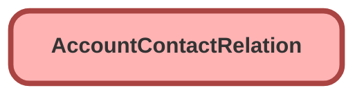

---
hide:
  - path
---

<!-- This file is auto-generated. if you do not want it to be overwritten, set TRUE in the line below -->
<!-- DO_NOT_OVERWRITE_DOC=FALSE -->

## Schema

<!-- Object description -->

## Fields

| Name      | Label | Type | Description |
| :-------- | :---- | :--: | :---------- | 
| AccountId |  | Lookup | undefined |
| ContactId |  | Lookup | undefined |
| DataRollupCategories |  | Picklist | undefined |
| egh_Emirate__c | Emirate | Picklist | undefined |
| egh_Operation_End_Date__c | Operation End Date | Date | undefined |
| egh_Operation_Start_Date__c | Operation Start Date | Date | undefined |
| EGH_Status__c | Status | Picklist | undefined |
| EndDate |  |  | undefined |
| IsActive |  |  | undefined |
| IsDirect |  |  | undefined |
| IsIncludedInGroup |  |  | undefined |
| IsPrimaryGroup |  |  | undefined |
| IsPrimaryMember |  |  | undefined |
| Roles |  | Picklist | undefined |
| StartDate |  |  | undefined |

## Related Flows

| Object | Name      | Type | Description |
| :----  | :-------- | :--: | :---------- | 
| Contact | [EGH_Contact_Mark_First_Contact_as_Primary](../flows/EGH_Contact_Mark_First_Contact_as_Primary.md) |  Record After Save | <!-- --> |
| EGH_ShowroomVisit__c | [EGH_Showroom_Visit_Populate_Contact](../flows/EGH_Showroom_Visit_Populate_Contact.md) |  Record Before Save | <!-- --> |

## Related Lightning Pages

| Lightning Page | Type |
| :----      | :--: | 
| [EGH_FleetAccountLightningPage](../pages/EGH_FleetAccountLightningPage.md) |  Record Page |
| [EGH_PersonAccountLightningPage](../pages/EGH_PersonAccountLightningPage.md) |  Record Page |

## Related Permission Sets

| Permission Set | User License |
| :----      | :--: | 
| [EGH_Core_Integration_Permission_Set](../permissionsets/EGH_Core_Integration_Permission_Set.md) | None |
| [EGH_Core_Permission](../permissionsets/EGH_Core_Permission.md) | None |
| [EGH_Fleet_Consultant](../permissionsets/EGH_Fleet_Consultant.md) | None |
| [EGH_Lease_Consultant](../permissionsets/EGH_Lease_Consultant.md) | None |
| [EGH_Sales_Consultant_Omni_Channel](../permissionsets/EGH_Sales_Consultant_Omni_Channel.md) | None |
| [EGH_SystemAdminPermissionSet](../permissionsets/EGH_SystemAdminPermissionSet.md) | None |

_Documentation generated with [sfdx-hardis](https://sfdx-hardis.cloudity.com), by [Cloudity](https://www.cloudity.com/) & [friends](https://github.com/hardisgroupcom/sfdx-hardis/graphs/contributors)_
