---
hide:
  - path
---

<!-- This file is auto-generated. if you do not want it to be overwritten, set TRUE in the line below -->
<!-- DO_NOT_OVERWRITE_DOC=FALSE -->

## Schema

```mermaid
graph TD
Activity["Activity"]:::mainObject
click Activity "/objects/Activity/"


classDef object fill:#D6E9FF,stroke:#0070D2,stroke-width:3px,rx:12px,ry:12px,shadow:drop,color:#333;
classDef customObject fill:#FFF4C2,stroke:#CCAA00,stroke-width:3px,rx:12px,ry:12px,shadow:drop,color:#333;
classDef customObjectManaged fill:#FFD8B2,stroke:#CC5500,stroke-width:3px,rx:12px,ry:12px,shadow:drop,color:#333;
classDef mainObject fill:#FFB3B3,stroke:#A94442,stroke-width:4px,rx:14px,ry:14px,shadow:drop,color:#333,font-weight:bold;

```

<!-- Object description -->

## Fields

| Name      | Label | Type | Description |
| :-------- | :---- | :--: | :---------- | 
| Attempt_Number__c | Attempt Number | Number | undefined |
| Brand__c | Brand | Picklist | undefined |
| EGH_Attempt_Number__c | Attempt Number | Number | undefined |
| EGH_Brand__c | Brand | Picklist | undefined |
| EGH_ContactTypePicklist__c | Contact Type | Picklist | undefined |
| EGH_Created_Time__c | Created Time | Time | undefined |
| EGH_DueDateTime__c | Due Date Time | DateTime | The time the Task is Due |

## Related Apex Classes

| Apex Class | Type |
| :----      | :--: | 
| [ers_DatatableControllerTest](../apex/ers_DatatableControllerTest.md) | Test |

## Related Lightning Pages

| Lightning Page | Type |
| :----      | :--: | 
| [Asset_Record_Page](../pages/Asset_Record_Page.md) |  Record Page |
| [EGH_AppraisalLightningPage](../pages/EGH_AppraisalLightningPage.md) |  Record Page |
| [EGH_BusinessAccountLightningPage](../pages/EGH_BusinessAccountLightningPage.md) |  Record Page |
| [EGH_Case_Record_Page](../pages/EGH_Case_Record_Page.md) |  Record Page |
| [EGH_FleetAccountLightningPage](../pages/EGH_FleetAccountLightningPage.md) |  Record Page |
| [EGH_LeadLightningPage](../pages/EGH_LeadLightningPage.md) |  Record Page |
| [EGH_OpportunityLightningPage](../pages/EGH_OpportunityLightningPage.md) |  Record Page |
| [EGH_PersonAccountLightningPage](../pages/EGH_PersonAccountLightningPage.md) |  Record Page |
| [EGH_Read_Only_Opportunity_Page](../pages/EGH_Read_Only_Opportunity_Page.md) |  Record Page |
| [EGH_VehicleLightningRecordPage](../pages/EGH_VehicleLightningRecordPage.md) |  Record Page |
| [Home_Page_Default](../pages/Home_Page_Default.md) |  Home Page |
| [Interaction](../pages/Interaction.md) |  Record Page |
| [LeadSystemAdminPage](../pages/LeadSystemAdminPage.md) |  Record Page |
| [Service_Appointment_Record_Page](../pages/Service_Appointment_Record_Page.md) |  Record Page |
| [Service_Appointment_Record_Page1](../pages/Service_Appointment_Record_Page1.md) |  Record Page |
| [Service_Appointment_Record_Page2](../pages/Service_Appointment_Record_Page2.md) |  Record Page |

## Related Profiles

| Profile | User License |
| :----      | :--: | 
| [Admin](../profiles/Admin.md) |  Salesforce |
| [EGH Minimum Access Profile](../profiles/EGH%20Minimum%20Access%20Profile.md) |  Salesforce |
| [EGH Sales Profile](../profiles/EGH%20Sales%20Profile.md) |  Salesforce |
| [EGH Service Profile](../profiles/EGH%20Service%20Profile.md) |  Salesforce |

## Related Permission Sets

| Permission Set | User License |
| :----      | :--: | 
| [EGH_Contact_Center_PS](../permissionsets/EGH_Contact_Center_PS.md) | None |
| [EGH_Core_Integration_Permission_Set](../permissionsets/EGH_Core_Integration_Permission_Set.md) | None |
| [EGH_Core_Permission](../permissionsets/EGH_Core_Permission.md) | None |
| [EGH_Digital_Sales_Consultant_Omni_Channel](../permissionsets/EGH_Digital_Sales_Consultant_Omni_Channel.md) | None |
| [EGH_Fleet_Consultant](../permissionsets/EGH_Fleet_Consultant.md) | None |
| [EGH_Lease_Consultant](../permissionsets/EGH_Lease_Consultant.md) | None |
| [EGH_Sales_Consultant_Omni_Channel](../permissionsets/EGH_Sales_Consultant_Omni_Channel.md) | None |
| [EGH_Service_Consultants_PS](../permissionsets/EGH_Service_Consultants_PS.md) | None |
| [EGH_SystemAdminPermissionSet](../permissionsets/EGH_SystemAdminPermissionSet.md) | None |
| [EGH_Test_Drive_Team](../permissionsets/EGH_Test_Drive_Team.md) | None |

_Documentation generated with [sfdx-hardis](https://sfdx-hardis.cloudity.com), by [Cloudity](https://www.cloudity.com/) & [friends](https://github.com/hardisgroupcom/sfdx-hardis/graphs/contributors)_
