---
hide:
  - path
---

<!-- This file is auto-generated. if you do not want it to be overwritten, set TRUE in the line below -->
<!-- DO_NOT_OVERWRITE_DOC=FALSE -->

## Schema

```mermaid
graph TD
AgentWork["AgentWork"]:::mainObject
click AgentWork "/objects/AgentWork/"


classDef object fill:#D6E9FF,stroke:#0070D2,stroke-width:3px,rx:12px,ry:12px,shadow:drop,color:#333;
classDef customObject fill:#FFF4C2,stroke:#CCAA00,stroke-width:3px,rx:12px,ry:12px,shadow:drop,color:#333;
classDef customObjectManaged fill:#FFD8B2,stroke:#CC5500,stroke-width:3px,rx:12px,ry:12px,shadow:drop,color:#333;
classDef mainObject fill:#FFB3B3,stroke:#A94442,stroke-width:4px,rx:14px,ry:14px,shadow:drop,color:#333,font-weight:bold;

```

<!-- Object description -->

## Fields

| Name      | Label | Type | Description |
| :-------- | :---- | :--: | :---------- | 
| AbandonedDateTime |  |  | undefined |
| AcceptDateTime |  |  | undefined |
| ActiveTime |  |  | undefined |
| AcwExtensionCount |  |  | undefined |
| AcwExtensionDuration |  |  | undefined |
| AfterConversationActualTime |  |  | undefined |
| AgentCapacityWhenDeclined |  |  | undefined |
| AgentIntCapacityWhenDeclined |  |  | undefined |
| CancelDateTime |  |  | undefined |
| CapacityModel |  |  | undefined |
| CapacityPercentage |  |  | undefined |
| CapacityWeight |  |  | undefined |
| ChannelData |  |  | undefined |
| CloseDateTime |  |  | undefined |
| DeclineDateTime |  |  | undefined |
| DeclineReason |  |  | undefined |
| FlagIcon |  |  | undefined |
| FlagMessage |  |  | undefined |
| HandleTime |  |  | undefined |
| HasNotification |  |  | undefined |
| IsAutoAcceptEnabled |  |  | undefined |
| IsConference |  |  | undefined |
| IsFallback |  |  | undefined |
| IsFlagged |  |  | undefined |
| IsFlagSupervisorOnly |  |  | undefined |
| IsInterruptible |  |  | undefined |
| IsOwnerChangeInitiated |  |  | undefined |
| IsPreferredUserRequired |  |  | undefined |
| IsStatusChangeInitiated |  |  | undefined |
| IsTransfer |  |  | undefined |
| LASessionId |  |  | undefined |
| OriginalQueueId |  | Lookup | undefined |
| OwnerId |  | Lookup | undefined |
| PausedCapacityPercentage |  |  | undefined |
| PausedCapacityWeight |  |  | undefined |
| PendingServiceRoutingId |  | Lookup | undefined |
| PreferredUserId |  | Lookup | undefined |
| PushTimeout |  |  | undefined |
| PushTimeoutDateTime |  |  | undefined |
| RequestDateTime |  |  | undefined |
| RoutingModel |  |  | undefined |
| RoutingPriority |  |  | undefined |
| RoutingType |  |  | undefined |
| SecondaryRoutingPriority |  |  | undefined |
| ServiceChannelId |  | Lookup | undefined |
| ShouldSkipCapacityCheck |  |  | undefined |
| ShouldSkipChannelCheck |  |  | undefined |
| SpeedToAnswer |  |  | undefined |
| Status |  |  | undefined |
| StatusSequence |  |  | undefined |
| TargetAcceptDateTime |  |  | undefined |
| TransferRequesterId |  | Lookup | undefined |
| UserId |  | Lookup | undefined |
| WorkItemId |  | Lookup | undefined |
| WorkItemStatus |  |  | undefined |

## Related Flows

| Object | Name      | Type | Description |
| :----  | :-------- | :--: | :---------- | 
| 💻 | [EGH_Lead_Routing_SubFlow](../flows/EGH_Lead_Routing_SubFlow.md) |  Routing Flow | <!-- --> |
| AgentWork | [EGH_Create_Lead_Sales_Team](../flows/EGH_Create_Lead_Sales_Team.md) |  Record After Save | <!-- --> |
| AgentWork | [EGH_Lead_Create_Follow_Up_Task](../flows/EGH_Lead_Create_Follow_Up_Task.md) |  Record After Save | <!-- --> |
| AgentWork | [EGH_Update_Case_Status_to_In_Progress](../flows/EGH_Update_Case_Status_to_In_Progress.md) |  Record After Save | <!-- --> |

## Related Apex Classes

| Apex Class | Type |
| :----      | :--: | 
| [EGH_CheckCapacityForVisitRouting](../apex/EGH_CheckCapacityForVisitRouting.md) | Invocable |

_Documentation generated with [sfdx-hardis](https://sfdx-hardis.cloudity.com), by [Cloudity](https://www.cloudity.com/) & [friends](https://github.com/hardisgroupcom/sfdx-hardis/graphs/contributors)_
