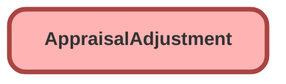

---
hide:
  - path
---

<!-- This file is auto-generated. if you do not want it to be overwritten, set TRUE in the line below -->
<!-- DO_NOT_OVERWRITE_DOC=FALSE -->

## Schema

<!-- Object description -->

## Fields

| Name      | Label | Type | Description |
| :-------- | :---- | :--: | :---------- | 
| AdjustedById |  | Lookup | undefined |
| AdjustmentValue |  |  | undefined |
| AppraisalId |  | MasterDetail | undefined |
| AppraisalItemId |  | Lookup | undefined |
| Description |  |  | undefined |
| Name |  |  | undefined |
| Status |  |  | undefined |
| Type |  | Picklist | undefined |

## Related Flows

| Object | Name      | Type | Description |
| :----  | :-------- | :--: | :---------- | 
| AppraisalAdjustment | [EGH_AppraisalAdjustmentUpdatedFlow](../flows/EGH_AppraisalAdjustmentUpdatedFlow.md) |  Record After Save | Update the Appraisal owner to thew user that created the Appraisal and the Last Evaluator to the user performing the Appraisal Adjustment when a new Appraisal Adjustment is created or updated. |

## Related Apex Classes

| Apex Class | Type |
| :----      | :--: | 
| [EGH_AppraisalAdjustmentTriggerHandler](../apex/EGH_AppraisalAdjustmentTriggerHandler.md) | Trigger Handler |
| [EGH_AppraisalAdjustmentTriggerHelper](../apex/EGH_AppraisalAdjustmentTriggerHelper.md) | Class |
| [EGH_AppraisalAdjustmentTriggerTest](../apex/EGH_AppraisalAdjustmentTriggerTest.md) | Test |
| [EGH_AppraisalAdjustmentTrigger](../apex/EGH_AppraisalAdjustmentTrigger.md) | Class |
| [EGH_AppraisalAdjustmentTriggerSecond](../apex/EGH_AppraisalAdjustmentTriggerSecond.md) | Trigger Handler |

## Related Lightning Pages

| Lightning Page | Type |
| :----      | :--: | 
| [EGH_AppraisalLightningPage](../pages/EGH_AppraisalLightningPage.md) |  Record Page |

## Related Profiles

| Profile | User License |
| :----      | :--: | 
| [Admin](../profiles/Admin.md) |  Salesforce |
| [EGH Minimum Access Profile](../profiles/EGH%20Minimum%20Access%20Profile.md) |  Salesforce |
| [EGH Sales Profile](../profiles/EGH%20Sales%20Profile.md) |  Salesforce |
| [EGH Service Profile](../profiles/EGH%20Service%20Profile.md) |  Salesforce |

## Related Permission Sets

| Permission Set | User License |
| :----      | :--: | 
| [EGH_Apex_Classes](../permissionsets/EGH_Apex_Classes.md) | None |
| [EGH_SystemAdminPermissionSet](../permissionsets/EGH_SystemAdminPermissionSet.md) | None |

_Documentation generated with [sfdx-hardis](https://sfdx-hardis.cloudity.com), by [Cloudity](https://www.cloudity.com/) & [friends](https://github.com/hardisgroupcom/sfdx-hardis/graphs/contributors)_
