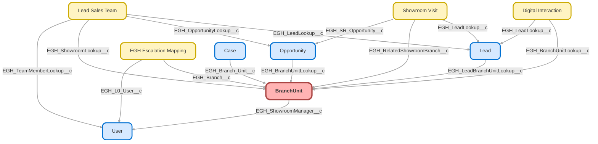

---
hide:
  - path
---

<!-- This file is auto-generated. if you do not want it to be overwritten, set TRUE in the line below -->
<!-- DO_NOT_OVERWRITE_DOC=FALSE -->

## Schema

<!-- Object description -->

## Fields

| Name      | Label | Type | Description |
| :-------- | :---- | :--: | :---------- | 
| AccountId |  | Lookup | undefined |
| BranchCode |  |  | undefined |
| BranchManagerId |  | Lookup | undefined |
| EGH_LocationTypePicklist__c | Location Type | Picklist | Indicate if the Branch it's a a Showroom or a Service Center. If it's a parent Branch the value will be Company. |
| EGH_ShowroomManager__c | Showroom Manager | Lookup | undefined |
| EndDate |  |  | undefined |
| IsActive |  |  | undefined |
| LocationId |  | Lookup | undefined |
| Name |  |  | undefined |
| OperatingHoursId |  | Lookup | undefined |
| OperationalState |  | Picklist | undefined |
| ParentBranchUnitId |  | Lookup | undefined |
| ServiceTerritoryId |  | Lookup | undefined |
| StartDate |  |  | undefined |
| Type |  |  | undefined |

## Related Flows

| Object | Name      | Type | Description |
| :----  | :-------- | :--: | :---------- | 
| 💻 | [EGH_Create_Internal_Escalation_Case](../flows/EGH_Create_Internal_Escalation_Case.md) |  Screen Flow | <!-- --> |
| 💻 | [EGH_Lead_Routing_SubFlow](../flows/EGH_Lead_Routing_SubFlow.md) |  Routing Flow | <!-- --> |
| 💻 | [EGH_MeetGreetTestFlow](../flows/EGH_MeetGreetTestFlow.md) |  Screen Flow | Test Flow for Meet&Greet Application. To use in discussion with Irshad |
| 💻 | [EGH_Product_Genius](../flows/EGH_Product_Genius.md) |  Screen Flow | Flow for Product Genius Application |
| AgentWork | [EGH_Create_Lead_Sales_Team](../flows/EGH_Create_Lead_Sales_Team.md) |  Record After Save | <!-- --> |
| EGH_ShowroomVisit__c | [EGH_LeadAndVisitShowroomAssignmentFlow](../flows/EGH_LeadAndVisitShowroomAssignmentFlow.md) |  Record After Save | Flow to assign a Lead to the appropriate Sales Consultant or the Team Leader based on Skills, Presence Status and previously assign Sales Consultant. Check if the purpose of the visit is Meet F&I Team. |

## Related Apex Classes

| Apex Class | Type |
| :----      | :--: | 
| [EGHResourceTimelineController](../apex/EGHResourceTimelineController.md) | Lightning Controller |
| [EGHResourceTimelineControllerTest](../apex/EGHResourceTimelineControllerTest.md) | Test |
| [EGHTestDriveTimelineController](../apex/EGHTestDriveTimelineController.md) | Lightning Controller |
| [EGHTestDriveTimelineControllerTest](../apex/EGHTestDriveTimelineControllerTest.md) | Test |
| [EGH_LeadFindDuplicatesTest](../apex/EGH_LeadFindDuplicatesTest.md) | Test |
| [EGH_MeetGreetSearchControllerClass](../apex/EGH_MeetGreetSearchControllerClass.md) | Invocable |
| [EGH_MeetGreetSearchControllerClass_Test](../apex/EGH_MeetGreetSearchControllerClass_Test.md) | Test |
| [EGH_TeamLeaderControllerClass](../apex/EGH_TeamLeaderControllerClass.md) | Invocable |
| [EGH_TeamLeaderControllerClassTest](../apex/EGH_TeamLeaderControllerClassTest.md) | Test |
| [EGH_TestDriveSlotFinder](../apex/EGH_TestDriveSlotFinder.md) | Lightning Controller |
| [EGH_TestDriveSlotFinder_Test](../apex/EGH_TestDriveSlotFinder_Test.md) | Test |

## Related Lightning Pages

| Lightning Page | Type |
| :----      | :--: | 
| [Interaction](../pages/Interaction.md) |  Record Page |

## Related Profiles

| Profile | User License |
| :----      | :--: | 
| [Admin](../profiles/Admin.md) |  Salesforce |
| [EGH Minimum Access Profile](../profiles/EGH%20Minimum%20Access%20Profile.md) |  Salesforce |
| [EGH Sales Profile](../profiles/EGH%20Sales%20Profile.md) |  Salesforce |
| [EGH Service Profile](../profiles/EGH%20Service%20Profile.md) |  Salesforce |

## Related Permission Sets

| Permission Set | User License |
| :----      | :--: | 
| [EGH_Contact_Center_PS](../permissionsets/EGH_Contact_Center_PS.md) | None |
| [EGH_Core_Integration_Permission_Set](../permissionsets/EGH_Core_Integration_Permission_Set.md) | None |
| [EGH_Core_Permission](../permissionsets/EGH_Core_Permission.md) | None |
| [EGH_Digital_Sales_Consultant_Omni_Channel](../permissionsets/EGH_Digital_Sales_Consultant_Omni_Channel.md) | None |
| [EGH_Fleet_Consultant](../permissionsets/EGH_Fleet_Consultant.md) | None |
| [EGH_Lease_Consultant](../permissionsets/EGH_Lease_Consultant.md) | None |
| [EGH_Meet_and_Greet_Application](../permissionsets/EGH_Meet_and_Greet_Application.md) | None |
| [EGH_Product_Genius_Admin](../permissionsets/EGH_Product_Genius_Admin.md) | None |
| [EGH_Product_Genius](../permissionsets/EGH_Product_Genius.md) | None |
| [EGH_Sales_Consultant_Omni_Channel](../permissionsets/EGH_Sales_Consultant_Omni_Channel.md) | None |
| [EGH_Service_Consultants_PS](../permissionsets/EGH_Service_Consultants_PS.md) | None |
| [EGH_SystemAdminPermissionSet](../permissionsets/EGH_SystemAdminPermissionSet.md) | None |

_Documentation generated with [sfdx-hardis](https://sfdx-hardis.cloudity.com), by [Cloudity](https://www.cloudity.com/) & [friends](https://github.com/hardisgroupcom/sfdx-hardis/graphs/contributors)_
