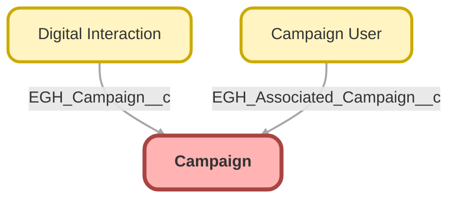

---
hide:
  - path
---

<!-- This file is auto-generated. if you do not want it to be overwritten, set TRUE in the line below -->
<!-- DO_NOT_OVERWRITE_DOC=FALSE -->

## Schema

<!-- Object description -->

## Fields

| Name      | Label | Type | Description |
| :-------- | :---- | :--: | :---------- | 
| ActualCost |  |  | undefined |
| AmountAllOpportunities |  |  | undefined |
| AmountWonOpportunities |  |  | undefined |
| BudgetedCost |  |  | undefined |
| CampaignMemberRecordTypeId |  | Lookup | undefined |
| Description |  |  | undefined |
| EGH_Address__c | Address | LongTextArea | undefined |
| EGH_Brand__c | Brand | Picklist | undefined |
| EGH_Campaign_End_Date_Time__c | Campaign End Date Time | DateTime | undefined |
| EGH_Campaign_Start_Date_Time__c | Campaign Start Date Time | DateTime | undefined |
| EGH_Vehicle_Models__c | Vehicle Models | MultiselectPicklist | undefined |
| EndDate |  |  | undefined |
| ExpectedResponse |  |  | undefined |
| ExpectedRevenue |  |  | undefined |
| HierarchyActualCost |  |  | undefined |
| HierarchyAmountAllOpportunities |  |  | undefined |
| HierarchyAmountWonOpportunities |  |  | undefined |
| HierarchyBudgetedCost |  |  | undefined |
| HierarchyExpectedRevenue |  |  | undefined |
| HierarchyNumberOfContacts |  |  | undefined |
| HierarchyNumberOfConvertedLeads |  |  | undefined |
| HierarchyNumberOfLeads |  |  | undefined |
| HierarchyNumberOfOpportunities |  |  | undefined |
| HierarchyNumberOfResponses |  |  | undefined |
| HierarchyNumberOfWonOpportunities |  |  | undefined |
| HierarchyNumberSent |  |  | undefined |
| IsActive |  |  | undefined |
| Name |  |  | undefined |
| NumberOfContacts |  |  | undefined |
| NumberOfConvertedLeads |  |  | undefined |
| NumberOfLeads |  |  | undefined |
| NumberOfOpportunities |  |  | undefined |
| NumberOfResponses |  |  | undefined |
| NumberOfWonOpportunities |  |  | undefined |
| NumberSent |  |  | undefined |
| OwnerId |  | Lookup | undefined |
| ParentId |  | Lookup | undefined |
| StartDate |  |  | undefined |
| Status |  | Picklist | undefined |
| Type |  | Picklist | undefined |

## Related Flows

| Object | Name      | Type | Description |
| :----  | :-------- | :--: | :---------- | 
| 💻 | [EGH_Product_Genius](../flows/EGH_Product_Genius.md) |  Screen Flow | Flow for Product Genius Application |
| EGH_Interaction__c | [EGH_Digital_Interaction_Link_Lead_With_Campaign](../flows/EGH_Digital_Interaction_Link_Lead_With_Campaign.md) |  Record After Save | <!-- --> |

## Related Lightning Pages

| Lightning Page | Type |
| :----      | :--: | 
| [EGH_Campaign_Layout](../pages/EGH_Campaign_Layout.md) |  Record Page |
| [EGH_Campaign_User](../pages/EGH_Campaign_User.md) |  Record Page |
| [Interaction](../pages/Interaction.md) |  Record Page |

## Related Profiles

| Profile | User License |
| :----      | :--: | 
| [Admin](../profiles/Admin.md) |  Salesforce |
| [EGH Minimum Access Profile](../profiles/EGH%20Minimum%20Access%20Profile.md) |  Salesforce |
| [EGH Sales Profile](../profiles/EGH%20Sales%20Profile.md) |  Salesforce |
| [EGH Service Profile](../profiles/EGH%20Service%20Profile.md) |  Salesforce |

## Related Permission Sets

| Permission Set | User License |
| :----      | :--: | 
| [EGH_Contact_Center_PS](../permissionsets/EGH_Contact_Center_PS.md) | None |
| [EGH_Core_Integration_Permission_Set](../permissionsets/EGH_Core_Integration_Permission_Set.md) | None |
| [EGH_Core_Permission](../permissionsets/EGH_Core_Permission.md) | None |
| [EGH_Digital_Sales_Consultant_Omni_Channel](../permissionsets/EGH_Digital_Sales_Consultant_Omni_Channel.md) | None |
| [EGH_Fleet_Consultant](../permissionsets/EGH_Fleet_Consultant.md) | None |
| [EGH_Lease_Consultant](../permissionsets/EGH_Lease_Consultant.md) | None |
| [EGH_Meet_and_Greet_Application](../permissionsets/EGH_Meet_and_Greet_Application.md) | None |
| [EGH_Product_Genius_Admin](../permissionsets/EGH_Product_Genius_Admin.md) | None |
| [EGH_Product_Genius](../permissionsets/EGH_Product_Genius.md) | None |
| [EGH_QA_and_Data_Analyst_PS](../permissionsets/EGH_QA_and_Data_Analyst_PS.md) | None |
| [EGH_Sales_Consultant_Omni_Channel](../permissionsets/EGH_Sales_Consultant_Omni_Channel.md) | None |
| [EGH_Service_Consultants_PS](../permissionsets/EGH_Service_Consultants_PS.md) | None |
| [EGH_SystemAdminPermissionSet](../permissionsets/EGH_SystemAdminPermissionSet.md) | None |

_Documentation generated with [sfdx-hardis](https://sfdx-hardis.cloudity.com), by [Cloudity](https://www.cloudity.com/) & [friends](https://github.com/hardisgroupcom/sfdx-hardis/graphs/contributors)_
