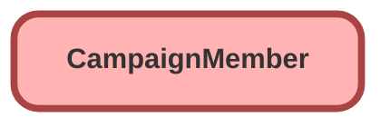

---
hide:
  - path
---

<!-- This file is auto-generated. if you do not want it to be overwritten, set TRUE in the line below -->
<!-- DO_NOT_OVERWRITE_DOC=FALSE -->

## Schema

<!-- Object description -->

## Fields

| Name      | Label | Type | Description |
| :-------- | :---- | :--: | :---------- | 
| CampaignId |  | Lookup | undefined |
| City |  |  | undefined |
| CompanyOrAccount |  |  | undefined |
| ContactId |  | Lookup | undefined |
| Country |  |  | undefined |
| Description |  |  | undefined |
| DoNotCall |  |  | undefined |
| Email |  |  | undefined |
| Fax |  |  | undefined |
| FirstName |  |  | undefined |
| FirstRespondedDate |  |  | undefined |
| HasOptedOutOfEmail |  |  | undefined |
| HasOptedOutOfFax |  |  | undefined |
| HasResponded |  |  | undefined |
| LastName |  |  | undefined |
| LeadId |  | Lookup | undefined |
| LeadSource |  | Picklist | undefined |
| MobilePhone |  |  | undefined |
| Phone |  |  | undefined |
| PostalCode |  |  | undefined |
| Salutation |  | Picklist | undefined |
| State |  |  | undefined |
| Status |  | Picklist | undefined |
| Street |  |  | undefined |
| Title |  |  | undefined |

## Related Flows

| Object | Name      | Type | Description |
| :----  | :-------- | :--: | :---------- | 
| EGH_Interaction__c | [EGH_Digital_Interaction_Link_Lead_With_Campaign](../flows/EGH_Digital_Interaction_Link_Lead_With_Campaign.md) |  Record After Save | <!-- --> |
| Lead | [EGH_Insert_Lead_as_Campaign_Member](../flows/EGH_Insert_Lead_as_Campaign_Member.md) |  Record After Save | <!-- --> |

_Documentation generated with [sfdx-hardis](https://sfdx-hardis.cloudity.com), by [Cloudity](https://www.cloudity.com/) & [friends](https://github.com/hardisgroupcom/sfdx-hardis/graphs/contributors)_
