---
hide:
  - path
---

<!-- This file is auto-generated. if you do not want it to be overwritten, set TRUE in the line below -->
<!-- DO_NOT_OVERWRITE_DOC=FALSE -->

## Schema

```mermaid
graph TD
ContentVersion["ContentVersion"]:::mainObject
click ContentVersion "/objects/ContentVersion/"


classDef object fill:#D6E9FF,stroke:#0070D2,stroke-width:3px,rx:12px,ry:12px,shadow:drop,color:#333;
classDef customObject fill:#FFF4C2,stroke:#CCAA00,stroke-width:3px,rx:12px,ry:12px,shadow:drop,color:#333;
classDef customObjectManaged fill:#FFD8B2,stroke:#CC5500,stroke-width:3px,rx:12px,ry:12px,shadow:drop,color:#333;
classDef mainObject fill:#FFB3B3,stroke:#A94442,stroke-width:4px,rx:14px,ry:14px,shadow:drop,color:#333,font-weight:bold;

```

<!-- Object description -->

## Fields

| Name      | Label | Type | Description |
| :-------- | :---- | :--: | :---------- | 
| ContentSize |  |  | undefined |
| ContentSizeLong |  |  | undefined |
| Description |  |  | undefined |
| dfsle__GeneratedFileFormat__c | Generated File Format | Picklist | undefined |
| dfsle__GeneratedFileName__c | Generated File Name | Text | undefined |
| dfsle__GeneratedFileSuffix__c | Generated File Suffix | Picklist | undefined |
| dfsle__Rule__c | Rule | LongTextArea | JSON mapping for storing Document Generation rule helpful in implementing Conditional Template         generation. |
| FileExtension |  |  | undefined |
| FileType |  |  | undefined |
| IsAssetEnabled |  |  | undefined |
| Language |  |  | undefined |
| OwnerId |  | Lookup | undefined |
| SharingOption |  |  | undefined |
| SharingPrivacy |  |  | undefined |
| TagCsv |  |  | undefined |
| Title |  |  | undefined |

## Related Apex Classes

| Apex Class | Type |
| :----      | :--: | 
| [EGH_DamageCaptureController](../apex/EGH_DamageCaptureController.md) | Lightning Controller |
| [EGH_DamageCaptureController_Test](../apex/EGH_DamageCaptureController_Test.md) | Test |

_Documentation generated with [sfdx-hardis](https://sfdx-hardis.cloudity.com), by [Cloudity](https://www.cloudity.com/) & [friends](https://github.com/hardisgroupcom/sfdx-hardis/graphs/contributors)_
