---
hide:
  - path
---

<!-- This file is auto-generated. if you do not want it to be overwritten, set TRUE in the line below -->
<!-- DO_NOT_OVERWRITE_DOC=FALSE -->

## Schema

```mermaid
graph TD
Customer["Customer"]:::mainObject
click Customer "/objects/Customer/"


classDef object fill:#D6E9FF,stroke:#0070D2,stroke-width:3px,rx:12px,ry:12px,shadow:drop,color:#333;
classDef customObject fill:#FFF4C2,stroke:#CCAA00,stroke-width:3px,rx:12px,ry:12px,shadow:drop,color:#333;
classDef customObjectManaged fill:#FFD8B2,stroke:#CC5500,stroke-width:3px,rx:12px,ry:12px,shadow:drop,color:#333;
classDef mainObject fill:#FFB3B3,stroke:#A94442,stroke-width:4px,rx:14px,ry:14px,shadow:drop,color:#333,font-weight:bold;

```

<!-- Object description -->

## Fields

| Name      | Label | Type | Description |
| :-------- | :---- | :--: | :---------- | 
| CustomerStatusType |  |  | undefined |
| Name |  |  | undefined |
| OwnerId |  | Lookup | undefined |
| PartyId |  | Lookup | undefined |
| TotalLifeTimeValue |  |  | undefined |

## Related Flows

| Object | Name      | Type | Description |
| :----  | :-------- | :--: | :---------- | 
| 💻 | [dm_031f5a5b_98ab_4c69_8692_7628437bbb5b](../flows/dm_031f5a5b_98ab_4c69_8692_7628437bbb5b.md) |  Survey Enrich | <!-- --> |
| 💻 | [dm_266cd062_188e_478b_b6e1_00b3901d4b47](../flows/dm_266cd062_188e_478b_b6e1_00b3901d4b47.md) |  Survey Enrich | <!-- --> |
| 💻 | [dm_85a98cc6_9c17_438f_a935_95eaec532f08](../flows/dm_85a98cc6_9c17_438f_a935_95eaec532f08.md) |  Survey Enrich | <!-- --> |
| 💻 | [dm_e8fe1326_4176_4006_bebf_018153a1f0ac](../flows/dm_e8fe1326_4176_4006_bebf_018153a1f0ac.md) |  Survey Enrich | <!-- --> |
| Case | [EGH_Consumer_Body_Email_Case_Updates](../flows/EGH_Consumer_Body_Email_Case_Updates.md) |  Record Before Save | <!-- --> |
| SurveyInvitation | [EGH_CaseCreateFeedbackCaseForPoorScoreSurveys](../flows/EGH_CaseCreateFeedbackCaseForPoorScoreSurveys.md) |  Record After Save | Create Feedback Case For Poor Score Surveys using Platform Event. Update Reason Code and Category. |

## Related Apex Classes

| Apex Class | Type |
| :----      | :--: | 
| [EGH_AppraisalAdjustmentTriggerTest](../apex/EGH_AppraisalAdjustmentTriggerTest.md) | Test |
| [EGH_AppraisalItemTriggerHandler](../apex/EGH_AppraisalItemTriggerHandler.md) | Trigger Handler |
| [EGH_TestDriveSlotFinder](../apex/EGH_TestDriveSlotFinder.md) | Lightning Controller |
| [MyProfilePageControllerTest](../apex/MyProfilePageControllerTest.md) | Test (See All Data) |
| [SiteRegisterController](../apex/SiteRegisterController.md) | Visualforce Controller |

## Related Lightning Pages

| Lightning Page | Type |
| :----      | :--: | 
| [EGH_BusinessAccountLightningPage](../pages/EGH_BusinessAccountLightningPage.md) |  Record Page |
| [EGH_FleetAccountLightningPage](../pages/EGH_FleetAccountLightningPage.md) |  Record Page |
| [EGH_PersonAccountLightningPage](../pages/EGH_PersonAccountLightningPage.md) |  Record Page |
| [EGH_Service_Appointment_SystemAdmin](../pages/EGH_Service_Appointment_SystemAdmin.md) |  Record Page |
| [EGH_Traffic_Fine_Lightning_Page](../pages/EGH_Traffic_Fine_Lightning_Page.md) |  Record Page |
| [Genesys_Experience_Layout](../pages/Genesys_Experience_Layout.md) |  Record Page |

## Related Profiles

| Profile | User License |
| :----      | :--: | 
| [Admin](../profiles/Admin.md) |  Salesforce |
| [EGH Minimum Access Profile](../profiles/EGH%20Minimum%20Access%20Profile.md) |  Salesforce |
| [EGH Sales Profile](../profiles/EGH%20Sales%20Profile.md) |  Salesforce |
| [EGH Service Profile](../profiles/EGH%20Service%20Profile.md) |  Salesforce |

## Related Permission Sets

| Permission Set | User License |
| :----      | :--: | 
| [EGH_Contact_Center_PS](../permissionsets/EGH_Contact_Center_PS.md) | None |
| [EGH_Core_Integration_Permission_Set](../permissionsets/EGH_Core_Integration_Permission_Set.md) | None |
| [EGH_Core_Permission](../permissionsets/EGH_Core_Permission.md) | None |
| [EGH_Digital_Sales_Consultant_Omni_Channel](../permissionsets/EGH_Digital_Sales_Consultant_Omni_Channel.md) | None |
| [EGH_Fleet_Consultant](../permissionsets/EGH_Fleet_Consultant.md) | None |
| [EGH_Lease_Consultant](../permissionsets/EGH_Lease_Consultant.md) | None |
| [EGH_Meet_and_Greet_Application](../permissionsets/EGH_Meet_and_Greet_Application.md) | None |
| [EGH_Product_Genius_Admin](../permissionsets/EGH_Product_Genius_Admin.md) | None |
| [EGH_Product_Genius](../permissionsets/EGH_Product_Genius.md) | None |
| [EGH_QA_and_Data_Analyst_PS](../permissionsets/EGH_QA_and_Data_Analyst_PS.md) | None |
| [EGH_Sales_Consultant_Omni_Channel](../permissionsets/EGH_Sales_Consultant_Omni_Channel.md) | None |
| [EGH_Service_Consultants_PS](../permissionsets/EGH_Service_Consultants_PS.md) | None |
| [EGH_SystemAdminPermissionSet](../permissionsets/EGH_SystemAdminPermissionSet.md) | None |
| [EGH_Test_Drive_Team](../permissionsets/EGH_Test_Drive_Team.md) | None |

_Documentation generated with [sfdx-hardis](https://sfdx-hardis.cloudity.com), by [Cloudity](https://www.cloudity.com/) & [friends](https://github.com/hardisgroupcom/sfdx-hardis/graphs/contributors)_
