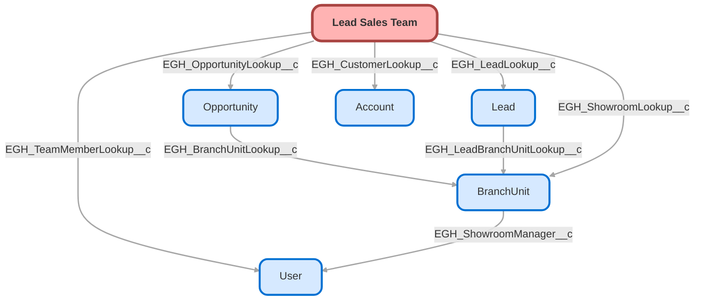

---
hide:
  - path
---

<!-- This file is auto-generated. if you do not want it to be overwritten, set TRUE in the line below -->
<!-- DO_NOT_OVERWRITE_DOC=FALSE -->

## Schema

<!-- Object description -->

## Fields

| Name      | Label | Type | Description |
| :-------- | :---- | :--: | :---------- | 
| EGH_CustomerLookup__c | Customer | Lookup | Relationship field to inform who was the sales team that work on the previous Lead |
| EGH_LeadLookup__c | Lead | Lookup | Lead the Sales Team Member is related to. |
| EGH_MemberRoleText__c | Member Role | Text | Role of the member; what has been the participation of the member in the Lead process |
| EGH_OpportunityLookup__c | Opportunity | Lookup | undefined |
| EGH_ShowroomLookup__c | Showroom | Lookup | Lookup to the showroom the user is working in |
| EGH_TeamMemberLookup__c | Team Member | Lookup | Lead Sales Team Member |

## Related Flows

| Object | Name      | Type | Description |
| :----  | :-------- | :--: | :---------- | 
| 💻 | [EGH_Lead_Routing_SubFlow](../flows/EGH_Lead_Routing_SubFlow.md) |  Routing Flow | <!-- --> |
| AgentWork | [EGH_Create_Lead_Sales_Team](../flows/EGH_Create_Lead_Sales_Team.md) |  Record After Save | <!-- --> |
| Lead | [EGH_Lead_Add_Leasing_Fleet_Consultant_to_Lead_Sales_Team](../flows/EGH_Lead_Add_Leasing_Fleet_Consultant_to_Lead_Sales_Team.md) |  Record After Save | <!-- --> |
| Lead | [EGH_Lead_Add_Sales_Consultant_to_Lead_Sales_Team](../flows/EGH_Lead_Add_Sales_Consultant_to_Lead_Sales_Team.md) |  Record After Save | <!-- --> |
| Lead | [EGH_Lead_Sales_Team_Account_Mapping](../flows/EGH_Lead_Sales_Team_Account_Mapping.md) |  Record After Save | <!-- --> |
| Opportunity | [EGH_Opportunity_Add_Sales_Consultant_to_Lead_Sales_Team](../flows/EGH_Opportunity_Add_Sales_Consultant_to_Lead_Sales_Team.md) |  Record After Save | <!-- --> |

## Related Lightning Pages

| Lightning Page | Type |
| :----      | :--: | 
| [Lead_Sales_Team_Record_Page](../pages/Lead_Sales_Team_Record_Page.md) |  Record Page |

## Related Profiles

| Profile | User License |
| :----      | :--: | 
| [Admin](../profiles/Admin.md) |  Salesforce |
| [EGH Minimum Access Profile](../profiles/EGH%20Minimum%20Access%20Profile.md) |  Salesforce |
| [EGH Sales Profile](../profiles/EGH%20Sales%20Profile.md) |  Salesforce |
| [EGH Service Profile](../profiles/EGH%20Service%20Profile.md) |  Salesforce |

## Related Permission Sets

| Permission Set | User License |
| :----      | :--: | 
| [EGH_Contact_Center_PS](../permissionsets/EGH_Contact_Center_PS.md) | None |
| [EGH_Core_Integration_Permission_Set](../permissionsets/EGH_Core_Integration_Permission_Set.md) | None |
| [EGH_Core_Permission](../permissionsets/EGH_Core_Permission.md) | None |
| [EGH_Digital_Sales_Consultant_Omni_Channel](../permissionsets/EGH_Digital_Sales_Consultant_Omni_Channel.md) | None |
| [EGH_Meet_and_Greet_Application](../permissionsets/EGH_Meet_and_Greet_Application.md) | None |
| [EGH_Sales_Consultant_Omni_Channel](../permissionsets/EGH_Sales_Consultant_Omni_Channel.md) | None |
| [EGH_Service_Consultants_PS](../permissionsets/EGH_Service_Consultants_PS.md) | None |
| [EGH_SystemAdminPermissionSet](../permissionsets/EGH_SystemAdminPermissionSet.md) | None |

_Documentation generated with [sfdx-hardis](https://sfdx-hardis.cloudity.com), by [Cloudity](https://www.cloudity.com/) & [friends](https://github.com/hardisgroupcom/sfdx-hardis/graphs/contributors)_
