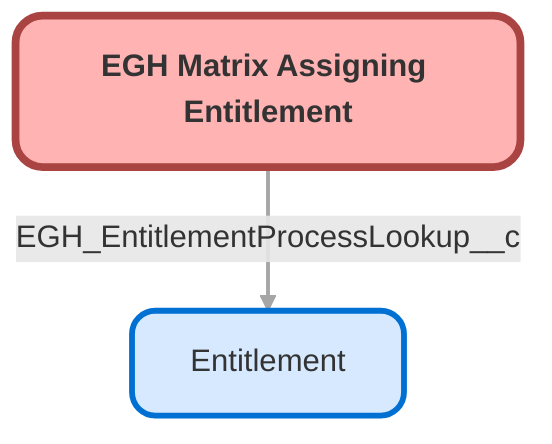

---
hide:
  - path
---

<!-- This file is auto-generated. if you do not want it to be overwritten, set TRUE in the line below -->
<!-- DO_NOT_OVERWRITE_DOC=FALSE -->

## Schema

<!-- Object description -->

## Fields

| Name      | Label | Type | Description |
| :-------- | :---- | :--: | :---------- | 
| EGH_Entitlement_Type__c | EGH Entitlement Type | Picklist | undefined |
| EGH_EntitlementProcessLookup__c | Entitlement Process | Lookup | Lookup to the Entitlement process to apply when the conditions in the Matrix row are fulfilled |
| EGH_Priority__c | EGH Priority | Text | undefined |
| EGH_Reason_Code__c | EGH Reason Code | Picklist | undefined |

## Validation Rules

| Rule      | Active | Description | Formula |
| :-------- | :---- | :---------- | :------ |
| EGH_No_Duplicate_Reason_Code | Yes | Validate that all the mandatory fields are included | AND(   (ISBLANK(TEXT(EGH_Reason_Code__c))),   (ISBLANK(TEXT(EGH_Entitlement_Type__c))),   (ISBLANK(EGH_Priority__c)),   (ISBLANK(EGH_EntitlementProcessLookup__c)) ) |

## Related Flows

| Object | Name      | Type | Description |
| :----  | :-------- | :--: | :---------- | 
| Case | [egh_Auto_Assign_Entitlement_Flow](../flows/egh_Auto_Assign_Entitlement_Flow.md) |  Record After Save | <!-- --> |

## Related Profiles

| Profile | User License |
| :----      | :--: | 
| [Admin](../profiles/Admin.md) |  Salesforce |
| [EGH Minimum Access Profile](../profiles/EGH%20Minimum%20Access%20Profile.md) |  Salesforce |
| [EGH Sales Profile](../profiles/EGH%20Sales%20Profile.md) |  Salesforce |
| [EGH Service Profile](../profiles/EGH%20Service%20Profile.md) |  Salesforce |

## Related Permission Sets

| Permission Set | User License |
| :----      | :--: | 
| [EGH_SystemAdminPermissionSet](../permissionsets/EGH_SystemAdminPermissionSet.md) | None |

_Documentation generated with [sfdx-hardis](https://sfdx-hardis.cloudity.com), by [Cloudity](https://www.cloudity.com/) & [friends](https://github.com/hardisgroupcom/sfdx-hardis/graphs/contributors)_
