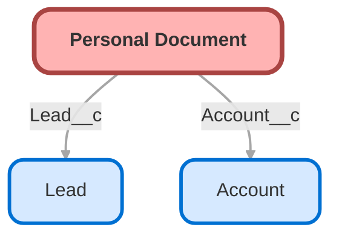

---
hide:
  - path
---

<!-- This file is auto-generated. if you do not want it to be overwritten, set TRUE in the line below -->
<!-- DO_NOT_OVERWRITE_DOC=FALSE -->

## Schema

<!-- Object description -->

## Fields

| Name      | Label | Type | Description |
| :-------- | :---- | :--: | :---------- | 
| Account__c | Account | Lookup | Customer to which the document is related to |
| EGH_DocumentActiveChackbox__c | Active | Checkbox | Indicate if the document is Active or has expired. If checked it means the document is Active. |
| EGH_DocumentNumberText__c | Document Number | Text | Personal Document Number (EID, Passport,...) |
| EGH_DocumentTypePicklist__c | Document Type | Picklist | Personal Document Type: EID, Passport, Driving License,... |
| EGH_ExpirationDate__c | Expiration Date | Date | Expiration Date of the Document |
| EGH_Issue_Date__c | Issue Date | Date | undefined |
| Issuing_Country__c | Issuing Country | Picklist | Country of the document |
| Lead__c | Lead | Lookup | Lead to which the document is associated |

## Validation Rules

| Rule      | Active | Description | Formula |
| :-------- | :---- | :---------- | :------ |
| EGH_DrivingLicense_Format | Yes |  | AND(  TEXT(EGH_DocumentTypePicklist__c) = "Driving License",   OR( ISNEW(), ISCHANGED(EGH_DocumentNumberText__c) ),   OR(  LEN(EGH_DocumentNumberText__c) <  $CustomMetadata.EGH_Personal_Documents_Validation_Meta__mdt.Driving_License.Minimum_Length__c ,   LEN(EGH_DocumentNumberText__c) > $CustomMetadata.EGH_Personal_Documents_Validation_Meta__mdt.Driving_License.Maximum_Length__c,   NOT(REGEX(EGH_DocumentNumberText__c, $CustomMetadata.EGH_Personal_Documents_Validation_Meta__mdt.Driving_License.REGEX__c)) ) ) |
| EGH_Emirates_ID_Format | Yes |  | AND(          TEXT(EGH_DocumentTypePicklist__c) = "EID",         OR(         ISNEW(),         ISCHANGED(EGH_DocumentNumberText__c)     ),           OR(                 NOT(LEN(EGH_DocumentNumberText__c) = $CustomMetadata.EGH_Personal_Documents_Validation_Meta__mdt.Emirates_ID.Minimum_Length__c),                           NOT(REGEX(EGH_DocumentNumberText__c, $CustomMetadata.EGH_Personal_Documents_Validation_Meta__mdt.Emirates_ID.REGEX__c))     ) ) |
| EGH_IssueExpiryDateRequired | No ⚠️ | Issue Date and Expiry Date are mandatory for all document types except International Driving Number. | AND( NOT(TEXT(EGH_DocumentTypePicklist__c) = "International Driving Number"), OR( AND( ISNEW(), OR( ISBLANK(EGH_Issue_Date__c), ISBLANK(EGH_ExpirationDate__c), EGH_Issue_Date__c > TODAY(), EGH_ExpirationDate__c <= TODAY() ) ), AND( NOT(ISNEW()), OR( ISCHANGED(EGH_ExpirationDate__c), ISCHANGED(EGH_Issue_Date__c), ISCHANGED(EGH_DocumentNumberText__c) ), OR( ISBLANK(EGH_Issue_Date__c), ISBLANK(EGH_ExpirationDate__c), EGH_Issue_Date__c > TODAY(), EGH_ExpirationDate__c <= TODAY() ) ) ) ) |
| EGH_Pasport_Format | Yes |  | AND(          TEXT(EGH_DocumentTypePicklist__c) = "Passport",           OR(         ISNEW(),         ISCHANGED(EGH_DocumentNumberText__c)     ),           OR(                  LEN(EGH_DocumentNumberText__c) < $CustomMetadata.EGH_Personal_Documents_Validation_Meta__mdt.Passport.Minimum_Length__c,                 LEN(EGH_DocumentNumberText__c) > $CustomMetadata.EGH_Personal_Documents_Validation_Meta__mdt.Passport.Maximum_Length__c,                          NOT(REGEX(EGH_DocumentNumberText__c, $CustomMetadata.EGH_Personal_Documents_Validation_Meta__mdt.Passport.REGEX__c))     ) ) |

## Related Flows

| Object | Name      | Type | Description |
| :----  | :-------- | :--: | :---------- | 
| 💻 | [EGH_StartTestDriveFlow](../flows/EGH_StartTestDriveFlow.md) |  Screen Flow | Start Test Drive Screen Flow |

## Related Lightning Pages

| Lightning Page | Type |
| :----      | :--: | 
| [Personal_Document_Lightning_Page](../pages/Personal_Document_Lightning_Page.md) |  Record Page |

## Related Profiles

| Profile | User License |
| :----      | :--: | 
| [Admin](../profiles/Admin.md) |  Salesforce |
| [EGH Minimum Access Profile](../profiles/EGH%20Minimum%20Access%20Profile.md) |  Salesforce |
| [EGH Sales Profile](../profiles/EGH%20Sales%20Profile.md) |  Salesforce |
| [EGH Service Profile](../profiles/EGH%20Service%20Profile.md) |  Salesforce |

## Related Permission Sets

| Permission Set | User License |
| :----      | :--: | 
| [EGH_Core_Integration_Permission_Set](../permissionsets/EGH_Core_Integration_Permission_Set.md) | None |
| [EGH_Core_Permission](../permissionsets/EGH_Core_Permission.md) | None |
| [EGH_Digital_Sales_Consultant_Omni_Channel](../permissionsets/EGH_Digital_Sales_Consultant_Omni_Channel.md) | None |
| [EGH_Fleet_Consultant](../permissionsets/EGH_Fleet_Consultant.md) | None |
| [EGH_Lease_Consultant](../permissionsets/EGH_Lease_Consultant.md) | None |
| [EGH_Meet_and_Greet_Application](../permissionsets/EGH_Meet_and_Greet_Application.md) | None |
| [EGH_Product_Genius](../permissionsets/EGH_Product_Genius.md) | None |
| [EGH_Sales_Consultant_Omni_Channel](../permissionsets/EGH_Sales_Consultant_Omni_Channel.md) | None |
| [EGH_SystemAdminPermissionSet](../permissionsets/EGH_SystemAdminPermissionSet.md) | None |
| [EGH_Test_Drive_Team](../permissionsets/EGH_Test_Drive_Team.md) | None |

_Documentation generated with [sfdx-hardis](https://sfdx-hardis.cloudity.com), by [Cloudity](https://www.cloudity.com/) & [friends](https://github.com/hardisgroupcom/sfdx-hardis/graphs/contributors)_
