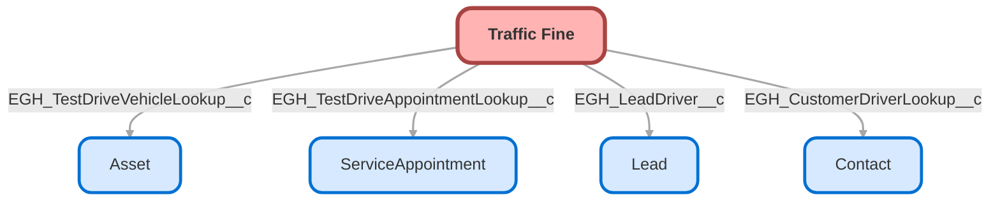

---
hide:
  - path
---

<!-- This file is auto-generated. if you do not want it to be overwritten, set TRUE in the line below -->
<!-- DO_NOT_OVERWRITE_DOC=FALSE -->

## Schema

<!-- Object description -->

## Fields

| Name      | Label | Type | Description |
| :-------- | :---- | :--: | :---------- | 
| EGH_CustomerDriverLookup__c | Customer Driver | Lookup | Driver of the vehicle in the moment the traffic fine was created (Customer). There will be other field to indicate the driver if a lead was driving. |
| EGH_DateOfInfractionDateTime__c | Date/Time Of Infraction | DateTime | Date and Time of the infraction related with the traffic fine |
| EGH_DescriptionLongText__c | Description | LongTextArea | Description of the infraction |
| EGH_FineAmountCurrency__c | Fine Amount | Currency | Amount of the traffic fine |
| EGH_FineNumberText__c | Fine Number | Text | Traffic Fine number |
| EGH_IncidentLocationLongText__c | Incident Location | LongTextArea | Where the infraction occurred |
| EGH_LeadDriver__c | Lead Driver | Lookup | Driver of the vehicle in the moment the traffic fine was created (Lead). There will be other field to indicate the driver if a customer was driving. |
| EGH_PaymentDate__c | Payment Date | Date | Date when the fine was paid |
| EGH_PaymentStatusPicklist__c | Payment Status | Picklist | Payment status of the traffic fine |
| EGH_TestDriveAppointmentLookup__c | Test Drive Appointment | Lookup | Test Drive appointment in which the infraction occurred |
| EGH_TestDriveVehicleLookup__c | Test Drive Vehicle | Lookup | Test Drive Vehicle the Traffic Fine is related to |

## Related Lightning Pages

| Lightning Page | Type |
| :----      | :--: | 
| [EGH_Traffic_Fine_Lightning_Page](../pages/EGH_Traffic_Fine_Lightning_Page.md) |  Record Page |

## Related Profiles

| Profile | User License |
| :----      | :--: | 
| [Admin](../profiles/Admin.md) |  Salesforce |
| [EGH Minimum Access Profile](../profiles/EGH%20Minimum%20Access%20Profile.md) |  Salesforce |
| [EGH Sales Profile](../profiles/EGH%20Sales%20Profile.md) |  Salesforce |
| [EGH Service Profile](../profiles/EGH%20Service%20Profile.md) |  Salesforce |

## Related Permission Sets

| Permission Set | User License |
| :----      | :--: | 
| [EGH_Core_Integration_Permission_Set](../permissionsets/EGH_Core_Integration_Permission_Set.md) | None |
| [EGH_Core_Permission](../permissionsets/EGH_Core_Permission.md) | None |
| [EGH_QA_and_Data_Analyst_PS](../permissionsets/EGH_QA_and_Data_Analyst_PS.md) | None |
| [EGH_SystemAdminPermissionSet](../permissionsets/EGH_SystemAdminPermissionSet.md) | None |
| [EGH_Test_Drive_Team](../permissionsets/EGH_Test_Drive_Team.md) | None |

_Documentation generated with [sfdx-hardis](https://sfdx-hardis.cloudity.com), by [Cloudity](https://www.cloudity.com/) & [friends](https://github.com/hardisgroupcom/sfdx-hardis/graphs/contributors)_
