---
hide:
  - path
---

<!-- This file is auto-generated. if you do not want it to be overwritten, set TRUE in the line below -->
<!-- DO_NOT_OVERWRITE_DOC=FALSE -->

## Schema

```mermaid
graph TD
EmailMessage["EmailMessage"]:::mainObject
click EmailMessage "/objects/EmailMessage/"


classDef object fill:#D6E9FF,stroke:#0070D2,stroke-width:3px,rx:12px,ry:12px,shadow:drop,color:#333;
classDef customObject fill:#FFF4C2,stroke:#CCAA00,stroke-width:3px,rx:12px,ry:12px,shadow:drop,color:#333;
classDef customObjectManaged fill:#FFD8B2,stroke:#CC5500,stroke-width:3px,rx:12px,ry:12px,shadow:drop,color:#333;
classDef mainObject fill:#FFB3B3,stroke:#A94442,stroke-width:4px,rx:14px,ry:14px,shadow:drop,color:#333,font-weight:bold;

```

<!-- Object description -->

## Fields

| Name      | Label | Type | Description |
| :-------- | :---- | :--: | :---------- | 
| AutomationType |  |  | undefined |
| BccAddress |  |  | undefined |
| CcAddress |  |  | undefined |
| FirstOpenedDate |  |  | undefined |
| FromAddress |  |  | undefined |
| FromName |  |  | undefined |
| HasAttachment |  |  | undefined |
| Headers |  |  | undefined |
| HtmlBody |  |  | undefined |
| Incoming |  |  | undefined |
| IsExternallyVisible |  |  | undefined |
| IsPrivateDraft |  |  | undefined |
| LastOpenedDate |  |  | undefined |
| MessageDate |  |  | undefined |
| MessageSize |  |  | undefined |
| ParentId |  | Lookup | undefined |
| RelatedToId |  | Lookup | undefined |
| Source |  |  | undefined |
| Status |  |  | undefined |
| Subject |  |  | undefined |
| TextBody |  |  | undefined |
| ToAddress |  |  | undefined |
| ValidatedFromAddress |  |  | undefined |

_Documentation generated with [sfdx-hardis](https://sfdx-hardis.cloudity.com), by [Cloudity](https://www.cloudity.com/) & [friends](https://github.com/hardisgroupcom/sfdx-hardis/graphs/contributors)_
