---
hide:
  - path
---

<!-- This file is auto-generated. if you do not want it to be overwritten, set TRUE in the line below -->
<!-- DO_NOT_OVERWRITE_DOC=FALSE -->

## Schema

```mermaid
graph TD
EntityMilestone["EntityMilestone"]:::mainObject
click EntityMilestone "/objects/EntityMilestone/"


classDef object fill:#D6E9FF,stroke:#0070D2,stroke-width:3px,rx:12px,ry:12px,shadow:drop,color:#333;
classDef customObject fill:#FFF4C2,stroke:#CCAA00,stroke-width:3px,rx:12px,ry:12px,shadow:drop,color:#333;
classDef customObjectManaged fill:#FFD8B2,stroke:#CC5500,stroke-width:3px,rx:12px,ry:12px,shadow:drop,color:#333;
classDef mainObject fill:#FFB3B3,stroke:#A94442,stroke-width:4px,rx:14px,ry:14px,shadow:drop,color:#333,font-weight:bold;

```

<!-- Object description -->

## Fields

| Name      | Label | Type | Description |
| :-------- | :---- | :--: | :---------- | 
| ActualElapsedTimeInDays |  |  | undefined |
| ActualElapsedTimeInHrs |  |  | undefined |
| ActualElapsedTimeInMins |  |  | undefined |
| BusinessHoursId |  | Lookup | undefined |
| CompletionDate |  |  | undefined |
| ElapsedTimeInDays |  |  | undefined |
| ElapsedTimeInHrs |  |  | undefined |
| ElapsedTimeInMins |  |  | undefined |
| IsCompleted |  |  | undefined |
| IsViolated |  |  | undefined |
| MilestoneId |  | Lookup | undefined |
| ParentEntityId |  | Lookup | undefined |
| SlaProcessId |  | Lookup | undefined |
| StartDate |  |  | undefined |
| StoppedTimeInDays |  |  | undefined |
| StoppedTimeInHrs |  |  | undefined |
| StoppedTimeInMins |  |  | undefined |
| TargetDate |  |  | undefined |
| TargetResponseInDays |  |  | undefined |
| TargetResponseInHrs |  |  | undefined |
| TargetResponseInMins |  |  | undefined |
| TimeRemainingInDays |  |  | undefined |
| TimeRemainingInHrs |  |  | undefined |
| TimeRemainingInMins |  |  | undefined |
| TimeSinceTargetInDays |  |  | undefined |
| TimeSinceTargetInHrs |  |  | undefined |
| TimeSinceTargetInMins |  |  | undefined |

## Related Profiles

| Profile | User License |
| :----      | :--: | 
| [Admin](../profiles/Admin.md) |  Salesforce |
| [EGH Minimum Access Profile](../profiles/EGH%20Minimum%20Access%20Profile.md) |  Salesforce |
| [EGH Sales Profile](../profiles/EGH%20Sales%20Profile.md) |  Salesforce |
| [EGH Service Profile](../profiles/EGH%20Service%20Profile.md) |  Salesforce |

_Documentation generated with [sfdx-hardis](https://sfdx-hardis.cloudity.com), by [Cloudity](https://www.cloudity.com/) & [friends](https://github.com/hardisgroupcom/sfdx-hardis/graphs/contributors)_
