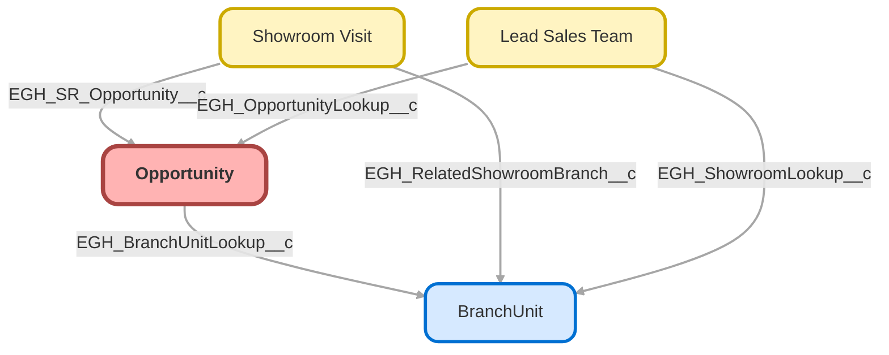

---
hide:
  - path
---

<!-- This file is auto-generated. if you do not want it to be overwritten, set TRUE in the line below -->
<!-- DO_NOT_OVERWRITE_DOC=FALSE -->

## Schema

<!-- Object description -->

## Fields

| Name      | Label | Type | Description |
| :-------- | :---- | :--: | :---------- | 
| AccountId |  | Lookup | undefined |
| Amount |  |  | undefined |
| CampaignId |  | Lookup | undefined |
| CloseDate |  |  | undefined |
| ContractId |  | Lookup | undefined |
| Description |  |  | undefined |
| EGH_Branch_Name__c | Branch Name | Text | undefined |
| EGH_BranchUnitLookup__c | Preferred Branch | Lookup | undefined |
| EGH_Brand__c | Brand | Picklist | undefined |
| EGH_CRMExternalId__c | CRM External ID | Text | undefined |
| EGH_How_soon__c | How soon is the customer planning to buy | Picklist | undefined |
| EGH_IsReportingManager__c | EGH IsReportingManager | Checkbox | undefined |
| EGH_Nationality__c | Nationality | Picklist | undefined |
| EGH_Opportunity_CRM_External_ID__c | Opportunity CRM External ID | Text | undefined |
| EGH_OpportunityDescFormula__c | Opportunity Desc | Text | Summary of the Opportunity |
| EGH_OpportunityOwner__c | Opportunity Owner | Text | undefined |
| EGH_OpportunityScore__c | EGH Opportunity Score | Picklist | undefined |
| EGH_Payment_type__c | Payment type | Picklist | undefined |
| EGH_Source_of_Business__c | Source of Business | Picklist | undefined |
| ExpectedRevenue |  |  | undefined |
| IqScore |  |  | undefined |
| IsExcludedFromTerritory2Filter |  |  | undefined |
| IsPrivate |  |  | undefined |
| LeadSource |  | Picklist | undefined |
| Name |  |  | undefined |
| NextStep |  |  | undefined |
| Opportunity_Lost_Reason__c | Opportunity Lost Reason | Picklist | EGH Field for opportunity lost reason |
| OwnerId |  | Lookup | undefined |
| Pricebook2Id |  | Lookup | undefined |
| Probability |  |  | undefined |
| Sales_Representative__c | Sales Representative | Text | undefined |
| SourceId |  | Lookup | undefined |
| StageName |  | Picklist | undefined |
| SyncedQuoteId |  | Lookup | undefined |
| Territory2Id |  | Lookup | undefined |
| TotalOpportunityQuantity |  |  | undefined |
| Type |  | Picklist | undefined |

## Validation Rules

| Rule      | Active | Description | Formula |
| :-------- | :---- | :---------- | :------ |
| EGH_OpportunityLossReasonRule | Yes | Ensure a users enters a lost reason when marking the opportunity as closed lost. | AND(   ISPICKVAL(StageName, "Closed Lost"),   ISBLANK(TEXT(Opportunity_Lost_Reason__c)) ) |
| EGH_Prevent_Closed_Lost_Edit | Yes | Prevents editing of Opportunities when the Stage is Closed Lost. This ensures data integrity for closed lost opportunities. | ISPICKVAL(PRIORVALUE(StageName),'Closed Lost') |
| EGH_PreventOppOwnerChangeForTestDrive | Yes | Prevents users with the roles Test Drive Admin/ Coordinator, and Manager from changing the Opportunity Owner. | AND( OR( CONTAINS($UserRole.DeveloperName,'EGH_TestDriveAdminRole'), CONTAINS($UserRole.DeveloperName,'EGH_TestDriveCoordinatorRole') ),  ISCHANGED(OwnerId)   ) |
| EGH_PreventOppStageChangeForTestDrive | Yes | Prevents users with the roles Test Drive Admin/ Coordinator, and Manager from changing the Opportunity Stage. | AND( OR( CONTAINS($UserRole.DeveloperName,'EGH_TestDriveAdminRole'), CONTAINS($UserRole.DeveloperName,'EGH_TestDriveCoordinatorRole') ),  ISCHANGED(StageName)   ) |

## Related Flows

| Object | Name      | Type | Description |
| :----  | :-------- | :--: | :---------- | 
| 💻 | [EGH_Lead_Owner_information](../flows/EGH_Lead_Owner_information.md) |  Screen Flow | <!-- --> |
| 💻 | [EGH_MeetGreetTestFlow](../flows/EGH_MeetGreetTestFlow.md) |  Screen Flow | Test Flow for Meet&Greet Application. To use in discussion with Irshad |
| 💻 | [EGH_Product_Genius](../flows/EGH_Product_Genius.md) |  Screen Flow | Flow for Product Genius Application |
| EGH_ShowroomVisit__c | [EGH_LeadAndVisitShowroomAssignmentFlow](../flows/EGH_LeadAndVisitShowroomAssignmentFlow.md) |  Record After Save | Flow to assign a Lead to the appropriate Sales Consultant or the Team Leader based on Skills, Presence Status and previously assign Sales Consultant. Check if the purpose of the visit is Meet F&I Team. |
| Opportunity | [EGH_Opportunity_Add_Sales_Consultant_to_Lead_Sales_Team](../flows/EGH_Opportunity_Add_Sales_Consultant_to_Lead_Sales_Team.md) |  Record After Save | <!-- --> |
| Opportunity | [EGH_Opportunity_Follow_up_Tasks_Creation_Scheduled_Flow](../flows/EGH_Opportunity_Follow_up_Tasks_Creation_Scheduled_Flow.md) |  Scheduled | <!-- --> |
| Opportunity | [EGH_Update_External_ID_On_Opportunity](../flows/EGH_Update_External_ID_On_Opportunity.md) |  Record After Save | <!-- --> |

## Related Apex Classes

| Apex Class | Type |
| :----      | :--: | 
| [EGHResourceTimelineController](../apex/EGHResourceTimelineController.md) | Lightning Controller |
| [EGHResourceTimelineControllerTest](../apex/EGHResourceTimelineControllerTest.md) | Test |
| [EGH_BookAppointmentRest](../apex/EGH_BookAppointmentRest.md) | REST |
| [EGH_MeetGreetSearchControllerClass](../apex/EGH_MeetGreetSearchControllerClass.md) | Invocable |
| [EGH_MeetGreetSearchControllerClass_Test](../apex/EGH_MeetGreetSearchControllerClass_Test.md) | Test |
| [EGH_OpportunityScoringController](../apex/EGH_OpportunityScoringController.md) | Lightning Controller |
| [EGH_OpportunityScoringControllerTest](../apex/EGH_OpportunityScoringControllerTest.md) | Test |
| [EGH_RestTests](../apex/EGH_RestTests.md) | Test |
| [EGH_TestDriveSlotFinder](../apex/EGH_TestDriveSlotFinder.md) | Lightning Controller |
| [EGH_TestDriveSlotFinder_Test](../apex/EGH_TestDriveSlotFinder_Test.md) | Test |

## Related Lightning Pages

| Lightning Page | Type |
| :----      | :--: | 
| [EGH_AppraisalLightningPage](../pages/EGH_AppraisalLightningPage.md) |  Record Page |
| [EGH_FleetAccountLightningPage](../pages/EGH_FleetAccountLightningPage.md) |  Record Page |
| [EGH_OpportunityLightningPage](../pages/EGH_OpportunityLightningPage.md) |  Record Page |
| [EGH_Read_Only_Opportunity_Page](../pages/EGH_Read_Only_Opportunity_Page.md) |  Record Page |
| [Interaction](../pages/Interaction.md) |  Record Page |

## Related Profiles

| Profile | User License |
| :----      | :--: | 
| [Admin](../profiles/Admin.md) |  Salesforce |
| [EGH Minimum Access Profile](../profiles/EGH%20Minimum%20Access%20Profile.md) |  Salesforce |
| [EGH Sales Profile](../profiles/EGH%20Sales%20Profile.md) |  Salesforce |
| [EGH Service Profile](../profiles/EGH%20Service%20Profile.md) |  Salesforce |

## Related Permission Sets

| Permission Set | User License |
| :----      | :--: | 
| [EGH_Apex_Classes](../permissionsets/EGH_Apex_Classes.md) | None |
| [EGH_Contact_Center_PS](../permissionsets/EGH_Contact_Center_PS.md) | None |
| [EGH_Core_Integration_Permission_Set](../permissionsets/EGH_Core_Integration_Permission_Set.md) | None |
| [EGH_Core_Permission](../permissionsets/EGH_Core_Permission.md) | None |
| [EGH_Digital_Sales_Consultant_Omni_Channel](../permissionsets/EGH_Digital_Sales_Consultant_Omni_Channel.md) | None |
| [EGH_Fleet_Consultant](../permissionsets/EGH_Fleet_Consultant.md) | None |
| [EGH_Lease_Consultant](../permissionsets/EGH_Lease_Consultant.md) | None |
| [EGH_Meet_and_Greet_Application](../permissionsets/EGH_Meet_and_Greet_Application.md) | None |
| [EGH_Product_Genius_Admin](../permissionsets/EGH_Product_Genius_Admin.md) | None |
| [EGH_Product_Genius](../permissionsets/EGH_Product_Genius.md) | None |
| [EGH_QA_and_Data_Analyst_PS](../permissionsets/EGH_QA_and_Data_Analyst_PS.md) | None |
| [EGH_Sales_Consultant_Omni_Channel](../permissionsets/EGH_Sales_Consultant_Omni_Channel.md) | None |
| [EGH_Sales_Team_Leader_PS](../permissionsets/EGH_Sales_Team_Leader_PS.md) | None |
| [EGH_Service_Consultants_PS](../permissionsets/EGH_Service_Consultants_PS.md) | None |
| [EGH_Service_Team_Leader_PS](../permissionsets/EGH_Service_Team_Leader_PS.md) | None |
| [EGH_SystemAdminPermissionSet](../permissionsets/EGH_SystemAdminPermissionSet.md) | None |
| [EGH_Test_Drive_Admin](../permissionsets/EGH_Test_Drive_Admin.md) | None |
| [EGH_Test_Drive_Team](../permissionsets/EGH_Test_Drive_Team.md) | None |

_Documentation generated with [sfdx-hardis](https://sfdx-hardis.cloudity.com), by [Cloudity](https://www.cloudity.com/) & [friends](https://github.com/hardisgroupcom/sfdx-hardis/graphs/contributors)_
