---
hide:
  - path
---

<!-- This file is auto-generated. if you do not want it to be overwritten, set TRUE in the line below -->
<!-- DO_NOT_OVERWRITE_DOC=FALSE -->

## Schema

```mermaid
graph TD
Order["Order"]:::mainObject
click Order "/objects/Order/"


classDef object fill:#D6E9FF,stroke:#0070D2,stroke-width:3px,rx:12px,ry:12px,shadow:drop,color:#333;
classDef customObject fill:#FFF4C2,stroke:#CCAA00,stroke-width:3px,rx:12px,ry:12px,shadow:drop,color:#333;
classDef customObjectManaged fill:#FFD8B2,stroke:#CC5500,stroke-width:3px,rx:12px,ry:12px,shadow:drop,color:#333;
classDef mainObject fill:#FFB3B3,stroke:#A94442,stroke-width:4px,rx:14px,ry:14px,shadow:drop,color:#333,font-weight:bold;

```

<!-- Object description -->

## Fields

| Name      | Label | Type | Description |
| :-------- | :---- | :--: | :---------- | 
| AccountId |  | Lookup | undefined |
| AccountNumber |  |  | undefined |
| ActivatedById |  | Lookup | undefined |
| ActivatedDate |  |  | undefined |
| BillingAddress |  |  | undefined |
| BillToContactId |  | Lookup | undefined |
| CompanyAuthorizedById |  | Lookup | undefined |
| CompanyAuthorizedDate |  |  | undefined |
| ContractEndDate |  |  | undefined |
| ContractId |  | Lookup | undefined |
| ContractName |  |  | undefined |
| CustomerAuthorizedById |  | Lookup | undefined |
| CustomerAuthorizedDate |  |  | undefined |
| Description |  |  | undefined |
| EffectiveDate |  |  | undefined |
| EndDate |  |  | undefined |
| IsReductionOrder |  |  | undefined |
| Name |  |  | undefined |
| OpportunityId |  | Lookup | undefined |
| OrderReferenceNumber |  |  | undefined |
| OriginalOrderId |  | Lookup | undefined |
| OwnerId |  | Lookup | undefined |
| PoDate |  |  | undefined |
| PoNumber |  |  | undefined |
| Pricebook2Id |  | Lookup | undefined |
| QuoteId |  | Lookup | undefined |
| SalesAgreementId |  | Lookup | undefined |
| ShippingAddress |  |  | undefined |
| ShipToContactId |  | Lookup | undefined |
| Status |  | Picklist | undefined |
| TotalAmount |  |  | undefined |
| Type |  | Picklist | undefined |

## Related Apex Classes

| Apex Class | Type |
| :----      | :--: | 
| [EGHResourceTimelineControllerTest](../apex/EGHResourceTimelineControllerTest.md) | Test |
| [EGH_AssignedResourceInspectTriggerTest](../apex/EGH_AssignedResourceInspectTriggerTest.md) | Test |
| [eghChecklistManagerController](../apex/eghChecklistManagerController.md) | Lightning Controller |
| [eghChecklistManagerControllerTest](../apex/eghChecklistManagerControllerTest.md) | Test |
| [ers_DatatableControllerTest](../apex/ers_DatatableControllerTest.md) | Test |

## Related Lightning Pages

| Lightning Page | Type |
| :----      | :--: | 
| [EGH_AppraisalLightningPage](../pages/EGH_AppraisalLightningPage.md) |  Record Page |
| [EGH_FleetAccountLightningPage](../pages/EGH_FleetAccountLightningPage.md) |  Record Page |
| [EGH_LeadLightningPage](../pages/EGH_LeadLightningPage.md) |  Record Page |
| [EGH_PersonAccountLightningPage](../pages/EGH_PersonAccountLightningPage.md) |  Record Page |
| [EGH_Service_Appointment_Lightning_Page](../pages/EGH_Service_Appointment_Lightning_Page.md) |  Record Page |
| [EGH_Service_Appointment_SystemAdmin](../pages/EGH_Service_Appointment_SystemAdmin.md) |  Record Page |

## Related Profiles

| Profile | User License |
| :----      | :--: | 
| [Admin](../profiles/Admin.md) |  Salesforce |
| [EGH Minimum Access Profile](../profiles/EGH%20Minimum%20Access%20Profile.md) |  Salesforce |
| [EGH Sales Profile](../profiles/EGH%20Sales%20Profile.md) |  Salesforce |
| [EGH Service Profile](../profiles/EGH%20Service%20Profile.md) |  Salesforce |

## Related Permission Sets

| Permission Set | User License |
| :----      | :--: | 
| [EGH_Core_Integration_Permission_Set](../permissionsets/EGH_Core_Integration_Permission_Set.md) | None |
| [EGH_Core_Permission](../permissionsets/EGH_Core_Permission.md) | None |
| [EGH_FeedbackManagementAdvancedPermissionSet](../permissionsets/EGH_FeedbackManagementAdvancedPermissionSet.md) | None |
| [EGH_SystemAdminPermissionSet](../permissionsets/EGH_SystemAdminPermissionSet.md) | None |

_Documentation generated with [sfdx-hardis](https://sfdx-hardis.cloudity.com), by [Cloudity](https://www.cloudity.com/) & [friends](https://github.com/hardisgroupcom/sfdx-hardis/graphs/contributors)_
