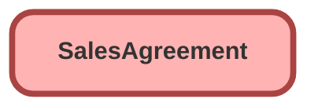

---
hide:
  - path
---

<!-- This file is auto-generated. if you do not want it to be overwritten, set TRUE in the line below -->
<!-- DO_NOT_OVERWRITE_DOC=FALSE -->

## Schema

<!-- Object description -->

## Fields

| Name      | Label | Type | Description |
| :-------- | :---- | :--: | :---------- | 
| AccountId |  | Lookup | undefined |
| ActivatedDate |  |  | undefined |
| ActualMarginPercentage |  |  | undefined |
| ActualsCalculationMode |  |  | undefined |
| AgreementType |  |  | undefined |
| ApprovedById |  | Lookup | undefined |
| ApprovedDate |  |  | undefined |
| ArePredfndStatusValOveride |  |  | undefined |
| CancellationDate |  |  | undefined |
| CancellationReason |  | Picklist | undefined |
| ClonedFromAgreementId |  | Lookup | undefined |
| ContactId |  | Lookup | undefined |
| DecimalScale |  |  | undefined |
| Description |  |  | undefined |
| EndDate |  |  | undefined |
| FutureActCalcSchedules |  |  | undefined |
| Name |  |  | undefined |
| OwnerId |  | Lookup | undefined |
| PlannedMarginPercentage |  |  | undefined |
| PricebookId |  | Lookup | undefined |
| ProductLevel |  |  | undefined |
| ReferenceFieldId |  | Lookup | undefined |
| RenewedFromAgreementId |  | Lookup | undefined |
| RenewedToAgreementId |  | Lookup | undefined |
| ScheduleCount |  |  | undefined |
| ScheduleFrequency |  |  | undefined |
| ShouldUserSpecPlnQuantity |  |  | undefined |
| StartDate |  |  | undefined |
| Status |  | Picklist | undefined |
| StatusCode |  |  | undefined |
| TotalActualAgreementAmount |  |  | undefined |
| TotalActualCostAmount |  |  | undefined |
| TotalActualMarginAmount |  |  | undefined |
| TotalAgreementAmount |  |  | undefined |
| TotalPlannedCostAmount |  |  | undefined |
| TotalPlannedMarginAmount |  |  | undefined |
| TotalProposedAgreementAmount |  |  | undefined |

## Related Profiles

| Profile | User License |
| :----      | :--: | 
| [Admin](../profiles/Admin.md) |  Salesforce |

## Related Permission Sets

| Permission Set | User License |
| :----      | :--: | 
| [EGH_SystemAdminPermissionSet](../permissionsets/EGH_SystemAdminPermissionSet.md) | None |

_Documentation generated with [sfdx-hardis](https://sfdx-hardis.cloudity.com), by [Cloudity](https://www.cloudity.com/) & [friends](https://github.com/hardisgroupcom/sfdx-hardis/graphs/contributors)_
