---
hide:
  - path
---

<!-- This file is auto-generated. if you do not want it to be overwritten, set TRUE in the line below -->
<!-- DO_NOT_OVERWRITE_DOC=FALSE -->

## Schema

```mermaid
graph TD
TimeSlot["TimeSlot"]:::mainObject
click TimeSlot "/objects/TimeSlot/"


classDef object fill:#D6E9FF,stroke:#0070D2,stroke-width:3px,rx:12px,ry:12px,shadow:drop,color:#333;
classDef customObject fill:#FFF4C2,stroke:#CCAA00,stroke-width:3px,rx:12px,ry:12px,shadow:drop,color:#333;
classDef customObjectManaged fill:#FFD8B2,stroke:#CC5500,stroke-width:3px,rx:12px,ry:12px,shadow:drop,color:#333;
classDef mainObject fill:#FFB3B3,stroke:#A94442,stroke-width:4px,rx:14px,ry:14px,shadow:drop,color:#333,font-weight:bold;

```

<!-- Object description -->

## Fields

| Name      | Label | Type | Description |
| :-------- | :---- | :--: | :---------- | 
| DayOfWeek |  |  | undefined |
| EndTime |  |  | undefined |
| MaxAppointments |  |  | undefined |
| OperatingHoursId |  | MasterDetail | undefined |
| StartTime |  |  | undefined |
| TimeSlotNumber |  |  | undefined |
| Type |  |  | undefined |
| WorkTypeGroupId |  | Lookup | undefined |

## Related Apex Classes

| Apex Class | Type |
| :----      | :--: | 
| [EGH_AssignedResourceInspectTriggerTest](../apex/EGH_AssignedResourceInspectTriggerTest.md) | Test |
| [EGH_GetSlotsRest](../apex/EGH_GetSlotsRest.md) | REST |
| [EGH_TestDriveSlotFinder](../apex/EGH_TestDriveSlotFinder.md) | Lightning Controller |
| [EGH_TestDriveSlotFinder_Test](../apex/EGH_TestDriveSlotFinder_Test.md) | Test |

## Related Profiles

| Profile | User License |
| :----      | :--: | 
| [Admin](../profiles/Admin.md) |  Salesforce |
| [EGH Minimum Access Profile](../profiles/EGH%20Minimum%20Access%20Profile.md) |  Salesforce |
| [EGH Sales Profile](../profiles/EGH%20Sales%20Profile.md) |  Salesforce |
| [EGH Service Profile](../profiles/EGH%20Service%20Profile.md) |  Salesforce |

## Related Permission Sets

| Permission Set | User License |
| :----      | :--: | 
| [Badge_Object_Access](../permissionsets/Badge_Object_Access.md) | None |
| [EGH_Apex_Classes](../permissionsets/EGH_Apex_Classes.md) | None |
| [EGH_BypassFlowsPermissionSet](../permissionsets/EGH_BypassFlowsPermissionSet.md) | None |
| [EGH_Digital_Sales_Consultant_Omni_Channel](../permissionsets/EGH_Digital_Sales_Consultant_Omni_Channel.md) | None |
| [EGH_F_I_OmniChannel](../permissionsets/EGH_F_I_OmniChannel.md) | None |
| [EGH_FeedbackManagementAdvancedPermissionSet](../permissionsets/EGH_FeedbackManagementAdvancedPermissionSet.md) | None |
| [EGH_FilesConnectPermissionSet](../permissionsets/EGH_FilesConnectPermissionSet.md) | None |
| [EGH_Knowledge_Admin](../permissionsets/EGH_Knowledge_Admin.md) | None |
| [EGH_ModifyServiceAppointmentsPermissionSet](../permissionsets/EGH_ModifyServiceAppointmentsPermissionSet.md) | None |
| [EGH_Product_Genius_Admin](../permissionsets/EGH_Product_Genius_Admin.md) | None |
| [EGH_SalesforceSchedulerResourcesPermissionSet](../permissionsets/EGH_SalesforceSchedulerResourcesPermissionSet.md) | None |
| [EGH_SystemAdminPermissionSet](../permissionsets/EGH_SystemAdminPermissionSet.md) | None |
| [EGH_Test_Drive_Team](../permissionsets/EGH_Test_Drive_Team.md) | None |
| [Lightning_Experience_User](../permissionsets/Lightning_Experience_User.md) | None |
| [PS_Genesys_Experience_Permission](../permissionsets/PS_Genesys_Experience_Permission.md) | None |
| [PS_Genesys_Integration](../permissionsets/PS_Genesys_Integration.md) | None |
| [PS_Genesys_Presences](../permissionsets/PS_Genesys_Presences.md) | None |
| [Salesforce_Feedback_Management_Starter](../permissionsets/Salesforce_Feedback_Management_Starter.md) | None |
| [sf_devops_InitializeEnvironments](../permissionsets/sf_devops_InitializeEnvironments.md) | None |
| [sf_devops_NamedCredentials](../permissionsets/sf_devops_NamedCredentials.md) | None |
| [Test](../permissionsets/Test.md) | None |
| [Trailhead](../permissionsets/Trailhead.md) | None |

_Documentation generated with [sfdx-hardis](https://sfdx-hardis.cloudity.com), by [Cloudity](https://www.cloudity.com/) & [friends](https://github.com/hardisgroupcom/sfdx-hardis/graphs/contributors)_
