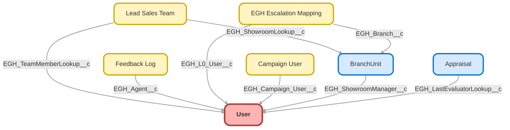

---
hide:
  - path
---

<!-- This file is auto-generated. if you do not want it to be overwritten, set TRUE in the line below -->
<!-- DO_NOT_OVERWRITE_DOC=FALSE -->

## Schema

<!-- Object description -->

## Fields

| Name      | Label | Type | Description |
| :-------- | :---- | :--: | :---------- | 
| AboutMe |  |  | undefined |
| Address |  |  | undefined |
| Alias |  |  | undefined |
| CallCenterId |  | Lookup | undefined |
| CommunityNickname |  |  | undefined |
| CompanyName |  |  | undefined |
| ContactId |  | Lookup | undefined |
| DefaultGroupNotificationFrequency |  |  | undefined |
| DelegatedApproverId |  | Lookup | undefined |
| Department |  |  | undefined |
| dfsle__CanManageAccount__c | Can Manage DocuSign Account | Checkbox | Can Manage DocuSign Account |
| dfsle__Provisioned__c | DocuSign Provisioned Date | Date | Date when the user was added to the account |
| dfsle__Status__c | Docusign Status | Picklist | undefined |
| dfsle__Username__c | DocuSign Username | Text | DocuSign Username |
| DigestFrequency |  |  | undefined |
| Division |  |  | undefined |
| Email |  |  | undefined |
| EmailEncodingKey |  |  | undefined |
| EmployeeNumber |  |  | undefined |
| EndDay |  |  | undefined |
| Extension |  |  | undefined |
| Fax |  |  | undefined |
| FederationIdentifier |  |  | undefined |
| ForecastEnabled |  |  | undefined |
| IndividualId |  | Lookup | undefined |
| IsActive |  |  | undefined |
| IsSystemControlled |  |  | undefined |
| LanguageLocaleKey |  |  | undefined |
| LocaleSidKey |  |  | undefined |
| ManagerId |  | Hierarchy | undefined |
| MobilePhone |  |  | undefined |
| Name |  |  | undefined |
| Phone |  |  | undefined |
| ProfileId |  | Lookup | undefined |
| ReceivesAdminInfoEmails |  |  | undefined |
| ReceivesInfoEmails |  |  | undefined |
| SenderEmail |  |  | undefined |
| SenderName |  |  | undefined |
| sf_devops__Bitbucket_Primary_Email_Address__c | Bitbucket Primary Email Address | Email | The primary email address used to configure git when we are connecting to a Bitbucket Repository |
| sf_devops__GitHub_Primary_Email_Address__c | GitHub Primary Email Address | Email | The primary email address used to configure git when we are connecting to a GitHub Repository |
| Signature |  |  | undefined |
| StartDay |  |  | undefined |
| StayInTouchNote |  |  | undefined |
| StayInTouchSignature |  |  | undefined |
| StayInTouchSubject |  |  | undefined |
| TimeZoneSidKey |  |  | undefined |
| Title |  |  | undefined |
| Username |  |  | undefined |
| UserRoleId |  | Lookup | undefined |
| UserSubtype |  |  | undefined |
| WorkspaceId |  | Lookup | undefined |

## Related Flows

| Object | Name      | Type | Description |
| :----  | :-------- | :--: | :---------- | 
| 💻 | [Datatable_Configuration_Wizard5](../flows/Datatable_Configuration_Wizard5.md) |  Screen Flow | Flow designed to run inside of the datatable CPE to select and set component attributes by interacting with a sample datatable. |
| 💻 | [EGH_Case_Action_Notification_After_4_Hour](../flows/EGH_Case_Action_Notification_After_4_Hour.md) |  Auto Launched Flow | <!-- --> |
| 💻 | [EGH_Case_Notification_After_5_Hour](../flows/EGH_Case_Notification_After_5_Hour.md) |  Auto Launched Flow | <!-- --> |
| 💻 | [EGH_Collect_Emails_For_Escalation_Flow](../flows/EGH_Collect_Emails_For_Escalation_Flow.md) |  Auto Launched Flow | <!-- --> |
| 💻 | [EGH_Create_Internal_Escalation_Case](../flows/EGH_Create_Internal_Escalation_Case.md) |  Screen Flow | <!-- --> |
| 💻 | [EGH_Lead_Owner_information](../flows/EGH_Lead_Owner_information.md) |  Screen Flow | <!-- --> |
| AgentWork | [EGH_Create_Lead_Sales_Team](../flows/EGH_Create_Lead_Sales_Team.md) |  Record After Save | <!-- --> |
| ServiceAppointment | [EGH_Update_Time_In_Description](../flows/EGH_Update_Time_In_Description.md) |  Record After Save | This flow is triggered when the Service Appointment’s Arrival Window Start or End time is changed. It uses an Apex action to format the date and time in the user’s timezone, then updates the Description field with the Date, Time, and Timezone in the correct format. |

## Related Apex Classes

| Apex Class | Type |
| :----      | :--: | 
| [CommunitiesSelfRegController](../apex/CommunitiesSelfRegController.md) | Visualforce Controller |
| [CommunitiesSelfRegControllerTest](../apex/CommunitiesSelfRegControllerTest.md) | Test (See All Data) |
| [EGHResourceTimelineController](../apex/EGHResourceTimelineController.md) | Lightning Controller |
| [EGHResourceTimelineControllerTest](../apex/EGHResourceTimelineControllerTest.md) | Test |
| [EGHTestDriveTimelineController](../apex/EGHTestDriveTimelineController.md) | Lightning Controller |
| [EGHTestDriveTimelineControllerTest](../apex/EGHTestDriveTimelineControllerTest.md) | Test |
| [EGH_AppraisalAdjustmentTriggerHandler](../apex/EGH_AppraisalAdjustmentTriggerHandler.md) | Trigger Handler |
| [EGH_AppraisalAdjustmentTriggerTest](../apex/EGH_AppraisalAdjustmentTriggerTest.md) | Test |
| [EGH_AppraisalTriggerHandler](../apex/EGH_AppraisalTriggerHandler.md) | Trigger Handler |
| [EGH_AssignedResourceInspectTriggerTest](../apex/EGH_AssignedResourceInspectTriggerTest.md) | Test |
| [EGH_AssignedResourceTriggerTest](../apex/EGH_AssignedResourceTriggerTest.md) | Test |
| [EGH_CheckCapacityForVisitRouting](../apex/EGH_CheckCapacityForVisitRouting.md) | Invocable |
| [EGH_CheckCapacityForVisitRoutingTest](../apex/EGH_CheckCapacityForVisitRoutingTest.md) | Test (See All Data) |
| [EGH_FormatServiceAppointmentTime](../apex/EGH_FormatServiceAppointmentTime.md) | Invocable |
| [EGH_FormatServiceAppointmentTime_Test](../apex/EGH_FormatServiceAppointmentTime_Test.md) | Test |
| [EGH_RestTests](../apex/EGH_RestTests.md) | Test |
| [EGH_TeamLeaderControllerClass](../apex/EGH_TeamLeaderControllerClass.md) | Invocable |
| [EGH_TeamLeaderControllerClassTest](../apex/EGH_TeamLeaderControllerClassTest.md) | Test |
| [EGH_TestDriveSlotFinder](../apex/EGH_TestDriveSlotFinder.md) | Lightning Controller |
| [EGH_TestDriveSlotFinder_Test](../apex/EGH_TestDriveSlotFinder_Test.md) | Test |
| [MicrobatchSelfRegController](../apex/MicrobatchSelfRegController.md) | Visualforce Controller |
| [MicrobatchSelfRegControllerTest](../apex/MicrobatchSelfRegControllerTest.md) | Test (See All Data) |
| [MyProfilePageController](../apex/MyProfilePageController.md) | Visualforce Controller |
| [MyProfilePageControllerTest](../apex/MyProfilePageControllerTest.md) | Test (See All Data) |
| [SiteRegisterController](../apex/SiteRegisterController.md) | Visualforce Controller |
| [SiteRegisterControllerTest](../apex/SiteRegisterControllerTest.md) | Test (See All Data) |
| [eghChecklistManagerControllerTest](../apex/eghChecklistManagerControllerTest.md) | Test |
| [ers_DatatableController](../apex/ers_DatatableController.md) | Lightning Controller |

## Related Lightning Pages

| Lightning Page | Type |
| :----      | :--: | 
| [EGH_Campaign_User](../pages/EGH_Campaign_User.md) |  Record Page |
| [EGH_LeadLightningPage](../pages/EGH_LeadLightningPage.md) |  Record Page |
| [EGH_OpportunityLightningPage](../pages/EGH_OpportunityLightningPage.md) |  Record Page |
| [EGH_Service_Appointment_Lightning_Page](../pages/EGH_Service_Appointment_Lightning_Page.md) |  Record Page |

## Related Profiles

| Profile | User License |
| :----      | :--: | 
| [Admin](../profiles/Admin.md) |  Salesforce |
| [EGH Minimum Access Profile](../profiles/EGH%20Minimum%20Access%20Profile.md) |  Salesforce |
| [EGH Sales Profile](../profiles/EGH%20Sales%20Profile.md) |  Salesforce |
| [EGH Service Profile](../profiles/EGH%20Service%20Profile.md) |  Salesforce |

## Related Permission Sets

| Permission Set | User License |
| :----      | :--: | 
| [EGH_Contact_Center_PS](../permissionsets/EGH_Contact_Center_PS.md) | None |
| [EGH_Core_Integration_Permission_Set](../permissionsets/EGH_Core_Integration_Permission_Set.md) | None |
| [EGH_Core_Permission](../permissionsets/EGH_Core_Permission.md) | None |
| [EGH_Digital_Sales_Consultant_Omni_Channel](../permissionsets/EGH_Digital_Sales_Consultant_Omni_Channel.md) | None |
| [EGH_FilesConnectPermissionSet](../permissionsets/EGH_FilesConnectPermissionSet.md) | None |
| [EGH_Fleet_Consultant](../permissionsets/EGH_Fleet_Consultant.md) | None |
| [EGH_Lease_Consultant](../permissionsets/EGH_Lease_Consultant.md) | None |
| [EGH_Meet_and_Greet_Application](../permissionsets/EGH_Meet_and_Greet_Application.md) | None |
| [EGH_Product_Genius_Admin](../permissionsets/EGH_Product_Genius_Admin.md) | None |
| [EGH_Product_Genius](../permissionsets/EGH_Product_Genius.md) | None |
| [EGH_QA_and_Data_Analyst_PS](../permissionsets/EGH_QA_and_Data_Analyst_PS.md) | None |
| [EGH_Sales_Consultant_Omni_Channel](../permissionsets/EGH_Sales_Consultant_Omni_Channel.md) | None |
| [EGH_SalesforceSchedulerResourcesPermissionSet](../permissionsets/EGH_SalesforceSchedulerResourcesPermissionSet.md) | None |
| [EGH_Service_Consultants_PS](../permissionsets/EGH_Service_Consultants_PS.md) | None |
| [EGH_Service_Team_Leader_PS](../permissionsets/EGH_Service_Team_Leader_PS.md) | None |
| [EGH_SystemAdminPermissionSet](../permissionsets/EGH_SystemAdminPermissionSet.md) | None |
| [Lightning_Experience_User](../permissionsets/Lightning_Experience_User.md) | None |
| [PS_Genesys_Permissions](../permissionsets/PS_Genesys_Permissions.md) | None |

_Documentation generated with [sfdx-hardis](https://sfdx-hardis.cloudity.com), by [Cloudity](https://www.cloudity.com/) & [friends](https://github.com/hardisgroupcom/sfdx-hardis/graphs/contributors)_
