---
hide:
  - path
---

<!-- This file is auto-generated. if you do not want it to be overwritten, set TRUE in the line below -->
<!-- DO_NOT_OVERWRITE_DOC=FALSE -->

## Schema

```mermaid
graph TD
VehicleDefinition["VehicleDefinition"]:::mainObject
click VehicleDefinition "/objects/VehicleDefinition/"


classDef object fill:#D6E9FF,stroke:#0070D2,stroke-width:3px,rx:12px,ry:12px,shadow:drop,color:#333;
classDef customObject fill:#FFF4C2,stroke:#CCAA00,stroke-width:3px,rx:12px,ry:12px,shadow:drop,color:#333;
classDef customObjectManaged fill:#FFD8B2,stroke:#CC5500,stroke-width:3px,rx:12px,ry:12px,shadow:drop,color:#333;
classDef mainObject fill:#FFB3B3,stroke:#A94442,stroke-width:4px,rx:14px,ry:14px,shadow:drop,color:#333,font-weight:bold;

```

<!-- Object description -->

## Fields

| Name      | Label | Type | Description |
| :-------- | :---- | :--: | :---------- | 
| AccelerationTime |  |  | undefined |
| AuxiliaryBatteryType |  |  | undefined |
| BatteryCapacity |  |  | undefined |
| BodyType |  |  | undefined |
| CombinedFuelEconomy |  |  | undefined |
| CurbWeight |  |  | undefined |
| DoorCount |  |  | undefined |
| DoorStyle |  | Picklist | undefined |
| DoorStyleType |  |  | undefined |
| DrivetrainSystem |  | Picklist | undefined |
| DrivetrainType |  |  | undefined |
| EmissionStandard |  |  | undefined |
| EngineCubicCapacity |  |  | undefined |
| EngineName |  |  | undefined |
| ExtraUrbanFuelEconomy |  |  | undefined |
| FuelSource |  | Picklist | undefined |
| FuelTankCapacity |  |  | undefined |
| FuelType |  |  | undefined |
| GeoCountryId |  | Lookup | undefined |
| Height |  |  | undefined |
| Length |  |  | undefined |
| MainBatteryType |  |  | undefined |
| MaximumBatteryRange |  |  | undefined |
| MaximumGrossWeight |  |  | undefined |
| MaximumTorque |  |  | undefined |
| MinimumBatteryRange |  |  | undefined |
| ModelCode |  |  | undefined |
| Name |  |  | undefined |
| ProductId |  | Lookup | undefined |
| TopSpeed |  |  | undefined |
| TotalPower |  |  | undefined |
| TransmissionSystem |  | Picklist | undefined |
| TransmissionType |  |  | undefined |
| UrbanFuelEconomy |  |  | undefined |
| VariantName |  |  | undefined |
| VehicleClass |  |  | undefined |
| Wheelbase |  |  | undefined |
| Width |  |  | undefined |

## Related Lightning Pages

| Lightning Page | Type |
| :----      | :--: | 
| [EGH_FleetAccountLightningPage](../pages/EGH_FleetAccountLightningPage.md) |  Record Page |
| [EGH_PersonAccountLightningPage](../pages/EGH_PersonAccountLightningPage.md) |  Record Page |

## Related Profiles

| Profile | User License |
| :----      | :--: | 
| [Admin](../profiles/Admin.md) |  Salesforce |
| [EGH Minimum Access Profile](../profiles/EGH%20Minimum%20Access%20Profile.md) |  Salesforce |
| [EGH Sales Profile](../profiles/EGH%20Sales%20Profile.md) |  Salesforce |
| [EGH Service Profile](../profiles/EGH%20Service%20Profile.md) |  Salesforce |

## Related Permission Sets

| Permission Set | User License |
| :----      | :--: | 
| [EGH_Core_Integration_Permission_Set](../permissionsets/EGH_Core_Integration_Permission_Set.md) | None |
| [EGH_QA_and_Data_Analyst_PS](../permissionsets/EGH_QA_and_Data_Analyst_PS.md) | None |
| [EGH_SystemAdminPermissionSet](../permissionsets/EGH_SystemAdminPermissionSet.md) | None |

_Documentation generated with [sfdx-hardis](https://sfdx-hardis.cloudity.com), by [Cloudity](https://www.cloudity.com/) & [friends](https://github.com/hardisgroupcom/sfdx-hardis/graphs/contributors)_
