---
hide:
  - path
---

<!-- This file is auto-generated. if you do not want it to be overwritten, set TRUE in the line below -->
<!-- DO_NOT_OVERWRITE_DOC=FALSE -->

## Schema

```mermaid
graph TD
Visit["Visit"]:::mainObject
click Visit "/objects/Visit/"


classDef object fill:#D6E9FF,stroke:#0070D2,stroke-width:3px,rx:12px,ry:12px,shadow:drop,color:#333;
classDef customObject fill:#FFF4C2,stroke:#CCAA00,stroke-width:3px,rx:12px,ry:12px,shadow:drop,color:#333;
classDef customObjectManaged fill:#FFD8B2,stroke:#CC5500,stroke-width:3px,rx:12px,ry:12px,shadow:drop,color:#333;
classDef mainObject fill:#FFB3B3,stroke:#A94442,stroke-width:4px,rx:14px,ry:14px,shadow:drop,color:#333,font-weight:bold;

```

<!-- Object description -->

## Fields

| Name      | Label | Type | Description |
| :-------- | :---- | :--: | :---------- | 
| AccountId |  | Lookup | undefined |
| ActualVisitEndTime |  |  | undefined |
| ActualVisitStartTime |  |  | undefined |
| AddressId |  | Lookup | undefined |
| ContactId |  | Lookup | undefined |
| ContextId |  | Lookup | undefined |
| InstructionDescription |  |  | undefined |
| LocationId |  | Lookup | undefined |
| OwnerId |  | Lookup | undefined |
| ParentVisitId |  | Lookup | undefined |
| PlaceId |  | Lookup | undefined |
| PlannedVisitEndTime |  |  | undefined |
| PlannedVisitStartTime |  |  | undefined |
| ServiceResourceId |  | Lookup | undefined |
| Status |  |  | undefined |
| StatusRemarks |  |  | undefined |
| UserId |  | Lookup | undefined |
| VisitorId |  | Lookup | undefined |
| VisitPriority |  | Picklist | undefined |
| VisitTypeId |  | Lookup | undefined |

## Related Apex Classes

| Apex Class | Type |
| :----      | :--: | 
| [EGHResourceTimelineController](../apex/EGHResourceTimelineController.md) | Lightning Controller |
| [EGHResourceTimelineControllerTest](../apex/EGHResourceTimelineControllerTest.md) | Test |
| [EGH_AppraisalAdjustmentTriggerHandler](../apex/EGH_AppraisalAdjustmentTriggerHandler.md) | Trigger Handler |
| [EGH_AppraisalTriggerHandler](../apex/EGH_AppraisalTriggerHandler.md) | Trigger Handler |
| [EGH_CheckCapacityForVisitRouting](../apex/EGH_CheckCapacityForVisitRouting.md) | Invocable |
| [EGH_CheckCapacityForVisitRoutingTest](../apex/EGH_CheckCapacityForVisitRoutingTest.md) | Test (See All Data) |
| [EGH_OpportunityScoringController](../apex/EGH_OpportunityScoringController.md) | Lightning Controller |
| [EGH_UpdateVisitStartEndTime](../apex/EGH_UpdateVisitStartEndTime.md) | Lightning Controller |
| [EGH_UpdateVisitStartEndTime_Test](../apex/EGH_UpdateVisitStartEndTime_Test.md) | Test |
| [EGH_UpdateVisitTimeAndStatus](../apex/EGH_UpdateVisitTimeAndStatus.md) | Lightning Controller |
| [EGH_getPresenceStatusIdClass](../apex/EGH_getPresenceStatusIdClass.md) | Lightning Controller |
| [EGH_getPresenceStatusIdClassTest](../apex/EGH_getPresenceStatusIdClassTest.md) | Test (See All Data) |

## Related Lightning Pages

| Lightning Page | Type |
| :----      | :--: | 
| [EGH_LeadLightningPage](../pages/EGH_LeadLightningPage.md) |  Record Page |
| [EGH_OpportunityLightningPage](../pages/EGH_OpportunityLightningPage.md) |  Record Page |
| [EGH_Showroom_Visit_Record_Page](../pages/EGH_Showroom_Visit_Record_Page.md) |  Record Page |

## Related Profiles

| Profile | User License |
| :----      | :--: | 
| [Admin](../profiles/Admin.md) |  Salesforce |
| [EGH Minimum Access Profile](../profiles/EGH%20Minimum%20Access%20Profile.md) |  Salesforce |
| [EGH Sales Profile](../profiles/EGH%20Sales%20Profile.md) |  Salesforce |
| [EGH Service Profile](../profiles/EGH%20Service%20Profile.md) |  Salesforce |

## Related Permission Sets

| Permission Set | User License |
| :----      | :--: | 
| [EGH_Apex_Classes](../permissionsets/EGH_Apex_Classes.md) | None |
| [EGH_Contact_Center_PS](../permissionsets/EGH_Contact_Center_PS.md) | None |
| [EGH_Core_Integration_Permission_Set](../permissionsets/EGH_Core_Integration_Permission_Set.md) | None |
| [EGH_Core_Permission](../permissionsets/EGH_Core_Permission.md) | None |
| [EGH_Digital_Sales_Consultant_Omni_Channel](../permissionsets/EGH_Digital_Sales_Consultant_Omni_Channel.md) | None |
| [EGH_F_I_OmniChannel](../permissionsets/EGH_F_I_OmniChannel.md) | None |
| [EGH_FeedbackManagementAdvancedPermissionSet](../permissionsets/EGH_FeedbackManagementAdvancedPermissionSet.md) | None |
| [EGH_Fleet_Consultant](../permissionsets/EGH_Fleet_Consultant.md) | None |
| [EGH_Knowledge_Admin](../permissionsets/EGH_Knowledge_Admin.md) | None |
| [EGH_Lease_Consultant](../permissionsets/EGH_Lease_Consultant.md) | None |
| [EGH_Meet_and_Greet_Application](../permissionsets/EGH_Meet_and_Greet_Application.md) | None |
| [EGH_ModifyServiceAppointmentsPermissionSet](../permissionsets/EGH_ModifyServiceAppointmentsPermissionSet.md) | None |
| [EGH_Product_Genius_Admin](../permissionsets/EGH_Product_Genius_Admin.md) | None |
| [EGH_Product_Genius](../permissionsets/EGH_Product_Genius.md) | None |
| [EGH_QA_and_Data_Analyst_PS](../permissionsets/EGH_QA_and_Data_Analyst_PS.md) | None |
| [EGH_Sales_Consultant_Omni_Channel](../permissionsets/EGH_Sales_Consultant_Omni_Channel.md) | None |
| [EGH_Sales_Team_Leader_PS](../permissionsets/EGH_Sales_Team_Leader_PS.md) | None |
| [EGH_Service_Consultants_PS](../permissionsets/EGH_Service_Consultants_PS.md) | None |
| [EGH_Service_Team_Leader_PS](../permissionsets/EGH_Service_Team_Leader_PS.md) | None |
| [EGH_SystemAdminPermissionSet](../permissionsets/EGH_SystemAdminPermissionSet.md) | None |
| [EGH_Test_Drive_Admin](../permissionsets/EGH_Test_Drive_Admin.md) | None |
| [EGH_Test_Drive_Team](../permissionsets/EGH_Test_Drive_Team.md) | None |

_Documentation generated with [sfdx-hardis](https://sfdx-hardis.cloudity.com), by [Cloudity](https://www.cloudity.com/) & [friends](https://github.com/hardisgroupcom/sfdx-hardis/graphs/contributors)_
