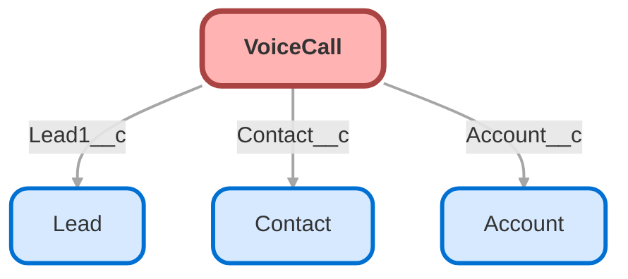

---
hide:
  - path
---

<!-- This file is auto-generated. if you do not want it to be overwritten, set TRUE in the line below -->
<!-- DO_NOT_OVERWRITE_DOC=FALSE -->

## Schema

<!-- Object description -->

## Fields

| Name      | Label | Type | Description |
| :-------- | :---- | :--: | :---------- | 
| Account__c | Account | Lookup | undefined |
| AccountRecord__c | AccountRecord | Text | undefined |
| ActivityId |  | Lookup | undefined |
| CallAcceptDateTime |  |  | undefined |
| CallConnectDateTime |  |  | undefined |
| CallDisposition |  |  | undefined |
| CallDurationInSeconds |  |  | undefined |
| CallEndDateTime |  |  | undefined |
| CallerId |  | Lookup | undefined |
| CallOrigin |  |  | undefined |
| CallQueuedDateTime |  |  | undefined |
| CallResolution |  | Picklist | undefined |
| CallStartDateTime |  |  | undefined |
| CallSubtype |  |  | undefined |
| CallType |  |  | undefined |
| Contact__c | Contact | Lookup | undefined |
| ContactRecord__c | ContactRecord | Text | undefined |
| CreateLead__c | CreateLead | Checkbox | undefined |
| CurrentMenu__c | CurrentMenu | LongTextArea | undefined |
| CustomerHoldDuration |  |  | undefined |
| Description |  |  | undefined |
| DisconnectReason |  |  | undefined |
| EndUserId |  | Lookup | undefined |
| External_ID__c | External ID | Text | undefined |
| FromPhoneNumber |  |  | undefined |
| Genesys_Interaction_URL__c | Genesys Interaction URL | Text | undefined |
| genesysps__Last_utterance__c | Last utterance | Text | undefined |
| Internal_Call__c | Internal Call | Text | Shows that the conversation was done internally or not. |
| IsDiarizationOptIn |  |  | undefined |
| IsRecorded |  |  | undefined |
| Language__c | Language | Text | undefined |
| Lead__c | Lead | Text | undefined |
| Lead1__c | Lead | Lookup | undefined |
| LeadRecord__c | LeadRecord | Text | undefined |
| LongestHoldDuration |  |  | undefined |
| NextCallId |  | Lookup | undefined |
| NumberOfHolds |  |  | undefined |
| OwnerId |  | Lookup | undefined |
| PreviousCallId |  | Lookup | undefined |
| QualityScore |  |  | undefined |
| Queue_Name__c | Queue Name | Text | undefined |
| QueueName |  |  | undefined |
| RecipientId |  | Lookup | undefined |
| RelatedRecordId |  | Lookup | undefined |
| ToPhoneNumber |  |  | undefined |
| TranscribedLanguage |  |  | undefined |
| UserId |  | Lookup | undefined |
| VendorCallKey |  |  | undefined |

## Related Flows

| Object | Name      | Type | Description |
| :----  | :-------- | :--: | :---------- | 
| 💻 | [CX_Cloud_Create_New_Lead_Screen_Pop](../flows/CX_Cloud_Create_New_Lead_Screen_Pop.md) |  Screen Flow | This screen pop flow is triggered through Genesys. If customer is calling from an unknown phone number, this will pop up. |
| VoiceCall | [Get_Related_Record_Voice_Call](../flows/Get_Related_Record_Voice_Call.md) |  Record After Save | <!-- --> |

## Related Lightning Pages

| Lightning Page | Type |
| :----      | :--: | 
| [Voice_Call_Layout](../pages/Voice_Call_Layout.md) |  Record Page |
| [Voice_Call_Record_Page](../pages/Voice_Call_Record_Page.md) |  Record Page |

## Related Permission Sets

| Permission Set | User License |
| :----      | :--: | 
| [PS_Genesys_Permissions](../permissionsets/PS_Genesys_Permissions.md) | None |

_Documentation generated with [sfdx-hardis](https://sfdx-hardis.cloudity.com), by [Cloudity](https://www.cloudity.com/) & [friends](https://github.com/hardisgroupcom/sfdx-hardis/graphs/contributors)_
