---
hide:
  - path
---

<!-- This file is auto-generated. if you do not want it to be overwritten, set TRUE in the line below -->
<!-- DO_NOT_OVERWRITE_DOC=FALSE -->

## Schema

```mermaid
graph TD
WorkOrder["WorkOrder"]:::mainObject
click WorkOrder "/objects/WorkOrder/"


classDef object fill:#D6E9FF,stroke:#0070D2,stroke-width:3px,rx:12px,ry:12px,shadow:drop,color:#333;
classDef customObject fill:#FFF4C2,stroke:#CCAA00,stroke-width:3px,rx:12px,ry:12px,shadow:drop,color:#333;
classDef customObjectManaged fill:#FFD8B2,stroke:#CC5500,stroke-width:3px,rx:12px,ry:12px,shadow:drop,color:#333;
classDef mainObject fill:#FFB3B3,stroke:#A94442,stroke-width:4px,rx:14px,ry:14px,shadow:drop,color:#333,font-weight:bold;

```

<!-- Object description -->

## Fields

| Name      | Label | Type | Description |
| :-------- | :---- | :--: | :---------- | 
| AccountId |  | Lookup | undefined |
| Address |  |  | undefined |
| AssetId |  | Lookup | undefined |
| BusinessHoursId |  | Lookup | undefined |
| CaseId |  | Lookup | undefined |
| ContactId |  | Lookup | undefined |
| Description |  |  | undefined |
| Discount |  |  | undefined |
| Duration |  |  | undefined |
| DurationType |  |  | undefined |
| EndDate |  |  | undefined |
| EntitlementId |  | Lookup | undefined |
| GrandTotal |  |  | undefined |
| IsClosed |  |  | undefined |
| IsStopped |  |  | undefined |
| LineItemCount |  |  | undefined |
| LocationId |  | Lookup | undefined |
| MilestoneStatus |  |  | undefined |
| MilestoneStatusIcon |  |  | undefined |
| OwnerId |  | Lookup | undefined |
| ParentWorkOrderId |  | Lookup | undefined |
| Pricebook2Id |  | Lookup | undefined |
| Priority |  | Picklist | undefined |
| RootWorkOrderId |  | Lookup | undefined |
| ServiceAppointmentCount |  |  | undefined |
| ServiceContractId |  | Lookup | undefined |
| ServiceTerritoryId |  | Lookup | undefined |
| SlaExitDate |  |  | undefined |
| SlaStartDate |  |  | undefined |
| StartDate |  |  | undefined |
| Status |  | Picklist | undefined |
| StatusCategory |  |  | undefined |
| StopStartDate |  |  | undefined |
| Subject |  |  | undefined |
| Subtotal |  |  | undefined |
| Tax |  |  | undefined |
| TotalPrice |  |  | undefined |
| WorkTypeId |  | Lookup | undefined |

## Related Apex Classes

| Apex Class | Type |
| :----      | :--: | 
| [EGH_AssignedResourceInspectTriggerTest](../apex/EGH_AssignedResourceInspectTriggerTest.md) | Test |

## Related Permission Sets

| Permission Set | User License |
| :----      | :--: | 
| [EGH_SystemAdminPermissionSet](../permissionsets/EGH_SystemAdminPermissionSet.md) | None |

_Documentation generated with [sfdx-hardis](https://sfdx-hardis.cloudity.com), by [Cloudity](https://www.cloudity.com/) & [friends](https://github.com/hardisgroupcom/sfdx-hardis/graphs/contributors)_
