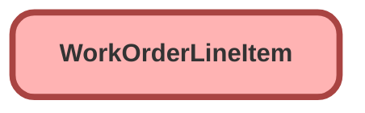

---
hide:
  - path
---

<!-- This file is auto-generated. if you do not want it to be overwritten, set TRUE in the line below -->
<!-- DO_NOT_OVERWRITE_DOC=FALSE -->

## Schema

<!-- Object description -->

## Fields

| Name      | Label | Type | Description |
| :-------- | :---- | :--: | :---------- | 
| Address |  |  | undefined |
| AssetId |  | Lookup | undefined |
| Description |  |  | undefined |
| Discount |  |  | undefined |
| Duration |  |  | undefined |
| DurationType |  |  | undefined |
| EndDate |  |  | undefined |
| IsClosed |  |  | undefined |
| ListPrice |  |  | undefined |
| LocationId |  | Lookup | undefined |
| OrderId |  | Lookup | undefined |
| ParentWorkOrderLineItemId |  | Lookup | undefined |
| PricebookEntryId |  | Lookup | undefined |
| Priority |  | Picklist | undefined |
| Quantity |  |  | undefined |
| RootWorkOrderLineItemId |  | Lookup | undefined |
| ServiceAppointmentCount |  |  | undefined |
| ServiceTerritoryId |  | Lookup | undefined |
| StartDate |  |  | undefined |
| Status |  | Picklist | undefined |
| StatusCategory |  |  | undefined |
| Subject |  |  | undefined |
| Subtotal |  |  | undefined |
| TotalPrice |  |  | undefined |
| UnitPrice |  |  | undefined |
| WorkOrderId |  | MasterDetail | undefined |
| WorkTypeId |  | Lookup | undefined |

_Documentation generated with [sfdx-hardis](https://sfdx-hardis.cloudity.com), by [Cloudity](https://www.cloudity.com/) & [friends](https://github.com/hardisgroupcom/sfdx-hardis/graphs/contributors)_
